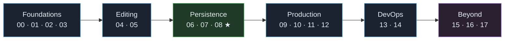

<div align="center">


# Sahar

**`recover` · `build` · `fight`**

A guided **Spring Boot 4** codealong that builds a real, editable **prayer / training / nutrition** routine app —
and teaches you modern backend engineering, _why before how_, as you go.

[](https://github.com/ramishtaha/spring-boot-sahar/actions/workflows/ci.yml)
&nbsp;
&nbsp;
&nbsp;
&nbsp;
&nbsp;
&nbsp;

<sub>18 runnable checkpoints · 19 step docs · 5 theory deep-dives · 7 cheatsheets · all green ✅</sub>

</div>

---

> [!NOTE]
> **Sahar** is the pre-dawn hour before Fajr — the time the day is won. This repo is **a course and a real app at once**: by the end you have a working Spring Boot 4 app that serves and lets you **edit** your routine, persisted in a database, runnable in Docker and installable as a PWA — and you'll have learned the backend that makes it tick.

## ✨ What you build & learn

| | |
|---|---|
| 🌐 **REST API** with Spring MVC + Jackson | 🧩 **Domain modelling** with Java records |
| 🧱 **Layered architecture** (web → service → repo) | 🛡️ **Bean Validation** + custom business rules |
| 🗄️ **JdbcTemplate** on H2, then **PostgreSQL** | 🪶 **Flyway** versioned migrations & seeding |
| 🐳 **Docker** multi-stage image + **compose** | 🔁 **GitHub Actions** CI |
| 📍 **Location-aware prayer times** (geolocation + a real solar-math calculator + OpenStreetMap geocoding) | 🎨 **Light/dark themed, installable PWA** |

> [!TIP]
> **New here?** Read **[docs/00-setup.md](docs/00-setup.md)** to set up your toolchain, then open **[step 00](docs/steps/00-baseline.md)** and build alongside the checkpoints. Track yourself in **[progress.md](progress.md)**.

- **Stack:** Spring Boot **4.0.6** · Java **25** (LTS; 17 minimum) · Maven · IntelliJ IDEA Community.
- **The domain** is the real "Sahar" routine — a Sunnah + 5-prayer baseline, an MMA block that waves **Foundation → Build → Peak → Deload**, supplements, nutrition, and bullet-journal prompts — seeded so the app boots with real content and lets you edit what changes each month.

> [!IMPORTANT]
> **Pre-2026 tutorials target Spring Boot 3.x** and differ mainly in *dependency names* (e.g. `spring-boot-starter-web` → `spring-boot-starter-webmvc`, Flyway via `spring-boot-starter-flyway`, modular `*-test` starters, Jackson 3). Every such difference is called out in the docs — see the [Maven cheatsheet](reference/cheatsheet-maven.md).

---

## 🔁 How this codealong works

Each step is a small, self-contained increment:

- 📖 **A doc** in [`docs/steps/`](docs/steps/) teaches the step — the *why*, the theory (with diagrams), the inline code, the end state, common mistakes, and questions to check yourself.
- ▶️ **Starter** = the *previous* step's checkpoint · **End** = *this* step's checkpoint, under [`checkpoints/`](checkpoints/). So `step-07` is exactly `step-06` **plus** step 7's changes — every step is `diff`-able.
- 📦 **[`app/`](app/)** is the finished, complete application — your main line and the thing to run when you just want to *use* Sahar.

The loop: **read** the step doc → **build** it yourself in `app/` (or alongside) → **compare** against that step's checkpoint → **tick** it in [`progress.md`](progress.md) → **log** anything fuzzy in [`questions.md`](questions.md) for your mentor.

> [!IMPORTANT]
> You learn by **typing it**, not by copying. The checkpoints exist to unstick you and to diff against — not to skip the thinking.

<details>
<summary>📂 <b>Browsing checkpoints safely</b></summary>

> To explore a step, *open or copy* its `checkpoints/step-NN-…` folder and run it there. Keep `app/` as your single working line so you never lose your place. Each checkpoint is a complete Maven project:
>
> ```bash
> cd checkpoints/step-06-jdbctemplate-h2
> ./mvnw spring-boot:run            # Windows: .\mvnw.cmd spring-boot:run
> ```
>
> Because checkpoints are sibling folders, the cleanest way to see what a step changed is a folder diff:
>
> ```bash
> git diff --no-index checkpoints/step-05-validation-and-rules checkpoints/step-06-jdbctemplate-h2
> ```

</details>

---

## 🗺️ Table of contents

### 🚀 Start here
- 🧰 [docs/00-setup.md](docs/00-setup.md) — install & verify the toolchain; version notes; using the checkpoints safely.
- 🗓️ [PLAN.md](PLAN.md) — the multi-session plan mapped to the steps and a time budget.
- ✅ [progress.md](progress.md) — your checklist, one box per step.
- ❓ [questions.md](questions.md) — where to log questions for your mentor.
- 🍽️ [docs/diet-plan.md](docs/diet-plan.md) — a suggested weekly meal plan (shown on the home page's *This week* board).

### 📚 The steps — build the app while learning

| # | Step | Doc | Checkpoint |
|:-:|------|:---:|:---:|
| 00 | Baseline: generate & dissect the project | [📖](docs/steps/00-baseline.md) | [📂](checkpoints/step-00-baseline/) |
| 01 | Serve the static Sahar site | [📖](docs/steps/01-serve-static.md) | [📂](checkpoints/step-01-serve-static/) |
| 02 | The first REST endpoint (static → dynamic) | [📖](docs/steps/02-first-rest-endpoint.md) | [📂](checkpoints/step-02-first-rest-endpoint/) |
| 03 | Model the domain with records | [📖](docs/steps/03-model-the-domain.md) | [📂](checkpoints/step-03-model-the-domain/) |
| 04 | Editing in memory: the service layer | [📖](docs/steps/04-in-memory-edit.md) | [📂](checkpoints/step-04-in-memory-edit/) |
| 05 | Validation & business rules | [📖](docs/steps/05-validation-and-rules.md) | [📂](checkpoints/step-05-validation-and-rules/) |
| 06 | Persistence with JdbcTemplate & H2 | [📖](docs/steps/06-jdbctemplate-h2.md) | [📂](checkpoints/step-06-jdbctemplate-h2/) |
| 07 | Full CRUD for the editable parts | [📖](docs/steps/07-full-crud.md) | [📂](checkpoints/step-07-full-crud/) |
| 08 | The editable admin UI **(core goal)** | [📖](docs/steps/08-editable-admin-ui.md) | [📂](checkpoints/step-08-editable-admin-ui/) |
| 09 | Swap to PostgreSQL with profiles | [📖](docs/steps/09-swap-to-postgres.md) | [📂](checkpoints/step-09-swap-to-postgres/) |
| 10 | Seeding & Flyway migrations | [📖](docs/steps/10-seed-and-migrations.md) | [📂](checkpoints/step-10-seed-and-migrations/) |
| 11 | Dockerize with a multi-stage build | [📖](docs/steps/11-dockerize.md) | [📂](checkpoints/step-11-dockerize/) |
| 12 | docker compose: the whole stack | [📖](docs/steps/12-compose.md) | [📂](checkpoints/step-12-compose/) |
| 13 | A taste of DevOps: GitHub Actions CI | [📖](docs/steps/13-ci-with-github-actions.md) | [📂](checkpoints/step-13-ci-with-github-actions/) |
| 14 | Deploy (optional) & orchestration overview | [📖](docs/steps/14-deploy.md) | [📂](checkpoints/step-14-deploy/) |
| 99 | Roadmap: where to go next | [📖](docs/steps/99-roadmap.md) | — |

### 🌟 Beyond the core course

Steps 00–14 stay frozen as the curriculum; **15–17 add their own runnable checkpoints**, and **`app/` equals step 17**.

| # | Step | Doc | Checkpoint |
|:-:|------|:---:|:---:|
| 15 | Location-aware prayer times (calculator + geocoding) | [📖](docs/steps/15-geolocation-prayer-times.md) | [📂](checkpoints/step-15-geolocation-prayer-times/) |
| 16 | Location picker (device / search / map), UI & PWA | [📖](docs/steps/16-ui-and-pwa.md) | [📂](checkpoints/step-16-ui-and-pwa/) |
| 17 | Visual polish (a tokens-first design system) | [📖](docs/steps/17-visual-polish.md) | [📂](checkpoints/step-17-visual-polish/) |

### 🧠 Theory deep-dives — [`docs/theory/`](docs/theory/)
- [Spring, servlets & dependency injection](docs/theory/spring-and-di.md)
- [HTTP and REST](docs/theory/http-and-rest.md)
- [The persistence landscape](docs/theory/persistence-landscape.md) — the full comparison
- [JdbcTemplate vs Spring Data JPA](docs/theory/jdbc-vs-jpa.md)
- [Containers and DevOps](docs/theory/containers-and-devops.md)

### 📑 Reference — [`reference/`](reference/)
- [Glossary](reference/glossary.md) · [Modern Java refresher](reference/java-refresher.md)
- Cheatsheets: [Maven](reference/cheatsheet-maven.md) · [Spring annotations](reference/cheatsheet-spring-annotations.md) · [HTTP & REST](reference/cheatsheet-http-rest.md) · [SQL & JdbcTemplate](reference/cheatsheet-sql-jdbc.md) · [Docker & Podman](reference/cheatsheet-docker-podman.md)

---

## 📈 Progress overview



> ★ = the **core goal** lands at step 08: edit your routine in the browser, it saves to the DB, and shows on a second device. Track your own progress in [progress.md](progress.md).

---

## Running it

### ⚡ The finished app — zero setup (embedded H2)
```bash
cd app
./mvnw spring-boot:run          # Windows: .\mvnw.cmd spring-boot:run
```
> [!TIP]
> Open **<http://localhost:8080>** for your routine and **<http://localhost:8080/admin.html>** to edit it. Data persists in `app/data/sahar.mv.db`; the H2 console is at `/h2-console` (JDBC URL `jdbc:h2:file:./data/sahar`, user `sa`, no password).

### 🐳 The whole stack with PostgreSQL (Docker)
```bash
cd app
docker compose up --build       # app + Postgres, data in a named volume
docker compose down             # stop (keeps your data)
docker compose down -v          # stop and wipe the database volume
```

> [!WARNING]
> Geolocation, the map tiles, and the offline service worker only work over **HTTPS** or **`localhost`** (a browser security rule) — fine locally and on an HTTPS deploy, not over a plain `http://<lan-ip>`.

---

## 🚢 Put it on GitHub

```bash
# Option A — GitHub CLI (creates the repo and pushes in one go)
gh repo create spring-boot-sahar --public --source=. --remote=origin --push

# Option B — manually (after creating an empty repo on github.com)
git remote add origin https://github.com/<your-username>/spring-boot-sahar.git
git branch -M main
git push -u origin main
```

Once pushed, GitHub Actions runs [.github/workflows/ci.yml](.github/workflows/ci.yml) on every push — it builds and tests `app/` and builds the Docker image. A green ✅ on your commit means everything still works.

---

<div align="center">
<sub>Built with Spring Boot 4 · Java 25 · <i>recover, build, fight.</i></sub>
</div>
