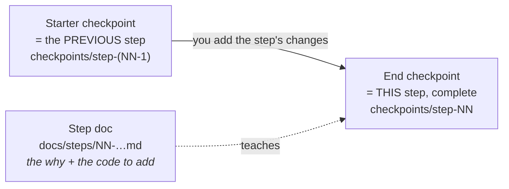
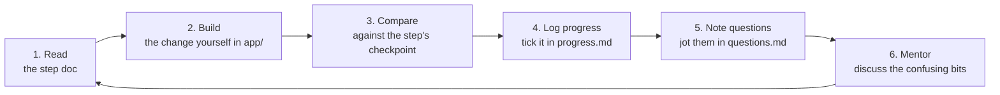
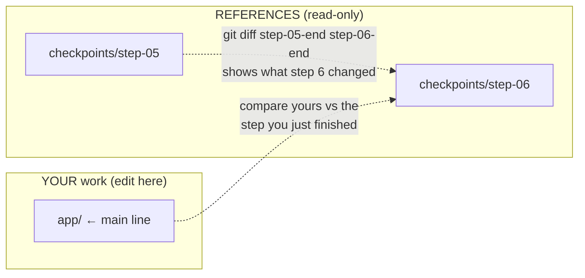
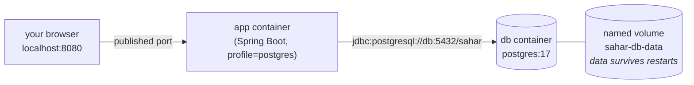

# Setup: install, verify, and how to use the checkpoints

> The on-ramp. Get a working Java 25 + Maven + Docker toolchain, prove it works, understand how this codealong is laid out, and learn how to run and `diff` the checkpoints without losing your place.

> [!TIP]
> **Brand new to Java, Spring Boot, or the terminal?** Spend an hour on the **[Foundations primers](./foundations/)** first — they assume *zero* prior knowledge and make everything below click. Already comfortable? Read on.

**What you will get from this page**

- Exactly what to install on Windows, macOS, or Linux — and the one thing you do *not* need (Maven).
- Copy-paste verification commands with the **expected output**, so you know your machine is ready before you write a line of code.
- The Spring Boot 3.x → 4.x differences that make pre-2026 tutorials look "wrong," in one table.
- A mental model of how each step works (doc + starter checkpoint + end checkpoint) and the read → build → compare → log loop.
- How to open, run, and `diff` checkpoints **safely**, keeping `app/` as your single source of truth.
- How to run the finished Sahar app two ways: zero-setup H2, or the full PostgreSQL stack with `docker compose`.

This is the only step with no code to write. Once `java -version` says `25` and `./mvnw -version` runs, you are ready for [step 00 — baseline](./steps/00-baseline.md).

---

## 🔧 1. What you need and how to install it

Here is the whole toolchain. The first two are required to write and run any code; the rest you can add when the steps that use them arrive.

| Tool | Why you need it | When | Required? |
|------|-----------------|------|-----------|
| **JDK 25** | Compiles and runs Java. Sahar targets Java 25; Spring Boot 4 needs Java 17 minimum. | From step 00 | **Yes** |
| **Maven** | Builds the project, runs tests, packages the jar. | From step 00 | **No** — use the bundled `mvnw` wrapper (see below) |
| **Git** | Version control; lets you `diff` and tag checkpoints. | From step 00 | Strongly recommended |
| **IntelliJ IDEA** | A free IDE that understands Maven and Spring out of the box; an optional Ultimate subscription adds extras. | From step 00 | Recommended (any editor works) |
| **Docker Desktop** *(or Podman)* | Runs PostgreSQL and packages the app as a container. | From step 09/11 | Only for the production half |

> [!IMPORTANT]
> **The big one: you do not need to install Maven.** Every Maven project in this repo (`app/` and each `checkpoints/step-NN-…/`) ships the **Maven Wrapper** — `mvnw` (macOS/Linux) and `mvnw.cmd` (Windows). The wrapper downloads the exact Maven version the project expects on first run, so everyone builds with the same tool. Wherever you see `mvn` in a tutorial, prefer `./mvnw` (or `.\mvnw.cmd`) here. You only install standalone Maven if you want a system-wide `mvn` command.

### JDK 25

You need a **JDK** (Java Development Kit — compiler + runtime), not just a JRE. Two solid distributions:

- **Eclipse Temurin** (OpenJDK build from Adoptium) — free, no account, the common default: [adoptium.net/temurin/releases](https://adoptium.net/temurin/releases/?version=25)
- **Oracle JDK 25** — also free for development under Oracle's current terms: [oracle.com/java/technologies/downloads](https://www.oracle.com/java/technologies/downloads/#java25)

The Java SE 25 documentation lives at [docs.oracle.com/en/java/javase/25](https://docs.oracle.com/en/java/javase/25/).

**Windows**
- Easiest: `winget install EclipseAdoptium.Temurin.25.JDK` (or download the `.msi` from Adoptium). The installer can set `JAVA_HOME` and add Java to `PATH` — tick those options.
- Verify in a **new** PowerShell window (so it picks up the new `PATH`).

**macOS**
- Homebrew: `brew install temurin@25` (or the official Temurin `.pkg`).
- If you juggle several JDKs, [SDKMAN!](https://sdkman.io/) makes switching easy: `sdk install java 25-tem`.

**Linux**
- SDKMAN! is the least painful across distros: `curl -s "https://get.sdkman.io" | bash`, then `sdk install java 25-tem`.
- Or your distro's package (`apt`, `dnf`, …) — just make sure it is JDK **25**, not 17 or 21.

> [!NOTE]
> **Heads-up — what `LTS` means here.** Java 25 is the current Long-Term-Support release. Spring Boot 4 only *requires* Java 17, so if your employer pins you to 17 or 21 the app will still compile and run — but the docs assume 25, and a few examples use newer language niceties. Install 25 if you can.

### Git

- **Windows:** `winget install Git.Git` or [git-scm.com/download/win](https://git-scm.com/download/win).
- **macOS:** comes with the Xcode Command Line Tools (`xcode-select --install`), or `brew install git`.
- **Linux:** `sudo apt install git` / `sudo dnf install git`.

### IntelliJ IDEA (free tier or Ultimate)

Since the **2025.3** release, IntelliJ IDEA is **one product**: a free tier — plenty for this whole course — plus an optional **Ultimate** subscription that unlocks advanced tooling. Download from [jetbrains.com/idea/download](https://www.jetbrains.com/idea/download/). When you first open `app/` (or a checkpoint), IntelliJ detects the `pom.xml`, imports it as a Maven project, and offers to download JDK 25 if it's missing.

> [!TIP]
> Good news for this course: the **Database tools and full SQL support are now free** — very handy from [step 06](./steps/06-jdbctemplate-h2.md). If you have **Ultimate**, you also get the Spring Beans/Endpoints tooling, the built-in **HTTP Client**, and **Docker** integration. See **[IntelliJ IDEA for Sahar](../reference/intellij-ultimate.md)** for exactly what helps at which step (and a ready-to-run `requests.http`).

### Docker Desktop (or Podman)

You only need this from step 09 onward (PostgreSQL) and step 11 (containerizing the app).

- **Docker Desktop:** [docs.docker.com/get-docker](https://docs.docker.com/get-docker/) — Windows/macOS/Linux. On Windows it runs on WSL 2; the installer walks you through enabling it.
- **Podman** as a drop-in alternative: [podman.io](https://podman.io/). `podman` mirrors the `docker` CLI, and `podman compose` reads the same `compose.yml`. Where the docs say `docker …`, `podman …` almost always works. See the Docker & Podman cheatsheet for the gotchas.

> [!TIP]
> You can complete steps 00–08 (the entire learning core, up to the editable admin UI) with **zero Docker** — the app uses an embedded H2 database that needs no install.

---

## ✅ 2. Verify your toolchain

Run these in a terminal **before** starting step 00. Each block shows a real command and the *shape* of the expected output — your exact patch versions and dates will differ, but the headline numbers should match.

This project was verified on **Java 25.0.1** and **Maven 3.9.x**. If your `java -version` shows `25.something`, you are good.

**Java — must say 25:**

```console
$ java -version
openjdk version "25.0.1" 2025-10-21
OpenJDK Runtime Environment Temurin-25.0.1+9 (build 25.0.1+9)
OpenJDK 64-Bit Server VM Temurin-25.0.1+9 (build 25.0.1+9, mixed mode, sharing)
```

The first line is what matters: it must start with `25`. If it says `17`, `21`, or `command not found`, your `PATH`/`JAVA_HOME` points at the wrong (or no) JDK — see Troubleshooting below.

**Maven — via the wrapper (recommended) or a system install:**

```console
$ cd app
$ ./mvnw -version           # Windows: .\mvnw.cmd -version
Apache Maven 3.9.x (…)
Maven home: …
Java version: 25.0.1, vendor: Eclipse Adoptium, runtime: …
```

The line that matters is **`Java version: 25.…`** — it confirms Maven is using the JDK you just installed. (The very first `./mvnw` run downloads Maven; that is normal and one-time.)

If you also installed standalone Maven, `mvn -version` should print the same thing.

**Git:**

```console
$ git --version
git version 2.43.0
```

**Docker (only needed from step 09+):**

```console
$ docker --version
Docker version 27.x.x, build …

$ docker compose version
Docker Compose version v2.x.x
```

(With Podman: `podman --version` and `podman compose version`.)

> [!IMPORTANT]
> **Sanity check before you continue:** in a *fresh* terminal, `java -version` says **25** and (from inside `app/`) `./mvnw -version` runs and reports **Java version: 25**. That is the whole bar for steps 00–08.

### Troubleshooting the basics

| Symptom | Likely cause | Fix |
|---------|--------------|-----|
| `java` not found | JDK not on `PATH`, or terminal opened before install | Open a **new** terminal; on Windows confirm the installer added Java to `PATH`. |
| `java -version` shows 17/21 | An older JDK wins on `PATH` | Point `JAVA_HOME` at the JDK 25 folder and put `$JAVA_HOME/bin` first on `PATH` (or use SDKMAN! `sdk use java 25-tem`). |
| `./mvnw` → *permission denied* (macOS/Linux) | Wrapper script not executable | `chmod +x mvnw`. |
| `.\mvnw.cmd` not recognised (Windows) | Wrong shell or wrong folder | Run it from the project folder in PowerShell/cmd; the leading `.\` is required. |
| `./mvnw` uses the wrong Java | Maven inherits `JAVA_HOME` | Set `JAVA_HOME` to the JDK 25 path; re-check with `./mvnw -version`. |

---

## ⚖️ 3. Version notes: this course targets Spring Boot 4.0.6 + Java 25

Sahar is built on **Spring Boot 4.0.6** ([docs.spring.io/spring-boot/4.0.6](https://docs.spring.io/spring-boot/4.0.6/)), which sits on **Spring Framework 7**, **Jakarta EE 11** (the `jakarta.*` namespace), and **Jackson 3** for JSON. Spring Boot 4 is a major release, and most tutorials, Stack Overflow answers, and blog posts written **before 2026 target Spring Boot 3.x**.

The good news: 3.x → 4.x is mostly **renames**, not rewrites. Your controllers, services, and `@Autowired` wiring look the same. What changed are mainly **Maven artifact names** — so a 3.x tutorial's *code* usually still applies, but its *`pom.xml`* does not. This is the single biggest source of "why doesn't this work?" for people coming from older material, so keep this table handy.

| Concern | Spring Boot 3.x (old tutorials) | Spring Boot 4.x (this course) |
|---------|-------------------------------|-------------------------------|
| Web (servlet/MVC) starter | `spring-boot-starter-web` | `spring-boot-starter-webmvc` |
| Reactive web starter | `spring-boot-starter-webflux` | `spring-boot-starter-webflux` (unchanged) |
| Flyway migrations | `org.flywaydb:flyway-core` (added directly) | `spring-boot-starter-flyway` **+** `flyway-database-postgresql` |
| H2 web console | bundled with the H2 driver, toggled by a property | its own module: `spring-boot-h2console` |
| Test support | one `spring-boot-starter-test` | modular: `spring-boot-starter-{webmvc,jdbc,validation,flyway}-test` |
| JSON library | Jackson 2 (`com.fasterxml.jackson`) | **Jackson 3** (`tools.jackson`) |
| Underlying framework | Spring Framework 6 | **Spring Framework 7** |
| Jakarta namespace | `jakarta.*` (the `javax→jakarta` move was the **2→3** change) | `jakarta.*` (unchanged) |

A couple of clarifications that trip people up:

- The famous **`javax.*` → `jakarta.*`** rename happened in Spring Boot **2 → 3**, *not* 3 → 4. By Boot 4 it is long settled — you use `jakarta.validation.constraints.NotNull`, `jakarta.servlet.*`, etc. If a tutorial imports `javax.persistence`/`javax.validation`, it predates Boot 3 entirely.
- These names will keep evolving across future Boot releases. Where this course relies on a name or flag that may age, it says so and links the official doc — when in doubt, the authoritative reference is always [docs.spring.io/spring-boot/4.0.6](https://docs.spring.io/spring-boot/4.0.6/).

You can see every one of these renames, with the explaining comment, in Sahar's real `pom.xml` — that file is dissected line-by-line in [step 00 — baseline](./steps/00-baseline.md). For a quick reference while building, see the [Maven cheatsheet](../reference/cheatsheet-maven.md) and the [Spring annotations cheatsheet](../reference/cheatsheet-spring-annotations.md).

---

## 🧭 4. How the codealong works

Sahar is a **course and a real app at the same time**. You learn Spring Boot by building one application — your personal training / prayer / nutrition routine — one small, runnable increment at a time.

Each numbered **step** has three parts:



- **The doc** (in [`docs/steps/`](./steps/)) teaches the step *why-before-how*: the motivation, the theory with diagrams, the exact code to add, the end state, common mistakes, and self-check questions.
- **The starter** is simply the *previous* step's end checkpoint — the ground you build on.
- **The end** is *this* step's checkpoint under [`checkpoints/`](../checkpoints/). So `checkpoints/step-07-full-crud` is exactly `checkpoints/step-06-jdbctemplate-h2` **plus** step 7's changes. Every checkpoint is a complete, runnable Maven project.
- **[`app/`](../app/)** is the finished, complete application — your **main working line** and the thing to run when you just want to *use* Sahar.

### The recommended loop



You learn by **typing it, not copying it.** The checkpoints exist to unstick you and to `diff` against — not to skip the thinking. Concretely:

1. **Read** the step doc end-to-end.
2. **Build** the change in `app/` (or in a copy alongside — see §5).
3. **Compare** your result against that step's checkpoint when you get stuck or when you finish.
4. **Tick it off** in [`progress.md`](../progress.md) — one box per step, so you always know where you are.
5. **Log questions** in [`questions.md`](../questions.md) the moment something is unclear, while the context is fresh.
6. **Discuss** the open questions with your mentor.

The overall arc, mapped to the steps:

```
Foundations   00 ▸ 01 ▸ 02 ▸ 03        (project, static site, REST, domain model)
Editing       04 ▸ 05                  (service layer, validation & rules)
Persistence   06 ▸ 07 ▸ 08             (JdbcTemplate+H2, CRUD, editable admin UI)  ← core goal at 08
Production    09 ▸ 10 ▸ 11 ▸ 12        (Postgres, Flyway, Docker, compose)
DevOps        13 ▸ 14 ▸ 99             (CI, deploy, roadmap)
```

The full table of contents — every step, theory deep-dive, and reference — is in the [README](../README.md). The session-by-session plan and time budget is in [PLAN.md](../PLAN.md).

---

## 🗂️ 5. How to use the checkpoints safely

The number-one way people get lost in a codealong is by editing checkpoint folders and forgetting which copy is "theirs." The rule that prevents this:

> **Keep `app/` as your single main working line. Treat `checkpoints/` as read-only references.**

When you want to *explore* a particular step — read its code, run it, experiment — **open it in IntelliJ read-only, or copy the folder** somewhere scratch and tinker in the copy. Do not edit the checkpoints in place; you want them pristine so your `diff`s stay meaningful.

### Running any checkpoint

Each `checkpoints/step-NN-…` folder is a self-contained Maven project. Run it the same way you run `app/`:

```bash
# macOS / Linux
cd checkpoints/step-06-jdbctemplate-h2
./mvnw spring-boot:run
```

```powershell
# Windows
cd checkpoints\step-06-jdbctemplate-h2
.\mvnw.cmd spring-boot:run
```

Or open the folder in **IntelliJ** (File → Open → pick the `step-NN` folder), let it import the Maven project, and click the green run arrow on the `SaharApplication` class. Then visit `http://localhost:8080`.

> [!WARNING]
> **Only run one app at a time.** Every checkpoint binds port 8080 by default. If you start a second one without stopping the first, you will get *"port 8080 already in use."* Stop the running app (Ctrl+C in the terminal, or the red stop button in IntelliJ) before starting another, or set a different port: `SAHAR_HOST_PORT`/`--server.port=8081`.

### Diffing two steps to see exactly what changed

The most powerful learning tool here is comparing the *before* and *after* of a step. Two ways:

**A. With git tags (cleanest).** The repo ships an initial commit with a `step-NN-end` tag per step. To see precisely what step 6 added on top of step 5:

```bash
git diff step-05-end step-06-end
```

**B. Folder diff (no git needed).** Point any diff tool at the two checkpoint folders:

```bash
# command line
diff -ru checkpoints/step-05-validation-and-rules checkpoints/step-06-jdbctemplate-h2

# or in IntelliJ: select both folders in the Project view → right-click → Compare Directories
```



### A safe scratch workflow

If you want to try a step in isolation without touching `app/`:

```bash
# copy the previous step as your sandbox, then build the new step's changes in the copy
cp -r checkpoints/step-05-validation-and-rules /tmp/sahar-try-06   # Windows: Copy-Item -Recurse
cd /tmp/sahar-try-06
./mvnw spring-boot:run
# ...edit, experiment; your real app/ stays untouched
```

---

## ▶️ 6. Running the finished app

When you just want to *use* Sahar (or see the finished target before you build it), run `app/`. There are two ways, and the first needs nothing but the JDK.

### Zero setup — embedded H2 (recommended first run)

H2 is a small Java database that runs *inside* the app, storing data in a local file. No install, no server, no Docker.

```bash
cd app
./mvnw spring-boot:run          # Windows: .\mvnw.cmd spring-boot:run
```

Then open:

- `http://localhost:8080` — the read-only view of your routine.
- `http://localhost:8080/admin.html` — the editable admin UI (the core goal, reached at step 08).
- `http://localhost:8080/h2-console` — the H2 web console, to peek at the tables directly.

Your data persists in a file at `app/data/sahar.mv.db`, so it survives restarts. To inspect it in the H2 console, use these exact values (from `application.properties`):

| Field | Value |
|-------|-------|
| JDBC URL | `jdbc:h2:file:./data/sahar` |
| User Name | `sa` |
| Password | *(leave blank)* |

On boot, Flyway creates the schema and seeds it (tables `app_meta`, `prayer_times`, `blocks`, `weeks`, `schedule_items`, `weekly_grid`, `supplements`, `diet_sections`), so the app comes up with real content. To start completely fresh, stop the app and delete the `app/data/` folder.

A quick smoke test once it is running:

```bash
curl http://localhost:8080/api/config
```

You should get back JSON describing the whole routine. (The REST API — `GET /api/config`, `GET/PUT /api/prayer-times`, the `/api/block` operations, `/api/schedule`, etc. — is built up across the steps.)

### The whole stack — PostgreSQL via Docker Compose

To run Sahar exactly as it would in production — the app plus a real PostgreSQL 17 database — use `docker compose`. This activates the `postgres` profile (`application-postgres.properties`) and points the app at the database container.

```bash
cd app
docker compose up --build       # builds the app image, starts Postgres, waits for it to be healthy, starts the app
# open http://localhost:8080

docker compose down             # stop everything; your data survives in a named volume
docker compose down -v          # stop AND wipe the database volume (fresh start)
```

A few things worth knowing (all explained in [step 12 — compose](./steps/12-compose.md)):

- Compose gives each service a DNS name; the app reaches Postgres at host `db`, no `localhost` involved.
- The database lives in a **named volume** (`sahar-db-data`), so `down` then `up` keeps your data — only `down -v` wipes it.
- Port 8080 is published to your machine; override it if it is taken: `SAHAR_HOST_PORT=8086 docker compose up`.
- Using **Podman**? `podman compose up` reads the same file.



---

## 🎉 You are ready

If `java -version` says **25** and `./mvnw -version` runs from inside `app/`, you have everything you need to start. Next stop: **[step 00 — baseline](./steps/00-baseline.md)**, where you generate the project and dissect the `pom.xml` line by line — including every Spring Boot 4 artifact name from §3.

---

## 🔗 Related

- [README](../README.md) — full table of contents and the project overview.
- [Step 00 — baseline: generate & dissect the project](./steps/00-baseline.md) — your first real step.
- [PLAN.md](../PLAN.md) — the session-by-session plan and time budget.
- [Theory: Spring, servlets, and dependency injection](./theory/spring-and-di.md) — what Spring actually does for you.
- [Maven cheatsheet](../reference/cheatsheet-maven.md) — `mvnw` commands and the 3.x → 4.x artifact renames.
- [Spring annotations cheatsheet](../reference/cheatsheet-spring-annotations.md) — the annotations you will meet, in one place.
- Official docs: [Spring Boot 4.0.6](https://docs.spring.io/spring-boot/4.0.6/) · [Java SE 25](https://docs.oracle.com/en/java/javase/25/) · [Flyway](https://flywaydb.org/) · [Docker](https://docs.docker.com/) · [Podman](https://podman.io/) · [PostgreSQL 17](https://www.postgresql.org/docs/17/)
