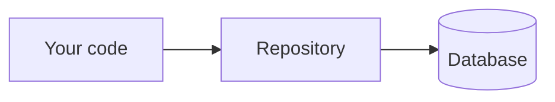

# 🗄️ Databases in five minutes

*A database is a place to store data on disk so it survives after your program stops.*

Why care? Without one, every change you make in Sahar would disappear the moment the app restarts. A database is how your edited prayer times are still there tomorrow.

## 💾 Why we even need one

When a program runs, its values live in **memory** (RAM) — fast, temporary storage that gets wiped when the program stops. So if you set your Fajr prayer time and then close the app, that value is gone forever.

A **database** stores data on **disk** (permanent storage), so it survives restarts, crashes, and reboots. That is the whole point: your data outlives the program.

> [!NOTE]
> "Persisting" data just means saving it somewhere permanent. You'll hear this word a lot.

## 📊 Tables, columns, and rows

The kind of database we use is a **relational database** — it organises data into **tables**. A table is just like a spreadsheet.

- A **column** is a field (one kind of value), like `fajr` or `dhuhr`.
- A **row** is one record (one full set of values).

In Sahar, a `prayer_times` table might look like this:

| fajr  | dhuhr | asr   | maghrib | isha  |
|-------|-------|-------|---------|-------|
| 05:12 | 13:05 | 16:40 | 19:55   | 21:20 |

Here the columns are the prayer names, and the single row holds *your* times. Edit a time, and that row changes on disk.

## 🗣️ SQL: how you talk to a database

**SQL** (Structured Query Language) is the language you use to ask a database to do things. There are four everyday actions — you don't need to memorise these, just recognise them:

```sql
SELECT fajr FROM prayer_times;            -- read a value
```
```sql
INSERT INTO prayer_times (fajr) VALUES ('05:12');  -- add a record
```
```sql
UPDATE prayer_times SET fajr = '05:10';   -- change a value
```
```sql
DELETE FROM prayer_times WHERE fajr = '05:10';  -- remove a record
```

Read, add, change, remove. That's 90% of what a database does all day.

## 🔌 Embedded vs server databases

There are two flavours, and Sahar uses both at different times:

- An **embedded** database lives *inside* your app as a single file. **H2** is one of these: zero setup, nothing to install, great for learning. Perfect for your first runs.
- A **server** database runs as its own separate program your app connects to. **PostgreSQL** (often just "Postgres") is the one we deploy with — solid and built for real use.

Sahar starts on H2 so you can run it instantly, then moves to Postgres later. The good news: **the same code works on both**. You switch databases by changing config, not by rewriting your app.

> [!TIP]
> Start on H2. Don't install Postgres until a later step actually asks you to.

## 🪄 You won't hand-write much SQL

Here's the relief: you rarely type SQL yourself. Sahar uses a **repository** — a thin layer of code that writes the SQL for you. You call a plain method like `save(...)` or `findById(...)`, and the repository turns it into the right SQL behind the scenes.



You'll meet repositories properly in step 06 — for now, just know the plumbing is handled for you.

## ✅ Recap

- Memory is temporary; a **database** saves data on **disk** so it survives restarts.
- A relational database holds **tables** made of **columns** (fields) and **rows** (records).
- **SQL** does four things: SELECT (read), INSERT (add), UPDATE (change), DELETE (remove).
- Sahar starts on embedded **H2**, moves to server **PostgreSQL** — same code, and a **repository** writes the SQL for you.

⬅️ Prev: [HTTP in five minutes](./http-basics.md) · Next: [Git in five minutes](./git-basics.md) · Go deeper: [The persistence landscape](../theory/persistence-landscape.md)
