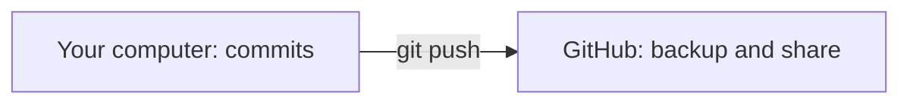

# 🔁 Git in five minutes

_Git takes snapshots of your project so you can undo mistakes, see what changed, and share your work._

Why care? In this course you'll change code a lot. Git lets you save your progress safely, compare it against the course checkpoints, and back everything up. It's your undo button for a whole project.

## 📸 What Git actually is

Git is a **version control** tool. "Version control" just means software that remembers the history of your files for you.

Each time you save a snapshot, Git records the full state of your project at that moment. That snapshot is called a **commit**. A commit is like a labelled photo: you can always look back at it, compare two photos, or jump back to an earlier one if something breaks.

The folder Git is tracking is called a **repository** (or "repo" for short). The Sahar app — your personal prayer, training, and nutrition routine web app — lives in one repo.

> [!NOTE]
> You don't need to memorise any of this. You'll repeat these steps so often they become muscle memory.

## ⌨️ The four commands to know

You type these in a **terminal** — a text window where you type commands instead of clicking buttons. One line each, in the order you'll usually use them:

```bash
git init                  # start tracking this folder
git add .                 # stage all your changes (mark them to be saved)
git commit -m "message"   # save a snapshot, with a short note about it
git push                  # send your commits to a remote like GitHub
```

A quick word on two of those:

- **Stage** (`git add`) means "pick which changes go into the next snapshot." The `.` means "everything I changed."
- The **message** in `git commit -m "..."` is a tiny note to your future self, like `"add login page"`.

That's the whole happy path. There's more to Git, but this gets you a long way.

## 🌍 What GitHub is

**GitHub** is a website that hosts your Git repository online. Think of it as a safe cloud home for your code.

Why it's worth it:

- Your work is **backed up** — if your laptop dies, your code is safe.
- It's **shareable** — you can send someone a link instead of a zip file.

The flow is simple. Git lives on your computer; GitHub lives on the internet. `git push` sends your local commits up to GitHub.



Good news: the Sahar repo is **already a Git repo**, so you won't need `git init`. The repo's README shows the exact commands to publish it to GitHub — just follow them.

## 🛟 A daily habit

> [!TIP]
> Commit small and often. A snapshot after each little working change is easy to understand and easy to undo. One giant commit at the end of the day is not.

A simple rhythm: get one small thing working, then `git add .` and `git commit -m "..."`. Repeat. Push when you're ready to back up or share.

## ✅ Recap

- A **commit** is a saved snapshot of your whole project; Git keeps the history so you can undo and compare.
- The four core commands: `git init`, `git add .`, `git commit -m "..."`, `git push`.
- **GitHub** is a website that hosts your repo so it's backed up and shareable.
- Commit small and often — and the Sahar repo is already set up for you.

Next: [Install your tools (setup)](../00-setup.md) — you're ready! · Go deeper: the [README's publish guide](../../README.md)
