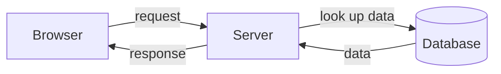

# 🌐 How a web app works

*A web app is a conversation: your browser asks, a server answers.*

You should care because everything you build in this course is one side of that conversation - the server side. Once you can picture the whole loop, the code stops feeling like magic.

## 👀 The everyday picture

You do this every day without thinking about it. You type a web address (like `sahar.app`) into your **browser** - that's the program you use to view websites, such as Chrome, Firefox, or Safari.

Here is what happens next, in plain words:

1. Your browser sends a **request** across the internet. A request is just a message that says "please give me this page" or "please save this for me".
2. That message arrives at a **server** - a program running on some computer somewhere, waiting to answer requests.
3. The server runs some code. It might look something up in a **database** (more on that below), then it sends back a **response** - the page or data you asked for.
4. Your browser receives the response and shows it on your screen.

That whole back-and-forth is called the **request-response loop**. It happens in a fraction of a second.

## 🧩 The three pieces

Almost every web app is built from three parts. Learn these three words and a lot of jargon will suddenly make sense.

- **Frontend** - what you *see* in the browser: the buttons, text, and images. (You won't focus on this in this track.)
- **Backend** - the *server code you will write*. It receives requests, decides what to do, and builds the response.
- **Database** - where data is *kept* so it survives. Close the browser, turn off your computer, come back tomorrow - the data is still there.

> [!TIP]
> A simple way to remember it: frontend is the *face*, backend is the *brain*, database is the *memory*.

## 🏠 What is "localhost"?

While you build, you don't need a computer "somewhere on the internet". Your own computer can play the role of the server, just for you.

When that happens, you reach it at a special address:

```
http://localhost:8080
```

`localhost` simply means "this very computer". The `8080` is the **port** - think of it as the specific door your server is listening behind. You don't need to memorise this; just know that when you see `localhost:8080`, your app is running on your own machine.

## 🔁 The loop as a picture

Here is the same loop as a tiny diagram. Read it top to bottom, then back up.



The browser asks. The server reads from the database. The data comes back to the server. The server sends a response to the browser. Done.

## 🕌 How this maps to Sahar

Sahar is the app you'll build: a personal web app for your prayer, training, and nutrition routine. Picture opening your daily routine page:

1. The page in your browser sends a request to **Sahar's server**: "give me today's routine".
2. The server (the backend code *you* write) reads your routine **from the database**.
3. It sends the routine back as **JSON** - a plain, tidy text format that programs use to pass data around. You don't need to learn JSON yet; just know it's how the server hands data to the browser.
4. The browser receives that data and shows your routine on the page.

Same loop as before - just with your own app filling in the blanks.

## ✅ Recap

- A web app is a **request-response loop**: the browser asks, the server answers.
- The three pieces are **frontend** (what you see), **backend** (the code you write), and **database** (where data lives).
- **`localhost:8080`** is your own computer acting as the server while you build.
- In Sahar, the page asks the server for your routine, the server reads it from the database, and sends it back as JSON.

⬅️ Prev: [Foundations index](./README.md) · Next: [Browser & JavaScript basics](./browser-javascript-basics.md) · then [The command line](./the-command-line.md) · Go deeper: [HTTP and REST](../theory/http-and-rest.md)
