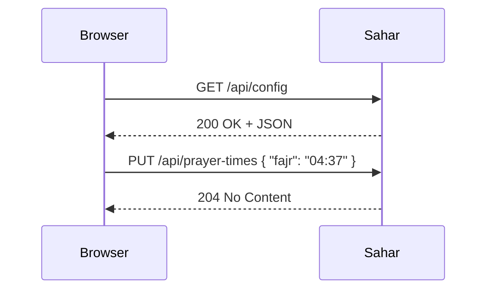

# 🔌 HTTP in five minutes

*HTTP is the simple back-and-forth language that browsers and servers use to talk.*

Why care? Every button you click and every screen Sahar shows is really just one app asking another for something. Once you see that pattern, the whole web stops feeling like magic.

## 💬 Request and response

HTTP stands for *HyperText Transfer Protocol*. A **protocol** is just an agreed set of rules for talking. Every exchange is two steps:

1. A **request** — the browser asks for something.
2. A **response** — the server answers.

That's it. Ask, answer. Ask, answer. Your phone opening Sahar in the morning is just sending requests and reading responses.

> [!NOTE]
> A **server** is a program that waits for requests and sends back answers. A **browser** (or a phone app) is the one asking. Sahar's backend is the server.

## 🚪 What a request carries

A request has three parts. You don't need to memorise this — just know they exist:

- A **method**: what you want to do (read something, create something, etc.).
- A **path** (part of the URL): which thing you mean, like `/api/prayer-times`.
- Sometimes a **body**: data you send along, usually as JSON (more on that below).

Here are the four methods you'll meet most:

| Method | Means | Plain English |
|--------|-------|---------------|
| GET | read | "Show me this." |
| POST | create | "Make a new one." |
| PUT | replace | "Swap this for what I'm sending." |
| DELETE | remove | "Delete this." |

> [!TIP]
> A handy memory hook: GET never changes anything. It only looks. So clicking around with GET is always safe.

## 🔢 What a response carries

A response carries a **status code**: a 3-digit number that summarises what happened. You'll learn to read these at a glance:

- `200 OK` — success, here's your data.
- `201 Created` — your new thing was made.
- `204 No Content` — success, but nothing to send back.
- `400 Bad Request` — *your* input was wrong (e.g. a misspelled time).
- `404 Not Found` — that thing doesn't exist.
- `500 Server Error` — the server itself broke.

A simple rule of thumb: **2xx** means good, **4xx** means *you* sent something wrong, **5xx** means the *server* had a problem. Most responses also include a body with the actual data.

## 📦 JSON: the data format

**JSON** (say "jay-son") is a plain-text way to write structured data. It's just text, and humans can read it. Here's a tiny example:

```json
{ "fajr": "04:37" }
```

The curly braces hold a set of `"name": value` pairs. That's a prayer time, written in JSON. When Sahar sends or receives data, it almost always travels as JSON.

## 🕌 How this looks in Sahar

Let's tie it together with three real moves Sahar makes:

- **GET `/api/config`** → returns your whole routine (prayer, training, nutrition) as one JSON document.
- **PUT `/api/prayer-times`** with a JSON body → replaces your saved times with the ones you send.
- Send a malformed time like `"25:99"` → you get back **`400 Bad Request`**, because the input was wrong.

A picture of that round trip:



You'll write the Sahar side of these later. For now, just enjoy recognising the shape: a method, a path, maybe a body — and an answer with a status code.

## ✅ Recap

- Every web interaction is a **request** then a **response**.
- A request has a **method** (GET/POST/PUT/DELETE), a **path**, and sometimes a JSON **body**.
- A response has a **status code** (2xx good, 4xx your fault, 5xx server's fault) and usually a body.
- **JSON** is the simple text format that carries the data.

⬅️ Prev: [What is Spring Boot?](./what-is-spring-boot.md) · Next: [Databases in five minutes](./databases-basics.md) · Go deeper: [HTTP & REST theory](../theory/http-and-rest.md) and the [HTTP cheatsheet](../../reference/cheatsheet-http-rest.md)
