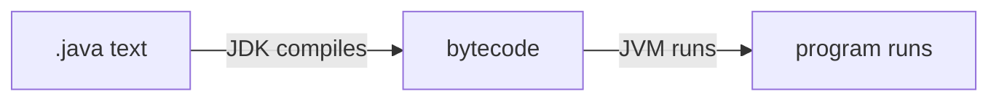

# ☕ Java 1 — your first program

*A gentle first look at what Java is and what a tiny program looks like.*

Why care? Sahar (your personal prayer, training, and nutrition app) is written in Java. Before you build features, it helps to know what these words mean. This page is just for that — no pressure.

## 🌍 What Java is

Java is a popular **programming language** — a way of writing instructions for a computer.

You type your instructions into plain text files that end in `.java`. But the computer can't run that text directly. Two helpers turn your text into a running program:

- The **JDK** (Java Development Kit) **compiles** your `.java` file. *Compiling* means translating your text into **bytecode** — a compact format the machine understands.
- The **JVM** (Java Virtual Machine) **runs** that bytecode. Because the JVM exists for Windows, macOS, and Linux, the same bytecode runs on any of them.

This course uses **Java 25**.



> [!TIP]
> You don't need to memorise this. Just remember: JDK builds, JVM runs.

## 📦 Classes and the main method

Java code lives inside a **class**. Think of a class as a named box that holds related code. For now, one class = one file.

A class can contain a **method** — a named block of instructions. A special method called `main` is the **entry point**: the spot where your program starts running.

## 👋 Hello, World

Here is the classic first program. It just prints one line of text:

```java
public class Hello {
    public static void main(String[] args) {
        // this line prints a message
        System.out.println("Hello, Sahar!");
    }
}
```

Let's read it slowly:

- `public class Hello` — defines a class named `Hello`. The file is named `Hello.java`.
- `public static void main(String[] args)` — the `main` method, where the program begins. You don't need to understand every word yet; just know this is the starting line.
- `System.out.println("Hello, Sahar!")` — `println` **prints** the text in quotes, then moves to a new line.
- The **semicolon** `;` ends a statement, like a full stop ends a sentence.
- The **curly braces** `{ }` group code together — they mark where the class and the method begin and end.
- `//` starts a **comment** — a note for humans. Java ignores it.

That's a whole program. Five short lines of real work.

## 🗂️ Packages and imports

As an app grows, you get many classes. A **package** keeps them organised — it's just a folder (a namespace) for related classes. Sahar uses packages like `com.ramishtaha.sahar`.

You write the package at the top of a file:

```java
package com.ramishtaha.sahar;
```

To use a class that lives in *another* package, you **import** it — that tells Java where to find it:

```java
import java.util.List;
```

After that import, you can use `List` by its short name. That's all `import` does: it saves you typing the full path every time.

## ✅ Recap

- Java is a language; the **JDK** compiles your `.java` text into **bytecode**, and the **JVM** runs it anywhere.
- Code lives in **classes**, and a program starts in the `main` **method**.
- `System.out.println(...)` prints text; `;` ends a statement; `{ }` group code; `//` is a comment.
- A **package** organises classes into folders, and `import` lets you use a class from another package.

> [!NOTE]
> You will almost never compile by hand — Maven or your IDE does it when you press **Run**. This page just makes the words make sense.

⬅️ Prev: [The command line](./the-command-line.md) · Next: [Java 2 — values & logic](./java-2-types-and-logic.md) · Go deeper: the [Modern Java refresher](../../reference/java-refresher.md)
