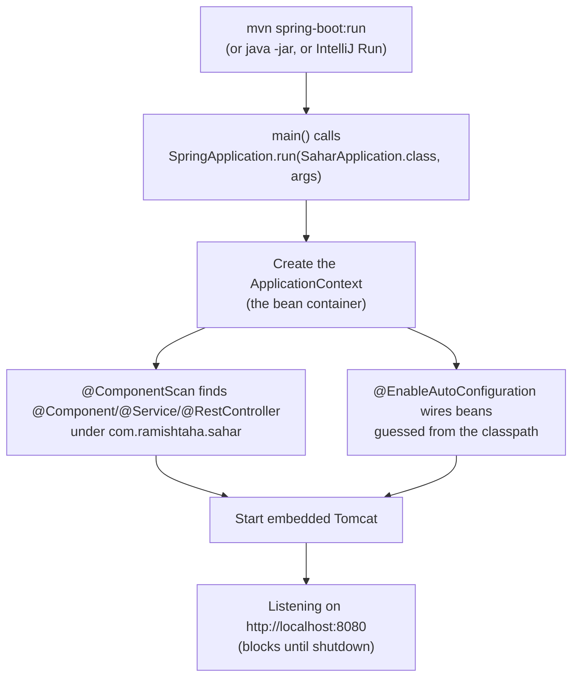

# 00 - Baseline: generate and dissect the project

_The empty-but-runnable Spring Boot 4 project from start.spring.io, taken apart piece by piece so nothing later is magic._

## Why this matters

Most Spring tutorials hand you a finished `pom.xml` and a `@RestController` and tell you to "just run it." You end up with a working app and no mental model. When something breaks three steps later, you have no idea which moving part is responsible.

This step does the opposite. We start with the smallest thing that boots - a generated project with **zero** of our own logic - and we read every line of it. By the end you should be able to point at any file and say what it does and why it is there. That investment pays off for the rest of the codealong, because every later step just adds one more file to a skeleton you already understand.

There is a second reason this matters specifically here: we are on **Spring Boot 4.0.6**, which renamed several artifacts that 90% of the tutorials and Stack Overflow answers online still call by their Boot 3.x names. If you copy a dependency from an old blog post, it will not resolve. Knowing the new names up front saves you a confusing afternoon. See [../theory/spring-and-di.md](../theory/spring-and-di.md) for the bigger picture of what Spring even is.

## Theory

A Spring Boot app is, at its core, three things working together:

1. **A build descriptor** (`pom.xml`) that tells Maven what libraries to pull in and how to package the app.
2. **An application context** - an in-memory container that holds your objects ("beans") and wires them to each other. This is dependency injection; read [../theory/spring-and-di.md](../theory/spring-and-di.md) for the why.
3. **An embedded web server** (Tomcat) that Spring Boot starts for you, so there is no separate server to install and deploy a `.war` into. You run a plain `java -jar` and you have an HTTP server.

"Auto-configuration" is the glue. Spring Boot looks at what is on your classpath and makes reasonable guesses: it sees Tomcat and Spring MVC, so it configures a web server on port 8080; later it will see an H2 driver, so it configures a datasource. You only ever override the guesses you disagree with.

Here is the boot sequence you trigger when you run the app:



The thing tying it all together is one annotation, `@SpringBootApplication`, which is itself three annotations bundled (we dissect it below). Keep that diagram in mind - every later step plugs into one of these stages.

## Start from

Nothing - this is the first code step. If you have not installed the JDK, Maven, and IntelliJ yet, do [../00-setup.md](../00-setup.md) first, then come back. The starting point for this step is literally the zip that [start.spring.io](https://start.spring.io) produces, which is preserved in the checkpoint folder for this step (linked at the end).

You do not have to regenerate it yourself, but it is worth knowing what was selected on start.spring.io so you can reproduce it:

- **Project**: Maven
- **Language**: Java
- **Spring Boot**: 4.0.6
- **Group**: `com.ramishtaha.sahar`, **Artifact**: `sahar`, **Java**: 25
- **Dependencies**: Spring Web, Spring Boot DevTools, Validation, JDBC API, H2 Database, PostgreSQL Driver

(Flyway is added later, in [./01-serve-static.md](./01-serve-static.md)'s successors - specifically step 10 - so it is deliberately absent here.)

## Build it

There is nothing to *write* in this step; the work is *reading*. Go through the four generated files in order.

### 1. `pom.xml` - the build descriptor

The Project Object Model is the single source of truth for how the project is built and what it depends on. Start at the top:

```xml
<parent>
    <groupId>org.springframework.boot</groupId>
    <artifactId>spring-boot-starter-parent</artifactId>
    <version>4.0.6</version>
    <relativePath/> <!-- look the parent up from the Maven repository, not a local folder -->
</parent>
```

This is the most important block. The Spring Boot **starter parent** is itself a pom that we inherit from. It carries a curated, version-tested set of dependency versions (the "bill of materials" / BOM) plus sensible plugin defaults. Because of it, almost every dependency below omits its `<version>` - the parent decides the version that is known to work with Boot 4.0.6. This is why you should never pin Spring versions by hand: let the parent do it. The `4.0.6` here is the one knob that pins everything else.

Next, our own coordinates and the Java version:

```xml
<groupId>com.ramishtaha.sahar</groupId>
<artifactId>sahar</artifactId>
<version>0.0.1-SNAPSHOT</version>
...
<properties>
    <java.version>25</java.version>
</properties>
```

`groupId` + `artifactId` + `version` uniquely identify this artifact. `<java.version>25</java.version>` is a property the parent reads to set the compiler source/target. We use Java 25 (current LTS); Spring Boot 4 needs Java 17 as a floor. Quick reminder of any rusty Java syntax lives in [../../reference/java-refresher.md](../../reference/java-refresher.md).

Now the dependencies - and this is where the **Spring Boot 3 -> 4 renames** bite. Read each comment in the real file; here are the four that matter:

```xml
<!-- spring-boot-starter-webmvc: embedded Tomcat + Spring MVC + Jackson (JSON). -->
<dependency>
    <groupId>org.springframework.boot</groupId>
    <artifactId>spring-boot-starter-webmvc</artifactId>
</dependency>
```

In Boot 3.x this was `spring-boot-starter-web`. In 4.x the blocking servlet stack is **`spring-boot-starter-webmvc`** (and the reactive stack is `spring-boot-starter-webflux`). This one starter pulls in embedded Tomcat, Spring MVC, and Jackson for JSON. Note: Boot 4 ships **Jackson 3** (package `tools.jackson`), but you never import it directly - records serialize automatically, so it stays transparent.

```xml
<dependency>
    <groupId>org.springframework.boot</groupId>
    <artifactId>spring-boot-starter-validation</artifactId>
</dependency>
```

Bean Validation (the `jakarta.validation` namespace - note `jakarta`, not `javax`; that rename was actually the Boot 2 -> 3 change). Unused until step 05, but it is on the classpath from day one.

```xml
<dependency>
    <groupId>org.springframework.boot</groupId>
    <artifactId>spring-boot-starter-jdbc</artifactId>
</dependency>
```

JDBC + the HikariCP connection pool + `JdbcTemplate`. Used from step 06. We deliberately chose JDBC over JPA for this app; the reasoning is in [../theory/jdbc-vs-jpa.md](../theory/jdbc-vs-jpa.md).

```xml
<!-- The H2 web console as a Spring Boot module (Boot 4 change). -->
<dependency>
    <groupId>org.springframework.boot</groupId>
    <artifactId>spring-boot-h2console</artifactId>
</dependency>
```

In Boot 3.x the H2 console came bundled with the H2 driver and was switched on with a property. In 4.x it is its own module, **`spring-boot-h2console`**. (The console itself does not appear until the H2 profile in step 06.)

The two database engines come next, both `runtime` scope because your code never imports them - only the JVM needs them when the app is running:

```xml
<dependency>
    <groupId>com.h2database</groupId>
    <artifactId>h2</artifactId>
    <scope>runtime</scope>
</dependency>
<dependency>
    <groupId>org.postgresql</groupId>
    <artifactId>postgresql</artifactId>
    <scope>runtime</scope>
</dependency>
```

DevTools gives you automatic restart on code change. Note the two scopes:

```xml
<dependency>
    <groupId>org.springframework.boot</groupId>
    <artifactId>spring-boot-devtools</artifactId>
    <scope>runtime</scope>
    <optional>true</optional>
</dependency>
```

`optional` so it never leaks transitively into anything that depends on us; `runtime` because it is a dev convenience, not a compile-time API.

Finally, the **modular test starters** - the biggest test-side Boot 4 change:

```xml
<dependency>
    <groupId>org.springframework.boot</groupId>
    <artifactId>spring-boot-starter-webmvc-test</artifactId>
    <scope>test</scope>
</dependency>
<dependency>
    <groupId>org.springframework.boot</groupId>
    <artifactId>spring-boot-starter-jdbc-test</artifactId>
    <scope>test</scope>
</dependency>
<dependency>
    <groupId>org.springframework.boot</groupId>
    <artifactId>spring-boot-starter-validation-test</artifactId>
    <scope>test</scope>
</dependency>
```

In Boot 3.x there was a single aggregate `spring-boot-starter-test`. In 4.x it was split per feature; each starter pulls JUnit 5 + AssertJ + the matching Spring test slice. (A fourth, `spring-boot-starter-flyway-test`, joins them in step 10.)

The `<build>` section has exactly one plugin:

```xml
<plugin>
    <groupId>org.springframework.boot</groupId>
    <artifactId>spring-boot-maven-plugin</artifactId>
</plugin>
```

Its `repackage` goal turns the plain jar into an executable "fat jar" with the server embedded, and `spring-boot:run` lets you start the app straight from Maven. A fuller command reference is in [../../reference/cheatsheet-maven.md](../../reference/cheatsheet-maven.md).

### 2. `SaharApplication.java` - the entry point

This is the whole file (`src/main/java/com/ramishtaha/sahar/SaharApplication.java`):

```java
package com.ramishtaha.sahar;

import org.springframework.boot.SpringApplication;
import org.springframework.boot.autoconfigure.SpringBootApplication;

@SpringBootApplication
public class SaharApplication {

    public static void main(String[] args) {
        SpringApplication.run(SaharApplication.class, args);
    }

}
```

Two things to understand.

`@SpringBootApplication` is **three annotations rolled into one** (the Javadoc in the real file spells these out):

- `@SpringBootConfiguration` - marks this class as a source of bean definitions.
- `@EnableAutoConfiguration` - tells Spring Boot to configure beans by guessing from the classpath (sees Tomcat + Spring MVC, wires up a web server).
- `@ComponentScan` - scans **this package and below** for `@Component`, `@Service`, `@RestController`, etc., and registers them as beans.

That last point is why the **base package matters**: `SaharApplication` lives in `com.ramishtaha.sahar`, so component scanning starts there. Every class you write later - `RoutineService`, your controllers, your repositories - must live under `com.ramishtaha.sahar` (or a sub-package like `com.ramishtaha.sahar.web`) or Spring will simply not find it. Put a controller in some sibling package and it silently does nothing. There is a quick lookup for these annotations in [../../reference/cheatsheet-spring-annotations.md](../../reference/cheatsheet-spring-annotations.md).

`SpringApplication.run(SaharApplication.class, args)` is the line that does everything in the diagram above: it builds the application context (the bean container), starts embedded Tomcat, and then **blocks** until the app is shut down. That blocking is intentional - it is what keeps the server alive and listening.

### 3. `application.properties` - configuration

`src/main/resources/application.properties` is read at startup; anything set here overrides an auto-configured default. The baseline sets only two lines:

```properties
spring.application.name=sahar

server.port=8080
```

`spring.application.name` is just a label (it shows up in logs and, later, in management endpoints). `server.port=8080` is the port embedded Tomcat listens on - and 8080 is already the default, so this line is technically optional. It is here to make the value explicit and easy to change. Later steps add datasource, profile, and Flyway settings to this same file.

### 4. `SaharApplicationTests.java` - the smoke test

`src/test/java/com/ramishtaha/sahar/SaharApplicationTests.java`:

```java
package com.ramishtaha.sahar;

import org.junit.jupiter.api.Test;
import org.springframework.boot.test.context.SpringBootTest;

@SpringBootTest
class SaharApplicationTests {

    @Test
    void contextLoads() {
    }

}
```

`@SpringBootTest` loads the **full** application context exactly as `main` would, but inside JUnit. The empty `contextLoads()` body is deliberate - the act of starting the context **is** the assertion. If any bean fails to be created or wired, this test goes red. It is the cheapest possible "did I break the wiring?" check, and it stays green throughout the course.

### 5. The source layout

Maven's standard layout, which Spring Boot relies on:

```
sahar/
├── pom.xml
├── mvnw, mvnw.cmd          # the Maven wrapper (see below)
├── src/main/java/com/ramishtaha/sahar/SaharApplication.java
├── src/main/resources/
│   ├── application.properties
│   ├── static/             # served as-is at / (CSS, JS, html) - used in step 01
│   └── templates/          # server-rendered templates (we won't use these)
└── src/test/java/com/ramishtaha/sahar/SaharApplicationTests.java
```

`src/main/resources/static` is the folder Boot serves static files from - that is the hook the very next step uses to put up an `index.html`. `templates/` exists for view engines like Thymeleaf, which this app does not use.

### 6. Run it

Three equivalent ways to start the app. Use whichever fits your moment:

```bash
# 1. Via Maven directly (needs Maven on your PATH)
mvn spring-boot:run
```

```bash
# 2. Via the Maven wrapper - pinned Maven version, no global install needed
./mvnw spring-boot:run        # macOS / Linux
mvnw.cmd spring-boot:run      # Windows PowerShell or cmd
```

3. **In IntelliJ**: open the `pom.xml` as a project, wait for it to import, then click the green ▶ in the gutter next to `main` in `SaharApplication`, or use the auto-created run configuration.

About the **Maven wrapper** (`mvnw` / `mvnw.cmd`): start.spring.io ships these scripts plus a tiny config under `.mvn/`. They download and run a *specific, pinned* Maven version, so every contributor (and CI) builds with the same toolchain regardless of what Maven is installed globally - or whether any is. Prefer `./mvnw` over `mvn` for reproducibility.

Whichever you use, you should see Tomcat report it is listening, ending with a line like `Tomcat started on port 8080`. Open [http://localhost:8080](http://localhost:8080).

## End state

The app boots and serves HTTP on `http://localhost:8080`. There are no controllers and no static files yet, so the browser shows Spring Boot's **whitelabel error page** with a **404** - and that is exactly correct. A 404 here means the server is up and routing requests; it just has nothing to route them to. (A connection-refused error, by contrast, would mean it did not start.)

Files in play this step (all generated, none hand-edited):

- `pom.xml`
- `src/main/java/com/ramishtaha/sahar/SaharApplication.java`
- `src/main/resources/application.properties`
- `src/test/java/com/ramishtaha/sahar/SaharApplicationTests.java`
- the Maven wrapper (`mvnw`, `mvnw.cmd`, `.mvn/`)

The exact, runnable snapshot is in the checkpoint folder: [../../checkpoints/step-00-baseline/](../../checkpoints/step-00-baseline/).

## Common mistakes and how to debug them

- **Copying a `spring-boot-starter-web` dependency from an old tutorial.** On Boot 4 the artifact does not exist under that name; Maven fails with "Could not find artifact". Use `spring-boot-starter-webmvc`.
- **Looking for one `spring-boot-starter-test`.** It was split in Boot 4 into modular per-feature test starters (`-webmvc-test`, `-jdbc-test`, `-validation-test`). Don't add the old aggregate; add the slice you need.
- **`Web server failed to start. Port 8080 was already in use.`** Something else owns the port (often a previous run of this app that did not shut down). Stop it, or change `server.port` in `application.properties`. On Windows: `netstat -ano | findstr :8080` to find the PID, then `taskkill /PID <pid> /F`.
- **Seeing the whitelabel 404 and thinking it failed.** It did not. 404 = server up, no route. Connection refused = server down. Check the console for `Tomcat started on port 8080`.
- **"Release version 25 not supported" / wrong JDK.** Your active JDK is older than 25. In IntelliJ set Project SDK to 25; on the CLI check `java -version`. Boot 4 needs 17+, and this pom asks for 25.
- **Putting a future class outside `com.ramishtaha.sahar`.** Component scanning only sees the base package and below. A `@RestController` in, say, `com.ramishtaha.controllers` is invisible and will 404 with no warning. Keep everything under the base package.
- **Running `mvn` when only the wrapper is set up.** If you get "mvn: command not found", use `./mvnw` (or `mvnw.cmd` on Windows) instead - that is the whole point of the wrapper.

## Check yourself

1. What three annotations does `@SpringBootApplication` combine, and which one explains why every class must live under `com.ramishtaha.sahar`?
2. Why do most dependencies in `pom.xml` have no `<version>` element?
3. Name three artifacts that were renamed or restructured between Spring Boot 3.x and 4.x, with their old and new names.
4. When you hit `http://localhost:8080` on the baseline and get a 404 whitelabel page, is the app working? How would the symptom differ if it were not?
5. What does the empty `contextLoads()` test actually assert, given it has no body?
6. What problem does the Maven wrapper (`mvnw`) solve that plain `mvn` does not?

## ---
Prev: [README](../../README.md) · [Setup](../00-setup.md) | Next: [01 - Serve static](./01-serve-static.md) | Checkpoint: [step-00-baseline](../../checkpoints/step-00-baseline/)
