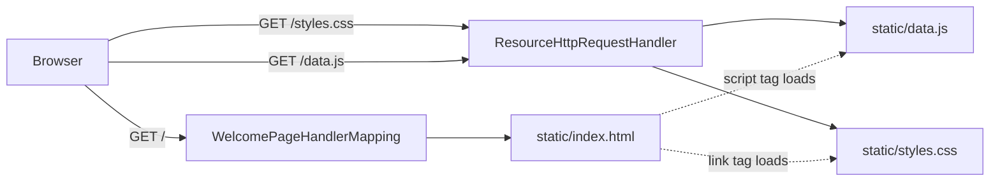

# 01 - Serve the static Sahar site

_Drop a hand-written HTML/CSS/JS site into Spring Boot and watch it render at `http://localhost:8080` with zero controllers._

## 🎯 Why this matters

Before we write a single line of Java, we are going to make Spring Boot serve a real, good-looking web page. That sounds almost too easy — and that is the point. One of Spring Boot's strongest "batteries included" defaults is that **any file you put under `src/main/resources/static/` is served at the web root, automatically, with no code.**

For a working engineer new to Spring, this is the cheapest possible way to internalise three things at once:

- A Spring Boot app is a **web server**, not just a `main()` method. When it starts, an embedded Tomcat is listening on port 8080.
- **Not everything needs a controller.** Static assets (HTML, CSS, JS, images) are handled by built-in machinery. You only write controllers when you need *behaviour*.
- We get a visible, satisfying result immediately, which we then spend the rest of the course pulling apart and rebuilding properly.

This step is deliberately the "wrong" architecture: the data lives in the browser (`data.js`). [Step 02](./02-first-rest-endpoint.md) deletes that file and moves the data behind a real `GET /api/config` endpoint. Seeing the bad version first makes the reason for the good version obvious.

## 🧠 Theory

### Where do static files come from?

When you generated this project from start.spring.io with the `spring-boot-starter-webmvc` starter, you got an **auto-configured resource handler**. On startup Spring Boot registers a `ResourceHttpRequestHandler` that maps incoming URLs to files on a set of classpath locations. The default locations, in order, are:

```text
classpath:/static/      <- we use this one
classpath:/public/
classpath:/resources/
classpath:/META-INF/resources/
```

`src/main/resources/static/styles.css` ends up on the classpath as `/static/styles.css`, so a browser request for `GET /styles.css` is matched and the file is streamed back. No annotation, no `@Controller`, no mapping that you wrote.

> [!IMPORTANT]
> Spring Boot 4 note: the web starter was **renamed**. In Boot 3.x it was `spring-boot-starter-web`; in Boot 4.x the servlet (MVC) starter is `spring-boot-starter-webmvc` (the reactive one is `spring-boot-starter-webflux`). The static-resource behaviour described here is identical — only the starter's coordinates changed. See the [Boot 4.0.6 docs](https://docs.spring.io/spring-boot/4.0.6/reference/web/servlet.html).

### Why does `/` show `index.html`?

There is one extra piece of magic. Spring Boot registers a `WelcomePageHandlerMapping`. If it finds an `index.html` on any of the static locations, it serves that file at the **root path `/`**. So `http://localhost:8080/` returns `static/index.html` even though no route says `/ -> index.html`. That is purely a Boot convenience; it is not part of the HTTP spec.

### No controller needed — and why that is the lesson

A request for a static asset never reaches "your code". It is intercepted earlier in the dispatch chain by the resource handler. Controllers exist for the cases the resource handler *cannot* serve: dynamic JSON, computed responses, request bodies, validation. We have none of those yet, so we write none. (If you want the conceptual background on how HTTP requests map to handlers, read [HTTP and REST](../theory/http-and-rest.md); for how Spring wires all this up at startup without you asking, read [Spring and DI](../theory/spring-and-di.md).)

### The request flow for this step



The browser asks for `/`, gets `index.html`. That HTML's `<link>` and `<script>` tags trigger follow-up requests for `/styles.css` and `/data.js`, which the resource handler serves the same way. Three requests, zero controllers.

### Why the data lives in the browser (for now)

In this step the routine data is a plain JavaScript object, `window.SAHAR`, defined in `data.js` and loaded by a `<script>` tag. `index.html` renders it. This *works*, but it is a static site, not an app: changing your prayer times means editing a file and redeploying, and every visitor downloads a hardcoded copy. The file even says so in its own comment. Keep this temporary arrangement in mind — dismantling it is the whole job of step 02.

## 🚦 Start from

Continue from the baseline checkpoint: a freshly generated Spring Boot 4.0.6 project that builds and starts but serves nothing. See [00 - Baseline](./00-baseline.md). You are adding files only; you will not touch any Java in this step.

## 🛠️ Build it

### 1. Create the static folder

Everything we add lives under `src/main/resources/static/`. start.spring.io does not create this folder, so make it:

```bash
mkdir -p src/main/resources/static
```

On Windows PowerShell:

```powershell
New-Item -ItemType Directory -Force src\main\resources\static
```

### 2. Add `data.js` — the routine data (temporary, client-side)

This is the June 2026 seed, living in the browser as `window.SAHAR`. Note the honest comment at the top: this file is **deleted in step 02**.

```javascript
// Sahar routine data - CLIENT SIDE (step 01 only).
//
// This is the "static site" version: the browser owns the data. It works, but
// it has a fatal flaw for an editable app - changing your routine means editing
// and redeploying a file, and every visitor just gets a hardcoded copy.
//
// In step 02 this file is DELETED. The same shape is served by the backend at
// GET /api/config, and index.html fetches it instead. That is the pivot from a
// static page to a server-driven app.
window.SAHAR = {
    title: "Sahar",
    tagline: "recover, build, fight",
    month: "June 2026",

    prayerTimes: {
        fajr: "04:37",
        sunrise: "05:59",
        dhuhr: "12:37",
        asr: "17:12",
        maghrib: "19:13",
        isha: "20:36",
        methodNote: "Karachi 18° Fajr/Isha, Hanafi Asr, computed for Thane (19.22N, 72.98E). Recheck monthly; drifts under ~10 min across a month."
    },
    // ... block (4 weeks) and weeklyGrid follow
};
```

A few things worth pointing out, because they reappear as a **JSON contract** later:

- `window.SAHAR` attaches the object to the global `window`, so any later `<script>` (here, the inline one in `index.html`) can read it.
- The shape — `title`, `tagline`, `month`, `prayerTimes`, `block`, `weeklyGrid` — is exactly the shape the backend will produce in step 02. This file is the informal spec for the `GET /api/config` response.
- The training block is four weeks, and the last one is the deload. That "deload is always the last week" rule becomes a real custom validator (`@DeloadLast`) much later in the course.

The block and grid arrays in the full file look like this:

```javascript
    block: {
        label: "4-week block · 8 Jun – 5 Jul (Foundation · Build · Peak · Deload)",
        weeks: [
            {
                ordinal: 1, name: "Foundation", startDate: "8 Jun", endDate: "14 Jun", deload: false,
                trainingFocus: "Moderate, no PM sessions; lock the schedule and the journaling habit.",
                backendFocus: "Spring Boot core: setup, dependency injection, controllers, a CRUD REST API."
            },
            // ... Build (W2), Peak (W3) ...
            {
                ordinal: 4, name: "Deload", startDate: "29 Jun", endDate: "5 Jul", deload: true,
                trainingFocus: "MMA down ~40%, light or skipped spar, weekday mains drilling only, more sleep.",
                backendFocus: "Ship it: deploy the container, refactor, docs."
            }
        ]
    },

    weeklyGrid: [
        { day: "Mon", discipline: "Muay Thai (technical)" },
        { day: "Tue", discipline: "Boxing" },
        // ... through Sun
        { day: "Sun", discipline: "Rest / mobility walk" }
    ]
```

For the exact, complete values, read the checkpoint copy: [`data.js`](../../checkpoints/step-01-serve-static/).

### 3. Add `index.html` — the defensive renderer

The HTML is a thin shell — a header, an empty `<main id="app">`, and a footer — plus a small inline script that turns the data object into DOM. The top-of-file comment is the design statement for the whole front end:

```html
<!--
  Sahar - the static shell (step 01).

  This page knows how to RENDER a routine config but holds no data of its own.
  In step 01 the data is loaded from the bundled data.js file (window.SAHAR).
  In step 02 that script tag is removed and render() is fed by fetch('/api/config')
  instead - the same shape, but now owned by the server.

  The render() function is written defensively: every section guards on whether
  its data is present, so as later steps enrich the config (schedule, supplements,
  diet, journal, ...) those sections light up automatically with no HTML change.
-->
```

The body is intentionally almost empty — the script fills `#app`:

```html
<main id="app">
    <p class="loading">Loading your routine…</p>
</main>
```

Then the data and the renderer load:

```html
<!-- Step 01: data is bundled with the page. Step 02 deletes this line. -->
<script src="data.js"></script>
<script>
    // ... helpers + render() ...

    // Step 01: the data ships with the page.
    render(window.SAHAR);
</script>
```

That last line is the seam. In step 01 we call `render(window.SAHAR)` synchronously because the data is already in memory. In step 02 the `<script src="data.js">` line is deleted and that call becomes `fetch('/api/config').then(r => r.json()).then(render)` — **the `render()` function itself does not change.**

**Why "defensive"?** Look at how each section is gated on the presence of its data. Prayer times:

```javascript
        // Prayer times
        if (cfg.prayerTimes) {
            const p = cfg.prayerTimes;
            const s = section('Prayer times');
            const row = el('div', 'prayer-row');
            [['Fajr', p.fajr], ['Sunrise', p.sunrise], ['Dhuhr', p.dhuhr],
             ['Asr', p.asr], ['Maghrib', p.maghrib], ['Isha', p.isha]]
                .forEach(([name, time]) => {
                    if (time == null) return;
                    const c = el('div', 'prayer' + (name === 'Sunrise' ? ' muted' : ''));
                    c.appendChild(el('span', 'prayer-name', esc(name)));
                    c.appendChild(el('span', 'prayer-time', esc(time)));
                    row.appendChild(c);
                });
            s.appendChild(row);
            if (p.methodNote) s.appendChild(el('p', 'note', esc(p.methodNote)));
            app.appendChild(s);
        }
```

Notice the two layers of guarding: the whole section only renders `if (cfg.prayerTimes)`, and *within* it each prayer is skipped `if (time == null)`. The `methodNote` is itself optional (`if (p.methodNote)`). Every other section follows the same pattern. The training-block section, for instance, only runs when both the block and its weeks exist:

```javascript
        // Training block (4 or 5 weeks)
        if (cfg.block && cfg.block.weeks) {
            const s = section('Training block');
            if (cfg.block.label) s.appendChild(el('p', 'subtle', esc(cfg.block.label)));
            const grid = el('div', 'weeks');
            cfg.block.weeks.forEach(w => {
                const c = el('div', 'week' + (w.deload ? ' deload' : ''));
                // ... week head, dates, focus lines ...
            });
            s.appendChild(grid);
            app.appendChild(s);
        }
```

Crucially, `render()` already contains sections we have **no data for yet** — `cfg.schedule`, `cfg.supplements`, `cfg.diet`, `cfg.journal`, `cfg.threeRules`, `cfg.weekend`, `cfg.notes`. In step 01 none of those keys exist on `window.SAHAR`, so the `if (...)` guards are false and those sections simply do not appear. When step 03 starts adding schedule and supplements to the config, **those cards light up on their own with no HTML edit.** That is the payoff of writing the renderer defensively up front.

Two small helpers do all the DOM work, kept framework-free on purpose:

```javascript
    function el(tag, className, html) {
        const node = document.createElement(tag);
        if (className) node.className = className;
        if (html != null) node.innerHTML = html;
        return node;
    }
    function esc(s) {
        return String(s == null ? '' : s)
            .replace(/&/g, '&amp;').replace(/</g, '&lt;').replace(/>/g, '&gt;');
    }
```

`esc()` HTML-escapes any value before it goes into `innerHTML`, so routine text can never accidentally inject markup. It is a habit worth keeping even in a personal app.

### 4. Add `styles.css` — the pre-dawn theme

The CSS gives Sahar its identity: deep night blues with a dawn-amber accent, named for the pre-dawn hours. It is plain CSS using custom properties (CSS variables) so colours are defined once:

```css
/* Sahar - "pre-dawn" theme. Deep night blues with a dawn-amber accent. */
:root {
    --bg: #0d1117;
    --bg-card: #161b22;
    --border: #2a3242;
    --text: #e6edf3;
    --muted: #8b97a7;
    --accent: #f0a830;      /* dawn amber */
    --accent-2: #4ea1d3;    /* sky blue */
    --deload: #2ea043;      /* green = recovery */
    --pray: #c9a227;
    /* ... per-category colours: train, work, meal, supp, journal, sleep, admin ... */
}
```

The class names in the CSS map one-to-one to the class names `render()` produces: `.card`, `.prayer-row`, `.weeks`, `.week.deload`, `.days`, and so on. For example, the deload week gets a green left border because `render()` adds the `deload` class and the CSS targets it:

```css
.week { /* ... */ border-left: 3px solid var(--accent-2); }
.week.deload { border-left-color: var(--deload); }
```

The stylesheet also already contains rules for things we have not built — `.timeline`, `.tl-item`, form `.field`s, `.toast`, `.nav` — because later steps (the daily timeline in step 03, the admin editor in step 08) reuse this one file. There is no harm in unused CSS; it just sits ready, exactly like the unused `render()` branches.

The `<head>` pulls it in with a relative link, which the resource handler serves as `/styles.css`:

```html
<link rel="stylesheet" href="styles.css">
```

### 5. Run it

Start the app from the project root:

```bash
./mvnw spring-boot:run
```

On Windows:

```powershell
.\mvnw.cmd spring-boot:run
```

Watch the log for the line confirming Tomcat is up:

```text
Tomcat started on port 8080 (http) with context path '/'
Started SaharApplication in 1.2 seconds
```

Open `http://localhost:8080`. You should see the Sahar header with the **June 2026** badge, the six prayer-time tiles, the four-week training block (Deload week outlined in green), and the weekly grid. View source or open the Network tab and you will see the browser fetched `/`, `/styles.css`, and `/data.js` — three static files, no JSON, no controller.

## ✅ End state

The app now serves a complete, styled, read-only Sahar site at `http://localhost:8080`, with all data living in the browser.

Files added in this step (all under `src/main/resources/static/`):

- `index.html` — the shell plus the defensive `render()` function. Renders prayer times, the training block, and the weekly grid; silently ready for schedule/supplements/diet/journal/rules/weekend/notes when later steps supply them.
- `styles.css` — the pre-dawn theme; class names match the renderer, with extra rules pre-staged for later steps.
- `data.js` — `window.SAHAR`, the June 2026 routine, client-side and **temporary**.

No Java changed. No controller exists. The whole step rides on Spring Boot's static-resource auto-configuration and `WelcomePageHandlerMapping`.

Checkpoint for this step: [step-01-serve-static](../../checkpoints/step-01-serve-static/).

## 🐞 Common mistakes and how to debug them

- **404 at `http://localhost:8080/`.** Almost always the folder is wrong. It must be `src/main/resources/static/` (singular `static`, under `resources`), not `src/main/static` or `src/main/resources/public/index.html` mis-typed. Confirm the file is on the classpath: after a build, look for `target/classes/static/index.html`. If it is not there, your IDE did not copy resources — re-run `./mvnw spring-boot:run` from the command line.
- **Page loads but is unstyled / blank.** Open the browser **Network** tab and reload. A red `404` on `/styles.css` or `/data.js` means the filename or relative path in `index.html` does not match the actual file. The links are relative (`href="styles.css"`, `src="data.js"`), so the files must sit next to `index.html` in the same folder.
- **`Loading your routine…` never goes away.** That placeholder is replaced by `render()`. If it stays, open the **Console** tab. A `ReferenceError: SAHAR is not defined` (or `window.SAHAR` undefined) means `data.js` did not load or failed to parse — check the Network tab for it and look for a JS syntax error in `data.js`.
- **Edited a file but the browser shows the old version.** Two caches can bite you. The browser caches static assets — do a hard reload (Ctrl/Cmd+Shift+R). And the running server serves from `target/classes`, so a save in `src/main/resources` may not be picked up until the app restarts (or you have devtools/auto-restart configured, which we do not yet).
- **Port 8080 already in use.** The log shows `Web server failed to start. Port 8080 was already in use.` Another app (or a previous run you forgot to stop) holds the port. Stop it, or set `server.port` in `application.properties`.
- **Reaching for a controller.** If your instinct was to write a `@GetMapping("/")` returning the HTML — resist it. That is the step-02 mindset applied too early. For *static* files, the resource handler is already doing the job.

## ❓ Check yourself

1. Which directory does Spring Boot serve at the web root by default, and what is the full classpath path of `styles.css` once built?
2. Why does `http://localhost:8080/` return `index.html` even though no route maps `/` to it? Name the component responsible.
3. Why did this step require **zero** controllers? When *would* you need one?
4. The renderer already has a `cfg.schedule` branch, but nothing appears for it in step 01. Why — and what makes it "light up" later without editing the HTML?
5. What is the single line in `index.html` that step 02 will change, and what does it change it to?
6. Boot 3.x used `spring-boot-starter-web`. What is the equivalent servlet starter name in Boot 4.x, and what is the reactive alternative?

## ---

⬅️ Prev: [00 - Baseline](./00-baseline.md) · ➡️ Next: [02 - First REST endpoint](./02-first-rest-endpoint.md) · 🚩 Checkpoint: [step-01-serve-static](../../checkpoints/step-01-serve-static/)

_See also: [HTTP and REST](../theory/http-and-rest.md) · [Spring and DI](../theory/spring-and-di.md) · [HTTP/REST cheatsheet](../../reference/cheatsheet-http-rest.md)_
