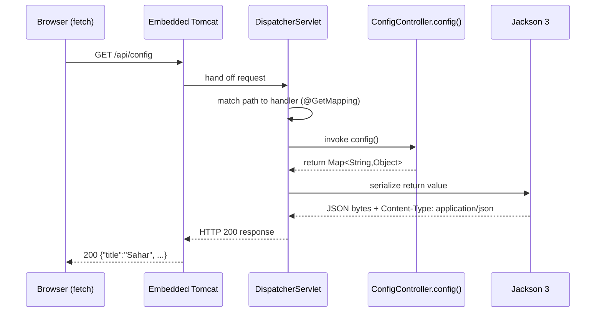

# 02 - The first REST endpoint (static to dynamic)

_Add `GET /api/config`, return JSON from Java, and let the server — not a bundled file — feed the page._

## 🎯 Why this matters

In [step 01](./01-serve-static.md) the page was a static site: `index.html` rendered a routine, but the routine itself lived in a hand-edited JavaScript file (`data.js`, exposed as `window.SAHAR`). That works for a brochure. It does **not** work for an app you intend to edit monthly — changing your prayer times or your training block would mean editing JavaScript and redeploying, and every visitor would receive a frozen copy baked into the download.

This step is the pivot. We add a single backend endpoint, `GET /api/config`, that returns the same shape as JSON. The browser stops carrying the data and starts **asking the server** for it. From here on the routine is owned by the backend, which is exactly what we need before we move it into a database (steps 06+) and make it editable through an admin page.

You will meet the three pieces that make almost every Spring web endpoint work: `@RestController`, `@GetMapping`, and the `DispatcherServlet` front controller. You will also see Jackson silently turn a Java object into JSON. And — on purpose — the data is returned as an untyped `Map<String, Object>` so you can feel exactly why we will reach for proper records in [step 03](./03-model-the-domain.md).

## 🧠 Theory

**A REST endpoint is just a Java method wired to an HTTP request.** When a request for `GET /api/config` arrives, Spring needs to (a) decide which of your methods should handle it, (b) call it, and (c) turn whatever the method returns into an HTTP response. That dispatch job is done by one object Spring Boot configures for you: the **`DispatcherServlet`**, the *front controller*. Every request to the app hits it first; it consults a handler mapping, finds the method annotated for that path, invokes it, then runs the result through a *message converter* on the way out.

**`@RestController` = `@Controller` + `@ResponseBody`.** A plain `@Controller` traditionally returns a *view name* — a string like `"home"` that Spring resolves to an HTML template to render. We do not want that; we want the return value to **be the response body**. `@ResponseBody` says exactly that, and `@RestController` is the convenience annotation that bundles both, so *every* method in the class returns body content rather than a view name. The class is also a `@Component`, so component scanning (see [Spring and DI](../theory/spring-and-di.md)) finds it and registers it as a bean at startup.

**`@GetMapping("/api/config")`** maps HTTP `GET` requests for that path to the method. It is the GET-only shorthand for `@RequestMapping(method = GET, path = "...")`. Later steps add `@PostMapping`, `@PutMapping`, `@DeleteMapping` for the other verbs (see [HTTP and REST](../theory/http-and-rest.md) and the [HTTP/REST cheatsheet](../../reference/cheatsheet-http-rest.md)).

**Jackson turns the returned object into JSON.** When a `@ResponseBody` method returns a Java object (not a `String`/`ResponseEntity`), Spring picks the JSON message converter, which uses **Jackson** to serialize. It writes the JSON bytes and sets `Content-Type: application/json` for you — no manual string building, no `new JSONObject(...)`. Spring Boot 4 ships **Jackson 3** (the `tools.jackson` package); you do not import Jackson here, so the upgrade is transparent — a `Map`, a record, or a `List` all serialize the same way they did under Jackson 2.

Here is the full round trip for `GET /api/config`:



Nothing in this diagram is custom: Tomcat is the embedded server Spring Boot starts, the `DispatcherServlet` and the handler mapping are auto-configured, and the JSON converter is registered because Jackson is on the classpath (pulled in by the web starter). Your code is only the `config()` method in the middle.

## 🚦 Start from

Continue from the step 01 checkpoint, [`step-01-serve-static`](../../checkpoints/step-01-serve-static/). At that point you have:

- `SaharApplication.java` (the `main` / `@SpringBootApplication` entry point),
- a static site under `src/main/resources/static/`: `index.html`, `styles.css`, and `data.js`,
- and in `index.html`, two lines that we are about to change:

```html
<!-- Step 01: data is bundled with the page. Step 02 deletes this line. -->
<script src="data.js"></script>
```

```javascript
// Step 01: the data ships with the page.
render(window.SAHAR);
```

The full checkpoint for **this** step is [`step-02-first-rest-endpoint`](../../checkpoints/step-02-first-rest-endpoint/).

## 🛠️ Build it

### 1. Create the controller package and class

Create `src/main/java/com/ramishtaha/sahar/web/ConfigController.java`. The `web` package is the top layer of our architecture (web -> service -> repo -> database); REST controllers live here. Start with the declaration and the imports:

```java
package com.ramishtaha.sahar.web;

import org.springframework.web.bind.annotation.GetMapping;
import org.springframework.web.bind.annotation.RestController;

import java.util.LinkedHashMap;
import java.util.List;
import java.util.Map;

@RestController
public class ConfigController {
    // ...
}
```

- `@RestController` (line 27 in the checkpoint) marks this class as a REST handler — `@Controller` + `@ResponseBody` in one. Because it is a component, startup component-scanning registers it as a bean and the `DispatcherServlet` learns about its mappings. See the [Spring annotations cheatsheet](../../reference/cheatsheet-spring-annotations.md).
- `import org.springframework.web.bind.annotation.*` is where `@GetMapping` and `@RestController` come from. Note `org.springframework.web` — this is Spring MVC, pulled in by `spring-boot-starter-webmvc` (renamed from Boot 3.x's `spring-boot-starter-web`; the reactive sibling is `spring-boot-starter-webflux`).

### 2. Add the `GET /api/config` handler

This is the method that answers the request. It returns the **whole** config as a single object:

```java
@GetMapping("/api/config")
public Map<String, Object> config() {
    Map<String, Object> cfg = new LinkedHashMap<>();
    cfg.put("title", "Sahar");
    cfg.put("tagline", "recover, build, fight");
    cfg.put("month", "June 2026");
    cfg.put("prayerTimes", prayerTimes());
    cfg.put("block", block());
    cfg.put("weeklyGrid", weeklyGrid());
    return cfg;
}
```

- `@GetMapping("/api/config")` binds this method to `GET /api/config`. No other path or verb reaches it.
- The return type is `Map<String, Object>`. When the request handler returns, Spring sees a non-`String`, non-`ResponseEntity` value and routes it through the JSON message converter; Jackson serializes the `Map` to a JSON object whose keys are the map keys.
- We use `LinkedHashMap`, not `HashMap`, deliberately: it preserves insertion order, so the JSON comes out `title`, `tagline`, `month`, `prayerTimes`, ... in the order written. A plain `HashMap` would scramble the key order. JSON does not *require* ordered keys, but stable output is far easier to eyeball and diff.
- `prayerTimes()`, `block()`, `weeklyGrid()` are private helpers returning nested maps/lists. Jackson recurses: a nested `Map` becomes a nested JSON object, a `List` becomes a JSON array.

### 3. Fill in the nested data (still hardcoded)

The prayer times for June 2026 in Thane (Hanafi Asr), straight from the checkpoint:

```java
private Map<String, Object> prayerTimes() {
    Map<String, Object> p = new LinkedHashMap<>();
    p.put("fajr", "04:37");
    p.put("sunrise", "05:59");
    p.put("dhuhr", "12:37");
    p.put("asr", "17:12");
    p.put("maghrib", "19:13");
    p.put("isha", "20:36");
    p.put("methodNote", "Karachi 18° Fajr/Isha, Hanafi Asr, computed for Thane (19.22N, 72.98E). "
            + "Recheck monthly; drifts under ~10 min across a month.");
    return p;
}
```

The training block is the 4-week, 8 Jun – 5 Jul block (Foundation · Build · Peak · Deload). Note the **deload is always the last week** — here week 4 passes `true`:

```java
private Map<String, Object> block() {
    Map<String, Object> b = new LinkedHashMap<>();
    b.put("label", "4-week block · 8 Jun – 5 Jul (Foundation · Build · Peak · Deload)");
    b.put("weeks", List.of(
            week(1, "Foundation", "8 Jun", "14 Jun", false,
                    "Moderate, no PM sessions; lock the schedule and the journaling habit.",
                    "Spring Boot core: setup, dependency injection, controllers, a CRUD REST API."),
            week(2, "Build", "15 Jun", "21 Jun", false,
                    "Add PM strength Mon and Thu; deeper deep-work; volume climbs.",
                    "Persistence: Spring Data JPA, Postgres, repositories, validation."),
            week(3, "Peak", "22 Jun", "28 Jun", false,
                    "Full volume, sharpest spar, deepest learning.",
                    "Docker and DevOps: Dockerfile, compose, env config, basic CI."),
            week(4, "Deload", "29 Jun", "5 Jul", true,
                    "MMA down ~40%, light or skipped spar, weekday mains drilling only, more sleep.",
                    "Ship it: deploy the container, refactor, docs.")
    ));
    return b;
}
```

The `week(...)` and `gridDay(...)` helpers just build the per-item maps (this is the *clumsy* part — see the note in step 4):

```java
private Map<String, Object> week(int ordinal, String name, String start, String end,
                                  boolean deload, String training, String backend) {
    Map<String, Object> w = new LinkedHashMap<>();
    w.put("ordinal", ordinal);
    w.put("name", name);
    w.put("startDate", start);
    w.put("endDate", end);
    w.put("deload", deload);
    w.put("trainingFocus", training);
    w.put("backendFocus", backend);
    return w;
}

private List<Map<String, Object>> weeklyGrid() {
    return List.of(
            gridDay("Mon", "Muay Thai (technical)"),
            gridDay("Tue", "Boxing"),
            gridDay("Wed", "Wrestling / BJJ (light)"),
            gridDay("Thu", "Muay Thai"),
            gridDay("Fri", "Padwork + light drills (taper)"),
            gridDay("Sat", "SPAR + BJJ / MMA rounds"),
            gridDay("Sun", "Rest / mobility walk")
    );
}
```

(The full `gridDay` helper and the rest are in the [checkpoint](../../checkpoints/step-02-first-rest-endpoint/).) Notice the types: `int ordinal` serializes to a JSON number, `boolean deload` to `true`/`false`, `String` to a quoted string — Jackson maps Java types to JSON types automatically.

### 4. Why `Map<String, Object>` is on purpose (and why it hurts)

The checkpoint's own Javadoc says it plainly:

> [!CAUTION]
> the data is hardcoded and modelled as an untyped `Map<String, Object>` on purpose. It works, but look how fragile it is — a typo in a key is invisible to the compiler, the shape is not guaranteed, and nesting maps-of-maps gets ugly fast.

Concretely:

- **Typos compile.** `p.put("dhur", ...)` instead of `"dhuhr"` is a perfectly valid `Map` operation. Nothing fails until the frontend silently shows a blank. With a record field `dhuhr`, a typo is a compile error.
- **No shape contract.** The return type `Map<String, Object>` tells a reader nothing about what is inside. Is `block` a map? a list? You have to read the body. A record type *is* the documentation.
- **`Object` everywhere.** Values are `Object`, so you lose all type help. Pulling a value back out means casting and praying.

This friction is the motivation for [step 03](./03-model-the-domain.md), where this same JSON shape comes from Java **records** (`Config`, `PrayerTimes`, `Block`, `Week`, ...). The key win: **the JSON output stays byte-for-byte identical**, so the frontend never notices the swap. (Records serialize automatically under Jackson 3, by their component names — no annotations needed.)

### 5. Point the frontend at the server, and delete `data.js`

Open `src/main/resources/static/index.html`. **Remove** the bundled-data script tag:

```diff
- <!-- Step 01: data is bundled with the page. Step 02 deletes this line. -->
- <script src="data.js"></script>
+ <!-- Step 02: data.js is gone. The server now owns the data. -->
```

Then **replace** the bottom call `render(window.SAHAR);` with a `fetch`. This is the actual checkpoint code at the end of `index.html`:

```javascript
// Step 02: the data now comes from the server. Same shape as data.js had,
// but the browser no longer carries a copy - it asks the backend for it.
fetch('/api/config')
    .then(resp => {
        if (!resp.ok) throw new Error('HTTP ' + resp.status);
        return resp.json();
    })
    .then(render)
    .catch(err => {
        document.getElementById('app').innerHTML =
            '<p class="loading">Could not load /api/config: ' + esc(err.message) + '</p>';
    });
```

- `fetch('/api/config')` issues the `GET` (a relative path, so it hits the same host/port the page came from — no CORS to worry about).
- `if (!resp.ok) throw ...` turns any non-2xx into an error. **`fetch` does not reject on HTTP 404/500** — a 500 still resolves the promise — so you must check `resp.ok` yourself, or a failed request looks like success.
- `resp.json()` parses the JSON body into a JS object — the same shape `window.SAHAR` used to be.
- `.then(render)` hands that object to the existing `render(cfg)` function, untouched from step 01. The renderer is written defensively (every section guards `if (cfg.xxx)`), which is why later steps can enrich the config and new sections just light up.
- `.catch(...)` shows a readable message in the `#app` panel if the server is down or the path is wrong.

Finally, **delete the file** `src/main/resources/static/data.js`. It is dead now; leaving it around invites confusion about which copy is real.

### 6. Run it and see JSON

```bash
./mvnw spring-boot:run
```

Then in another terminal (or a browser):

```bash
curl http://localhost:8080/api/config
```

You should get JSON beginning `{"title":"Sahar","tagline":"recover, build, fight","month":"June 2026","prayerTimes":{...`. Open <http://localhost:8080/> and the page renders exactly as in step 01 — but now the bytes came from your Java method, not from a file in the browser.

## ✅ End state

The app is now **server-driven**. The same page renders the same routine, but the data is produced by a Spring MVC endpoint and fetched at load time.

- **Added:** `src/main/java/com/ramishtaha/sahar/web/ConfigController.java` — `@RestController` with `GET /api/config` returning a hardcoded `Map<String, Object>`.
- **Changed:** `src/main/resources/static/index.html` — removed `<script src="data.js">`, replaced `render(window.SAHAR)` with `fetch('/api/config').then(...).then(render)`.
- **Deleted:** `src/main/resources/static/data.js`.

No `pom.xml` change is needed: `spring-boot-starter-webmvc` (already present from step 01 to serve static files) brings Spring MVC, Tomcat, and Jackson, which is everything this endpoint requires.

Full code: [`step-02-first-rest-endpoint`](../../checkpoints/step-02-first-rest-endpoint/).

## 🐞 Common mistakes and how to debug them

- **Endpoint returns `404`.** The controller probably is not being component-scanned. `ConfigController` must live under the base package `com.ramishtaha.sahar` (here `com.ramishtaha.sahar.web`). `@SpringBootApplication` scans its own package and below — a class outside that tree is invisible. Also confirm the path is exactly `/api/config` (case-sensitive) and the verb is `GET`.
- **JSON comes back HTML-wrapped or you get a "view not found" error.** You used `@Controller` instead of `@RestController` (or forgot `@ResponseBody`). Without it, the return value is treated as a *view name*, not body content.
- **Keys come out in a random order.** You used `HashMap` instead of `LinkedHashMap`. Functionally valid JSON, but harder to read and diff. Use `LinkedHashMap` for stable order.
- **The page shows "Loading…" forever or "Could not load /api/config".** Open the browser devtools Network tab and look at the `/api/config` request: a `404` means the endpoint is not mapped; a `500` means the handler threw (check the server console stack trace). Remember `fetch` does **not** throw on 4xx/5xx — the `if (!resp.ok)` check is what surfaces it.
- **`data.js 404` in the console.** You replaced `render(window.SAHAR)` but forgot to remove the `<script src="data.js">` tag (or vice versa, leaving `window.SAHAR` undefined). Both edits must happen together.
- **Stale page after editing `index.html`.** Static resources are served from the classpath; a hard refresh (Ctrl/Cmd-Shift-R) and a restart of `spring-boot:run` rule out browser/build caching.

## ❓ Check yourself

1. What two annotations does `@RestController` combine, and what would change if you used a plain `@Controller` here?
2. Which object decides that `GET /api/config` should be handled by `ConfigController.config()`, and where did it come from?
3. Who converts the returned `Map<String, Object>` into JSON, and which library/version does Spring Boot 4 use to do it?
4. Give two concrete reasons the untyped `Map<String, Object>` is a worse model than a record — and explain why swapping to records in step 03 will not break the frontend.
5. Why does the `fetch` code check `if (!resp.ok)` instead of relying on the `.catch`?
6. Why did `data.js` have to be deleted rather than just left in place?

## ---

⬅️ Prev: [01 - Serve static](./01-serve-static.md) · ➡️ Next: [03 - Model the domain](./03-model-the-domain.md) · 🏁 Checkpoint: [step-02-first-rest-endpoint](../../checkpoints/step-02-first-rest-endpoint/)
