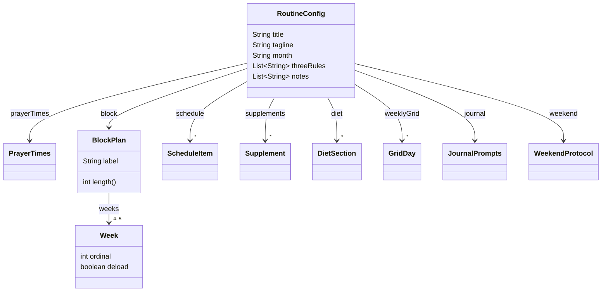

# 03 - Model the domain with records

_Replace the untyped `Map` from step 02 with a typed tree of Java records, so the compiler guarantees the JSON shape and the code reads like the domain._

> [!IMPORTANT]
> **Checkpoint:** [`step-03-model-the-domain`](../../checkpoints/step-03-model-the-domain/) — the working `/api/config` endpoint now returns a typed `RoutineConfig` record tree instead of a `Map`, with the full June 2026 seed. Package is `com.ramishtaha.sahar`.

> [!TIP]
> **IntelliJ IDEA** — when you write `new RoutineConfig(` and press <kbd>Ctrl</kbd>+<kbd>P</kbd>, IntelliJ shows the 13 record components inline as parameter hints, so you match them top-to-bottom without guessing. Generate a record from a `Map` literal with the **paste-as-record** intention, and let <kbd>Alt</kbd>+<kbd>Enter</kbd> add any missing import.

## 🎯 Why this matters

In [step 02](./02-first-rest-endpoint.md) the `/api/config` endpoint returned a giant `Map<String, Object>`. It worked, and the JSON looked right, but the code was lying to the compiler: every key was a `String`, every value was `Object`, and a typo like `"prayertimes"` instead of `"prayerTimes"`, or putting a number where a string belonged, would compile fine and only blow up (or silently produce wrong JSON) at runtime.

This step fixes that without changing a single byte of the JSON the client sees. We model the Sahar routine as a tree of **Java records** - `PrayerTimes`, `Week`, `BlockPlan`, `ScheduleItem`, `Supplement`, `DietSection`, `JournalPrompts`, `GridDay`, `WeekendProtocol`, and the aggregate `RoutineConfig`. The controller returns a `RoutineConfig` instead of a `Map`. Jackson still serializes it automatically, so the response is byte-for-byte the same shape - but now the structure is checked at compile time, your IDE autocompletes every field, and the model documents itself.

This is the foundation for everything later: the service in [step 04](./04-in-memory-edit.md) edits these records, validation in step 05 constrains them, and the database in step 06 stores their structured parts. You only get to model the domain once and reuse it everywhere if it is typed.

## 🧠 Theory

> [!NOTE]
> **What changed from Spring Boot 3.x.** This step leans on two things that are newer than most tutorials assume. **Records** are a full language feature on Java 25 (the project's LTS — *Long-Term Support*, the release line that gets years of updates), not the preview they were back on Java 14–15. And Spring Boot 4 ships **Jackson 3** (package `tools.jackson`, the library that turns your objects into JSON) where Boot 3.x shipped Jackson 2 (`com.fasterxml.jackson`) — same record-to-JSON behaviour, new import root. You never import Jackson here, so this is transparent, but it matters the day you add a custom annotation. Full older-vs-newer table: [Version deltas](../../reference/cheatsheet-version-deltas.md).

### What a record is

A **record** is a compact, immutable data carrier, stabilised in Java 16. When you write:

```java
public record PrayerTimes(String fajr, String sunrise, String dhuhr, /* ... */) { }
```

the compiler generates, for free:

- a `private final` field for each **component** (`fajr`, `sunrise`, ...),
- a **canonical constructor** (the all-arguments constructor a record generates automatically, taking every component in declaration order) that takes all components in order,
- a public **accessor** per component, named exactly like the component - `fajr()`, `isha()` (note: no `get` prefix),
- value-based `equals()` and `hashCode()` (two records are equal when all their components are equal),
- a readable `toString()` like `PrayerTimes[fajr=04:37, ...]`.

That is roughly 60 lines of boilerplate you would otherwise hand-write for a classic POJO (*Plain Old Java Object* — an ordinary class with fields, getters, setters, `equals`/`hashCode`, all written by hand), and the record version cannot drift out of sync because there is nothing to maintain.

If you are rusty on records, the closures-vs-accessors and `final` mechanics, skim the [Java refresher](../../reference/java-refresher.md) before continuing.

### Why records fit a domain model

Our domain is "data with a shape": prayer times, weeks, schedule slots. It is not behaviour-heavy. Records are purpose-built for exactly this:

- **Immutability by default.** Once the server hands out a `RoutineConfig`, no caller can mutate it by accident - there are no setters. State changes happen by building a *new* record, which is exactly what we want when the service starts editing in step 04.
- **Value semantics.** `equals`/`hashCode` compare contents, so tests can assert `assertEquals(expected, actual)` on whole trees.
- **Self-documenting.** The component list *is* the schema. Reading `record Week(int ordinal, String name, String startDate, ...)` tells you the shape at a glance.
- **They can still have methods** - just no mutable state. We use that for `BlockPlan.length()` below.

### How records become JSON

Spring Boot 4 ships **Jackson 3** (package `tools.jackson`). You do not import Jackson anywhere in this project - it is transparent - but it is what turns a returned object into a JSON response body. Turning an in-memory object into text on the wire is called **serialization** (and reading it back, deserialization); for the mental model see [Serialization & JSON](../theory/serialization-and-json.md). For a record, Jackson reads the **component names** and emits one JSON property per component: `fajr()` becomes `"fajr": "04:37"`. Nesting works recursively: a `RoutineConfig` holds a `PrayerTimes`, so the JSON nests a `"prayerTimes"` object. Lists become JSON arrays. The same machinery runs in reverse for request bodies in [step 04](./04-in-memory-edit.md). For the deeper HTTP/JSON picture see [HTTP and REST](../theory/http-and-rest.md).

Because the component names *are* the JSON keys, renaming a record component renames the JSON field. That is the trade we want: one typed source of truth.

### The shape of the model



`RoutineConfig` is the **aggregate root** (the one top-level record that owns and composes all the smaller ones, so the rest of the app talks to a single object instead of juggling ten): the single thing `GET /api/config` returns, composing all the smaller records.

## 🚦 Start from

Continue from the step 02 checkpoint (the working `Map`-based `/api/config`). If you want to compare, the step 02 endpoint is described in [02 - first REST endpoint](./02-first-rest-endpoint.md). You will be adding a new `domain` package and a `seed` package, and rewriting `ConfigController`. Nothing else moves.

## 🛠️ Build it

### 1. Create the leaf records in `com.ramishtaha.sahar.domain`

Start with the small, self-contained records - the leaves of the tree. Each lives in its own file in the new `domain` package.

`PrayerTimes` - the five daily prayers plus sunrise and the calculation note:

```java
package com.ramishtaha.sahar.domain;

public record PrayerTimes(
        String fajr,
        String sunrise,
        String dhuhr,
        String asr,
        String maghrib,
        String isha,
        String methodNote
) {
}
```

Why `String`, not `LocalTime`? These are display values typed by hand ("HH:mm"), and step 05 will add validation that the strings are well-formed. Keeping them as strings avoids forcing a parse/format on every read and keeps the JSON exactly `"04:37"`.

`GridDay` - one row of the weekly training grid. `note` is nullable:

```java
package com.ramishtaha.sahar.domain;

public record GridDay(
        String day,
        String discipline,
        String note
) {
}
```

`ScheduleItem` - one slot in the daily timeline. `category` drives the frontend colour-coding; `detail` may be `null`:

```java
package com.ramishtaha.sahar.domain;

public record ScheduleItem(
        String time,
        String title,
        String detail,
        String category,
        String dayType
) {
}
```

`Supplement`, `DietSection`, `JournalPrompts`, and `WeekendProtocol` follow the same pattern. `JournalPrompts` is worth noting because it holds two lists rather than scalars:

```java
package com.ramishtaha.sahar.domain;

import java.util.List;

public record JournalPrompts(
        List<String> morning,
        List<String> night
) {
}
```

A record component can be any type, including `List<String>` or another record - that is what lets us build a tree.

### 2. Add `Week` and give `BlockPlan` a derived accessor

`Week` is a plain leaf, but its `deload` flag carries a domain rule (the last week of a block is always the deload):

```java
package com.ramishtaha.sahar.domain;

public record Week(
        int ordinal,
        String name,
        String startDate,
        String endDate,
        String trainingFocus,
        String backendFocus,
        boolean deload
) {
}
```

`BlockPlan` composes a `List<Week>` **and** adds a computed method - proof that records can hold behaviour as long as it does not introduce mutable state:

```java
package com.ramishtaha.sahar.domain;

import java.util.List;

public record BlockPlan(
        String label,
        List<Week> weeks
) {
    public int length() {
        return weeks == null ? 0 : weeks.size();
    }
}
```

`length()` is a **derived accessor**: it computes from existing state instead of storing a new field. It is handy in the UI and in the block rules later, and because it is a no-arg method named `length`, Jackson will *also* serialize it as a `"length"` property in the JSON - a small, useful bonus that comes from following the accessor convention.

### 3. Compose the aggregate root `RoutineConfig`

This single record pulls everything together. It is the exact list of things `GET /api/config` returns:

```java
package com.ramishtaha.sahar.domain;

import java.util.List;

public record RoutineConfig(
        String title,
        String tagline,
        String month,
        PrayerTimes prayerTimes,
        BlockPlan block,
        List<GridDay> weeklyGrid,
        List<ScheduleItem> schedule,
        List<Supplement> supplements,
        List<DietSection> diet,
        JournalPrompts journal,
        List<String> threeRules,
        WeekendProtocol weekend,
        List<String> notes
) {
}
```

The order of components here is the order the keys appear in the JSON. Some fields are *editable monthly* (`month`, `prayerTimes`, `block`, `schedule`); the rest (`weeklyGrid`, `supplements`, `diet`, `journal`, `threeRules`, `weekend`, `notes`) are reference content the app displays. Later steps persist only the editable parts in the database and keep the reference content in the seed.

### 4. Build the real data in `RoutineSeed.defaultConfig()`

Create the `com.ramishtaha.sahar.seed` package and a `RoutineSeed` utility. It is a `final` class with a private constructor and one static factory - the "no instances, just a factory" idiom. `defaultConfig()` returns a fresh tree on every call:

```java
package com.ramishtaha.sahar.seed;

import com.ramishtaha.sahar.domain.*;

import java.util.List;

public final class RoutineSeed {

    private RoutineSeed() {
    }

    public static RoutineConfig defaultConfig() {
        return new RoutineConfig(
                "Sahar",
                "recover, build, fight",
                "June 2026",
                prayerTimes(),
                block(),
                weeklyGrid(),
                schedule(),
                supplements(),
                diet(),
                journal(),
                threeRules(),
                weekend(),
                notes()
        );
    }
    // ... private factory methods below
}
```

The body delegates to small private helpers so the top stays readable. The real June 2026 seed - read it from the checkpoint, do not guess values - is, for prayer times:

```java
private static PrayerTimes prayerTimes() {
    return new PrayerTimes(
            "04:37", "05:59", "12:37", "17:12", "19:13", "20:36",
            "Karachi 18° Fajr/Isha, Hanafi Asr, computed for Thane (19.22N, 72.98E). "
                    + "Recheck monthly; drifts under ~10 min across a month.");
}
```

The training block is the 4-week block 8 Jun - 5 Jul, with the deload last:

```java
private static BlockPlan block() {
    return new BlockPlan(
            "4-week block · 8 Jun – 5 Jul (Foundation · Build · Peak · Deload)",
            List.of(
                    new Week(1, "Foundation", "8 Jun", "14 Jun",
                            "Moderate, no PM sessions; lock the schedule and the journaling habit.",
                            "Spring Boot core: setup, dependency injection, controllers, a CRUD REST API.",
                            false),
                    new Week(2, "Build", "15 Jun", "21 Jun",
                            "Add PM strength Mon and Thu; deeper deep-work; volume climbs.",
                            "Persistence: Spring Data JPA, Postgres, repositories, validation.",
                            false),
                    new Week(3, "Peak", "22 Jun", "28 Jun",
                            "Full volume, sharpest spar, deepest learning.",
                            "Docker and DevOps: Dockerfile, compose, env config, basic CI.",
                            false),
                    new Week(4, "Deload", "29 Jun", "5 Jul",
                            "MMA down ~40%, light or skipped spar, weekday mains drilling only, more sleep.",
                            "Ship it: deploy the container, refactor, docs.",
                            true)
            ));
}
```

Notice only the last `Week` has `deload` = `true`. That is the rule the validation step will enforce; for now it is just data.

The daily schedule uses a tiny private helper so each line stays short. The helper fixes `dayType` to `"weekday"`:

```java
private static ScheduleItem item(String time, String title, String detail, String category) {
    return new ScheduleItem(time, title, detail, category, "weekday");
}
```

and the list reads almost like the routine itself:

```java
private static List<ScheduleItem> schedule() {
    return List.of(
            item("04:15", "Wake, water, wudu, Tahajjud, Fajr", "500ml water · 20-min Tahajjud", "pray"),
            item("04:50", "Morning bullet-journal log", "5–10 min", "journal"),
            item("05:00", "Deep work — backend", "120 min · backend focus per the current week", "work"),
            item("07:30", "MMA AM session", "discipline per the weekly grid", "train"),
            // ... 13 more slots through to:
            item("21:20", "Lights out", "~7h sleep", "sleep")
    );
}
```

The remaining helpers - `weeklyGrid()`, `supplements()`, `diet()`, `journal()`, `threeRules()`, `weekend()`, `notes()` - build the reference content the same way (read `RoutineSeed.java` in the checkpoint for the full text). For example the three rules and the weekend protocol:

```java
private static List<String> threeRules() {
    return List.of(
            "One maxed system per day. Spar is Saturday, so Saturday is hard-body and easy-brain; Sunday flips it.",
            "Wave the load: Foundation, Build, Peak, Deload.",
            "The real CNS threat is head impact, not a missing supplement. Weekly spar is low concussive load; keep it there."
    );
}

private static WeekendProtocol weekend() {
    return new WeekendProtocol(
            "Hard body, easy brain — spar plus rounds in the morning; study is applied only "
                    + "(build, debug, ship), no new material.",
            "Deep brain, rested body — 4–5 hours of real focus then build a project; full physical rest, "
                    + "mobility walk; Uprise-D3 60K with a fatty meal; batch-cook the week's red meat and chicken stews, "
                    + "buy fish fresh.");
}
```

### 5. Make the controller return `RoutineConfig`

Finally, rewrite `ConfigController` so the `Map` is gone and the method returns the typed tree:

```java
package com.ramishtaha.sahar.web;

import org.springframework.web.bind.annotation.GetMapping;
import org.springframework.web.bind.annotation.RestController;
import com.ramishtaha.sahar.domain.RoutineConfig;
import com.ramishtaha.sahar.seed.RoutineSeed;

@RestController
public class ConfigController {

    @GetMapping("/api/config")
    public RoutineConfig config() {
        return RoutineSeed.defaultConfig();
    }
}
```

`@RestController` + `@GetMapping` work exactly as in step 02. The only change is the return type: Jackson now serializes a `RoutineConfig` record tree instead of a `Map`. The data still comes straight from `RoutineSeed`, is read-only, and resets on every request because nothing holds state yet - [step 04](./04-in-memory-edit.md) adds a service that keeps an editable copy in memory.

### 6. Run and confirm the JSON is unchanged

```bash
mvn spring-boot:run
```

```bash
curl http://localhost:8080/api/config
```

You should get the same shape as step 02 - `"title": "Sahar"`, a nested `"prayerTimes"` object, a `"block"` with a `"weeks"` array, and so on - now with an extra `"block": { ..., "length": 4 }` from the derived accessor. Same JSON, type-safe code.

## ✅ End state

The app serves the full Sahar routine from a strongly typed domain model. `GET /api/config` returns a `RoutineConfig` record; the JSON is the same shape as step 02 (plus the derived `block.length`), but the compiler now guarantees the structure and the IDE autocompletes every field.

Files added or changed in this step:

- **New** `com.ramishtaha.sahar.domain` package: `RoutineConfig`, `PrayerTimes`, `Week`, `BlockPlan`, `ScheduleItem`, `Supplement`, `DietSection`, `JournalPrompts`, `GridDay`, `WeekendProtocol`.
- **New** `com.ramishtaha.sahar.seed.RoutineSeed` with `defaultConfig()` and its private factory helpers, holding the real June 2026 content.
- **Changed** `com.ramishtaha.sahar.web.ConfigController`: returns `RoutineConfig` instead of `Map<String, Object>`.

See the full, working source in [the step 03 checkpoint](../../checkpoints/step-03-model-the-domain/).

## 💼 Interview angle

**Q: What does the `record` keyword generate for you, and why use it for a domain model?**
A: For each component it generates a `private final` field, the all-args canonical constructor, a same-named
accessor, plus value-based `equals`/`hashCode` and a readable `toString`. That makes records ideal for
"data with a shape" — immutable, self-documenting, and comparable by content.

**Q: How does a record become JSON, and where do the property names come from?**
A: Jackson reads the **component names** and emits one JSON property per component (`fajr()` → `"fajr"`),
nesting recursively for records and emitting arrays for lists. The component name *is* the JSON key, so
renaming a component renames the field.

**Q: Records are immutable — so how do you "change" one?**
A: You don't mutate it; you build a *new* record with the updated values (there are no setters). That's
exactly what the in-memory edit in step 04 does, and it's why records are safe to hand out and share.

**Q: A record has no `length` field, yet the JSON shows `"length": 4`. Why?**
A: `BlockPlan.length()` is a derived/no-arg accessor that computes `weeks.size()`. Jackson treats any
public no-arg getter-shaped method as a property, so it serializes `length` even though nothing is stored —
and ignores it on deserialization because it isn't a constructor component.

**Q: What's an aggregate root, and why model the config as one `RoutineConfig`?**
A: It's the single top-level object that owns and composes the smaller records, so callers deal with one
typed thing instead of ten loose pieces. `GET /api/config` returns exactly that one object, and later steps
persist only its editable parts.

**Q: Why model prayer times as `String` rather than `LocalTime`?**
A: They're hand-typed display values in `"HH:mm"` form. Strings keep the JSON byte-for-byte (`"04:37"`),
avoid forcing a parse/format on every read, and step 05 adds validation that the strings are well-formed —
all the safety without the conversion cost.

## 🐞 Common mistakes and how to debug them

- **Constructor argument order/count mismatch.** `new RoutineConfig(...)` takes 13 arguments in a fixed order. If you swap two `String`s of the same type (e.g. `title` and `tagline`), it compiles but the JSON is subtly wrong. Symptom: fields look shuffled in the response. Fix: read the component list top-to-bottom and match it; let your IDE show parameter hints.
- **Adding a `get` prefix.** Record accessors are `fajr()`, not `getFajr()`. If you write `config.getMonth()` it will not compile. Use the bare component name.
- **Trying to mutate a record.** There are no setters. `prayerTimes.fajr("05:00")` is not a thing. To "change" a value you build a new record. This is intentional and matters in step 04.
- **`List.of(...)` with a `null` element throws.** `List.of` rejects nulls. The seed only ever puts `null` in *nullable record components* (like a `GridDay.note` or `ScheduleItem.detail`), never as a list element. Symptom: `NullPointerException` at startup from `List.of`. Fix: nulls go inside an element, not as the element.
- **Wrong package import in the seed.** `RoutineSeed` uses `import com.ramishtaha.sahar.domain.*;`. If the records are in a different package the wildcard import will not resolve and `new Week(...)` will not compile.
- **Expecting `length` to be settable.** `BlockPlan.length()` is derived from `weeks.size()`. Jackson serializes it but there is no field behind it; you cannot set it, and on deserialization (step 04) Jackson ignores it because it is not a constructor component.
- **JSON shape changed unexpectedly.** If a field name in the response is wrong, check the record component name - the component name *is* the JSON key. Renaming the component renames the field.

## ❓ Check yourself

1. What four things does the compiler generate for you when you declare a `record`?
2. Why are prayer times modelled as `String` instead of `LocalTime` in this app?
3. How does Jackson decide the JSON key for `BlockPlan.label`, and where does the extra `"length"` property in the JSON come from?
4. `RoutineConfig` has 13 components - which are "editable monthly" and which are "reference content", and why does that distinction matter for later steps?
5. The records have no setters. If [step 04](./04-in-memory-edit.md) needs to change the month, how will it produce the updated config?
6. Why is `RoutineSeed` a `final` class with a private constructor instead of a regular class you instantiate?

---
⬅️ Prev: [02 - first REST endpoint](./02-first-rest-endpoint.md) · ➡️ Next: [04 - in-memory edit](./04-in-memory-edit.md) · 📍 Checkpoint: [step-03-model-the-domain](../../checkpoints/step-03-model-the-domain/) · 🔗 See also: [Serialization & JSON](../theory/serialization-and-json.md) · [Java refresher](../../reference/java-refresher.md) · [Interview-prep](../../reference/interview-prep.md)
