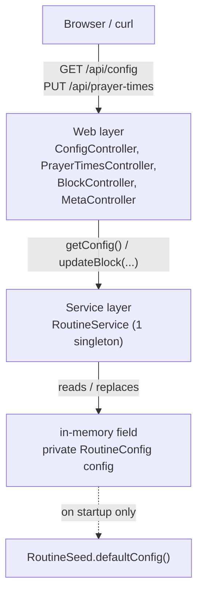
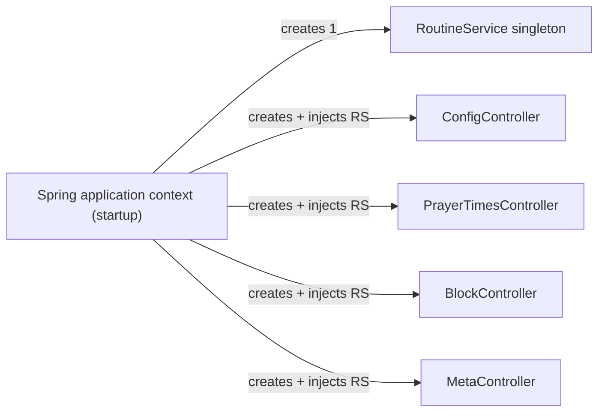

# 04 - Editing in memory: the service layer

*Introduce a `@Service` bean that holds the routine in a field, add `PUT` endpoints that edit it, and watch those edits survive between requests but vanish on restart.*

> [!IMPORTANT]
> **Checkpoint:** [`step-04-in-memory-edit`](../../checkpoints/step-04-in-memory-edit/) — the Sahar app with a `RoutineService` state-holder, constructor-injected controllers, and the three new `PUT` endpoints. Package is `com.ramishtaha.sahar`.

> [!TIP]
> **IntelliJ IDEA Ultimate** — fire the PUTs from the **HTTP Client** ([`app/requests.http`](../../app/requests.http)), and use the **Spring Beans** diagram + the autowiring gutter icons to *see* the dependency injection you wired. [More →](../../reference/intellij-ultimate.md)

## 🎯 Why this matters

Up to step 03 the app is a glorified read-only printout. Every request to `GET /api/config` calls `RoutineSeed.defaultConfig()` and builds a brand-new tree from scratch. There is nowhere to *put* an edit, because there is no object that outlives a single request.

This step adds that object: a **service** that holds the current routine in a field and exposes methods to change it. Once one object lives across requests, "edit" becomes possible — a `PUT` mutates the field, and the next `GET` sees the new value. That is the whole point of a server with state.

You will also meet the three workhorses of every Spring web app you will ever write:

- **The service layer** — where business logic lives, separated from HTTP plumbing.
- **Constructor dependency injection** — how a controller gets a service without ever calling `new`.
- **`@RequestBody`** — how incoming JSON becomes a typed Java object, the exact mirror of how `@RestController` turns objects back into JSON.

And you will feel the limitation that motivates the rest of the course: in-memory state **resets on restart**. That ache is what a database fixes in [step 06](./06-jdbctemplate-h2.md).

> [!NOTE]
> **What changed from Spring Boot 3.x** — the service layer, `@Service`, constructor injection, and `@RequestBody` are all unchanged from Boot 3 (and Spring 5/6); these are stable foundations. The one delta that touches this step is **Jackson 3** (package `tools.jackson`), which is what Boot 4 uses to turn your incoming JSON into a record and your returned record back into JSON — it works exactly like Jackson 2 did here, just under a new package name. You will also see `synchronized` (plain Java, no version story) rather than any newer concurrency type. Full older-vs-newer table: [Version deltas](../../reference/cheatsheet-version-deltas.md).

## 🧠 Theory

### The layered architecture

A Spring web app is built in layers, each with one job. Requests flow down; data flows back up.

- **Web layer** (`@RestController`): speaks HTTP. Parses the URL, the method (`GET`/`PUT`/...), and the JSON body; calls the layer below; turns the result back into JSON. It should contain almost no logic.
- **Service layer** (`@Service`): the business rules and the current state. Knows nothing about HTTP — no URLs, no status codes. You could call it from a CLI, a test, or a scheduled job and it would behave identically.
- **Data layer** (repositories): persistence. Empty for now — our "store" is a field in the service. [Step 06](./06-jdbctemplate-h2.md) introduces real `JdbcTemplate` repositories here.



Why separate the layers at all when the app is tiny? Because each layer has different reasons to change. HTTP concerns (status codes, content types) move at a different pace than business rules (a block is 4 or 5 weeks). Keeping them apart means a change to one rarely touches the other — and the service stays unit-testable without spinning up a web server.

### Dependency injection: who calls `new`?

`ConfigController` needs a `RoutineService`. The naive move is `new RoutineService()` inside the controller — but then *every* controller would build its *own* service, each with its own `config` field, and an edit through one controller would be invisible to another. You need **one shared** service.

Spring solves this with an **application context**: at startup it scans your classes, sees the `@Service` and `@RestController` annotations, and constructs exactly one instance of each (a **singleton**). When it builds a controller, it looks at the constructor parameters, finds a matching bean, and passes it in. You declare a *need*; Spring satisfies it. That is **dependency injection**.



All four controllers receive the **same** `RoutineService` instance. That shared instance is the reason an edit is durable across requests. More on the context and beans in [the DI theory page](../theory/spring-and-di.md).

### `@RequestBody` and PUT vs POST

`@RestController` already turns a returned object into a JSON response (via Jackson — in Boot 4 that is Jackson 3, `tools.jackson`, but it is invisible here). `@RequestBody` is the mirror: it takes the incoming JSON request body and **deserializes** it (turns text-on-the-wire back into a live Java object — the reverse of serialization; see [Serialization & JSON](../theory/serialization-and-json.md)) into a Java object. Because our domain types are records, Jackson maps JSON keys to record components automatically — no annotations, no custom code.

```text
Request:   PUT /api/prayer-times   body = {"fajr":"04:37", ...}
                         |  @RequestBody  (Jackson: JSON -> PrayerTimes)
                         v
            PrayerTimes record  ->  service.updatePrayerTimes(...)
                         |  @RestController (Jackson: PrayerTimes -> JSON)
                         v
Response:  200 OK   body = {"fajr":"04:37", ...}
```

Why **PUT** and not POST for these edits? PUT means *"make the resource at this URL equal to what I'm sending"* — a full replacement. It is **idempotent** (a request you can repeat safely — running it many times has the same effect as running it once): sending the identical request twice leaves the server in the same state as sending it once. Replacing the single prayer-times resource is a textbook PUT. POST means *"create a new sub-resource"* or *"run a process"* and is not idempotent. We use POST later (`POST /api/schedule` to create, `POST /api/block/roll-forward` to run an action). See [the HTTP/REST theory page](../theory/http-and-rest.md) and the [HTTP cheatsheet](../../reference/cheatsheet-http-rest.md).

### Immutable records, and how you "edit" them

Records are immutable — there is no `setMonth(...)`. To "change" one you build a **new** instance copying every field except the one you are replacing. We centralise that copy-and-replace in small `with*` helpers on `RoutineConfig` so the service stays readable.

## 🚦 Start from

Continue from the step 03 checkpoint, [`03 - Model the domain`](./03-model-the-domain.md). At that point `ConfigController` reads straight from the seed and there is no service, no edits, no PUT:

```java
// step 03 ConfigController.java - the starting point
@RestController
public class ConfigController {

    @GetMapping("/api/config")
    public RoutineConfig config() {
        return RoutineSeed.defaultConfig();   // fresh tree every request, read-only
    }
}
```

Notice there is no field, no constructor, no state. Every call rebuilds the routine. We are about to give it a memory.

## 🛠️ Build it

### 1. Add the `with*` helpers to `RoutineConfig`

The record is immutable, so editing means copying. Add one wither per editable field. Each one calls the canonical constructor, passing the **new** value for one component and the existing accessor for the rest.

```java
// src/main/java/com/ramishtaha/sahar/domain/RoutineConfig.java
public RoutineConfig withMonth(String newMonth) {
    return new RoutineConfig(title, tagline, newMonth, prayerTimes, block, weeklyGrid, schedule,
            supplements, diet, journal, threeRules, weekend, notes);
}

public RoutineConfig withPrayerTimes(PrayerTimes newPrayerTimes) {
    return new RoutineConfig(title, tagline, month, newPrayerTimes, block, weeklyGrid, schedule,
            supplements, diet, journal, threeRules, weekend, notes);
}

public RoutineConfig withBlock(BlockPlan newBlock) {
    return new RoutineConfig(title, tagline, month, prayerTimes, newBlock, weeklyGrid, schedule,
            supplements, diet, journal, threeRules, weekend, notes);
}

public RoutineConfig withSchedule(List<ScheduleItem> newSchedule) {
    return new RoutineConfig(title, tagline, month, prayerTimes, block, weeklyGrid, newSchedule,
            supplements, diet, journal, threeRules, weekend, notes);
}
```

Line by line: inside `withMonth`, `newMonth` is the parameter; `title`, `tagline`, `prayerTimes`, `block`, and the rest are the record's own accessors (you can call them without `this.`). The result is a fresh `RoutineConfig` identical to the old one except for `month`. The original object is untouched — that is what immutability buys you: nobody can mutate a config someone else is reading.

`withSchedule` exists already for use in later steps; we wire it in step 07. Adding it now keeps all the withers in one place.

### 2. Create the `RoutineService` bean

This is the new state-holder. It loads the seed **once** at startup into a field, and every edit replaces that field.

```java
// src/main/java/com/ramishtaha/sahar/service/RoutineService.java
@Service
public class RoutineService {

    private RoutineConfig config = RoutineSeed.defaultConfig();

    public synchronized RoutineConfig getConfig() {
        return config;
    }

    /** Replace the whole prayer-times block. Returns the updated config. */
    public synchronized RoutineConfig updatePrayerTimes(PrayerTimes prayerTimes) {
        config = config.withPrayerTimes(prayerTimes);
        return config;
    }

    /** Replace just the month label. Returns the updated config. */
    public synchronized RoutineConfig updateMonth(String month) {
        config = config.withMonth(month);
        return config;
    }

    /** Replace the whole training block. Returns the updated config. */
    public synchronized RoutineConfig updateBlock(BlockPlan block) {
        config = config.withBlock(block);
        return config;
    }
}
```

What each part does:

- **`@Service`** marks the class as a Spring bean. At startup Spring creates **one** instance (a singleton) and makes it available for injection. (`@Service` is functionally `@Component` with a name that documents intent — "this is a service-layer bean".)
- **`private RoutineConfig config = RoutineSeed.defaultConfig();`** is the entire data store. The field initialiser runs once, when Spring constructs the singleton — so the seed is read once at startup, not per request. This is the line that gives the app a memory.
- **`getConfig()`** returns the current snapshot. Each `update*` method calls a wither, **reassigns** the `config` field to the new copy, and returns it. The old config is discarded.
- **`synchronized`** prevents two concurrent requests from interleaving a read and a write of `config` and losing an update. One person editing their own routine will never collide, but it costs nothing and is the correct habit when a single field is shared across threads.

Note what is *not* here: no `@GetMapping`, no URLs, no status codes. The service has no idea it is being driven over HTTP. That separation is the value of the layer.

### 3. Point `ConfigController` at the service

Replace the direct seed call with a service call, injected through the constructor.

```java
// src/main/java/com/ramishtaha/sahar/web/ConfigController.java
@RestController
public class ConfigController {

    private final RoutineService routine;

    public ConfigController(RoutineService routine) {
        this.routine = routine;
    }

    @GetMapping("/api/config")
    public RoutineConfig config() {
        return routine.getConfig();
    }
}
```

The `private final RoutineService routine;` field plus the constructor that assigns it is **constructor injection**. Spring sees the constructor needs a `RoutineService`, finds the singleton it already built, and passes it in. We never write `new RoutineService()`. `final` is deliberate: the dependency is set once and can never be reassigned. Single-constructor classes need no `@Autowired` annotation — Spring uses the only constructor automatically.

### 4. Add the PUT endpoints

Three controllers, one per editable area. They follow the same shape: inject the service, expose a `GET` to read, a `PUT` to replace.

**Prayer times** — `GET` returns them, `PUT` replaces them with the body:

```java
// src/main/java/com/ramishtaha/sahar/web/PrayerTimesController.java
@RestController
public class PrayerTimesController {

    private final RoutineService routine;

    public PrayerTimesController(RoutineService routine) {
        this.routine = routine;
    }

    @GetMapping("/api/prayer-times")
    public PrayerTimes get() {
        return routine.getConfig().prayerTimes();
    }

    @PutMapping("/api/prayer-times")
    public PrayerTimes update(@RequestBody PrayerTimes prayerTimes) {
        return routine.updatePrayerTimes(prayerTimes).prayerTimes();
    }
}
```

`update` receives the JSON body as a `PrayerTimes` record (`@RequestBody`), hands it to the service, and returns the prayer times from the updated config so the client sees the result without a follow-up GET.

**The training block** — same pattern, on `/api/block`:

```java
// src/main/java/com/ramishtaha/sahar/web/BlockController.java
@PutMapping("/api/block")
public BlockPlan update(@RequestBody BlockPlan block) {
    return routine.updateBlock(block).block();
}
```

> [!NOTE]
> For now **any** block is accepted — even a 3-week one, or one whose deload is not last. [Step 05](./05-validation-and-rules.md) adds the rules so a malformed block is rejected with a `400` instead of silently corrupting the routine.

**The month label** — this one takes a tiny JSON object, not a whole domain record, so it uses a small request type and echoes the result:

```java
// src/main/java/com/ramishtaha/sahar/web/MetaController.java
@PutMapping("/api/month")
public Map<String, String> updateMonth(@RequestBody MonthUpdate body) {
    routine.updateMonth(body.month());
    return Map.of("month", routine.getConfig().month());
}
```

The body deserializes into a `MonthUpdate` record (with a single `month` component), so a request like `{ "month": "July 2026" }` maps cleanly. Returning `{"month": "July 2026"}` echoes the new value — a friendly PUT convention.

### 5. Run it and prove edits persist across requests

Start the app, then read, edit, and read again:

```bash
# 1. read the current month (from the seed)
curl -s http://localhost:8080/api/config | grep -o '"month":"[^"]*"'

# 2. PUT a new month
curl -s -X PUT http://localhost:8080/api/month \
     -H "Content-Type: application/json" \
     -d '{"month":"July 2026"}'

# 3. read again - the SAME running server now reports the new month
curl -s http://localhost:8080/api/config | grep -o '"month":"[^"]*"'
```

The third call shows `July 2026`. That is the singleton service doing its job: step 2 reassigned its `config` field, and step 3 read the same field back. Try the same with prayer times:

```bash
curl -s -X PUT http://localhost:8080/api/prayer-times \
     -H "Content-Type: application/json" \
     -d '{"fajr":"04:35","sunrise":"05:55","dhuhr":"12:37","asr":"17:12","maghrib":"19:13","isha":"20:36","methodNote":"Thane, Hanafi"}'
```

`GET /api/prayer-times` now returns `04:35`.

### 6. Now restart — and feel the limitation

Stop the app (Ctrl+C) and start it again. Hit `GET /api/config`. The month is back to the seed value; your `July 2026` is gone.

Why? The `config` field lives in the JVM's heap. When the process dies, the heap dies with it. On the next start, the field initialiser runs `RoutineSeed.defaultConfig()` again from scratch. The app is **stateless across restarts** — fine for a demo, useless for a real personal app you actually edit. That pain is exactly what [step 06](./06-jdbctemplate-h2.md) fixes by moving `config` out of a field and into a database.

## ✅ End state

`GET /api/config` and the three new `PUT` endpoints all read and write **one shared in-memory routine** held by `RoutineService`. Edits made in one request are visible to the next — but reset on restart.

Working now:

- `GET  /api/config` — the whole routine (from the service, not the seed directly).
- `GET  /api/prayer-times` / `PUT /api/prayer-times` — read / replace prayer times.
- `PUT  /api/month` — change the month label.
- `GET  /api/block` / `PUT /api/block` — read / replace the training block (no validation yet).

Files changed or added this step:

- `domain/RoutineConfig.java` — added `withMonth`, `withPrayerTimes`, `withBlock`, `withSchedule`.
- `service/RoutineService.java` — **new**, the `@Service` state-holder.
- `web/ConfigController.java` — now injects `RoutineService` instead of calling the seed.
- `web/PrayerTimesController.java`, `web/BlockController.java`, `web/MetaController.java` — **new** PUT endpoints.

Full source: [step-04-in-memory-edit checkpoint](../../checkpoints/step-04-in-memory-edit/).

## 💼 Interview angle

**Q: What is dependency injection, and why is constructor injection preferred?**
A: DI means a class declares the collaborators it *needs* and a container (Spring's application context) supplies them, instead of the class calling `new` itself. Constructor injection makes the dependency `final` and mandatory — the object can't exist in a half-wired state — and needs no `@Autowired` on a single-constructor class.

**Q: Why is a Spring `@Service` a singleton, and why does that matter here?**
A: Spring's default bean scope creates exactly one instance per context. All four controllers receive that same `RoutineService`, so an edit through one request mutates the one shared `config` field and the next request sees it. Two instances would each have their own state and edits would "vanish."

**Q: What do `@RequestBody` and `@RestController` do, and how are they related?**
A: `@RequestBody` deserializes the incoming JSON request body into a typed Java object (here, a record); `@RestController` serializes the returned object back into a JSON response. They're mirror images, both driven by Jackson — one inbound, one outbound.

**Q: What does "idempotent" mean, and why is PUT idempotent but POST not?**
A: An idempotent request can be repeated with the same end state as sending it once. PUT *replaces* the resource at a URL, so resending it changes nothing further; POST typically *creates* a new sub-resource or runs an action, so each call can have a new effect.

**Q: Why split a tiny app into web and service layers?**
A: The layers change for different reasons — HTTP concerns (status codes, content types) move at a different pace than business rules. The service knows nothing about HTTP, so it stays unit-testable without a web server and can be driven from a CLI, a test, or a scheduled job unchanged.

**Q: Your in-memory edit survives between requests but disappears on restart. Why?**
A: The state is a field on a singleton, living in the JVM heap. It outlives a single request because the bean outlives it, but when the process dies the heap dies too; the next start re-runs the seed. Moving that state into a database (step 06) makes it durable across restarts.

## 🐞 Common mistakes and how to debug them

- **Calling `new RoutineService()` in a controller.** You then get a *second* service with its own empty `config`, and edits made through it are invisible elsewhere. Symptom: a PUT "works" (200 OK) but the next GET ignores it. Fix: never `new` a bean — declare it as a constructor parameter and let Spring inject the singleton.
- **`No qualifying bean of type 'RoutineService'` at startup.** Usually the class is missing `@Service`, or it sits outside the `com.ramishtaha.sahar` base package so component-scan never finds it. Fix: add the annotation; keep the class under the base package.
- **`415 Unsupported Media Type` on PUT.** You forgot `-H "Content-Type: application/json"`. `@RequestBody` only deserializes JSON when the request advertises JSON. Fix: send the header.
- **`400 Bad Request` with a parse error.** Malformed JSON (trailing comma, single quotes, a key that does not match a record component). Jackson cannot map it to the record. Fix: validate your JSON and match the field names exactly (`fajr`, `methodNote`, ...).
- **Editing a record "in place".** There is no setter; `config.month() = "..."` does not compile. You must build a new copy with a `with*` helper and reassign the field. If you forget to reassign (`config.withMonth(x);` with no `config =`), the edit is computed and thrown away — the GET shows the old value.
- **"My edit disappeared!"** If it vanished after a *restart*, that is expected (in-memory state). If it vanished *between requests on the same run*, you probably have two service instances (see the first bullet).

## ❓ Check yourself

1. Why does an edit made by one `PUT` show up in the next `GET`, even though `RoutineConfig` is immutable?
2. What would break if each controller did `new RoutineService()` instead of accepting it as a constructor parameter?
3. What does `@RequestBody` do, and which annotation does the opposite on the way out?
4. Why is `PUT /api/prayer-times` a PUT and not a POST? What does "idempotent" mean here?
5. Where does the seed get read — once at startup, or on every request? Which line decides that?
6. After a restart your edits are gone. Explain why in terms of where `config` lives, and what step fixes it.

---
⬅️ Prev: [03 - Model the domain](./03-model-the-domain.md) · ➡️ Next: [05 - Validation and rules](./05-validation-and-rules.md) · 📍 Checkpoint: [step-04-in-memory-edit](../../checkpoints/step-04-in-memory-edit/) · 🔗 See also: [Spring & DI](../theory/spring-and-di.md) · [HTTP & REST](../theory/http-and-rest.md) · [Interview-prep](../../reference/interview-prep.md)
