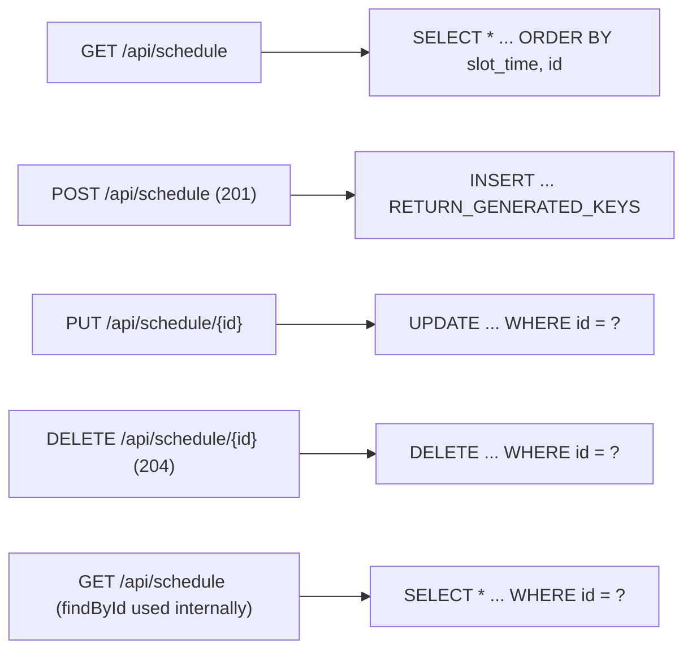

# 07 - Full CRUD for the editable parts

_Every monthly-editable field now has working create / read / update / delete endpoints backed by the database._

> [!IMPORTANT]
> **Checkpoint:** [`step-07-full-crud`](../../checkpoints/step-07-full-crud/) — the Sahar app with full CRUD over
> the daily schedule and the targeted block operations: GET/POST(201)/PUT/DELETE on `/api/schedule`, plus
> roll-forward / add-week / edit-week / drop-week on `/api/block`, all invariant-checked inside `@Transactional`
> service methods. Package is `com.ramishtaha.sahar`.

> [!TIP]
> **IntelliJ IDEA Ultimate** — exercise all five CRUD verbs from the **HTTP Client** ([`app/requests.http`](../../app/requests.http)) or the **Endpoints** tool window. [More →](../../reference/intellij-ultimate.md)

## 🎯 Why this matters

Step 06 put the routine in a real H2 file and wired up `JdbcTemplate` repositories, but the app was still effectively read-only: you could `GET` config, and replace a couple of things wholesale. That is not enough for an app you actually live in. Each month you edit prayer times, swap a training week, add a slot to the daily timeline, drop one that no longer fits.

This step turns Sahar into something you can _operate_. We add the classic five REST verbs over the daily schedule (a collection resource), and a handful of focused operations on the training block. In doing so you will learn the parts of Spring MVC that every real controller uses: `@PathVariable`, class-level `@RequestMapping`, returning the right status code (201/204/400/404), and the small but important mechanics of getting a database-generated id back after an INSERT.

We will also confront a real design decision: when a write breaks a business rule ("a block must be 4 or 5 weeks, deload last"), _who_ rejects it, and as _what_ HTTP status? See [HTTP and REST](../theory/http-and-rest.md) for the verbs-and-status-codes background this step leans on.

> [!NOTE]
> **What changed from Spring Boot 3.x.** The MVC annotations in this step (`@RestController`, `@GetMapping`,
> `@PathVariable`, `@RequestBody`, `@ResponseStatus`) are unchanged across the Boot 3 → 4 jump — that vocabulary
> has been stable for years. Two things differ on Boot 4 / Java 25: validation annotations like `@NotBlank`
> live under `jakarta.validation.*` (they were `javax.validation.*` before Boot 3), and JSON binding is now
> **Jackson 3** under `tools.jackson` rather than Jackson 2's `com.fasterxml.jackson` — which is why this `ScheduleItem`
> record serializes (turning a Java object into JSON — see [Serialization & JSON](../theory/serialization-and-json.md))
> with zero annotations. The full older-vs-newer table lives in [Version deltas](../../reference/cheatsheet-version-deltas.md).

## 🧠 Theory

### A collection resource and its five verbs

`/api/schedule` is a **collection resource**: a list of slots. REST gives us a stable vocabulary for acting on it. Each verb maps cleanly to one SQL statement in the repository.



The status codes are not decoration. They are part of the contract:

- **201 Created** - a `POST` succeeded and a new resource exists. The response body is the created row, now carrying its id.
- **204 No Content** - a `DELETE` succeeded; there is nothing meaningful to return.
- **400 Bad Request** - the input was syntactically fine but broke a rule (bad time format, or a block that is not 4-5 weeks with the deload last).
- **404 Not Found** - you named an id or ordinal that does not exist.

### The id problem on create

When you `POST` a new slot, the client does not know its id yet - the database assigns it via `GENERATED BY DEFAULT AS IDENTITY`. So `ScheduleItem.id` is `null` on the way in and populated on the way out. To learn the id the database just minted, JDBC offers a `KeyHolder`: you tell the driver "return generated keys", run the INSERT, and read the key back. That is the one genuinely new repository technique in this step.

### Idempotency: why PUT vs POST is not arbitrary

`PUT` is **idempotent** - sending it twice leaves the same final state (replace the week, replace it again, same result). `POST` is not - posting twice creates two rows, or runs an operation twice. That is why replacing the block is `PUT /api/block`, but "add a week" and "roll forward to next month" are `POST /api/block/weeks` and `POST /api/block/roll-forward`: each call _changes_ how many weeks exist.

### Where do business rules live, and what do they throw?

The block has an invariant: **4 or 5 weeks, and the deload is always the last week**. Every operation that touches the block - replace, roll-forward, add, drop, edit - must leave that invariant intact. We enforce it in one place, the service, in `requireValidBlock(...)`.

When the rule is broken, this code throws a Spring `ResponseStatusException` straight from the service. That is a deliberate shortcut, and the class doc says so:

> [!NOTE]
> A service throwing a web-flavoured exception is a small shortcut. In a larger codebase you would throw a plain domain exception and let a `@RestControllerAdvice` translate it to an HTTP status, keeping the service ignorant of HTTP.

The trade-off: `ResponseStatusException` is fewer moving parts and reads well in a course, but it couples your business layer to `org.springframework.web`. The cleaner pattern - a domain exception plus advice that maps it to a status - keeps the service testable without HTTP and reusable from a non-web caller. We will note where you'd refactor; for now, short wins.

## 🚦 Start from

Continue from the step 06 checkpoint, where persistence and `JdbcTemplate` repositories landed: [./06-jdbctemplate-h2.md](./06-jdbctemplate-h2.md). Your app already serves `GET /api/config` from H2 and has `RoutineService` assembling the response. This step adds `id` to `ScheduleItem`, fleshes out `ScheduleRepository`, builds `ScheduleController` and the new `BlockController` operations, and adds the `WeekUpdate` DTO.

## 🛠️ Build it

### 1. Give `ScheduleItem` an id

To address one specific slot for update or delete, the client needs to name it - and the row's primary key is that name. Add `Long id` as the first record component (`domain/ScheduleItem.java`):

```java
public record ScheduleItem(
        Long id,
        @NotBlank @Pattern(regexp = PrayerTimes.TIME, message = "time must be like 06:30") String time,
        @NotBlank(message = "title is required") String title,
        String detail,
        @NotBlank(message = "category is required") String category,
        String dayType
) {
}
```

- `Long` (not `long`) so it can be `null` on create - the database assigns it.
- The validation constraints from step 05 still apply, so creating a slot with a bad time or blank title is rejected with a **400** before any SQL runs.
- Because this is a record, Jackson 3 (the JSON library Boot 4 ships, under `tools.jackson` — see the version callout above) serializes and deserializes it automatically - including the new `id` field - with no annotations and no Jackson import on your side. ([Serialization & JSON](../theory/serialization-and-json.md) explains the object↔JSON round-trip.)

### 2. Full CRUD in the repository, including the generated key

`repo/ScheduleRepository.java` now does all four operations. First, one `RowMapper` shared by every read - this is the row-to-object mapping the step title promises:

```java
private static final RowMapper<ScheduleItem> MAPPER = (rs, rowNum) -> new ScheduleItem(
        rs.getLong("id"),
        rs.getString("slot_time"),
        rs.getString("title"),
        rs.getString("detail"),
        rs.getString("category"),
        rs.getString("day_type"));
```

Note the column names: `slot_time` and `day_type` are the reserved-word-safe names from step 06, mapped back onto the record's `time` and `dayType`. The mapper is the single source of truth for "a row looks like this".

Reads:

```java
public List<ScheduleItem> findAll() {
    return jdbc.query("SELECT * FROM schedule_items ORDER BY slot_time, id", MAPPER);
}

public Optional<ScheduleItem> findById(Long id) {
    return jdbc.query("SELECT * FROM schedule_items WHERE id = ?", MAPPER, id).stream().findFirst();
}
```

`findAll` orders by `slot_time` (HH:mm strings sort correctly) then `id`, so a newly created slot lands in the right place in the timeline. `findById` returns an `Optional` so the service can decide what "missing" means.

Now the new piece - **create with a `GeneratedKeyHolder`**:

```java
public ScheduleItem create(ScheduleItem item) {
    String dayType = item.dayType() == null ? "weekday" : item.dayType();
    KeyHolder keys = new GeneratedKeyHolder();
    jdbc.update(con -> {
        PreparedStatement ps = con.prepareStatement("""
                INSERT INTO schedule_items (slot_time, title, detail, category, day_type, sort_order)
                VALUES (?, ?, ?, ?, ?, 0)
                """, Statement.RETURN_GENERATED_KEYS);
        ps.setString(1, item.time());
        ps.setString(2, item.title());
        ps.setString(3, item.detail());
        ps.setString(4, item.category());
        ps.setString(5, dayType);
        return ps;
    }, keys);
    Long id = keys.getKey().longValue();
    return findById(id).orElseThrow();
}
```

Line by line, why each piece is there:

- `dayType == null ? "weekday"` - a sensible default so the column is never null.
- `new GeneratedKeyHolder()` - the bucket the driver drops the new id into.
- The lambda is a `PreparedStatementCreator`: we build the `PreparedStatement` ourselves so we can pass `Statement.RETURN_GENERATED_KEYS`. That flag is what asks the driver to hand the auto-id back. (The simpler `jdbc.update(sql, args...)` form cannot return keys - that's why we drop to the lambda here.)
- `keys.getKey().longValue()` - read the single generated key.
- `findById(id).orElseThrow()` - re-read the full row so the returned object matches exactly what is in the database (and carries the id). That is why `create` takes an item with a `null` id and returns one with the id filled in.

Update and delete return the **row count**, which the service uses to detect "no such id":

```java
/** Returns the number of rows changed - 0 means "no such id". */
public int update(Long id, ScheduleItem item) {
    String dayType = item.dayType() == null ? "weekday" : item.dayType();
    return jdbc.update("""
            UPDATE schedule_items
               SET slot_time = ?, title = ?, detail = ?, category = ?, day_type = ?
             WHERE id = ?
            """,
            item.time(), item.title(), item.detail(), item.category(), dayType, id);
}

/** Returns the number of rows deleted - 0 means "no such id". */
public int delete(Long id) {
    return jdbc.update("DELETE FROM schedule_items WHERE id = ?", id);
}
```

Returning `int` instead of throwing here keeps the repository dumb about HTTP - it just reports "0 rows changed" and lets the service decide that means 404. See [SQL and JDBC cheatsheet](../../reference/cheatsheet-sql-jdbc.md) for the `update` return-value conventions.

### 3. The schedule controller - the five verbs

`web/ScheduleController.java` is thin: each method delegates to the service and lets annotations set the status.

```java
@RestController
@RequestMapping("/api/schedule")
public class ScheduleController {

    private final RoutineService routine;

    public ScheduleController(RoutineService routine) {
        this.routine = routine;
    }

    @GetMapping
    public List<ScheduleItem> list() {
        return routine.listSchedule();
    }

    @PostMapping
    @ResponseStatus(HttpStatus.CREATED)
    public ScheduleItem create(@Valid @RequestBody ScheduleItem item) {
        return routine.createScheduleItem(item);
    }

    @PutMapping("/{id}")
    public ScheduleItem update(@PathVariable Long id, @Valid @RequestBody ScheduleItem item) {
        return routine.updateScheduleItem(id, item);
    }

    @DeleteMapping("/{id}")
    @ResponseStatus(HttpStatus.NO_CONTENT)
    public void delete(@PathVariable Long id) {
        routine.deleteScheduleItem(id);
    }
}
```

- `@RequestMapping("/api/schedule")` at the **class** level is the shared prefix. Each method's annotation (`@GetMapping`, `@PostMapping`, `@PutMapping("/{id}")`, `@DeleteMapping("/{id}")`) appends to it. This is why you write `/{id}` once per method, not the full path.
- `@ResponseStatus(HttpStatus.CREATED)` on `create` -> **201**. `@ResponseStatus(HttpStatus.NO_CONTENT)` on `delete` -> **204** (and `delete` returns `void`, matching "no content").
- `@PathVariable Long id` binds the `{id}` segment of the URL into the method parameter - Spring parses the string to `Long` for you.
- `@Valid @RequestBody` runs the record's bean-validation constraints _before_ the method body, so a malformed body never reaches the service.

### 4. The block operations

The wholesale `PUT /api/block` already existed. This step adds four targeted operations in `web/BlockController.java`:

```java
@RestController
@RequestMapping("/api/block")
public class BlockController {

    @GetMapping
    public BlockPlan get() {
        return routine.getBlock();
    }

    @PutMapping
    public BlockPlan replace(@Valid @RequestBody BlockPlan block) {
        return routine.replaceBlock(block);
    }

    @PostMapping("/roll-forward")
    public BlockPlan rollForward() {
        return routine.rollForward();
    }

    @PostMapping("/weeks")
    public BlockPlan addWeek() {
        return routine.addWeek();
    }

    @PutMapping("/weeks/{ordinal}")
    public BlockPlan updateWeek(@PathVariable int ordinal, @Valid @RequestBody WeekUpdate update) {
        return routine.updateWeek(ordinal, update);
    }

    @DeleteMapping("/weeks/{ordinal}")
    public BlockPlan dropWeek(@PathVariable int ordinal) {
        return routine.dropWeek(ordinal);
    }
}
```

Read the verbs as design: replacing the resource is `PUT` (idempotent); roll-forward and add-week create something new, so `POST`; editing one named week is `PUT` to that week's URL; removing one is `DELETE`. Every operation returns the whole `BlockPlan` so the caller (and the admin UI in [step 08](./08-editable-admin-ui.md)) always has the fresh, renumbered state.

### 5. A DTO that accepts only what the caller may change

`PUT /api/block/weeks/{ordinal}` takes a dedicated request body, `web/WeekUpdate.java` - not the full `Week`:

```java
public record WeekUpdate(
        @NotBlank(message = "week name is required") String name,
        @NotBlank(message = "start date is required") String startDate,
        @NotBlank(message = "end date is required") String endDate,
        @NotBlank(message = "training focus is required") String trainingFocus,
        @NotBlank(message = "backend focus is required") String backendFocus
) {
}
```

It deliberately omits `ordinal` and `deload`. The ordinal comes from the URL; whether a week is the deload is decided by its **position** in the block, not by the client. Accepting only the fields you actually allow the caller to change is a small but real API-design habit - it makes "the client cannot move the deload" true by construction, not by a check you might forget.

### 6. The service - operations plus the one invariant

`service/RoutineService.java` is where the rules live. Schedule CRUD turns repository row-counts into HTTP outcomes:

```java
public ScheduleItem createScheduleItem(ScheduleItem item) {
    return schedule.create(item);
}

public ScheduleItem updateScheduleItem(Long id, ScheduleItem item) {
    if (schedule.update(id, item) == 0) {
        throw new ResponseStatusException(HttpStatus.NOT_FOUND, "no schedule item " + id);
    }
    return schedule.findById(id).orElseThrow();
}

public void deleteScheduleItem(Long id) {
    if (schedule.delete(id) == 0) {
        throw new ResponseStatusException(HttpStatus.NOT_FOUND, "no schedule item " + id);
    }
}
```

That `== 0` check is the whole 404 story: the repository reports zero rows changed, the service raises **404**.

Every block operation funnels through `requireValidBlock` before persisting:

```java
/** The same rules as the @DeloadLast / @Size constraints, applied to a server-built block. */
private void requireValidBlock(BlockPlan block) {
    int n = block.length();
    if (n < 4 || n > 5) {
        throw new ResponseStatusException(HttpStatus.BAD_REQUEST, "a block is 4 or 5 weeks long");
    }
    List<Week> weeks = block.weeks();
    for (int i = 0; i < n; i++) {
        boolean shouldBeDeload = (i == n - 1);
        if (weeks.get(i).deload() != shouldBeDeload) {
            throw new ResponseStatusException(HttpStatus.BAD_REQUEST,
                    "the deload must be the last week (and only the last week)");
        }
    }
}
```

This re-validates the same invariant the `@DeloadLast` / `@Size` annotations enforce on a client-supplied `PUT` body - but here the block is built _server-side_ (by add/drop/roll-forward), so annotations on the request body never see it. The rule must live in code too. `addWeek` shows the pattern: insert a Build week just before the deload, `renumber(...)` the ordinals 1..n, then `requireValidBlock(updated)` before `blocks.replace(...)`:

```java
@Transactional
public BlockPlan addWeek() {
    BlockPlan current = blocks.find();
    List<Week> weeks = new ArrayList<>(current.weeks());
    if (weeks.size() >= 5) {
        throw new ResponseStatusException(HttpStatus.BAD_REQUEST, "a block is at most 5 weeks");
    }
    int beforeDeload = weeks.size() - 1; // insert just before the last (deload) week
    weeks.add(beforeDeload, new Week(0, "Build", "TBD", "TBD",
            "(added accumulation week - set the training focus)",
            "(set the backend focus)", false));
    BlockPlan updated = renumber(current.label(), weeks);
    requireValidBlock(updated);
    blocks.replace(updated);
    return blocks.find();
}
```

`dropWeek` mirrors it with its own guards - you cannot drop below 4 weeks, and you cannot drop the deload:

```java
Week target = weeks.stream().filter(w -> w.ordinal() == ordinal).findFirst()
        .orElseThrow(() -> new ResponseStatusException(HttpStatus.NOT_FOUND, "no week " + ordinal));
if (target.deload()) {
    throw new ResponseStatusException(HttpStatus.BAD_REQUEST, "cannot drop the deload week");
}
```

Each of these methods is `@Transactional` (Spring wraps the whole method in one database transaction — a group of writes that all commit together or all roll back) because a block replace is several statements - if validation or a write fails partway, the whole thing rolls back rather than leaving a half-edited block. This aggregate write — read the block, rebuild it, replace every week — is the textbook reason transactions exist; see [Transactions & ACID](../theory/transactions-and-acid.md) for the full story (including the proxy self-invocation trap).

### 7. Make the reasons visible

Those `ResponseStatusException` messages are useful only if Spring includes them in the error JSON. In `application.properties`:

```properties
server.error.include-message=always
```

Without this, Spring hides the message in production-style responses and you get a bare `400` with no clue why. With it, `POST /api/block/weeks` on a full block returns the reason `"a block is at most 5 weeks"`. The property comment is honest about the trade-off: handy while learning; in a public API you would think twice before exposing internal messages.

### 8. Try it

```bash
# list the timeline
curl http://localhost:8080/api/schedule

# create a slot - note 201 and the returned id
curl -i -X POST http://localhost:8080/api/schedule \
  -H "Content-Type: application/json" \
  -d '{"time":"15:30","title":"Mobility","detail":"hips + t-spine","category":"train","dayType":"weekday"}'

# update it (use the id you just got back)
curl -X PUT http://localhost:8080/api/schedule/9 \
  -H "Content-Type: application/json" \
  -d '{"time":"15:45","title":"Mobility","detail":"hips","category":"train","dayType":"weekday"}'

# delete it - expect 204 No Content
curl -i -X DELETE http://localhost:8080/api/schedule/9

# block ops
curl -X POST http://localhost:8080/api/block/weeks            # add an accumulation week (now 5)
curl -X POST http://localhost:8080/api/block/weeks            # 400: "a block is at most 5 weeks"
curl -X DELETE http://localhost:8080/api/block/weeks/3        # drop week 3, back to 4
```

## ✅ End state

Sahar is now fully editable over HTTP. Every monthly-editable field has working create/read/update/delete backed by the database, with correct status codes and validated, invariant-preserving block operations.

Files changed in this step:

- `domain/ScheduleItem.java` - gained the `Long id` component.
- `repo/ScheduleRepository.java` - full CRUD; `create` uses a `GeneratedKeyHolder` to return the new id.
- `web/ScheduleController.java` - GET/POST(201)/PUT/DELETE(204) over `/api/schedule`.
- `web/BlockController.java` - added `roll-forward`, `weeks` (POST), `weeks/{ordinal}` (PUT/DELETE).
- `web/WeekUpdate.java` - new DTO for editing one week (no `ordinal`, no `deload`).
- `service/RoutineService.java` - schedule CRUD, the four block operations, and `requireValidBlock`.
- `application.properties` - `server.error.include-message=always`.

Checkpoint for this step: [step-07-full-crud/](../../checkpoints/step-07-full-crud/).

## 💼 Interview angle

**Q: How do you return a database-generated id from an INSERT with `JdbcTemplate`?**
A: Build the `PreparedStatement` yourself with `Statement.RETURN_GENERATED_KEYS` and pass a `GeneratedKeyHolder`
to `jdbc.update(...)`. The plain `jdbc.update(sql, args...)` form cannot return keys; read the id back with
`keys.getKey().longValue()`, then re-read the row so the returned object matches the database exactly.

**Q: When do you use `PUT` versus `POST`, and why does it matter?**
A: `PUT` is idempotent — sending it twice leaves the same final state, so it fits "replace this resource."
`POST` is not idempotent — twice means two creates or two runs — so it fits "add a week" or "roll forward."
Picking the wrong verb makes retries (which clients and proxies do freely) unsafe.

**Q: How do you map a "row not found" to a 404 without leaking HTTP concerns into the repository?**
A: The repository's `update`/`delete` return an `int` row-count and stay ignorant of HTTP. The service treats
`== 0` as "no such id" and throws `ResponseStatusException(NOT_FOUND, ...)`. The dumb repository stays reusable
and unit-testable without a web context.

**Q: Why are the block operations `@Transactional`, and what would break without it?**
A: A block edit is several statements — read, rebuild, validate, replace every week. `@Transactional` makes
them one atomic unit: if validation or a write fails partway, everything rolls back instead of leaving a
half-edited, invariant-violating block. Without it a mid-operation failure could persist 3 of 5 weeks.

**Q: Where should a business rule like "4–5 weeks, deload last" be enforced — and why both annotations and code?**
A: Bean-validation annotations (`@Size`, `@DeloadLast`) only check a client-supplied request body. Operations
that build the block server-side (add/drop/roll-forward) never hit those, so the same invariant must also live
in code — `requireValidBlock(...)` in the service — run before every persist.

**Q: Why give the create DTO a boxed `Long id` instead of `long`?**
A: On create the client doesn't know the id yet — the database assigns it — so the field must be `null` inbound.
A primitive `long` can't be null and would default to `0`, silently masking "no id yet." Boxed `Long` models
the genuinely-absent value.

## 🐞 Common mistakes and how to debug them

- **POST returns the row but `id` is `null`.** You used the plain `jdbc.update(sql, args...)` form, which cannot return keys. You must build a `PreparedStatement` with `Statement.RETURN_GENERATED_KEYS` and pass a `GeneratedKeyHolder`, as `create` does.
- **PUT to a non-existent id returns 200, not 404.** Your service ignored the row-count. `update`/`delete` return an `int`; treat `== 0` as "no such id" and throw `ResponseStatusException(HttpStatus.NOT_FOUND, ...)`.
- **A 400 with no message.** You forgot `server.error.include-message=always`, so the helpful reason ("the deload must be the last week...") is suppressed. Add the property and retry.
- **`Statement` ambiguity.** Two `Statement` types exist - import `java.sql.Statement` (for `RETURN_GENERATED_KEYS`), not `org.springframework...`. A "cannot resolve RETURN_GENERATED_KEYS" error usually means the wrong import.
- **Block ops "work" but leave an invalid block.** If you skip `requireValidBlock(updated)` before `blocks.replace(...)`, a server-built block can violate the deload-last rule with no annotation to catch it. Annotations only validate the request body; server-built blocks need the explicit check.
- **`@PathVariable` name mismatch.** If the URL template is `/weeks/{ordinal}` the parameter must be `ordinal` (or you must name it explicitly, `@PathVariable("ordinal")`). A mismatch gives a `MissingPathVariableException`.
- **404 vs 400 confusion.** Naming an id/ordinal that does not exist is **404**; supplying input that breaks a rule (full block, dropping the deload, bad time) is **400**. Mixing these up makes the API lie to its callers.

## ❓ Check yourself

1. Why does `ScheduleItem.id` have to be `Long` (boxed) rather than `long` (primitive)?
2. What does `Statement.RETURN_GENERATED_KEYS` plus a `GeneratedKeyHolder` buy you that `jdbc.update(sql, args...)` cannot?
3. The repository's `update`/`delete` return an `int`. Where does that number turn into a 404, and why is it better that the repository does _not_ throw?
4. Why is "add a week" a `POST` while "replace the block" is a `PUT`? What property distinguishes them?
5. `WeekUpdate` omits `ordinal` and `deload`. What problem does omitting them prevent, compared with accepting a full `Week`?
6. The service throws `ResponseStatusException` directly. What is the cleaner alternative, and what does the shortcut couple together?

---
⬅️ Prev: [06 - JdbcTemplate and H2](./06-jdbctemplate-h2.md) · ➡️ Next: [08 - Editable admin UI](./08-editable-admin-ui.md) · 📍 Checkpoint: [step-07-full-crud](../../checkpoints/step-07-full-crud/) · 🔗 See also: [HTTP and REST](../theory/http-and-rest.md) · [Transactions & ACID](../theory/transactions-and-acid.md) · [Interview-prep](../../reference/interview-prep.md)
