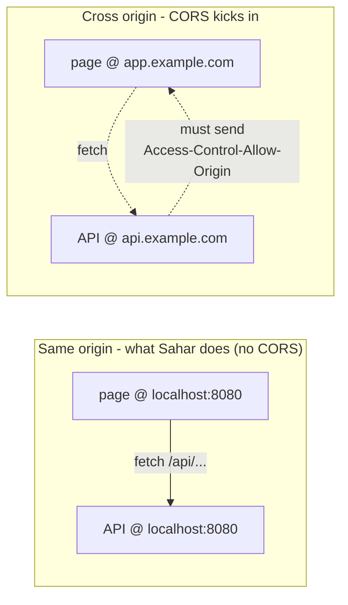
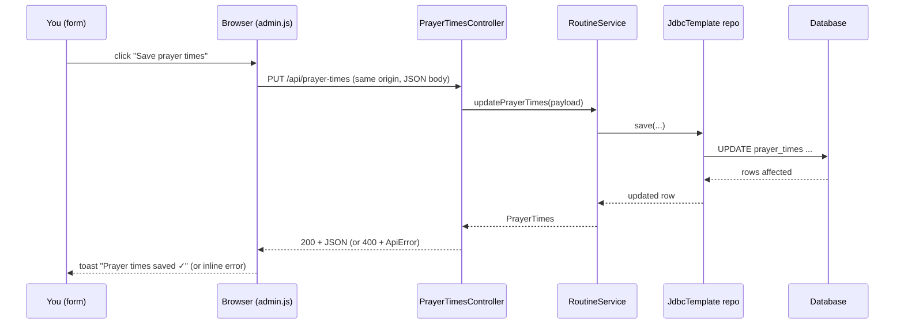

# 08 - The editable admin UI (core goal)

_A browser editor that saves the month, prayer times, and the training block straight to the database over the same-origin REST API - and shows up on a second device._

## Why this matters

This is **the core goal of the whole project**. Everything before this step was scaffolding: a static page that renders a config ([step 01](./00-baseline.md)), a server that owns the data and serves `/api/config` ([step 02](./00-baseline.md)), real persistence ([step 06](./07-full-crud.md)), and a full read/write API ([step 07](./07-full-crud.md)). None of that is useful to the human running Sahar until they can **open a browser, change a value, and have it stick**.

Step 08 builds that editor with nothing but an HTML file and a plain `.js` file - no framework, no build step. It is deliberately small so you can see exactly how a browser talks to the Spring API you wrote. By the end you can change Fajr in the browser, watch the toast confirm, refresh your phone, and see the new time. That round trip - **form to controller to service to repo to database and back** - is the thing this course exists to make real.

A second, sneaky reason this matters: because Spring serves `admin.html` from the **same origin** as `/api/prayer-times`, you get to learn what **CORS** is by _not needing it_. That contrast (same-origin vs cross-origin) is one of the most misunderstood topics in web development, and you will understand it by the end of this page.

## Theory

### One server, two kinds of file

Spring Boot serves anything under `src/main/resources/static/` as a plain static file at the web root. So `static/admin.html` is reachable at `http://localhost:8080/admin.html`, and `static/admin.js` at `/admin.js`. The **same** Spring app also answers `/api/...` with JSON. That single fact - one app, one origin - is what makes this step so simple.

An **origin** is the triple `(scheme, host, port)`. `http://localhost:8080` is one origin. When the browser loads `admin.html` from `http://localhost:8080` and that page calls `fetch('/api/prayer-times')`, the request goes to `http://localhost:8080/api/prayer-times` - **same scheme, same host, same port**. Same origin. The browser asks no questions.

### What CORS is, and why we do NOT need it here

**CORS** (Cross-Origin Resource Sharing) is a **browser** security rule. By default the browser will let JavaScript on origin A _send_ a request to origin B, but it will **hide the response** from the page unless origin B explicitly opts in with `Access-Control-Allow-Origin` headers. This is the **same-origin policy** with a controlled escape hatch. It protects you: without it, a malicious page you visit could quietly read responses from your bank's API using your logged-in cookies.

Crucially, CORS is enforced by the browser, not by Spring. `curl` and Postman never care about CORS - they are not browsers. So you will only ever hit a CORS error when **a web page on one origin calls an API on a different origin**.



We serve the page and the API from the same Spring app, so we are permanently in the left box. **We do not need CORS, and we do not configure it.**

When _would_ you? If you later split the frontend out - say a React app deployed to `https://sahar.vercel.app` calling this API on `https://api.sahar.win` - those are different origins and the browser would block the responses until the API opts in. In Spring you would enable it one of two ways:

```java
// Option A: per-controller / per-method annotation
@CrossOrigin(origins = "https://sahar.vercel.app")
@RestController
public class PrayerTimesController { /* ... */ }
```

```java
// Option B: global, via a WebMvcConfigurer
@Configuration
public class CorsConfig implements WebMvcConfigurer {
    @Override
    public void addCorsMappings(CorsRegistry registry) {
        registry.addMapping("/api/**")
                .allowedOrigins("https://sahar.vercel.app")
                .allowedMethods("GET", "POST", "PUT", "DELETE");
    }
}
```

We mention these so you recognise them later. For Sahar in this course, **neither exists** - and that is the point. (More on the request model in [HTTP and REST](../theory/http-and-rest.md).)

### The request round trip

Here is exactly what happens when you edit prayer times and click Save:



### Optimistic UI, honestly

"Optimistic UI" means giving the user instant feedback _before_ the server has fully confirmed, then **reconciling** with whatever the server actually returns. Sahar's version is intentionally modest: we show a toast on success, but we never lie - if the server returns a `400` we surface its real validation messages instead of pretending the save worked. The block endpoints go one step further: they **return the new block**, so the page re-renders straight from the response with no extra `GET`.

## Start from

Continue from the [step 07 checkpoint](../../checkpoints/step-07-full-crud/) - the full CRUD API. That step gave you the endpoints this page calls: `PUT /api/month`, `PUT /api/prayer-times`, and the block operations `POST /api/block/roll-forward`, `POST /api/block/weeks`, `PUT /api/block/weeks/{ordinal}`, `DELETE /api/block/weeks/{ordinal}`. We add no Java in this step - only two static files and one link.

## Build it

### 1. Create `admin.html` - the form shell

Put this at `src/main/resources/static/admin.html`. It is plain HTML: a card per editable thing, with inputs that have stable `id`s so the JS can find them. The top comment block records the same-origin/CORS reasoning so future-you remembers why there is no CORS config:

```html
<!--
  Sahar admin (step 08).

  These forms call the SAME REST API the read-only page uses - PUT /api/prayer-times,
  PUT /api/month, and the /api/block/* operations. Because Spring serves this page from the
  same origin (same scheme + host + port) as the API, the browser makes plain same-origin
  fetches and CORS never enters the picture. ...
-->
```

The month card is the simplest unit - one input, one button:

```html
<section class="card">
    <h2>Month label</h2>
    <div class="field">
        <label for="month">Month</label>
        <input id="month" type="text" placeholder="June 2026">
    </div>
    <button id="saveMonth">Save month</button>
</section>
```

The prayer-times card has the six prayers plus sunrise and a method note, and - importantly - an **empty error slot** that the JS fills when the server rejects the input:

```html
<button id="savePrayer">Save prayer times</button>
<div id="prayerErr" class="err-text"></div>
```

The block card has the two block-level buttons and an empty `#weeks` host that JS will fill with one editable card per week, plus its own `#blockErr` slot:

```html
<section class="card">
    <h2>Training block</h2>
    <p class="subtle" id="blockLabel"></p>
    <div class="nav" style="margin-bottom: 1rem;">
        <button id="rollForward" class="secondary">Roll forward (new month)</button>
        <button id="addWeek" class="secondary">+ Add week</button>
    </div>
    <div id="weeks"></div>
    <div id="blockErr" class="err-text"></div>
</section>
```

Finally, the toast element and the script tag at the end of `<body>`:

```html
<div id="toast" class="toast"></div>

<script src="admin.js"></script>
```

Note `admin.js` is loaded with a **relative** path (no leading slash). Since the page is at `/admin.html`, the browser resolves it to `/admin.js` - same origin again.

### 2. Create `admin.js` - the wiring

Put this at `src/main/resources/static/admin.js`. Start with the tiny helpers. `$` is a one-character alias for `getElementById`; `toast()` flashes a message and auto-hides it after 2.2 seconds:

```javascript
const $ = (id) => document.getElementById(id);

function toast(msg, kind) {
    const t = $('toast');
    t.textContent = msg;
    t.className = 'toast show ' + (kind || '');
    setTimeout(() => { t.className = 'toast ' + (kind || ''); }, 2200);
}
```

The `api()` wrapper is the heart of the file. It does the `fetch`, sets `Content-Type: application/json` and serialises the body **only when there is one** (so a `DELETE` with no body sends no `Content-Type`), then returns a uniform `{ ok, status, body }` so callers never touch the raw `Response`:

```javascript
async function api(method, path, body) {
    const opts = { method, headers: {} };
    if (body !== undefined) {
        opts.headers['Content-Type'] = 'application/json';
        opts.body = JSON.stringify(body);
    }
    const resp = await fetch(path, opts);
    let parsed = null;
    const text = await resp.text();
    if (text) {
        try { parsed = JSON.parse(text); } catch { parsed = text; }
    }
    return { ok: resp.ok, status: resp.status, body: parsed };
}
```

Why read `text()` first and then try to `JSON.parse`? Because a `200` with an empty body (or a non-JSON error page) would make `resp.json()` throw. Reading text and parsing defensively means the wrapper never blows up on an empty or unexpected response.

`errorText()` is the bridge to your backend. In [step 07](./07-full-crud.md) the validation handler returns an `ApiError` with a `messages` array. This function digs that out, with sensible fallbacks for a `ResponseStatusException` `reason`, a raw string, or a bare status code:

```javascript
function errorText(res) {
    if (res.body && Array.isArray(res.body.messages)) return res.body.messages.join('; ');
    if (res.body && res.body.message) return res.body.message;     // ResponseStatusException reason
    if (typeof res.body === 'string' && res.body) return res.body;
    return 'HTTP ' + res.status;
}
```

This is how a `jakarta.validation` failure on the server (a `400` carrying `messages`) ends up as readable text under a form, instead of a silent failure.

### 3. Load existing values into the forms

On page load we `GET /api/config` - the **same endpoint the read-only page uses** - and copy its fields into the inputs. Reusing `/api/config` means the editor and the viewer can never drift apart:

```javascript
async function load() {
    const res = await api('GET', '/api/config');
    if (!res.ok) { toast('Could not load config', 'err'); return; }
    const cfg = res.body;
    $('month').value = cfg.month || '';
    const p = cfg.prayerTimes || {};
    ['fajr', 'sunrise', 'dhuhr', 'asr', 'maghrib', 'isha'].forEach(k => { $(k).value = p[k] || ''; });
    $('methodNote').value = p.methodNote || '';
    $('blockLabel').textContent = (cfg.block && cfg.block.label) || '';
    renderWeeks(cfg.block ? cfg.block.weeks : []);
}
```

`load()` is called once at the very bottom of the file. Every `|| ''` guard means a missing field renders as an empty input rather than the string `"undefined"`.

### 4. Save the month and prayer times

The month save is a one-liner handler: `PUT /api/month` with `{ month }`, then a single toast that branches on `res.ok`:

```javascript
$('saveMonth').addEventListener('click', async () => {
    const res = await api('PUT', '/api/month', { month: $('month').value });
    toast(res.ok ? 'Month saved ✓' : 'Save failed: ' + errorText(res), res.ok ? 'ok' : 'err');
});
```

Prayer times is where inline validation shows up. We clear the error slot, build the payload from the inputs, `PUT /api/prayer-times`, and on failure write `errorText(res)` straight into `#prayerErr`:

```javascript
$('savePrayer').addEventListener('click', async () => {
    $('prayerErr').textContent = '';
    const payload = {
        fajr: $('fajr').value, sunrise: $('sunrise').value, dhuhr: $('dhuhr').value,
        asr: $('asr').value, maghrib: $('maghrib').value, isha: $('isha').value,
        methodNote: $('methodNote').value
    };
    const res = await api('PUT', '/api/prayer-times', payload);
    if (res.ok) {
        toast('Prayer times saved ✓', 'ok');
    } else {
        $('prayerErr').textContent = errorText(res);
        toast('Validation failed', 'err');
    }
});
```

Try clearing Fajr and saving: the server's `@NotBlank`-style message appears under the form. That is the full validation loop - JS payload, Jackson 3 deserialises it into your record, `jakarta.validation` rejects it, the handler builds `ApiError`, and `errorText()` renders the message.

### 5. Render and edit each week

`renderWeeks()` rebuilds the `#weeks` host from scratch each time. For every week it builds a card; the `deload` flag adds a CSS class and a pill, and each input carries a `data-f="..."` attribute naming its field so `saveWeek` can collect them back generically:

```javascript
function renderWeeks(weeks) {
    const host = $('weeks');
    host.innerHTML = '';
    (weeks || []).forEach(w => {
        const card = document.createElement('div');
        card.className = 'week' + (w.deload ? ' deload' : '');
        card.style.marginBottom = '0.8rem';
        card.innerHTML = `
            <div class="week-head">
                <span class="week-no">W${w.ordinal}</span>
                ${w.deload ? '<span class="pill">deload</span>' : ''}
            </div>
            <div class="grid-2">
                <div class="field"><label>Name</label><input data-f="name" value="${attr(w.name)}"></div>
                <div class="field"><label>Start</label><input data-f="startDate" value="${attr(w.startDate)}"></div>
                <div class="field"><label>End</label><input data-f="endDate" value="${attr(w.endDate)}"></div>
            </div>
            <div class="field"><label>Training focus</label><input data-f="trainingFocus" value="${attr(w.trainingFocus)}"></div>
            <div class="field"><label>Backend focus</label><input data-f="backendFocus" value="${attr(w.backendFocus)}"></div>
            <div class="nav">
                <button data-act="saveWeek">Save week ${w.ordinal}</button>
                <button data-act="dropWeek" class="secondary">Drop</button>
            </div>`;
        card.querySelector('[data-act="saveWeek"]').addEventListener('click', () => saveWeek(w.ordinal, card));
        card.querySelector('[data-act="dropWeek"]').addEventListener('click', () => dropWeek(w.ordinal));
        host.appendChild(card);
    });
}

function attr(s) { return String(s == null ? '' : s).replace(/"/g, '&quot;'); }
```

`attr()` escapes any double-quote in a value so it cannot break out of the `value="..."` attribute - a small but real safety habit when you build HTML from strings.

`saveWeek()` reads each `data-f` input by name and `PUT`s to `/api/block/weeks/{ordinal}`. The key move: on success it calls `afterBlock(res.body)` because the endpoint **returns the whole updated block**:

```javascript
async function saveWeek(ordinal, card) {
    const get = (f) => card.querySelector(`[data-f="${f}"]`).value;
    const payload = {
        name: get('name'), startDate: get('startDate'), endDate: get('endDate'),
        trainingFocus: get('trainingFocus'), backendFocus: get('backendFocus')
    };
    const res = await api('PUT', '/api/block/weeks/' + ordinal, payload);
    if (res.ok) { toast('Week ' + ordinal + ' saved ✓', 'ok'); afterBlock(res.body); }
    else { $('blockErr').textContent = errorText(res); toast('Save failed', 'err'); }
}
```

### 6. Add week, drop week, roll forward

These three are structurally identical: call an endpoint, and on success re-render from the returned block. Drop is a `DELETE` (no body), add is a `POST` (no body), roll-forward is a `POST` behind a `confirm()` so you cannot wipe the block by a stray click:

```javascript
async function dropWeek(ordinal) {
    const res = await api('DELETE', '/api/block/weeks/' + ordinal);
    if (res.ok) { toast('Dropped week ' + ordinal + ' ✓', 'ok'); afterBlock(res.body); }
    else { $('blockErr').textContent = errorText(res); toast(errorText(res), 'err'); }
}

$('addWeek').addEventListener('click', async () => {
    const res = await api('POST', '/api/block/weeks');
    if (res.ok) { toast('Week added ✓', 'ok'); afterBlock(res.body); }
    else { $('blockErr').textContent = errorText(res); toast(errorText(res), 'err'); }
});

$('rollForward').addEventListener('click', async () => {
    if (!confirm('Roll the block forward to a fresh template for next month?')) return;
    const res = await api('POST', '/api/block/roll-forward');
    if (res.ok) { toast('Rolled forward ✓', 'ok'); afterBlock(res.body); }
    else { toast('Failed: ' + errorText(res), 'err'); }
});
```

Notice the **business rule from the server shows up for free**: if you try to drop a week such that the deload would no longer be last (the `@DeloadLast` rule), the server returns a `400` and `errorText(res)` prints its message into `#blockErr`. The UI did not duplicate the rule - it just rendered the server's verdict.

`afterBlock()` is the reconcile step - clear the block error and re-render purely from the response, so the page state always matches the database without an extra round trip:

```javascript
function afterBlock(block) {
    $('blockErr').textContent = '';
    if (block && block.weeks) { $('blockLabel').textContent = block.label || ''; renderWeeks(block.weeks); }
}

load();
```

### 7. Add the Edit link on `index.html`

The read-only page already had this in its header - confirm it is present so a reader can get to the editor:

```html
<div class="nav" style="align-items:center;">
    <span class="month-badge"><span id="month"></span></span>
    <a href="/admin.html">Edit</a>
</div>
```

### 8. Run it and prove the round trip

```bash
./mvnw spring-boot:run
```

Open `http://localhost:8080/admin.html`, change Fajr to `04:40`, click **Save prayer times**, see the toast. Now open `http://localhost:8080/` on your phone (same Wi-Fi, using your machine's LAN IP, e.g. `http://192.168.1.20:8080/`) and the new Fajr is there. The value lives in the database, not in the browser - **that is the whole project working**.

## End state

The app now has a working editor:

- **`admin.html` / `admin.js`** - forms for the month, prayer times, and the 4-or-5-week block (per-week edit, add, drop, roll-forward), all wired with `fetch` to the step-07 API over the same origin.
- **Optimistic feedback** via `toast()`, **reconciled** from the server response (block endpoints re-render from their returned block).
- **Inline `400` messages** read out of your `ApiError.messages` by `errorText()` and shown in `#prayerErr` / `#blockErr`.
- **`index.html`** carries an `Edit` link to the admin page.
- **No CORS config** anywhere, on purpose - everything is same-origin.

Files changed this step: `src/main/resources/static/admin.html` (new), `src/main/resources/static/admin.js` (new), `src/main/resources/static/index.html` (Edit link confirmed). No Java changed.

See the full code in the [step 08 checkpoint](../../checkpoints/step-08-editable-admin-ui/).

## Common mistakes and how to debug them

- **"It saved but the page still shows the old value."** You forgot to reconcile. The block handlers call `afterBlock(res.body)` to re-render; if you skip that, the inputs keep the value _you_ typed even after a server-side normalisation. Open DevTools - Network and inspect the response body to see what the server actually stored.
- **Chasing a CORS error that is not there.** If a request fails, check it is actually going to `localhost:8080` and not, say, `127.0.0.1:8080` (a _different_ origin to the browser, even though it is the same machine). Same-origin requires the host strings to match exactly. The fix is to load the page and call the API from the identical host:port - not to add CORS.
- **`415 Unsupported Media Type` on save.** The body went out without `Content-Type: application/json`. Our `api()` sets it only when `body !== undefined`; if you call `api('PUT', path)` with no body where the controller expects one, Spring will not bind it. Pass the payload object.
- **Validation messages do not appear.** Confirm the server returns the `ApiError` shape with a `messages` array (from [step 07](./07-full-crud.md)). If it returns a different JSON shape, `errorText()` falls through to `HTTP 400`. Match the field names or extend `errorText()`.
- **Editing a stale browser tab.** Static files are cached. After editing `admin.js`, hard-refresh (Ctrl/Cmd+Shift+R) or you will run yesterday's JavaScript and swear the change did nothing.
- **`data-f` typo.** `saveWeek` reads inputs by `card.querySelector('[data-f="name"]')`. If the attribute name in `renderWeeks` and the `get(...)` key disagree, you silently send `null`/empty. Keep the names in lockstep.
- **Phone cannot reach the app.** `localhost` on your phone is the _phone_. Use the machine's LAN IP and make sure both devices are on the same network and the firewall allows port 8080.

## Check yourself

1. Why does Sahar need **no** CORS configuration, and what single change would suddenly require it?
2. What is an "origin", precisely, and why is `localhost:8080` a different origin from `127.0.0.1:8080` to the browser?
3. In `api()`, why do we read `resp.text()` and then `try { JSON.parse }` instead of just calling `resp.json()`?
4. After saving a week, how does the page end up showing the database's version rather than the text you typed?
5. Trace a cleared-out Fajr value from the input box to the red message under the form - which layer rejects it, and how does the message reach `#prayerErr`?
6. Why is `roll-forward` guarded by `confirm()` but `addWeek` is not?

## ---

Prev: [07 - Full CRUD](./07-full-crud.md) | Next: [09 - Swap to Postgres](./09-swap-to-postgres.md) | Checkpoint: [step-08-editable-admin-ui](../../checkpoints/step-08-editable-admin-ui/)

_See also: [HTTP and REST](../theory/http-and-rest.md) · [HTTP/REST cheatsheet](../../reference/cheatsheet-http-rest.md)_
