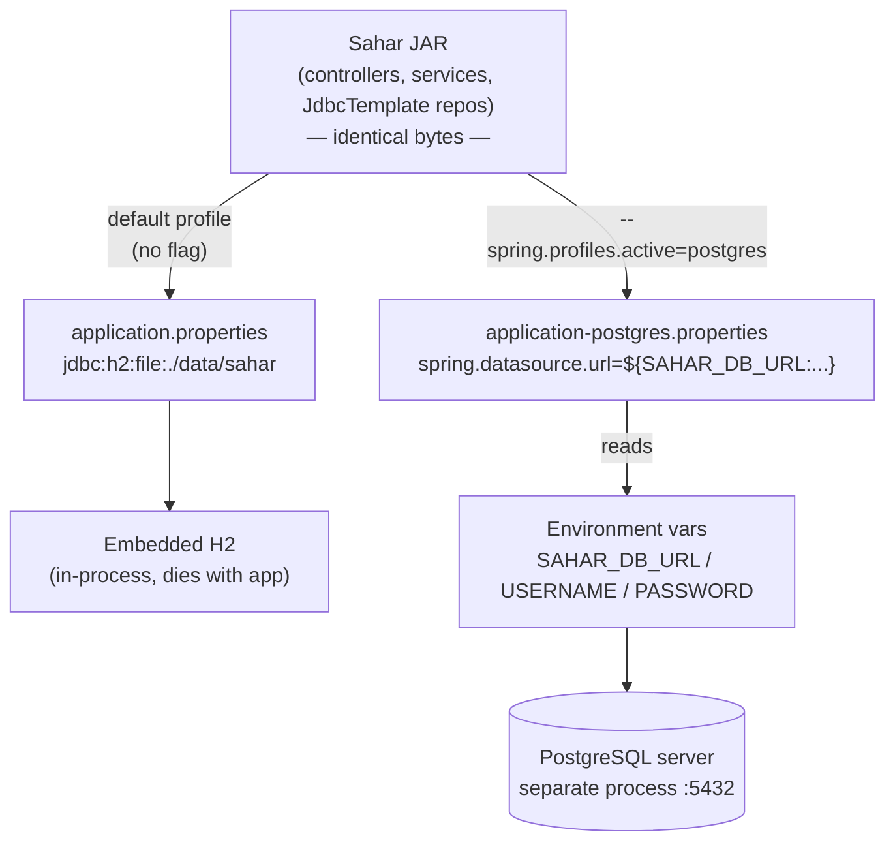

# 09 - Swap to PostgreSQL with profiles

_Same code, two databases: keep embedded H2 as the zero-setup default, and add a `postgres` profile that points the very same app at a real PostgreSQL server — with every connection detail coming from the environment._

## Why this matters

Up to now Sahar has run on embedded H2: a database that lives **inside the app's own JVM process**. That is wonderful for learning — you clone the repo, run one command, and you have a working database with no install, no server, no credentials. But it is not what you deploy. A real deployment uses a **server database** that runs as its own process, survives the app restarting, and serves many clients at once.

The naive way to switch databases is to edit `application.properties` and change the URL. That is a trap: you would have to edit-and-revert constantly, you would risk committing production credentials, and two developers could not run different setups from the same code. The professional way is **profiles plus environment-based config**. You teach the app *both* configurations once, pick one at launch time, and feed secrets in from the environment.

The payoff for Sahar specifically: the default profile still runs on H2 (anyone can run the course with zero setup), while `--spring.profiles.active=postgres` flips the same JAR onto Postgres for a real deploy. Crucially, **not one line of Java or SQL changes** — only configuration. That is the whole point of this step, and it only works because we kept [`schema.sql`](../../checkpoints/step-09-swap-to-postgres/) portable back in [step 06](./06-jdbctemplate-h2.md).

## Theory

### Embedded DB vs server DB

An **embedded database** (H2 in our case) is a library you call in-process. There is no separate program to start; the "server" is just objects on your heap. When the JVM exits, so does the engine. File mode (`jdbc:h2:file:./data/sahar`) persists the *data* to disk, but the *engine* is still part of your app.

A **server database** (PostgreSQL) is a separate operating-system process — often on a separate machine — that you connect to over TCP. It owns its own lifecycle (you can restart your app a hundred times and the data and the server are untouched), it handles **concurrency** (many connections, real locking, MVCC), and it gives you **durability** guarantees (WAL, fsync) that a deploy depends on.

| | Embedded H2 (default) | PostgreSQL (`postgres` profile) |
|---|---|---|
| Where it runs | inside your JVM | separate server process |
| Lifecycle | dies with the app | independent of the app |
| Concurrency | fine for one app | built for many clients |
| Use it for | learning, tests, demos | staging and production |

See [persistence-landscape.md](../theory/persistence-landscape.md) for the wider map of options.

### Spring profiles

A **profile** is a named bundle of configuration that Spring layers *on top of* the base `application.properties`. The convention is the filename: `application-<profile>.properties`. When the `postgres` profile is active, Spring loads `application.properties` first and then **overrides** any matching keys with the values from `application-postgres.properties`. Keys that the profile does not mention are inherited unchanged.

You activate a profile in any of three equivalent ways (all shown in the real file's header comment):

```bash
mvn spring-boot:run -Dspring-boot.run.profiles=postgres   # during development
java -jar sahar.jar --spring.profiles.active=postgres      # running the built JAR
SPRING_PROFILES_ACTIVE=postgres                            # environment variable
```

The environment-variable form is what a container platform or CI system uses — it sets `SPRING_PROFILES_ACTIVE` and your app picks the right config with no command edits.

### Environment-based config and the 12-factor app

The [Twelve-Factor App](https://12factor.net/config) methodology says: **store config in the environment**, not in code. Anything that differs between deployments — database host, username, password — should come from environment variables, never be hard-coded or committed.

Spring's `${VAR:default}` placeholder syntax is purpose-built for this. `${SAHAR_DB_URL:jdbc:postgresql://localhost:5432/sahar}` means *"use the `SAHAR_DB_URL` environment variable if it is set; otherwise fall back to this local default."* So a fresh checkout against a local Docker Postgres just works (the defaults are correct for that), while production sets the three `SAHAR_DB_*` vars to real values and **never edits the file**. The secret never touches Git.

### Two profiles, one app



The diagram's key insight: the box at the top — the compiled app — is **the same bytes** in both columns. Only the arrows (which config file, which data source) differ.

## Start from

Continue from the [step 08 checkpoint](./08-editable-admin-ui.md) — the full editable admin UI on H2. Everything you built (controllers, `RoutineService`, the `JdbcTemplate` repositories, the static `index.html` and `admin.html`) stays exactly as it is. In this step you add **one new file** and make a tiny note about the driver that is already on the classpath.

If you ever want the finished result to compare against, it is in [`checkpoints/step-09-swap-to-postgres/`](../../checkpoints/step-09-swap-to-postgres/).

## Build it

### 1. Confirm the PostgreSQL driver is already on the classpath

You do not need to add a dependency in this step — the generated `pom.xml` has had the driver since the start, declared `runtime` so it ships but isn't compiled against:

```xml
<!-- The PostgreSQL JDBC driver. Only needed at runtime; used from step 09. -->
<dependency>
    <groupId>org.postgresql</groupId>
    <artifactId>postgresql</artifactId>
    <scope>runtime</scope>
</dependency>
```

`runtime` scope is exactly right for a JDBC driver: our code only ever talks to `JdbcTemplate` and the `javax.sql.DataSource` abstraction. We never `import org.postgresql.*`. The driver is loaded reflectively by class name at runtime (`spring.datasource.driver-class-name=org.postgresql.Driver`), so it does not belong on the compile classpath. The H2 driver sits alongside it under the same scope — both drivers are present; the active profile decides which one is used.

### 2. Look at what the default profile already says

Open `src/main/resources/application.properties`. The data-source block is pure H2:

```properties
spring.datasource.url=jdbc:h2:file:./data/sahar;AUTO_SERVER=TRUE
spring.datasource.username=sa
spring.datasource.password=
spring.datasource.driver-class-name=org.h2.Driver

# Run schema.sql on every startup. It uses CREATE TABLE IF NOT EXISTS, so this is
# safe to repeat. (Default "embedded" would also run it for H2; "always" is explicit
# and is what we will need unchanged when we point at PostgreSQL in step 09.)
spring.sql.init.mode=always
```

Notice the comment on `spring.sql.init.mode=always` was written with this step in mind. The default `embedded` mode only runs `schema.sql` for in-memory databases; pointing at a *server* database (even H2 in file mode, and definitely Postgres) needs `always` so the schema is created there too. Because it is already `always`, the schema will run on Postgres with no change.

We are **not editing this file**. The default stays H2 so the course runs with zero setup.

### 3. Create `application-postgres.properties`

Add a new file beside `application.properties`. This is the whole file from the checkpoint:

```properties
# ---------------------------------------------------------------------------
# Sahar - the "postgres" profile.
#
# A Spring "profile" is a named set of settings layered on top of the base
# application.properties. Activate it with either:
#     mvn spring-boot:run -Dspring-boot.run.profiles=postgres
#     java -jar sahar.jar --spring.profiles.active=postgres
#     SPRING_PROFILES_ACTIVE=postgres   (environment variable)
# When active, these values OVERRIDE the H2 ones from application.properties.
# ---------------------------------------------------------------------------

spring.datasource.url=${SAHAR_DB_URL:jdbc:postgresql://localhost:5432/sahar}
spring.datasource.username=${SAHAR_DB_USERNAME:sahar}
spring.datasource.password=${SAHAR_DB_PASSWORD:sahar}
spring.datasource.driver-class-name=org.postgresql.Driver

# Same as before: create tables if missing, then the DataSeeder fills an empty DB.
# schema.sql is portable SQL (GENERATED BY DEFAULT AS IDENTITY, BOOLEAN), so the very
# same file that ran on H2 runs unchanged on PostgreSQL.
spring.sql.init.mode=always

# There is no H2 here, so turn its console off in this profile.
spring.h2.console.enabled=false
```

Line by line, the *why*:

- **`spring.datasource.url=${SAHAR_DB_URL:jdbc:postgresql://localhost:5432/sahar}`** — the JDBC URL. `jdbc:postgresql://host:port/database`. The `${...:default}` placeholder means env var first, local default second. The default targets a database named `sahar` on `localhost:5432`, which is exactly what we will start in Docker below.
- **`spring.datasource.username` / `password`** — likewise from `SAHAR_DB_USERNAME` / `SAHAR_DB_PASSWORD`, defaulting to `sahar`/`sahar` for local dev. In production you set the env vars to the real credentials and this file never contains a secret.
- **`spring.datasource.driver-class-name=org.postgresql.Driver`** — overrides the H2 driver name from the base file. This is why the `postgresql` dependency must be present at runtime.
- **`spring.sql.init.mode=always`** — repeated here intentionally. It is also set in the base file, but stating it in the profile makes the intent explicit and immune to the base file changing. `schema.sql` runs against Postgres exactly as it ran against H2.
- **`spring.h2.console.enabled=false`** — there is no H2 in this profile, so we turn its console off. (Note that the H2 console module — `spring-boot-h2console`, a Spring Boot 4 change from the bundled-with-driver approach in 3.x — is still on the classpath; we simply disable the feature here.)

Everything **not** mentioned in this file (your `server.port`, `server.error.include-message`, the application name) is inherited from `application.properties`.

### 4. Confirm the schema is genuinely portable

The reason this whole step is "config only" is that [`schema.sql`](../../checkpoints/step-09-swap-to-postgres/) was written in portable SQL from the start. Two choices matter:

```sql
CREATE TABLE IF NOT EXISTS weeks (
    id             BIGINT GENERATED BY DEFAULT AS IDENTITY PRIMARY KEY,
    block_id       INT NOT NULL,
    ordinal        INT NOT NULL,
    name           VARCHAR(60)  NOT NULL,
    start_date     VARCHAR(30),
    end_date       VARCHAR(30),
    training_focus VARCHAR(500),
    backend_focus  VARCHAR(500),
    deload         BOOLEAN NOT NULL DEFAULT FALSE
);
```

- **`GENERATED BY DEFAULT AS IDENTITY`** is the SQL-standard auto-increment. It works identically on H2 and Postgres — no `AUTO_INCREMENT` (MySQL), no `SERIAL` (Postgres-only) needed.
- **`BOOLEAN`** is a real type on both engines.
- The reserved-word-safe names (`slot_time`, `day_of_week`, plural tables) avoid keyword clashes that bite on stricter engines.

`CREATE TABLE IF NOT EXISTS` is what makes `spring.sql.init.mode=always` safe to run on every boot: the second startup finds the tables already there and does nothing.

### 5. Start PostgreSQL in Docker

For local development you do not install Postgres on your machine — you run it in a container. One command starts a throwaway server matching our defaults:

```bash
docker run --name sahar-pg \
  -e POSTGRES_DB=sahar \
  -e POSTGRES_USER=sahar \
  -e POSTGRES_PASSWORD=sahar \
  -p 5432:5432 \
  postgres:17-alpine
```

- `--name sahar-pg` lets you `docker stop sahar-pg` / `docker start sahar-pg` later.
- The three `-e POSTGRES_*` env vars create a database, user, and password that exactly match the local defaults in `application-postgres.properties` — so the app connects with no env vars set.
- `-p 5432:5432` publishes the container's port 5432 to your host, which is where `jdbc:postgresql://localhost:5432/sahar` points.
- `postgres:17-alpine` pins a small, current image. (Tags age — check the [official Postgres image](https://hub.docker.com/_/postgres) for the latest.)

If you prefer Podman, the command is identical with `podman` in place of `docker`. See [containers-and-devops.md](../theory/containers-and-devops.md) and the [Docker/Podman cheatsheet](../../reference/cheatsheet-docker-podman.md).

### 6. Start the app with the postgres profile

In a second terminal, run Sahar against that server:

```bash
mvn spring-boot:run -Dspring-boot.run.profiles=postgres
```

On startup, with no `SAHAR_DB_*` env vars set, the placeholders fall back to their defaults and connect to your Docker Postgres. Spring runs `schema.sql` (creating all eight tables in Postgres), the seeder fills the empty database, and the app comes up on port 8080 — looking and behaving **identically** to the H2 run.

### 7. Verify it is really hitting Postgres

Open the app, edit a value through `/admin.html` (say, change the month label), then read it straight out of Postgres with `psql` inside the container — bypassing the app entirely:

```bash
docker exec -it sahar-pg psql -U sahar -d sahar -c "SELECT month_label FROM app_meta;"
```

You should see your edited value. That round-trip — write through the app, read directly from the server with a different client — is proof that the data now lives in a separate, durable Postgres process, not inside the JVM. (This was verified live for the checkpoint.)

## End state

Sahar now runs on **two databases from one codebase**:

- **Default profile** (no flag): embedded H2 file database, zero setup — the course default.
- **`postgres` profile**: the same app on a real PostgreSQL server, with all connection details supplied by `SAHAR_DB_URL`, `SAHAR_DB_USERNAME`, and `SAHAR_DB_PASSWORD` (each with a sensible local default).

Behaviour, endpoints, UI, and data are identical between the two — the only difference is where the rows physically live. No Java changed; no SQL changed.

Files changed in this step:

- **Added** `src/main/resources/application-postgres.properties` — the new profile.
- **Unchanged** `application.properties` (still H2), `schema.sql` (already portable), `pom.xml` (the `postgresql` driver was already present).

Full result: [`checkpoints/step-09-swap-to-postgres/`](../../checkpoints/step-09-swap-to-postgres/).

## Common mistakes and how to debug them

- **Forgot the profile flag.** Running plain `mvn spring-boot:run` uses the *default* H2 profile, so your Postgres edits "disappear." Check the startup log for `The following 1 profile is active: "postgres"`. No such line means you are on H2.
- **`Connection refused` to `localhost:5432`.** The Postgres container is not running or the port is not published. `docker ps` should list `sahar-pg` with `0.0.0.0:5432->5432/tcp`. If it exited, `docker logs sahar-pg` shows why; `docker start sahar-pg` restarts a stopped one.
- **`password authentication failed for user "sahar"`.** The container's `POSTGRES_USER`/`POSTGRES_PASSWORD` do not match the app's username/password. The env vars are only read **the first time** the container's data volume is created — recreating with new values needs `docker rm -f sahar-pg` then `docker run ...` again.
- **`database "sahar" does not exist`.** You omitted `-e POSTGRES_DB=sahar`, or you set `SAHAR_DB_URL` to a different database name. Confirm the URL's last path segment matches the created DB.
- **Schema didn't get created on Postgres.** Make sure `spring.sql.init.mode=always` is present (it is in the profile file). With the default `embedded` mode, Spring skips `schema.sql` for non-embedded databases and you get `relation "app_meta" does not exist`.
- **Leaked credentials.** Never replace the `${SAHAR_DB_PASSWORD:...}` placeholder with a real password committed to Git. Set the env var instead; the file should only ever contain the local default.
- **Port already in use.** Another Postgres (or a previous container) holds 5432. Either stop it or map a different host port (`-p 5433:5432`) and set `SAHAR_DB_URL` to `...localhost:5433/sahar`.

## Check yourself

1. What is the practical difference between embedded H2 and a PostgreSQL server, and why do you deploy on the latter?
2. When the `postgres` profile is active, which file is read first and which one wins on a conflicting key?
3. What does `${SAHAR_DB_URL:jdbc:postgresql://localhost:5432/sahar}` resolve to (a) with the env var set and (b) without it? Why is that a 12-factor win?
4. Why is `spring.datasource.driver-class-name=org.postgresql.Driver` set in the profile, and why is the `postgresql` dependency scoped `runtime` rather than `compile`?
5. Why can the *same* `schema.sql` run unchanged on both H2 and Postgres — name two specific SQL choices that make it portable.
6. How would you prove the data really lives in Postgres and not inside the app's JVM?

## ---

Prev: [08 - Editable admin UI](./08-editable-admin-ui.md) | Next: [10 - Seed and migrations](./10-seed-and-migrations.md) | Checkpoint: [step-09-swap-to-postgres](../../checkpoints/step-09-swap-to-postgres/)

Related reading: [persistence-landscape.md](../theory/persistence-landscape.md) · [containers-and-devops.md](../theory/containers-and-devops.md) · [Docker/Podman cheatsheet](../../reference/cheatsheet-docker-podman.md) · [glossary.md](../../reference/glossary.md)
