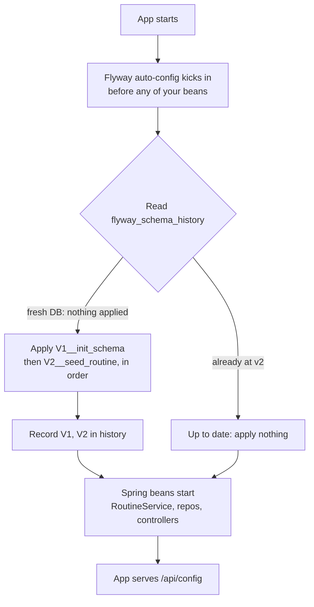

# 10 - Seeding and Flyway migrations

_Stop running `schema.sql` and a Java seeder on every boot. Move both the schema and the routine into versioned Flyway migrations that run exactly once and are tracked in a history table._

> [!IMPORTANT]
> **Checkpoint:** [`step-10-seed-and-migrations`](../../checkpoints/step-10-seed-and-migrations/) — the full
> Sahar app with its schema and seed data moved into versioned Flyway migrations (`V1__init_schema.sql`,
> `V2__seed_routine.sql`), the old `schema.sql` and Java `DataSeeder` retired, and a fresh database that comes
> up pre-filled with the June 2026 routine on both H2 and Postgres. Package is `com.ramishtaha.sahar`.

> [!TIP]
> **IntelliJ IDEA** — **SQL support** gives completion in your `V1`/`V2` migrations, and the **Database** tool window shows the `flyway_schema_history` table so you can see exactly which migrations Flyway applied. [More →](../../reference/intellij-ultimate.md)

## 🎯 Why this matters

Up to step 09 your schema lived in a `schema.sql` file that Spring re-ran on every startup (which is why every `CREATE TABLE` needed `IF NOT EXISTS`), and your data was inserted by a Java `DataSeeder` that checked "is the table empty? then insert." That works for one developer on one laptop. It falls apart the moment the schema starts to _evolve_:

- There is **no history**. If you add a column next month, where does that `ALTER TABLE` go? `schema.sql` only knows how to build from scratch; it cannot describe the _difference_ between v1 and v2 of your schema.
- There is **no ordering or "run once" guarantee** beyond your own `IF NOT EXISTS` / "is it empty?" hacks. Those guards are easy to get subtly wrong, and they re-read the whole database on every boot.
- It does **not travel well to a team or to production**. A teammate cloning the repo, CI spinning up a throwaway database, and your eventual production Postgres all need the _same_ schema in the _same_ order, with a record of what has already been applied so nobody double-applies a change.

Flyway solves exactly this: numbered migration scripts that each run once, in order, recorded in a `flyway_schema_history` table. This is the standard way real Spring apps manage their database. After this step, a brand-new database comes up already filled with the June 2026 routine, and a restart re-validates the history but does not re-seed.

> [!NOTE]
> **What changed from Spring Boot 3.x** — the way you add Flyway is the headline difference in this step. In
> Boot 3.x you added `org.flywaydb:flyway-core` directly to the pom (a single artifact that bundled all
> database support). In Boot 4.x you instead add the dedicated **`spring-boot-starter-flyway`**, which pulls
> Flyway onto the classpath (the list of folders and JARs the JVM loads classes from — see
> [Fundamentals](../../reference/cheatsheet-fundamentals.md)) and auto-configures it, plus a separate
> **`flyway-database-postgresql`** module for Postgres (Flyway 10+ split per-database support into its own
> modules; H2 support ships inside the starter). The single `spring-boot-starter-test` was likewise split into
> per-feature test starters such as `spring-boot-starter-flyway-test`. And when the seeded rows are later
> serialized to `/api/config`, Boot 4 uses **Jackson 3** (`tools.jackson`) rather than Jackson 2
> (`com.fasterxml.jackson`). The full table lives in [Version deltas](../../reference/cheatsheet-version-deltas.md).

## 🧠 Theory

### The simple built-in option (and why we are leaving it)

Spring Boot has a zero-dependency schema initializer baked in: if it finds `schema.sql` on the classpath it runs the DDL (Data Definition Language — the `CREATE TABLE`/`ALTER TABLE` statements that define structure, as opposed to the `INSERT`/`UPDATE` that move data), and if it finds `data.sql` it runs the inserts. You control it with `spring.sql.init.mode` (`always`, `embedded`, or `never`). That is what steps 06-09 leaned on for the schema. It is genuinely useful for tiny demos, but it has no concept of _versions_ — it just replays the same file. There is no record of "what has already run," so it cannot apply an incremental change; it can only build the world from zero. The `IF NOT EXISTS` everywhere was the symptom.

### Flyway: versioned migrations

Flyway flips the model. Instead of one "build everything" script, you write a **sequence of migrations**, each a small forward step:

- They live in `src/main/resources/db/migration`.
- They are named `V<version>__<description>.sql` — a capital `V`, a version number, **two** underscores, then a human description. So `V1__init_schema.sql` and `V2__seed_routine.sql`.
- Flyway keeps a `flyway_schema_history` table in your database. On startup it reads that table, sees which versions are already applied, and runs only the **pending** ones, in version order. Each migration therefore runs **exactly once** per database.

Because each script runs once and only once, you do **not** write `IF NOT EXISTS` anymore. The first time a database sees `V1`, the tables genuinely do not exist; the second time the app boots, Flyway sees version 1 already in history and skips it entirely. The history table is the single source of truth.

This is what makes a migration safe to ship: your laptop, your teammate's laptop, CI, and production each carry their own `flyway_schema_history`, and Flyway brings each of them forward from wherever they are to the latest version — never re-running, never skipping, never reordering.

### What runs when



First run on a fresh database: Flyway finds an empty (or absent) history table, applies `V1` then `V2`, records both, and only then lets the rest of the application context come up. Every later run: Flyway sees versions 1 and 2 already in history, validates that the checksums still match, and applies nothing — your data is left exactly as the API last left it.

For the bigger picture of where Flyway sits among migration tools and ORMs, see [the persistence landscape](../theory/persistence-landscape.md) and [JDBC vs JPA](../theory/jdbc-vs-jpa.md).

## 🚦 Start from

Continue from the previous step, [09 - Swap to Postgres](./09-swap-to-postgres.md). At that point you had:

- A portable `schema.sql` (with `IF NOT EXISTS`) under `src/main/resources`.
- A Java `DataSeeder` in `com.ramishtaha.sahar.seed` that inserted the routine when tables were empty.
- `application.properties` (H2 file mode) and `application-postgres.properties` (the `postgres` profile).

We will retire `schema.sql` and the Java seeder and hand both jobs to Flyway. The full result is in the checkpoint folder: [step-10-seed-and-migrations](../../checkpoints/step-10-seed-and-migrations/).

## 🛠️ Build it

### 1. Add the Flyway dependencies (Spring Boot 4 specifics)

Open `pom.xml` and add the migration dependencies. **This is a real Spring Boot 4 difference** — `flyway-core` → `spring-boot-starter-flyway` + `flyway-database-postgresql` — consolidated in the version callout above and in [Version deltas](../../reference/cheatsheet-version-deltas.md). In short: a dedicated starter pulls Flyway in and auto-configures it, plus a separate Flyway module adds Postgres support (Flyway 10+ split per-database support into modules; H2 support ships with the starter).

```xml
<!--
  NEW in step 10 - Flyway database migrations.
  NOTE (Spring Boot 4 change): in 3.x you added 'org.flywaydb:flyway-core' directly.
  In 4.x Spring Boot ships a dedicated starter, 'spring-boot-starter-flyway', which pulls
  Flyway and auto-configures it. Postgres support is its own Flyway module,
  'flyway-database-postgresql' (needed since Flyway 10); H2 support comes with the starter.
-->
<dependency>
    <groupId>org.springframework.boot</groupId>
    <artifactId>spring-boot-starter-flyway</artifactId>
</dependency>
<dependency>
    <groupId>org.flywaydb</groupId>
    <artifactId>flyway-database-postgresql</artifactId>
</dependency>
```

- `spring-boot-starter-flyway` — pulls Flyway onto the classpath and auto-enables it. No `@Bean`, no `@Configuration`: being on the classpath is enough. Notice neither dependency declares a `<version>` — the `spring-boot-starter-parent` (`4.0.6`) decides the version.
- `flyway-database-postgresql` — the Flyway module that teaches Flyway how to talk to a real PostgreSQL server. Without it, the same migrations would fail to run against Postgres in step 09's profile. H2 support is already inside the starter, so there is no separate H2 module.

While you are here, add the matching **modular test starter** (another Boot 4 change — the old single `spring-boot-starter-test` was split per feature):

```xml
<dependency>
    <groupId>org.springframework.boot</groupId>
    <artifactId>spring-boot-starter-flyway-test</artifactId>
    <scope>test</scope>
</dependency>
```

### 2. Create `V1__init_schema.sql`

Make the folder `src/main/resources/db/migration` and move your DDL into `V1__init_schema.sql`. It is the **same portable DDL** from steps 06-09 — but with one change: **drop every `IF NOT EXISTS`**, because Flyway runs this file exactly once.

```sql
-- Flyway migration V1: the schema.
--
-- Flyway runs every db/migration/V<n>__*.sql file once, in version order, and records each in a
-- flyway_schema_history table. Because each migration runs exactly once, we do NOT use
-- "IF NOT EXISTS" here (unlike the old schema.sql, which re-ran on every boot). Flyway's history
-- table is what makes a migration safe to ship to a team and to production.
--
-- This is the same portable DDL that schema.sql had in steps 06-09, so it runs unchanged on H2
-- and on PostgreSQL.

CREATE TABLE app_meta (
    id          INT PRIMARY KEY,
    title       VARCHAR(100) NOT NULL,
    tagline     VARCHAR(200) NOT NULL,
    month_label VARCHAR(60)  NOT NULL
);
```

That is the first of eight tables; the file continues with `prayer_times`, `blocks`, `weeks`, `schedule_items`, `weekly_grid`, `supplements`, and `diet_sections`. Two portability details carried over from step 06 and worth re-noticing:

- Identity columns use `BIGINT GENERATED BY DEFAULT AS IDENTITY PRIMARY KEY` (standard SQL), not H2- or Postgres-specific `AUTO_INCREMENT`/`SERIAL`, so the one file runs on both engines:

```sql
CREATE TABLE schedule_items (
    id         BIGINT GENERATED BY DEFAULT AS IDENTITY PRIMARY KEY,
    slot_time  VARCHAR(5)   NOT NULL,
    title      VARCHAR(200) NOT NULL,
    detail     VARCHAR(300),
    category   VARCHAR(20)  NOT NULL,
    day_type   VARCHAR(20)  NOT NULL,
    sort_order INT NOT NULL
);
```

- Reserved-word-safe names: `slot_time` not `time`, `day_of_week` not `day`, and plural table names like `blocks`/`weeks`/`supplements` — so neither H2 nor Postgres rejects the DDL over a keyword clash.

### 3. Create `V2__seed_routine.sql`

This file replaces the Java `DataSeeder` entirely. It is the real June 2026 routine as plain `INSERT`s. Because it is `V2`, Flyway runs it right after `V1`, on the freshly created tables.

```sql
-- Flyway migration V2: seed the real routine.
--
-- This replaces the Java DataSeeder from steps 06-09. The advantage: the seed is now versioned and
-- travels with the schema, so a brand-new database (yours, a teammate's, CI's, production's) comes up
-- already filled with the routine - no extra code path, no "is it empty?" check. Like all migrations
-- it runs exactly once; later edits made through the API are just UPDATEs on top of these rows.
--
-- A SQL note: a literal apostrophe inside a string is written as two single quotes ('') - see the
-- "paneer''s" / "spinach''s" below.

INSERT INTO app_meta (id, title, tagline, month_label)
VALUES (1, 'Sahar', 'recover, build, fight', 'June 2026');

INSERT INTO prayer_times (id, fajr, sunrise, dhuhr, asr, maghrib, isha, method_note)
VALUES (1, '04:37', '05:59', '12:37', '17:12', '19:13', '20:36',
        'Karachi 18° Fajr/Isha, Hanafi Asr, computed for Thane (19.22N, 72.98E). Recheck monthly; drifts under ~10 min across a month.');
```

A few things to internalize from this file:

- **The block is the seeded 4-week block, 8 Jun – 5 Jul, with Deload always last.** The four weeks are inserted in ordinal order and only the last one is `TRUE` for `deload`:

```sql
INSERT INTO weeks (block_id, ordinal, name, start_date, end_date, training_focus, backend_focus, deload) VALUES
(1, 1, 'Foundation', '8 Jun',  '14 Jun', 'Moderate, no PM sessions; lock the schedule and the journaling habit.', 'Spring Boot core: setup, dependency injection, controllers, a CRUD REST API.', FALSE),
(1, 2, 'Build',      '15 Jun', '21 Jun', 'Add PM strength Mon and Thu; deeper deep-work; volume climbs.',          'Persistence: Spring Data JPA, Postgres, repositories, validation.',          FALSE),
(1, 3, 'Peak',       '22 Jun', '28 Jun', 'Full volume, sharpest spar, deepest learning.',                          'Docker and DevOps: Dockerfile, compose, env config, basic CI.',              FALSE),
(1, 4, 'Deload',     '29 Jun', '5 Jul',  'MMA down ~40%, light or skipped spar, weekday mains drilling only, more sleep.', 'Ship it: deploy the container, refactor, docs.',                     TRUE);
```

- **The daily schedule is 17 rows** (`sort_order` 0 through 16), starting at `04:15` "Wake, water, wudu, Tahajjud, Fajr" and ending at `21:20` "Lights out". This `17` is the exact count the team verified on a fresh Postgres after step 10.
- **`NULL` for optional columns**, written as a bare `NULL` in the `VALUES` list (e.g. the `detail` of "Buffer — mobility & admin" and every `note` in `weekly_grid`).
- **The apostrophe-escaping rule.** A literal `'` inside a SQL string is written as two single quotes. Watch the diet section — `paneer''s` and `spinach''s` each become one apostrophe in the stored text:

```sql
INSERT INTO diet_sections (ordinal, title, body) VALUES
(1, 'Breakfast',               '3–4 whole eggs in ghee + raw pumpkin seeds.'),
...
(5, 'Vegetables (the minimum)','Organs cover most micronutrients, so veg is for fibre and vitamin C. Hide it in stews; palak paneer (the paneer''s calcium binds spinach''s oxalate, lower stone risk); rotate greens.'),
```

This is a standard SQL gotcha (it is the same in H2, Postgres, and most other engines). Get it wrong and you get a syntax error or a truncated string. See the [SQL + JDBC cheatsheet](../../reference/cheatsheet-sql-jdbc.md) for the quick reference.

> [!NOTE]
> Note on JSON, not SQL: when the service later reads these rows and serializes them (turns Java objects into a wire format — see [Serialization & JSON](../theory/serialization-and-json.md)) to JSON for `/api/config`, Spring Boot 4 uses **Jackson 3** (package `tools.jackson`) — see the version callout near the top. Your records serialize automatically and you never import Jackson, so this is transparent here — it only matters that the strings you seeded are exactly what shows up in the `/api/config` response.

### 4. Delete `schema.sql` and the Java `DataSeeder`

Flyway now owns **both** the schema and the seed, so the two old mechanisms must go or they will collide with Flyway over the same tables:

- Delete `src/main/resources/schema.sql`.
- Delete the Java seeder under `com.ramishtaha.sahar.seed` (the `DataSeeder` that ran on startup). The reference content that was never in the DB in the first place — journal prompts, the three rules, the weekend protocol, sleep/deload notes — still lives in `com.ramishtaha.sahar.seed.RoutineSeed` and is merged into the `/api/config` response by `RoutineService`. Only the _database_ seeding moved to Flyway.

### 5. Tell Spring's basic initializer to stand down

In `application.properties`, set the built-in `schema.sql`/`data.sql` initializer to `never` so it and Flyway do not both try to manage the tables:

```properties
# Flyway now owns schema creation AND seeding (see src/main/resources/db/migration). So we turn OFF
# Spring's basic schema.sql/data.sql initializer to avoid two tools fighting over the same tables.
# Flyway is auto-enabled simply by being on the classpath; it runs its migrations before the app's
# beans are ready, on both H2 and PostgreSQL.
spring.sql.init.mode=never
```

The H2 datasource and console settings above it are unchanged from step 09:

```properties
spring.datasource.url=jdbc:h2:file:./data/sahar;AUTO_SERVER=TRUE
spring.datasource.username=sa
spring.datasource.password=
spring.datasource.driver-class-name=org.h2.Driver
...
spring.h2.console.enabled=true
```

Mirror the same `spring.sql.init.mode=never` in `application-postgres.properties`, where a comment makes the cross-engine point explicit:

```properties
# Flyway owns schema + seed here too. flyway-database-postgresql (in the pom) is what lets Flyway
# talk to a real Postgres server; the very same V1/V2 migrations that ran on H2 run here unchanged.
spring.sql.init.mode=never
```

### 6. Run it — fresh, then again

Because step 09 used H2 in **file** mode (`./data/sahar.mv.db`), an old database file on disk would already have your tables. To genuinely see Flyway build from zero, delete the data folder first, then run:

```bash
# Wipe the old H2 file so Flyway starts from an empty database (PowerShell: Remove-Item -Recurse -Force .\data)
rm -rf ./data

mvn spring-boot:run
```

In the startup log you will see Flyway report something like "Successfully validated ... migrations", "Creating Schema History table", and "Migrating schema ... to version 1 - init schema", then "... to version 2 - seed routine". Now stop the app and run it again: Flyway logs "Successfully validated 2 migrations" and "Current version of schema: 2" — and applies nothing. Your data is untouched.

To run the very same migrations against Postgres, activate the profile from step 09:

```bash
mvn spring-boot:run -Dspring-boot.run.profiles=postgres
```

This was verified on **both** engines: Flyway applied versions 1 and 2, and a fresh Postgres came up with exactly **17** `schedule_items` rows.

## ✅ End state

A brand-new database — H2 file or Postgres — now comes up **pre-filled** with the June 2026 routine, with no Java seeding code path. Flyway records every applied migration in `flyway_schema_history`; a restart re-validates that history and re-seeds nothing. The same `V1`/`V2` scripts run unchanged on both engines.

Files changed in this step:

- `pom.xml` — added `spring-boot-starter-flyway`, `org.flywaydb:flyway-database-postgresql`, and `spring-boot-starter-flyway-test`.
- **New** `src/main/resources/db/migration/V1__init_schema.sql` — the schema (no `IF NOT EXISTS`).
- **New** `src/main/resources/db/migration/V2__seed_routine.sql` — the routine as `INSERT`s.
- **Deleted** `src/main/resources/schema.sql` and the Java `DataSeeder`.
- `application.properties` and `application-postgres.properties` — added `spring.sql.init.mode=never`.

Full checkpoint: [step-10-seed-and-migrations](../../checkpoints/step-10-seed-and-migrations/).

## 💼 Interview angle

**Q: Why use a migration tool like Flyway instead of just re-running a `schema.sql` on startup?**
A: `schema.sql` can only build from scratch; it has no concept of versions, so it cannot describe the
_difference_ between v1 and v2 of a schema (the next `ALTER TABLE` has nowhere clean to go). Flyway runs
numbered scripts once each, in order, and records them — giving you incremental, repeatable, team-safe schema
evolution.

**Q: How does Flyway guarantee a migration runs exactly once per database?**
A: It keeps a `flyway_schema_history` table. On startup it reads which versions are already applied and runs
only the pending ones, in version order. That history is the single source of truth, which is why the
migrations themselves drop `IF NOT EXISTS` — the first time a DB sees `V1` the tables genuinely don't exist.

**Q: You shipped `V2` last month and now need a new column. Do you edit `V2`?**
A: No. Flyway stores a checksum of each applied migration; editing `V2` causes a "Migration checksum mismatch"
validation failure on the next boot. Once a migration has run anywhere, it's immutable — you add a new
`V3__add_column.sql`. (On a throwaway local DB you can just wipe it and let Flyway rebuild.)

**Q: Why does `spring.sql.init.mode` have to be `never` once Flyway is in charge?**
A: Otherwise Spring's built-in `schema.sql`/`data.sql` initializer and Flyway both try to manage the same
tables, causing duplicate-object or "table already exists" errors. Pick one owner; here it's Flyway.

**Q: Flyway runs the same `V1`/`V2` on H2 and Postgres — what makes that possible, and what extra piece does
Postgres need?**
A: The DDL is written in portable standard SQL (`BIGINT GENERATED BY DEFAULT AS IDENTITY`, reserved-word-safe
names) so it runs unchanged on both. Postgres also needs the `flyway-database-postgresql` module so Flyway
knows how to talk to a real Postgres server; H2 support is already inside `spring-boot-starter-flyway`.

**Q: When in the lifecycle does Flyway run, relative to the rest of the Spring context?**
A: Before the application beans. Flyway's auto-configuration applies pending migrations first, so by the time
`RoutineService`, repositories, and controllers start, the schema and seed data are guaranteed to be present.

## 🐞 Common mistakes and how to debug them

- **Leaving `IF NOT EXISTS` in `V1`.** It will still work, but it defeats the point and hides ordering bugs. Flyway runs each migration once; write plain `CREATE TABLE`.
- **Editing an already-applied migration.** Flyway stores a checksum of each migration in `flyway_schema_history`. Change `V1` after it has run on a database and the next boot fails with a **"Migration checksum mismatch"** validation error. The rule: once a migration has shipped/run, it is immutable — fix things by adding a **new** `V3__…` migration. While developing locally on a throwaway DB, just delete the database (e.g. `rm -rf ./data`) and let Flyway rebuild.
- **Filename typos.** `V1_init_schema.sql` (one underscore) or `v1__init.sql` (lowercase `v`) are silently ignored — you need a capital `V` and exactly **two** underscores. Symptom: app starts but your tables/data never appear.
- **Wrong folder.** Migrations must be under `src/main/resources/db/migration`. Put them anywhere else and Flyway will not find them; you will see "0 migrations" in the log.
- **Forgetting `spring.sql.init.mode=never`.** If the basic initializer is still `always`/`embedded` and a stray `schema.sql` lingers, both tools fight over the tables and you get duplicate-object or "table already exists" errors. Delete `schema.sql` _and_ set the mode.
- **Unescaped apostrophe in `V2`.** Writing `paneer's` instead of `paneer''s` gives a SQL syntax error mid-migration. Because `V2` failed, Flyway records it as failed; fix the quote, wipe the dev DB, and rerun.
- **Missing `flyway-database-postgresql` when running the `postgres` profile.** Flyway refuses to run against Postgres without its Postgres module and errors at startup. H2 needs no equivalent — it is in the starter.
- **Old H2 file still on disk.** If you did not delete `./data`, your "fresh" run reuses the existing database, so it looks like Flyway did nothing new. Remove the folder to test a true cold start.

## ❓ Check yourself

1. Why does `V1__init_schema.sql` drop the `IF NOT EXISTS` that `schema.sql` needed? What guarantees the file is not run twice?
2. What does Flyway store in `flyway_schema_history`, and how does that change behavior between the first run and a later run?
3. Why must `spring.sql.init.mode` be `never` once Flyway is in charge?
4. How do you correctly write the apostrophe in `paneer's` inside a SQL string literal, and why?
5. What is the role of `flyway-database-postgresql`, and why is there no equivalent module needed for H2?
6. You shipped `V2` last month; now you need a new column. Do you edit `V1`/`V2`, or do something else — and what error would editing them cause?

---
⬅️ Prev: [09 - Swap to Postgres](./09-swap-to-postgres.md) · ➡️ Next: [11 - Dockerize](./11-dockerize.md) · 📍 Checkpoint: [step-10-seed-and-migrations](../../checkpoints/step-10-seed-and-migrations/) · 🔗 See also: [persistence landscape](../theory/persistence-landscape.md) · [SQL + JDBC cheatsheet](../../reference/cheatsheet-sql-jdbc.md) · [Version deltas](../../reference/cheatsheet-version-deltas.md) · [Interview-prep](../../reference/interview-prep.md)
