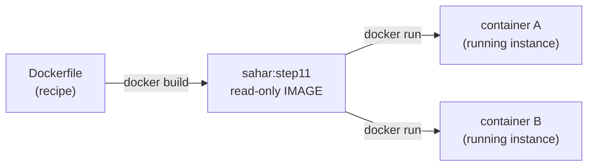
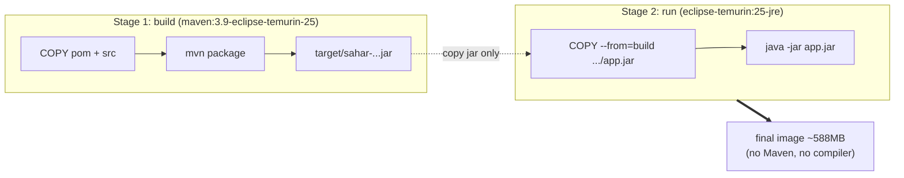

# 11 - Dockerize with a multi-stage build

_Package Sahar into a small, reproducible container image that anyone can run with one command - no Java, no Maven, no "works on my machine"._

> [!TIP]
> **IntelliJ IDEA Ultimate** — build and run the image from a ▶ gutter icon on the `Dockerfile`; the **Services** tool window shows the container, its logs, and a shell — no terminal needed. [More →](../../reference/intellij-ultimate.md)

## 🎯 Why this matters

Up to now you have been running Sahar with `mvn spring-boot:run` on your own laptop, against tools you installed by hand: a specific JDK, a specific Maven, your local file system. That is fine for development, but it does not travel. The day you want to run Sahar on a server, a teammate's machine, or next to a Postgres container (step [12](./12-compose.md)), you need a way to ship _the app and everything it needs to run_ as one unit.

A container image is that unit. It bundles a JRE, the built jar, and a tiny bit of OS into one read-only artifact. `docker run` it anywhere Docker (or Podman) is installed and it behaves identically - same Java, same jar, same start command. That reproducibility is the entire point.

The twist in this step is the **multi-stage build**. Building the app needs a full JDK plus Maven (hundreds of MB). _Running_ it needs only a JRE. A naive Dockerfile would ship all the build tooling and produce a bloated, attack-surface-heavy image. We will use two stages so the compiler and Maven stay behind, and only the jar plus a slim JRE ship.

## 🧠 Theory

### Image vs container

An **image** is a read-only template - a snapshot of a filesystem plus metadata (what command to run, which port, which user). It is baked once and never changes. A **container** is a running instance of an image: the image's filesystem plus a thin writable layer on top, with its own process and network namespace. One image, many containers.



This is exactly the class-vs-instance relationship you already know from Java. The image is the class; each container is a `new` instance with its own state. See the [glossary](../../reference/glossary.md) for these terms.

### Layers and caching

An image is built as a stack of **layers**. Each instruction in a Dockerfile (`COPY`, `RUN`, ...) produces one layer. Docker caches layers and rebuilds **from the first changed line down**. Everything above an unchanged line is reused from cache.

That single rule drives the whole design of a good Dockerfile: put the things that change rarely (dependencies) _above_ the things that change constantly (your source). If you `COPY` everything at once and then build, any one-character change to a Java file invalidates the cache and re-downloads every dependency. If you copy `pom.xml` first, dependency resolution sits on its own stable layer and is reused until the pom actually changes.

### Multi-stage build

A multi-stage build defines more than one `FROM` in the same Dockerfile. Each `FROM` starts a fresh stage with its own base image. Later stages can `COPY --from=<earlier-stage>` to pull selected files across. Only the **last** stage becomes the final image; earlier stages are discarded.



The build stage carries the JDK and Maven; the run stage carries only a JRE. The jar crosses the boundary; nothing else does. That is why the shipped image is a fraction of what a single-stage build would produce. More on the why-of-containers in [containers-and-devops](../theory/containers-and-devops.md).

### Config via environment, not rebuilds

The image is immutable, but Sahar still needs to point at different databases in different places (H2 locally, Postgres in step [12](./12-compose.md)). We do **not** rebuild the image to change config. Instead the app reads config from environment variables - the 12-factor approach. The `postgres` profile in this checkpoint is written exactly for that:

```properties
spring.datasource.url=${SAHAR_DB_URL:jdbc:postgresql://localhost:5432/sahar}
spring.datasource.username=${SAHAR_DB_USERNAME:sahar}
spring.datasource.password=${SAHAR_DB_PASSWORD:sahar}
```

`${SAHAR_DB_URL:default}` means "use the `SAHAR_DB_URL` env var, or this default if unset". `SPRING_PROFILES_ACTIVE` is just Spring's `spring.profiles.active` mapped to an env var name. So one image runs as H2-file by default, or as Postgres if you pass `-e SPRING_PROFILES_ACTIVE=postgres` and the `SAHAR_DB_*` vars.

## 🚦 Start from

Continue from the step 10 checkpoint (Flyway owns schema + seed). This step adds two new files at the project root - `Dockerfile` and `.dockerignore` - and changes no Java. The full result is in [`../../checkpoints/step-11-dockerize/`](../../checkpoints/step-11-dockerize/). If you are copying, start by reading [10 - Seed and migrations](./10-seed-and-migrations.md) so you understand what the container will run.

You need Docker (or Podman) installed. Everything here works with Podman too - swap `docker` for `podman`; see [cheatsheet-docker-podman](../../reference/cheatsheet-docker-podman.md).

## 🛠️ Build it

### 1. Tell Docker to use BuildKit syntax

The very first line of the `Dockerfile` is a special comment, not a normal one:

```dockerfile
# syntax=docker/dockerfile:1
```

This opts the build into the modern BuildKit frontend, which is what makes `--mount=type=cache` (below) work. It must be the first line of the file. BuildKit is the default in current Docker, but the directive keeps the file portable and future-proof.

### 2. Stage 1 - the build stage

```dockerfile
# ---- Stage 1: build ---------------------------------------------------------
# Full JDK + Maven. Used only to compile and package; thrown away after.
FROM maven:3.9-eclipse-temurin-25 AS build
WORKDIR /app
```

- `FROM maven:3.9-eclipse-temurin-25` picks an official image that already has Maven 3.9 and a full Java 25 JDK (Eclipse Temurin). No installing toolchains by hand.
- `AS build` names the stage so a later stage can copy from it.
- `WORKDIR /app` sets the working directory (and creates it). Every relative path after this is under `/app`.

Now the cache-friendly copy order:

```dockerfile
# Copy the pom first and resolve dependencies on its own layer. Because Docker caches layers and only
# rebuilds from the first changed line down, editing Java source does NOT re-download dependencies.
COPY pom.xml .

# Build the executable jar. The --mount cache keeps Maven's ~/.m2 download cache between builds, so
# repeat builds are fast; it is a build-time cache and is NOT part of the final image.
COPY src ./src
RUN --mount=type=cache,target=/root/.m2 mvn -B -ntp -DskipTests clean package
```

Reading this carefully:

- `COPY pom.xml .` brings _only_ the pom into its own layer first. The pom changes rarely, so this layer (and the dependency download it influences) stays cached across most builds.
- `COPY src ./src` brings your source in afterward, on a separate layer. A code edit invalidates this layer and below, but not the pom layer above.
- `RUN --mount=type=cache,target=/root/.m2 ...` is the BuildKit cache mount. It mounts a persistent cache at `/root/.m2` (Maven's local repository) for the duration of this `RUN` only. Downloaded dependencies survive between builds, but the cache is **not** baked into any layer - it never ships in the image. This is the modern replacement for the old "copy pom, run `dependency:go-offline`, then copy src" dance.
- The Maven flags: `-B` (batch mode, no interactive prompts), `-ntp` (no transfer progress spam in logs), `-DskipTests` (tests already ran in CI / locally; skip them in the image build for speed), `clean package` (produce the executable jar in `target/`).

The output is `target/sahar-0.0.1-SNAPSHOT.jar`, a Spring Boot fat jar with everything inside. That filename comes from the artifactId `sahar` and version in the pom - quote it exactly when you copy it across.

### 3. Stage 2 - the run stage

```dockerfile
# ---- Stage 2: run -----------------------------------------------------------
# A slim JRE - no compiler, no Maven. The shipped image is a fraction of the build image's size.
FROM eclipse-temurin:25-jre AS run
WORKDIR /app
```

A brand-new `FROM` starts a clean stage on `eclipse-temurin:25-jre` - a Java 25 _runtime_ only. No `javac`, no Maven. This is the base of the image you actually ship.

```dockerfile
# Create a non-root user. If the container is ever compromised, the attacker is not root.
RUN useradd --system --no-create-home --uid 10001 sahar
```

By default a container process runs as root. Running as a dedicated unprivileged user limits the blast radius if the app is exploited. `--system` makes a system account, `--no-create-home` skips a home directory we do not need, and `--uid 10001` pins a stable, high, non-overlapping user id (verified at runtime as uid 10001).

```dockerfile
# Copy ONLY the built jar out of the build stage. Nothing else from stage 1 comes along.
COPY --from=build /app/target/sahar-0.0.1-SNAPSHOT.jar app.jar
```

`--from=build` reaches into stage 1 and copies a single file to `/app/app.jar`. The JDK, Maven, the `.m2` cache, and your source all stay behind. This one line is the heart of the multi-stage win.

```dockerfile
# Make /app (the jar AND the ./data folder the default H2 file needs) writable by our user,
# then drop to it. Without this, the non-root user could not create the H2 database file.
RUN mkdir -p /app/data && chown -R sahar:sahar /app
USER sahar
```

Here is a subtlety that bites people. Recall `application.properties`:

```properties
spring.datasource.url=jdbc:h2:file:./data/sahar;AUTO_SERVER=TRUE
```

In the default H2 profile, Sahar writes a real file at `./data/sahar.mv.db` relative to the working directory - i.e. `/app/data/sahar.mv.db` in the container. Files copied in by `COPY` are owned by root. If we switched to user `sahar` without fixing ownership, the app could not create that file and Flyway would fail at startup. So we `mkdir -p /app/data` and `chown -R sahar:sahar /app` to hand `/app` (jar plus data dir) to our user, _then_ `USER sahar` drops privileges for everything after - including the running process.

```dockerfile
# Document the port the app listens on (this does not publish it - `-p` at run time does).
EXPOSE 8080
```

`EXPOSE` is **documentation/metadata**. It records that the app listens on 8080 (matching `server.port=8080`). It does **not** open the port to your host. Publishing happens with `-p` at `docker run` time. This trips up almost everyone once: `EXPOSE` alone never makes the app reachable from your browser.

```dockerfile
# All configuration comes from the environment (12-factor), e.g.:
#   -e SPRING_PROFILES_ACTIVE=postgres
#   -e SAHAR_DB_URL=jdbc:postgresql://db:5432/sahar -e SAHAR_DB_USERNAME=sahar -e SAHAR_DB_PASSWORD=...
# With no env set, the app uses its default H2 file database inside the container.
ENTRYPOINT ["java", "-jar", "app.jar"]
```

`ENTRYPOINT` in **exec form** (a JSON array) is the command the container runs on start. Exec form runs `java` directly as PID 1 - no shell wrapping it - so signals like Ctrl-C / `docker stop` reach the JVM cleanly for an orderly shutdown. With no env vars, the H2 default applies; the commented examples show how step [12](./12-compose.md) will flip it to Postgres without rebuilding.

### 4. The `.dockerignore`

Before building, Docker sends the **build context** (your project directory) to the daemon. Anything not needed there just wastes time and can leak into the image. `.dockerignore` trims it:

```text
# Keep the build context (what gets sent to the Docker daemon) small and clean.
# Everything here is either rebuilt inside the image or irrelevant to the build.
target/
data/
*.mv.db
*.trace.db
.git/
.gitignore
.idea/
*.iml
.vscode/
.mvn/wrapper/maven-wrapper.jar
HELP.md
```

Why each matters: `target/` and the `*.mv.db`/`*.trace.db`/`data/` files are rebuilt or recreated inside the image - shipping your _local_ H2 database into the build context would be wrong and bloat the context. `.git/` can be huge and is never needed to build. `.idea/`, `*.iml`, `.vscode/` are editor cruft. Dropping the wrapper jar and `HELP.md` keeps it lean. Smaller context = faster builds and no accidental secrets sneaking in.

### 5. Build and run

```bash
docker build -t sahar:step11 .
docker run -d -p 8080:8080 sahar:step11
```

- `docker build -t sahar:step11 .` builds from the `Dockerfile` in `.` (current dir) and tags the image `sahar:step11`.
- `docker run -d -p 8080:8080 sahar:step11` runs it detached (`-d`), publishing container port 8080 to host port 8080 (`-p host:container`). Now `EXPOSE` finally pays off: the port is reachable.

Verify it serves the Flyway-seeded app:

```bash
curl http://localhost:8080/api/config
# open http://localhost:8080/ for the read-only view
```

To prove the non-root user, exec into the running container:

```bash
docker ps                      # grab the container id
docker exec <id> id            # -> uid=10001(sahar) ...
```

## ✅ End state

Sahar now ships as a self-contained image. `docker build` produces `sahar:step11` (~588MB - dominated by the JRE base, with Maven and the compiler excluded), and `docker run -d -p 8080:8080 sahar:step11` serves the full app on `http://localhost:8080` exactly as `mvn spring-boot:run` did - same endpoints, same Flyway-seeded data, but with zero local Java/Maven required. The container runs as the unprivileged uid `10001`, and config is driven entirely by environment variables, ready for Postgres in the next step.

Files added this step (no Java changed):

- `Dockerfile` - the two-stage build (build stage `maven:3.9-eclipse-temurin-25`, run stage `eclipse-temurin:25-jre`).
- `.dockerignore` - keeps the build context small.

Full checkpoint: [`../../checkpoints/step-11-dockerize/`](../../checkpoints/step-11-dockerize/).

> [!NOTE]
> Going smaller: the JRE base is the bulk of the image. If you want a smaller, harder-to-attack image you can swap the run stage for a Google **distroless** Java base (no shell, no package manager) or build a custom minimal runtime with **`jlink`** that includes only the modules Sahar uses, then run it on a tiny base. Both add complexity (debugging a shell-less image is harder), so they are an optimization, not a starting point. Keep the readable Temurin JRE for learning.

## 🐞 Common mistakes and how to debug them

- **`docker build` ignores `--mount=type=cache` / "unknown flag".** The `# syntax=docker/dockerfile:1` line is missing or not the first line of the file, so BuildKit is not active. Put it on line 1. On older Docker, prefix the build with `DOCKER_BUILDKIT=1`.
- **App starts but the browser cannot reach it.** You relied on `EXPOSE`. `EXPOSE` is documentation only - you must publish with `-p 8080:8080` on `docker run`. Check `docker ps` shows `0.0.0.0:8080->8080/tcp`.
- **Flyway/H2 fails at startup with a file-permission or "cannot create" error.** The non-root user cannot write `/app/data`. Make sure the `RUN mkdir -p /app/data && chown -R sahar:sahar /app` line comes **before** `USER sahar`, and that the H2 url is still `jdbc:h2:file:./data/sahar` (relative to `WORKDIR /app`).
- **`COPY --from=build ... no such file or directory`.** The jar name does not match. It must be exactly `sahar-0.0.1-SNAPSHOT.jar` (artifactId + version from the pom). If you bump the version, update this line.
- **Every build re-downloads all dependencies.** You copied `src` before `pom.xml`, or copied everything in one `COPY . .`. Copy `pom.xml` first on its own layer so the dependency layer stays cached.
- **Container exits immediately, `docker ps` shows nothing.** Read the logs: `docker logs <id>`. A common cause is a bad `SPRING_PROFILES_ACTIVE` or `SAHAR_DB_URL` pointing at a database that is not reachable yet (that wiring is step [12](./12-compose.md)).
- **Data "disappears" after `docker rm`.** The H2 file lives in the container's writable layer, which dies with the container. That is expected here; durable storage across container lifecycles (volumes / a real Postgres) comes in step [12](./12-compose.md).

## ❓ Check yourself

1. What is the difference between an image and a container, and which one does `docker build` produce?
2. Why does the Dockerfile `COPY pom.xml` before `COPY src`? What breaks in the cache if you reverse them?
3. The build stage uses `maven:3.9-eclipse-temurin-25` but the final image uses `eclipse-temurin:25-jre`. What is left behind, and roughly why is the final image (~588MB) so much smaller than it would be otherwise?
4. Does `EXPOSE 8080` make the app reachable from your laptop's browser? What actually publishes the port?
5. Why do we `mkdir -p /app/data && chown -R sahar:sahar /app` _before_ `USER sahar`? What fails if we drop to the non-root user first?
6. How would you run this same image against Postgres without rebuilding it?

## ---

⬅️ Prev: [10 - Seed and migrations](./10-seed-and-migrations.md) · ➡️ Next: [12 - Compose](./12-compose.md) · 📍 Checkpoint: [step-11-dockerize](../../checkpoints/step-11-dockerize/)

🔗 Theory: [containers-and-devops](../theory/containers-and-devops.md) · 🐳 Cheatsheet: [docker / podman](../../reference/cheatsheet-docker-podman.md) · 🗂️ Reference: [glossary](../../reference/glossary.md)
