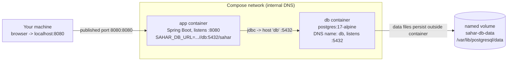

# 12 - Docker Compose: the whole stack

_One file, two containers: the Sahar app plus a real PostgreSQL database, wired together and persisting data._

## 🎯 Why this matters

In [step 11](./11-dockerize.md) you put the app in a container. That image runs fine on its own, but with no environment set it falls back to its **default H2 file database inside the container** - which means the moment the container is recreated, the data is gone. That is fine for a demo, but Sahar is a real app: you edit prayer times once a month and expect them to still be there next month.

A production-shaped setup is two processes: your app, and a database it talks to over the network. Doing that by hand means starting Postgres with the right flags, finding its IP, starting the app with that IP, and remembering to attach storage so the data survives. That is fiddly and easy to get wrong.

**Docker Compose** is the answer: one declarative file describes both containers, the private network between them, the storage volume for the database, and the start-up ordering. Then a single command - `docker compose up` - brings the whole stack online. This is the closest you can get to "production on your laptop" with one command, and it is exactly the artifact that [step 13 (CI)](./13-ci-with-github-actions.md) and any real deployment build on.

## 🧠 Theory

### What Compose actually does

A `docker-compose.yml` file lists **services**. Each service is one container (plus how to build or pull its image, what environment it gets, what ports it publishes, and so on). Compose reads the file and reconciles reality to match it: build/pull images, create a network, create volumes, start containers in dependency order.

Three Compose concepts do the heavy lifting here, and each solves a specific problem you would otherwise solve by hand:

1. **A private network with DNS.** Compose puts every service on a shared internal network and registers each service's **name as a DNS hostname**. So the `app` service reaches the `db` service simply at the host `db`. No IP addresses, no `localhost` (which inside a container means *that* container, not your machine).
2. **A named volume.** Containers are disposable - their writable layer is deleted when the container is removed. A **named volume** is storage that lives *outside* any container's lifecycle. Mount it at Postgres's data directory and the database files survive `down` then `up`.
3. **Health-gated start-up.** "Started" is not "ready". A Postgres container reports started in a second but is not accepting connections yet. A **healthcheck** plus `depends_on: condition: service_healthy` makes the app wait until the database genuinely answers.

### Container networking, concretely

This is the single most common confusion when moving from "one container" to "a stack", so it is worth being precise:

- Between containers on the Compose network, the app connects to `db:5432`. That `db` is the **service name** from the file, resolved by Compose's internal DNS.
- The database does **not** publish a port to your machine. Nothing in the `db` service has a `ports:` entry. Postgres is reachable *only* from inside the network - which is good: your DB is not exposed to the host or the internet.
- The app **does** publish a port: `8080` inside the container maps to a port on your machine. That is the only door from your laptop into the stack.



Read it as: your browser hits `localhost:8080`, which Compose forwards into the `app` container; the app opens a JDBC connection to the hostname `db` on the internal network; Postgres stores its files on the `sahar-db-data` volume, which outlives the container.

For the bigger picture on images vs containers, networks, and volumes, see [the containers and DevOps theory page](../theory/containers-and-devops.md).

## 🚦 Start from

Continue from the [step 11 checkpoint](./11-dockerize.md) - you already have a working multi-stage `Dockerfile` that produces a runnable image and uses environment variables for all configuration. The Dockerfile does **not** change in this step; we only add a `docker-compose.yml` next to it that uses it.

## 🛠️ Build it

### 1. Confirm the Dockerfile is environment-driven

Compose works because the image in [step 11](./11-dockerize.md) takes its entire configuration from the environment - the classic 12-factor approach. The relevant lines of the `Dockerfile` are:

```dockerfile
# All configuration comes from the environment (12-factor), e.g.:
#   -e SPRING_PROFILES_ACTIVE=postgres
#   -e SAHAR_DB_URL=jdbc:postgresql://db:5432/sahar -e SAHAR_DB_USERNAME=sahar -e SAHAR_DB_PASSWORD=...
# With no env set, the app uses its default H2 file database inside the container.
ENTRYPOINT ["java", "-jar", "app.jar"]
```

That comment is the contract Compose will fulfil: set `SPRING_PROFILES_ACTIVE`, `SAHAR_DB_URL`, `SAHAR_DB_USERNAME`, `SAHAR_DB_PASSWORD`, and the same image that ran H2 now runs against Postgres. Nothing in the image is rebuilt for the DB switch - it is pure configuration.

Note `build: .` in the Compose file (below) tells Compose to build *this* Dockerfile, so the app service and the image are always in sync.

### 2. Write `docker-compose.yml`

Create `docker-compose.yml` in the project root (next to `pom.xml` and `Dockerfile`). Here is the whole file, then a walk-through of each part.

```yaml
# (Modern Compose needs no top-level "version:" key - it is obsolete and Compose warns about it.)

services:
  db:
    image: postgres:17-alpine
    environment:
      POSTGRES_DB: sahar
      POSTGRES_USER: sahar
      POSTGRES_PASSWORD: sahar
    volumes:
      - sahar-db-data:/var/lib/postgresql/data
    healthcheck:
      test: ["CMD-SHELL", "pg_isready -U sahar -d sahar"]
      interval: 5s
      timeout: 3s
      retries: 10

  app:
    build: .
    depends_on:
      db:
        condition: service_healthy
    environment:
      SPRING_PROFILES_ACTIVE: postgres
      SAHAR_DB_URL: jdbc:postgresql://db:5432/sahar
      SAHAR_DB_USERNAME: sahar
      SAHAR_DB_PASSWORD: sahar
    ports:
      - "${SAHAR_HOST_PORT:-8080}:8080"

volumes:
  sahar-db-data:
```

> [!NOTE]
> There is no top-level `version:` key. Older tutorials start with `version: "3.8"` - modern Compose ignores it and prints a deprecation warning, so we leave it out.

#### The `db` service - line by line

```yaml
  db:
    image: postgres:17-alpine
```
Pull the official Postgres image, version 17, on the small Alpine base. We **pin** to `17`, not `latest`, so the database engine does not silently change under you - a reproducibility rule that matters even more for a database than for an app.

```yaml
    environment:
      POSTGRES_DB: sahar
      POSTGRES_USER: sahar
      POSTGRES_PASSWORD: sahar
```
The official Postgres image reads these on **first start of an empty data directory** and creates the database `sahar` owned by user `sahar`. (They are read once, at initialisation - changing them later does not rename an existing database; you would re-init a fresh volume.) `sahar/sahar` is fine for local dev; real deployments inject a real secret here.

```yaml
    volumes:
      - sahar-db-data:/var/lib/postgresql/data
```
This is the line that makes data persist. The named volume `sahar-db-data` is mounted at `/var/lib/postgresql/data`, which is exactly where Postgres keeps its files. As the file comment puts it:

```yaml
      # Named volume -> Postgres data lives OUTSIDE the container, so it persists across restarts,
      # recreation, and image upgrades. Without it, `down` would wipe the database.
```

```yaml
    healthcheck:
      test: ["CMD-SHELL", "pg_isready -U sahar -d sahar"]
      interval: 5s
      timeout: 3s
      retries: 10
```
`pg_isready` is a small tool shipped in the Postgres image that returns success only when the server is actually accepting connections for the given user and database. Compose runs it every `5s`, allowing `3s` per attempt, up to `10` retries. While it has not yet succeeded, the service status is "starting", not "healthy" - and that distinction is what gates the app below.

#### The `app` service - line by line

```yaml
  app:
    build: .
```
Instead of `image:`, the app service uses `build: .` - build the image from the `Dockerfile` in this directory. So `docker compose up` compiles and packages Sahar (via the multi-stage build) and runs the result; there is no separate `docker build` step to remember.

```yaml
    depends_on:
      db:
        condition: service_healthy
```
Ordering + readiness. `depends_on` alone only means "start `db` before `app`" - which is not enough, because "started" is not "ready". Adding `condition: service_healthy` ties start-up to the healthcheck above: the app container is not created until `pg_isready` has succeeded. This avoids the classic race where the app boots, tries to connect, and crashes because Postgres has not finished initialising.

```yaml
    environment:
      SPRING_PROFILES_ACTIVE: postgres
      SAHAR_DB_URL: jdbc:postgresql://db:5432/sahar
      SAHAR_DB_USERNAME: sahar
      SAHAR_DB_PASSWORD: sahar
```
This is where container networking becomes real. `SPRING_PROFILES_ACTIVE: postgres` flips the app onto its Postgres profile (the same profile you wired up earlier). The JDBC URL points at the host **`db`** - the service name - which Compose's internal DNS resolves to the database container. There is no IP address and no `localhost`. The file says it plainly:

```yaml
      # Container networking: Compose gives every service a DNS name equal to its service name,
      # so the app reaches Postgres at host "db" on the internal network - no localhost, no ports needed
      # between them. Only the app publishes a port to YOUR machine (below).
```

```yaml
    ports:
      - "${SAHAR_HOST_PORT:-8080}:8080"
```
`hostPort:containerPort`. The right-hand `8080` is the port the app listens on inside the container (it matches the `EXPOSE 8080` in the Dockerfile). The left-hand side is the port on your machine, and it is parameterised: `${SAHAR_HOST_PORT:-8080}` means "use the env var `SAHAR_HOST_PORT` if set, otherwise default to `8080`". So normally you open `http://localhost:8080`, but if 8080 is busy you can do `SAHAR_HOST_PORT=8086 docker compose up` and reach it on `8086` - without editing the file.

#### The top-level `volumes:` block

```yaml
volumes:
  sahar-db-data:
```
A named volume must be declared at the top level before a service can mount it. Leaving the value empty tells Compose to manage it with default settings. This is the entry that lets the data outlive any single container.

### 3. Run the stack

From the project root:

```bash
docker compose up --build
```

`--build` forces the app image to rebuild from the Dockerfile (use it after code changes; omit it for a plain start). You will see Compose pull `postgres:17-alpine`, run the multi-stage build, wait while the DB healthcheck flips to healthy, and only then start the app. When it is up, open:

```
http://localhost:8080
```

Add `-d` (`docker compose up -d --build`) to run detached in the background; then `docker compose logs -f app` follows just the app's logs.

### 4. Prove the volume persists data

This is the payoff. With the stack running, make a change that writes to the database - for example edit the prayer times in the editor at `/admin.html` (`PUT /api/prayer-times`), then verify with `GET /api/prayer-times`. Now tear the stack down and bring it back:

```bash
docker compose down        # stops and removes the containers AND the network - but NOT the named volume
docker compose up          # start again
```

Re-check `GET /api/prayer-times`: **your edit is still there.** That edit lived in Postgres's data directory, which is the `sahar-db-data` volume, which `down` left untouched. This was verified live for this checkpoint - an edit survived a full `down` then `up`.

If you ever *do* want a clean slate, delete the volume too:

```bash
docker compose down -v     # the -v also removes named volumes -> the database is wiped
```

### 5. Podman: the same file, no daemon

[Podman](https://podman.io/) is a drop-in, OCI-compatible alternative to Docker that is **daemonless** (no always-running background service) and **rootless** by default (containers run as your user, not root) - both nice security properties. Crucially, it reads the **same `docker-compose.yml`**. The commands map almost one-to-one:

```bash
# Docker                         # Podman
docker compose up --build        podman compose up --build
docker compose down              podman compose down
docker compose down -v           podman compose down -v
docker compose logs -f app       podman compose logs -f app
```

`podman compose` delegates to a Compose provider; on some systems the standalone `podman-compose` binary is used instead - same arguments. Nothing in our `docker-compose.yml` is Docker-specific, so it just works. See the [Docker/Podman cheatsheet](../../reference/cheatsheet-docker-podman.md) for the full command mapping.

## ✅ End state

`docker compose up` now brings up the entire Sahar stack with one command: a real PostgreSQL 17 database and the Spring Boot app talking to it over a private network, with the app published on `http://localhost:8080` and the database files persisting in a named volume across `down`/`up`.

Files in this step:

- **Added** `docker-compose.yml` - two services (`db`, `app`), an internal network (implicit), a healthcheck, health-gated `depends_on`, a published host port, and the `sahar-db-data` named volume.
- **Unchanged** `Dockerfile` - the environment-driven, multi-stage image from [step 11](./11-dockerize.md) is reused as-is via `build: .`.

Checkpoint for this step: [step-12-compose](../../checkpoints/step-12-compose/).

## 🐞 Common mistakes and how to debug them

- **Using `localhost` in `SAHAR_DB_URL`.** Inside the app container, `localhost` means the app container itself, not your machine and not the DB. The URL must use the **service name**: `jdbc:postgresql://db:5432/sahar`. Symptom: connection refused on startup.
- **Expecting `depends_on` alone to wait for readiness.** Without `condition: service_healthy`, the app can start while Postgres is still initialising and crash with connection errors. The fix is the healthcheck + condition shown above. If the app still loses the race, raise the healthcheck `retries`.
- **Wiping data with `down -v`.** Plain `docker compose down` keeps the volume; adding `-v` deletes named volumes too. If your data "disappeared", check whether you (or a script) ran `down -v` or `docker volume rm`.
- **Port 8080 already in use** ("bind: address already in use"). Something else owns 8080 on your host. Run with an override: `SAHAR_HOST_PORT=8086 docker compose up`, then open `http://localhost:8086`. The container still listens on 8080 internally - only the host side changes.
- **Stale app image after editing Java.** `docker compose up` reuses the existing app image. After code changes, run `docker compose up --build` so the multi-stage build re-runs.
- **Changing `POSTGRES_PASSWORD` and expecting it to take effect.** Those env vars are only read when the data directory is first initialised. Against an existing `sahar-db-data` volume they are ignored. To truly reset credentials, `docker compose down -v` first (destroys data) or use a SQL `ALTER ROLE`.
- **`db` failing to start on Postgres major-version mismatch.** A volume created by Postgres 17 cannot be read by a different major version. If you change the `image:` major version, you need a fresh volume.
- **Watching the wrong logs.** `docker compose logs` shows everything interleaved. Use `docker compose logs -f app` or `docker compose logs -f db` to isolate one service when diagnosing startup order or connection failures.

## ❓ Check yourself

1. Why does the app use the host `db` (not `localhost` or an IP) in `SAHAR_DB_URL`, and where does that name come from?
2. The `db` service has no `ports:` entry. How does the app still reach Postgres, and what is the security benefit of not publishing the DB port?
3. What exactly does the `sahar-db-data` named volume store, and what is the difference between `docker compose down` and `docker compose down -v`?
4. Why is `depends_on: condition: service_healthy` needed instead of plain `depends_on`, and what does `pg_isready` check?
5. What does `${SAHAR_HOST_PORT:-8080}` mean, and how would you start the stack on host port 8086 without editing the file?
6. Which file does `build: .` refer to, and which step's image is being reused unchanged?

## ---

⬅️ Prev: [11 - Dockerize the app](./11-dockerize.md) · ➡️ Next: [13 - CI with GitHub Actions](./13-ci-with-github-actions.md) · 🏁 Checkpoint: [step-12-compose](../../checkpoints/step-12-compose/)
