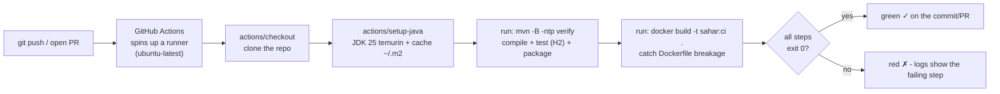

# 13 - A taste of DevOps: GitHub Actions CI

*Every push and pull request gets built, tested, and Docker-image-checked on a clean Linux machine - so "works on my machine" stops being a thing.*

## Why this matters

Up to step 12 you have been the only quality gate. You run `mvn verify` locally, you `docker build` locally, and if you forget - nobody catches it. The first time a teammate (or future-you) clones the repo on a different machine, a missing file or a stale assumption blows up.

**Continuous Integration (CI)** moves that gate off your laptop and onto a fresh, reproducible machine that runs *the same checks* automatically on every change. The payoff is concrete:

- A clean machine has no leftover state. If the build only passed because of a file you forgot to commit, or a tool you installed months ago, CI fails immediately - on the commit, where it is cheap to fix.
- A pull request shows a green check or a red cross *before* anyone reviews or merges it. Reviewers read code, not error logs.
- The exact build command lives in version control. "How do you build this?" is answered by a file, not by tribal knowledge.

This step is deliberately small - it is a *taste* of DevOps, not a full pipeline. You will add one file, `.github/workflows/ci.yml`, that on every push and PR checks out the code, installs Java 25, runs `mvn verify`, and builds the Docker image. That is the backbone every larger pipeline grows from. The why-before-how matters here: see [containers-and-devops.md](../theory/containers-and-devops.md) for where CI sits in the build -> test -> package -> ship chain.

## Theory

**CI vs CD.** *Continuous Integration* means: every change is automatically merged into a shared build and verified. *Continuous Delivery/Deployment* (CD) is the next stage - automatically shipping the verified artifact somewhere. This step is pure CI. Actually deploying Sahar is [step 14](./14-deploy.md).

**What is GitHub Actions?** A CI service built into GitHub. You describe *workflows* as YAML files in `.github/workflows/`. GitHub watches your repo for events (a push, a pull request, a schedule) and, when one matches, spins up a throwaway virtual machine called a *runner*, clones your code onto it, and runs your steps. When the runner finishes it is destroyed - nothing persists between runs except what you explicitly cache.

**The vocabulary, smallest to largest:**

- A **step** is one thing to do. It is either `uses:` (run a pre-built, shared action) or `run:` (execute a shell command).
- A **job** is an ordered list of steps that run on one runner. Steps in a job share the same machine and filesystem.
- A **workflow** is the whole file: a name, the events that trigger it (`on:`), and one or more jobs.
- An **action** is a reusable unit of behaviour published to the GitHub Marketplace, referenced by `uses: owner/name@version`. `actions/checkout` and `actions/setup-java` are official ones.

**Why `uses:` for checkout and setup, but `run:` for the build?** Cloning a repo and installing a JDK are common, fiddly, security-sensitive chores - so you lean on a vetted, versioned action instead of writing shell. Your *actual* build (`mvn verify`, `docker build`) is project-specific, so it is a plain `run:` command - the same one you type locally. That symmetry is the point: CI runs *your* command, not a magic one.

**Why tests need no database in CI.** Sahar's tests run against in-memory H2 (set up via the modular test starters in the `pom.xml`, see [step 11](./99-roadmap.md)). The runner does not have Postgres installed, and it does not need it: `mvn verify` spins H2 up inside the JVM, runs the Flyway migrations against it, exercises the layers, and tears it down. No external service, no Docker-for-the-tests, nothing to provision. This is exactly why the in-memory profile was worth the trouble earlier.



The rule the whole pipeline rests on: **a step fails the moment its command exits non-zero.** `mvn verify` returns non-zero if compilation or any test fails; `docker build` returns non-zero if the `Dockerfile` is broken. The runner stops at the first failure and the commit goes red.

## Start from

Continue from the **step 12** checkpoint (Docker Compose). You already have a working `Dockerfile` and `docker-compose.yml`, and `mvn verify` passes locally - both are prerequisites for this step's two build commands.

- Previous step: [12 - Docker Compose](./12-compose.md)
- Previous checkpoint folder: [../../checkpoints/step-12-compose/](../../checkpoints/step-12-compose/)

The only new file you add this step is `.github/workflows/ci.yml`. Nothing in `src/` changes.

## Build it

### 1. Confirm the build is green locally first

CI automates the command you already trust. Before you wire it up, run that exact command from the project root and watch it pass:

```bash
mvn -B -ntp verify
```

- `-B` (`--batch-mode`) - non-interactive output, no progress spinners. Always use this in CI; the log is cleaner and Maven never waits for input.
- `-ntp` (`--no-transfer-progress`) - suppresses the per-file "Downloading..." lines that otherwise flood the log.
- `verify` - a Maven lifecycle *phase*. Running it runs everything up to and including it: `compile`, `test`, `package`, and `verify`. So one word gives you compile + run tests + build the jar. (See [cheatsheet-maven.md](../../reference/cheatsheet-maven.md) for the lifecycle.)

This was confirmed green locally before CI was added - the CI run is just the same command on a clean machine. If it does not pass on your laptop, fix that first; CI will only tell you the same thing, slower.

### 2. Create the workflow file

GitHub only runs workflows it finds under `.github/workflows/` at the **repository root**. Create that folder and the file:

```bash
mkdir -p .github/workflows
```

Then create `.github/workflows/ci.yml`. Here is the real file from this step's checkpoint, top to bottom.

#### Name and triggers

```yaml
name: CI

on:
  push:
    branches: [ main ]
  pull_request:
```

- `name: CI` - the label GitHub shows in the **Actions** tab and on commit status checks.
- `on:` - the events that trigger this workflow.
  - `push:` with `branches: [ main ]` - run whenever commits land on `main` (e.g. a direct push or a merged PR). Restricting branches avoids re-running on every feature branch push.
  - `pull_request:` - run on every pull request, against whatever branch it targets. This is the check reviewers look at *before* merging. Leaving it with no filters means "all PRs".

#### The build job

```yaml
jobs:
  build:
    runs-on: ubuntu-latest
    steps:
      - name: Check out the code
        uses: actions/checkout@v4
```

- `jobs:` - the map of jobs. We have one, keyed `build`. The key is its id (used by `needs:` later).
- `runs-on: ubuntu-latest` - the runner OS. A fresh GitHub-hosted Linux VM, recreated for every run. Linux is the cheapest and fastest hosted option, and our build is OS-independent.
- `steps:` - the ordered list. Each `- name:` is a human label shown in the log.
- `uses: actions/checkout@v4` - the first step *must* be checkout. The runner starts empty; this official action clones your repo onto it. `@v4` pins the major version - pin actions so a new release cannot silently change your build. (Where a version may age, check the action's page; v4 is current as of writing.)

#### Set up Java with Maven caching

```yaml
      - name: Set up JDK 25
        uses: actions/setup-java@v4
        with:
          distribution: temurin
          java-version: '25'
          cache: maven            # cache ~/.m2 between runs so builds are fast
```

- `uses: actions/setup-java@v4` - installs a JDK on the runner and points `JAVA_HOME` at it.
- `with:` - the action's inputs (its parameters).
  - `distribution: temurin` - the Eclipse Temurin OpenJDK build. This matches the JDK in our `Dockerfile` (`maven:3.9-eclipse-temurin-25`, `eclipse-temurin:25-jre`), so CI and the image agree on the runtime.
  - `java-version: '25'` - Java 25, matching `<java.version>25</java.version>` in the `pom.xml`. Quote it so YAML does not read `25` as a number and drop trailing-zero-style surprises.
  - `cache: maven` - this is the speed win. `setup-java` saves and restores `~/.m2` (your downloaded dependencies) keyed on the `pom.xml`. The first run downloads everything; later runs restore the cache and skip the downloads. No separate caching step needed.

#### Build and test

```yaml
      - name: Build and test
        # 'verify' compiles, runs the tests (against in-memory H2 - no external DB needed), and packages.
        run: mvn -B -ntp verify
```

The heart of the workflow, and the same command from step 1. `run:` executes it in the runner's shell. If compilation fails or any test fails, `mvn` exits non-zero, the step fails, and the whole job goes red - and the `docker build` step below never runs.

#### Build the Docker image

```yaml
      - name: Build the Docker image
        # Catches Dockerfile breakage in CI. We build but do not push here.
        run: docker build -t sahar:ci .
```

- `docker` is pre-installed on `ubuntu-latest`, so no setup step is required.
- `docker build -t sahar:ci .` builds the multi-stage `Dockerfile` (see [step 12](./12-compose.md) / the checkpoint), tagging the result `sahar:ci`. The trailing `.` is the build context - the current directory.
- **We build but do not push.** The point here is to catch a broken `Dockerfile` (a renamed jar, a bad base image, a copy that no longer matches `target/sahar-0.0.1-SNAPSHOT.jar`) as part of CI. The image is built on the runner and thrown away with it.

That is the entire active workflow: checkout -> Java -> `mvn verify` -> `docker build`.

### 3. The optional publish-to-GHCR job (commented out)

The checkpoint ships a second job, fully commented out, that *pushes* the image to the **GitHub Container Registry (GHCR)** on pushes to `main`. It is off by default - read it to understand how CD would attach, then enable it when you actually want published images.

```yaml
  # publish-image:
  #   needs: build
  #   if: github.event_name == 'push' && github.ref == 'refs/heads/main'
  #   runs-on: ubuntu-latest
  #   permissions:
  #     contents: read
  #     packages: write
  #   steps:
  #     - uses: actions/checkout@v4
  #     - uses: docker/login-action@v3
  #       with:
  #         registry: ghcr.io
  #         username: ${{ github.actor }}
  #         password: ${{ secrets.GITHUB_TOKEN }}
  #     - uses: docker/build-push-action@v6
  #       with:
  #         context: .
  #         push: true
  #         tags: ghcr.io/${{ github.repository }}:latest
```

Reading it, top to bottom:

- `needs: build` - this job runs only *after* the `build` job succeeds. No point publishing an image whose tests failed.
- `if: github.event_name == 'push' && github.ref == 'refs/heads/main'` - guard so it publishes only on real pushes to `main`, never on pull requests. PRs from forks should not be able to push images.
- `permissions: { contents: read, packages: write }` - the job's token scopes. Workflows default to read-only; `packages: write` is what lets it push to GHCR.
- `secrets.GITHUB_TOKEN` - **you do not create this.** GitHub injects a short-lived token into every workflow run automatically. Combined with `packages: write`, it authenticates the push with zero secrets to manage. `github.actor` (who triggered the run) is the username.
- `docker/login-action@v3` logs in to `ghcr.io`; `docker/build-push-action@v6` builds *and* pushes in one step, tagging `ghcr.io/<owner>/<repo>:latest` via the `github.repository` context variable.

To enable it later: delete the leading `# ` from these lines. That is the seam where CI becomes CD - and [step 14](./14-deploy.md) builds on it.

### 4. About the repository root (read this if your build does not trigger)

A workflow runs **only** when `.github/workflows/*.yml` sits at the *repository root* - the directory containing `.git`. This trips people up in two ways here:

- **In this codealong, the checkpoint folder IS the project root.** When you copy `checkpoints/step-13-ci-with-github-actions/` out as your own repo and `git init` there, `.github/` is already at the root and the workflow triggers normally.
- **The bundled `spring-boot-sahar` teaching repo is different.** There the app lives under `app/`, so a workflow at `app/.github/workflows/ci.yml` would *not* run - GitHub never looks there. That repo therefore *also* has a workflow at its own root that `cd`s into `app/` (or sets a `working-directory`) before building. The two are not in conflict; they live at two different roots. If you ever nest a Spring project inside a larger repo, remember: the YAML goes at the outer root, and you point it at the subfolder.

### 5. Commit, push, watch it go green

```bash
git add .github/workflows/ci.yml
git commit -m "Add CI workflow: mvn verify + docker build on push/PR"
git push
```

Open the repo on GitHub, click the **Actions** tab, and watch the run. You will see the `build` job expand into its four steps, each with a live log. When `mvn verify` and `docker build` both exit 0, the commit shows a green check.

## End state

Sahar now has continuous integration. On every push to `main` and every pull request, a fresh Ubuntu runner checks out the code, installs Temurin JDK 25, restores the Maven cache, runs `mvn -B -ntp verify` (compile + tests against in-memory H2 + package), and builds the Docker image to prove the `Dockerfile` still works. The commit gets a green check on success, a red cross on any failure - visible right next to the code.

Files changed this step:

- **Added** `.github/workflows/ci.yml` - the workflow (one active `build` job; one commented-out `publish-image` job for GHCR).

Nothing under `src/`, the `pom.xml`, or the `Dockerfile` changed - this step only *automates* commands those files already support.

Checkpoint for this step: [../../checkpoints/step-13-ci-with-github-actions/](../../checkpoints/step-13-ci-with-github-actions/)

## Common mistakes and how to debug them

- **Workflow never runs / no Actions tab activity.** The file is not at the repository root. It must be `.github/workflows/ci.yml` in the directory that contains `.git`. A workflow under `app/.github/...` or any subfolder is invisible to GitHub. (See step 4 above.)
- **YAML indentation errors.** YAML is whitespace-significant and forbids tabs. `with:` keys must be indented under their `uses:` step; `steps:` must be a list of `- name:` items. If the run fails to even start with a parsing error, check that every nested level is exactly two more spaces and that you used spaces, not tabs.
- **`java-version: 25` behaving oddly.** Quote it: `'25'`. Unquoted, YAML parses it as a number; quoting keeps it an exact string the action expects.
- **First CI run is slow, later ones too.** The first run populates the Maven cache - that one is slow by design. If *every* run re-downloads everything, the `cache: maven` line is missing or the cache key (the `pom.xml`) keeps changing.
- **`mvn verify` passes locally but fails in CI.** Almost always a file you did not commit (a test resource, a Flyway migration) or a local-machine assumption (a dependency installed only on your laptop, a hard-coded path). The clean runner is doing its job - it found the thing that "works on my machine". Run `git status` and make sure everything the build needs is committed.
- **`docker build` step fails after a passing test step.** The jar name in the `Dockerfile`'s `COPY --from=build /app/target/sahar-0.0.1-SNAPSHOT.jar` must match `<artifactId>-<version>` from the `pom.xml` (`sahar` + `0.0.1-SNAPSHOT`). Bump the version in the `pom.xml` and forget the `Dockerfile`, and this is the step that catches it - exactly what it is there for.
- **`docker: command not found`.** Only on self-hosted or non-Ubuntu runners. `ubuntu-latest` ships Docker; if you switched runners, you must install it.
- **Enabling `publish-image` fails with a permissions error.** GHCR push needs `packages: write` in that job's `permissions:` block. Without it the injected `GITHUB_TOKEN` is read-only and the push is rejected.

## Check yourself

1. What is the difference between a workflow, a job, a step, and an action - and which of `uses:` vs `run:` does each step use?
2. Why does `mvn verify` need no Postgres on the runner, even though Sahar can run on Postgres?
3. Why does the first CI run take much longer than the next one? What line is responsible for the speed-up?
4. The Docker build step builds but does not push. What failure is it actually there to catch, and how does a renamed jar in the `pom.xml` get caught by it?
5. The `publish-image` job uses `secrets.GITHUB_TOKEN` without you ever creating a secret. Where does that token come from, and what `permissions:` entry must be present for the push to succeed?
6. You put the workflow at `app/.github/workflows/ci.yml` in a repo whose root is one level up. Why does nothing happen on push, and where should the file go?

## ---

Prev: [12 - Docker Compose](./12-compose.md) | Next: [14 - Deploy](./14-deploy.md) | Checkpoint: [step-13-ci-with-github-actions](../../checkpoints/step-13-ci-with-github-actions/)

See also: [Containers and DevOps theory](../theory/containers-and-devops.md) · [Maven cheatsheet](../../reference/cheatsheet-maven.md) · [Glossary](../../reference/glossary.md)
