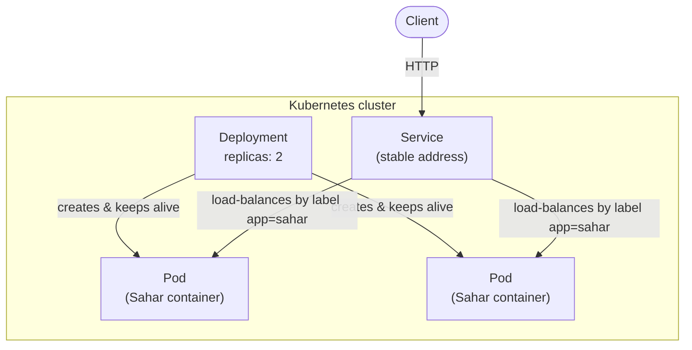
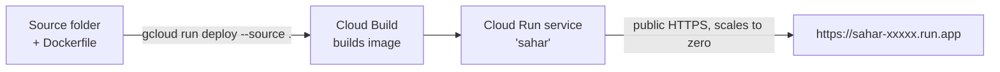

# 14 - Deploy (optional)

_Put Sahar on the public internet with one command - or stop at a clean local stack and call it done._

> [!IMPORTANT]
> **Checkpoint:** [`step-14-deploy`](../../checkpoints/step-14-deploy/) — the full Sahar app plus a new
> `deploy/` folder (`deploy/cloud-run.md`, `deploy/k8s/deployment.yaml`, `deploy/k8s/service.yaml`). It
> changes **nothing** in the running app — no Java, no `application.properties` edits — only adds deploy
> recipes. Package is `com.ramishtaha.sahar`.

## 🎯 Why this matters

You have built a real Spring Boot 4 app: layered web -> service -> repo, Flyway migrations, a Docker image, and CI that builds it on every push ([step 13](./13-ci-with-github-actions.md)). The honest last question is: **how does it actually run somewhere other than your laptop?**

This step answers that twice, at two very different scales:

1. **Kubernetes** - the industry-standard way to run *many* containers across *many* machines. We will look at it as a **mental model only**, using two illustrative YAML files, so the words "Pod", "Deployment", and "Service" have concrete shapes when you meet them again. You do **not** need Kubernetes for a one-user routine app, and pretending otherwise would be the opposite of teaching you the why.
2. **Google Cloud Run** - the smallest possible *real* deploy: one container, a public HTTPS URL, and **scales to zero** so an idle personal app costs essentially nothing. This is the right tool for Sahar.

The deploy is a victory lap, not a gate. `docker compose up` on your own machine is already a complete, production-shaped result. If you never push to the cloud, you have still finished the course.

## 🧠 Theory

> [!NOTE]
> **What changed from Spring Boot 3.x.** This step is mostly platform tooling, so very little of the
> *deploy* mechanics depend on the framework version — `gcloud`, `kubectl`, and the `Dockerfile` are
> the same regardless. The two things to keep straight: the **container** runs a **fat jar** (one
> self-contained JAR with the embedded server and all dependencies on its classpath — see
> [Fundamentals](../../reference/cheatsheet-fundamentals.md)), and Sahar pins **Java 25 (an LTS — Long-Term
> Support — release)**, so your base image must ship a JRE 25, not the JRE 17 most Boot 3.x tutorials assume.
> For the full older-vs-newer story (starter renames, `javax`→`jakarta`, Jackson 2→3, etc.), see
> [Version deltas](../../reference/cheatsheet-version-deltas.md).

### Why Kubernetes exists at all

Once you run more than a handful of containers, by-hand operations stop scaling. You want:

- **Self-healing** - if a container crashes, something restarts it without you waking up.
- **Scaling** - run 2 copies today, 20 on launch day, with one number change.
- **Rolling updates** - replace v1 with v2 a few instances at a time, with zero downtime, and roll back if it goes wrong.
- **Service discovery + load balancing** - one stable address that fans traffic out across all the live copies, even as individual copies come and go.

Kubernetes (K8s) is the orchestrator that does all of this. The three nouns you need:

- **Pod** - one running instance of your container (here, one Sahar container). The smallest unit K8s schedules.
- **Deployment** - a controller that says "keep N Pods of this image alive; if one dies, replace it; when I change the image, roll the new version out gradually." You declare the desired state; K8s makes reality match it.
- **Service** - one stable network name + load balancer in front of a set of Pods (selected by label). Pods come and go and change IPs; the Service address does not.



Read it as: the **Deployment** owns the Pods (and replaces dead ones); the **Service** fronts the Pods with one address. Traffic enters through the Service, never directly to a Pod.

### Why it is overkill for Sahar

Sahar has one user (you), and Cloud Run already gives us self-healing, HTTPS, and scaling for free. A two-Pod Kubernetes cluster for a personal routine app is paying the operational cost of a fleet to run a bicycle. We study the YAML so the vocabulary is real - hands-on Kubernetes is a deliberate later block on the [roadmap](./99-roadmap.md).

### Why Cloud Run fits

Cloud Run runs a single container, hands it a public HTTPS URL, and **scales to zero** when idle - so a personal app that nobody is hitting costs ~nothing. It builds the image for you from your source (no manual `docker push` needed), and it injects a `PORT` env var that the app must bind. We already wired that up - more below.



For the containers/orchestration background, see [containers-and-devops](../theory/containers-and-devops.md).

## 🚦 Start from

Continue from your working tree after [step 13 - CI with GitHub Actions](./13-ci-with-github-actions.md). You need the `Dockerfile` and `docker-compose.yml` from earlier steps and the `application.properties` that reads `PORT` (step 10). The reference checkpoint for this step is in [`checkpoints/step-14-deploy/`](../../checkpoints/step-14-deploy/); it adds a `deploy/` folder (`deploy/cloud-run.md`, `deploy/k8s/deployment.yaml`, `deploy/k8s/service.yaml`) and changes nothing in the running app.

## 🛠️ Build it

### 1. Confirm the app already binds the platform port

This is the one application-level requirement for almost any PaaS (Platform-as-a-Service — a host that runs your container or app for you and hands you a URL, no servers to manage), and it is **already done**. Open `src/main/resources/application.properties`:

```properties
# Listen on the port the platform tells us to. Cloud Run (and many PaaS) inject a PORT env var and
# expect the app to bind it; locally there is no PORT, so we fall back to 8080. This is the last piece
# of 12-factor config: even the port comes from the environment.
server.port=${PORT:8080}
```

- `${PORT:8080}` is Spring's property placeholder with a **default**: use the `PORT` environment variable if it is set, otherwise `8080`.
- Cloud Run sets `PORT` (often `8080`, but you must not hard-code it). Locally there is no `PORT`, so you keep `8080`. Nothing to change for the deploy - that is the payoff of having done 12-factor config earlier.

### 2. Read the illustrative Kubernetes Deployment (do NOT apply it for Sahar)

`deploy/k8s/deployment.yaml` exists so the words have shapes. Its own header says so:

```yaml
# ILLUSTRATIVE ONLY - the Kubernetes mental model for Sahar.
#
# You do NOT need Kubernetes for a personal app; this file exists so the words have shapes.
# A Deployment says "keep N copies (Pods) of this container running, and if one dies, replace it."
# A Pod is one running instance (here, one Sahar container). The Service (service.yaml) gives the
# Pods one stable address and load-balances across them.
#
# Apply with: kubectl apply -f deploy/k8s/   (against a real cluster). Hands-on K8s is a later block.
apiVersion: apps/v1
kind: Deployment
metadata:
  name: sahar
  labels:
    app: sahar
spec:
  replicas: 2                      # two Pods - the Deployment keeps both alive
  selector:
    matchLabels:
      app: sahar
  template:
    metadata:
      labels:
        app: sahar
    spec:
      containers:
        - name: sahar
          image: ghcr.io/YOUR_USER/sahar:latest   # the image CI built/pushed
          ports:
            - containerPort: 8080
```

Line by line:

- `kind: Deployment` - the controller, not the Pod itself. `apiVersion: apps/v1` is the stable API group Deployments live in.
- `replicas: 2` - desired number of Pods. The Deployment continuously reconciles reality toward this number: kill a Pod and it spins up a replacement.
- `selector.matchLabels: app: sahar` must match `template.metadata.labels: app: sahar`. The selector is how the Deployment knows *which* Pods are "its own". The Service later uses the same label to find them.
- `image: ghcr.io/YOUR_USER/sahar:latest` - the exact image CI built and pushed in [step 13](./13-ci-with-github-actions.md). K8s never builds; it only runs pre-built images.
- `containerPort: 8080` - the port the app listens on inside the Pod.

The Pod's environment wires up the `postgres` profile (the same env vars you would set anywhere):

```yaml
          env:
            - name: SPRING_PROFILES_ACTIVE
              value: "postgres"
            - name: SAHAR_DB_URL
              value: "jdbc:postgresql://sahar-db:5432/sahar"   # 'sahar-db' = a Postgres Service in-cluster
            - name: SAHAR_DB_USERNAME
              value: "sahar"
            - name: SAHAR_DB_PASSWORD
              valueFrom:
                secretKeyRef:        # secrets do not belong in YAML; K8s Secrets keep them out
                  name: sahar-db
                  key: password
```

- `SPRING_PROFILES_ACTIVE=postgres` activates Sahar's Postgres profile, exactly like locally. The app code does not change - only configuration.
- `jdbc:postgresql://sahar-db:5432/sahar` - `sahar-db` is a DNS name resolved **inside the cluster** to another Service (a Postgres). This is service discovery: you address a logical name, not an IP.
- `SAHAR_DB_PASSWORD` is pulled from a **Secret** (`secretKeyRef`) rather than typed in plaintext. Secrets do not belong in YAML you commit. (Note: K8s Secrets are only base64-encoded at rest by default, not encrypted - but they keep credentials out of your manifests and Git history.)

Finally the **probes**, which reuse Sahar's existing config endpoint:

```yaml
          readinessProbe:           # "is it ready for traffic yet?" - we reuse the config endpoint
            httpGet:
              path: /api/config
              port: 8080
            initialDelaySeconds: 10
            periodSeconds: 5
          livenessProbe:            # "is it still alive, or should K8s restart it?"
            httpGet:
              path: /api/config
              port: 8080
            initialDelaySeconds: 30
            periodSeconds: 15
```

- **Readiness** - "should the Service send this Pod traffic *yet*?" A Pod that is still booting (Flyway running, beans wiring) is alive but not ready; K8s holds traffic off it until `GET /api/config` returns 200.
- **Liveness** - "is this Pod still healthy, or should K8s restart it?" If `/api/config` stops answering, K8s kills and replaces the Pod.
- We reuse `GET /api/config` (the whole-routine endpoint) because Sahar has **no Actuator yet** - dedicated health endpoints like `/actuator/health` are on the [roadmap](./99-roadmap.md). Until then, a real endpoint that touches the service layer is a reasonable stand-in.
- `initialDelaySeconds` gives the app time to start before the first check (longer for liveness, so a slow boot does not get mistaken for a crash loop); `periodSeconds` is how often to recheck.

### 3. Read the illustrative Service

`deploy/k8s/service.yaml` gives those Pods one address:

```yaml
# ILLUSTRATIVE ONLY - see deployment.yaml.
#
# A Service is a stable network name + load balancer in front of a set of Pods (chosen by label).
# Pods come and go and change IPs; the Service address does not. type: LoadBalancer asks the cloud
# for an external IP (for learning on a laptop you would more likely use ClusterIP + `kubectl port-forward`,
# or an Ingress).
apiVersion: v1
kind: Service
metadata:
  name: sahar
spec:
  type: LoadBalancer
  selector:
    app: sahar          # routes to every Pod labelled app=sahar (the Deployment's Pods)
  ports:
    - port: 80          # the port the Service exposes
      targetPort: 8080  # the port the container listens on
```

- `selector: app: sahar` - the Service finds Pods by the same label the Deployment stamped on them. This is how the two files connect without referencing each other directly.
- `port: 80` is what clients hit; `targetPort: 8080` is the container's port. The Service maps 80 -> 8080.
- `type: LoadBalancer` asks the cloud for a real external IP. On a laptop cluster you would use `ClusterIP` plus `kubectl port-forward`, or an Ingress, instead.

You could apply both with `kubectl apply -f deploy/k8s/` against a real cluster - but for Sahar, **don't**. Move on to Cloud Run.

### 4. The real deploy: Google Cloud Run from source

This is the path actually worth running. From `deploy/cloud-run.md`:

One-time setup (needs the `gcloud` CLI and a Google Cloud project with billing enabled):

```bash
gcloud auth login
gcloud config set project YOUR_PROJECT_ID
gcloud services enable run.googleapis.com cloudbuild.googleapis.com
```

Then deploy straight from this folder - Cloud Build builds the image from your `Dockerfile`:

```bash
gcloud run deploy sahar \
  --source . \
  --region asia-south1 \
  --allow-unauthenticated \
  --port 8080
```

- `--source .` - Cloud Build builds the image for you from the current folder; no manual `docker build`/`push`.
- `--allow-unauthenticated` - make the URL public (no Google sign-in). Drop this flag for a private service.
- `--region asia-south1` - pick the region nearest you (this one is Mumbai); see [Cloud Run regions](https://cloud.google.com/run/docs/locations).
- `--port 8080` tells Cloud Run which container port to route to. Cloud Run also injects `PORT`, and the app already binds it via `server.port=${PORT:8080}` - so the two agree.

The command prints a URL like `https://sahar-xxxxx-uc.a.run.app`. Open it - that is your routine, live, behind HTTPS, scaling to zero when idle.

### 5. About data on Cloud Run

With no database configured, Sahar uses the in-container H2 file (`./data/sahar.mv.db`). On Cloud Run that file lives in the container's ephemeral disk, so:

> [!WARNING]
> With no database configured it uses the in-container H2 file, which is **ephemeral** on Cloud Run - fine for a quick public demo, but data resets when the instance is recycled.

Fine for showing the app off; useless for keeping real data. For durable data, point at a managed Postgres using the **same env vars** the `postgres` profile already reads:

```bash
gcloud run deploy sahar \
  --source . \
  --region asia-south1 \
  --allow-unauthenticated \
  --set-env-vars "SPRING_PROFILES_ACTIVE=postgres,SAHAR_DB_URL=jdbc:postgresql://HOST:5432/sahar,SAHAR_DB_USERNAME=sahar,SAHAR_DB_PASSWORD=..." \
  --add-cloudsql-instances YOUR_PROJECT:REGION:INSTANCE
```

The key lesson, straight from the checkpoint doc: connecting Cloud Run to Cloud SQL has a couple of extra wrinkles (the Cloud SQL socket factory or the proxy), and that is beyond this codealong - but **nothing in the app changes; only env vars do**. That is the whole point of having externalized configuration: the same JAR runs on H2 locally and Postgres in the cloud.

### 6. Or just stop at local

You do not have to deploy to finish the course:

```bash
docker compose up
```

This runs Sahar in production-shaped infrastructure (a container, against Postgres in another container) on your own machine. From `deploy/cloud-run.md`: that is "a complete, honest 'it runs in production-shaped infrastructure' result. The deploy is a victory lap, not a gate."

## ✅ End state

After this step you can do one of:

- **A live URL** - `gcloud run deploy sahar --source .` gives you a public `https://sahar-xxxxx.run.app` serving the read-only `/` view, the `/admin.html` editor, and the full `/api/...` surface, scaling to zero when idle. (H2 is ephemeral; managed Postgres makes it durable, with no code change.)
- **A clean local stack** - `docker compose up` runs the same image against Postgres locally.

Files that this step adds (none of the app's Java or `application.properties` changes):

- `deploy/cloud-run.md` - the Cloud Run runbook.
- `deploy/k8s/deployment.yaml` - illustrative Deployment (Pods, replicas, env, probes).
- `deploy/k8s/service.yaml` - illustrative Service (stable address, label selector, port mapping).

See the full reference in [`checkpoints/step-14-deploy/`](../../checkpoints/step-14-deploy/). Hands-on Kubernetes is intentionally a **later block** - see the [roadmap](./99-roadmap.md).

## 💼 Interview angle

**Q: In Kubernetes, what's the difference between a Pod, a Deployment, and a Service?**
A: A **Pod** is one running instance of your container. A **Deployment** is the controller that keeps N
Pods alive (replaces dead ones, rolls out new versions). A **Service** is one stable address that
load-balances across the Pods by label. The Deployment owns the Pods; the Service fronts them.

**Q: When is Kubernetes overkill, and what does a serverless platform like Cloud Run give you instead?**
A: K8s pays the operational cost of orchestrating a *fleet*; for a one-user app that's a bicycle on a
freight train. Cloud Run runs a single container, hands you a public HTTPS URL, self-heals, and **scales
to zero** when idle — the self-healing/HTTPS/scaling you'd otherwise build, for ~no cost when unused.

**Q: How does a container end up listening on the right port without hard-coding it?**
A: The platform injects a `PORT` env var and the app binds it — `server.port=${PORT:8080}` reads `PORT`
if set, else falls back to `8080` locally. Hard-coding `8080` makes the platform's `PORT` ignored and the
startup probe fails with "container failed to start and listen on the port."

**Q: What's the difference between a readiness probe and a liveness probe?**
A: **Readiness** asks "should the load balancer send this Pod traffic *yet*?" — a booting Pod is alive but
not ready, so traffic is held off. **Liveness** asks "is this Pod still healthy, or should it be
restarted?" — if it stops answering, K8s kills and replaces it.

**Q: How do you move the same app from H2 locally to managed Postgres in the cloud?**
A: Zero Java changes — only configuration. The `postgres` profile reads `SAHAR_DB_*` env vars, so you set
`SPRING_PROFILES_ACTIVE=postgres` plus the connection vars at deploy time. That's the payoff of
externalized 12-factor config: the same JAR runs on H2 or Postgres depending purely on the environment.

**Q: Why keep secrets out of YAML manifests, and where do they go instead?**
A: Anything committed to Git is effectively public to everyone with repo access, forever. K8s **Secrets**
(referenced via `secretKeyRef`) keep credentials out of manifests and history; on a PaaS you inject them as
env vars at deploy time. (K8s Secrets are only base64-encoded at rest by default, not encrypted — but they
keep plaintext out of your manifests.)

## 🐞 Common mistakes and how to debug them

- **Hard-coding the port.** If you set `server.port=8080` literally and remove the `${PORT:8080}` placeholder, Cloud Run's injected `PORT` is ignored, the container never binds the expected port, and the deploy fails the startup probe with "container failed to start and listen on the port". Keep `server.port=${PORT:8080}`.
- **Expecting H2 data to persist on Cloud Run.** It won't - the container disk is ephemeral and resets when the instance recycles. If you need durable data, switch to managed Postgres via `--set-env-vars SPRING_PROFILES_ACTIVE=postgres,...`. Don't file a "bug" for data loss that is by design.
- **`gcloud run deploy` fails at build.** Check that the APIs are enabled (`gcloud services enable run.googleapis.com cloudbuild.googleapis.com`) and that billing is on for the project. Read the Cloud Build log link the CLI prints - the failure is usually a Docker build error you can reproduce locally with `docker build .`.
- **403 / "Forbidden" when you open the URL.** You deployed without `--allow-unauthenticated`, so the service is private. Redeploy with the flag (or grant the `run.invoker` role) - only for a service you actually want public.
- **Applying the K8s YAML for Sahar.** The files say `# ILLUSTRATIVE ONLY` in the first line for a reason. `kubectl apply` needs a real cluster, a pushed image at `ghcr.io/YOUR_USER/sahar`, and a `sahar-db` Postgres Service plus a Secret named `sahar-db` - none of which this codealong provisions. Read them; don't run them yet.
- **Probe path returns non-200.** The probes hit `GET /api/config`. If that endpoint errors (e.g. Flyway failed, or the DB is unreachable), K8s marks the Pod unready/not-alive and either holds traffic or restarts it. Check the app logs first; the probe is reporting a real problem, not causing one.

## ❓ Check yourself

1. In Kubernetes, what is the difference between a **Pod**, a **Deployment**, and a **Service** - and which one keeps a crashed container alive?
2. Why is Kubernetes overkill for Sahar, and what does Cloud Run give you that makes it a better fit?
3. The `gcloud run deploy` command never mentions a port number to the app. How does the running container end up listening on the right port?
4. After `gcloud run deploy sahar --source .` with no database env vars, where does Sahar's data live, and what happens to it when the instance recycles?
5. To switch a Cloud Run deploy from ephemeral H2 to durable Postgres, how much **Java** code must change - and what changes instead?
6. The probes in `deployment.yaml` point at `/api/config`. Why that endpoint and not `/actuator/health`?

---
⬅️ Prev: [13 - CI with GitHub Actions](./13-ci-with-github-actions.md) · ➡️ Next: [99 - Roadmap](./99-roadmap.md) · 📍 Checkpoint: [step-14-deploy](../../checkpoints/step-14-deploy/) · 🔗 See also: [Containers & DevOps](../theory/containers-and-devops.md) · [Docker/Podman cheatsheet](../../reference/cheatsheet-docker-podman.md) · [Interview-prep](../../reference/interview-prep.md)
