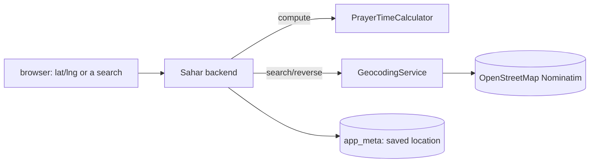

# 15 - Location-aware prayer times (calculation + geocoding, the backend)

_Beyond the core course: compute the day's prayer times for any location with real astronomy, and turn
place names into coordinates (and back) by calling an external service from Spring. The browser UI that
drives all this is the next step._

> [!IMPORTANT]
> **Checkpoint:** [`step-15-geolocation-prayer-times`](../../checkpoints/step-15-geolocation-prayer-times/)
> — the original course UI plus this new backend, so you can exercise everything over the API. The
> polished UI, the map, and the search box arrive in [step 16](./16-ui-and-pwa.md) (and in [`app/`](../../app/)).
> Package is `com.ramishtaha.sahar`.

> [!TIP]
> **IntelliJ IDEA Ultimate** — the calculate and geocode requests are in [`app/requests.http`](../../app/requests.http); run them in the **HTTP Client** and tweak `lat` / `lng` / `tz` inline. [More →](../../reference/intellij-ultimate.md)

## 🎯 Why this matters

The prayer times depend on **where you are** and **the date**. Step 04 let you type them; this step makes
them *computable* and *location-aware*. Two backend skills come together:

1. A pure **domain service** that does real astronomy (no DB, no HTTP) — trivially unit-testable.
2. **Calling another web service from Spring** (OpenStreetMap's geocoder) with the modern `RestClient`,
   plus persisting the chosen location so the app remembers it.

## 🧠 Theory

### Computing prayer times

Prayer times come from the **sun's position**. The algorithm
([praytimes.org/calculation](http://praytimes.org/calculation)) is: from the date get the sun's
**declination** and the **equation of time**; **Dhuhr** = local solar noon
(`12 + tz − longitude/15 − equationOfTime`); sunrise/Maghrib are when the sun is 0.833° below the horizon;
**Fajr/Isha** are when it's 18° below (the *Karachi* convention); **Asr** (Hanafi) is when an object's
shadow is 2× its height. It's all degree-based trigonometry — deterministic, so we pin it with a test.

### Geocoding, and why through the backend

To let the user *search* a place ("Mecca") or *pin* a point on a map, we need **geocoding** (name →
coordinates) and **reverse geocoding** (coordinates → name). We use OpenStreetMap's free
[Nominatim](https://nominatim.org/). Doing it **server-side** (not from the browser) is the lesson:

- Nominatim's policy asks callers to send a `User-Agent`; a server sets that reliably (and could cache /
  rate-limit). 
- It introduces Spring Boot 4's **`RestClient`** — the fluent HTTP client for calling other services.



## 🚦 Start from

[`step-14`](../../checkpoints/step-14-deploy/). This step is backend-only; the original UI still runs (it
just ignores the new fields), and you drive the new features over the API.

## 🛠️ Build it

### 1. The calculator (pure domain service)

[`PrayerTimeCalculator`](../../checkpoints/step-15-geolocation-prayer-times/src/main/java/com/ramishtaha/sahar/service/PrayerTimeCalculator.java)
is a stateless `@Component`. The headline:

```java
double dhuhr = 12.0 + tzHours - lng / 15.0 - eqt;
double fajr    = dhuhr - hourAngleBelowHorizon(18.0, lat, decl);   // Karachi
double asrAlt  = dacot(2.0 + dtan(Math.abs(lat - decl)));          // Hanafi shadow factor 2
double asr     = dhuhr + hourAngleAboveHorizon(asrAlt, lat, decl);
```

### 2. The calculate endpoint

In [`PrayerTimesController`](../../checkpoints/step-15-geolocation-prayer-times/src/main/java/com/ramishtaha/sahar/web/PrayerTimesController.java):

```java
@GetMapping("/api/prayer-times/calculate")
public PrayerTimes calculate(@RequestParam double lat, @RequestParam double lng,
                             @RequestParam(defaultValue = "0") int tz,   // MINUTES east of UTC
                             @RequestParam(required = false) String date) { ... }
```

### 3. Geocoding with `RestClient`

[`GeocodingService`](../../checkpoints/step-15-geolocation-prayer-times/src/main/java/com/ramishtaha/sahar/service/GeocodingService.java)
builds a `RestClient` (static factory) pointed at Nominatim with a `User-Agent`, and degrades gracefully
when offline:

```java
this.client = RestClient.builder()
        .baseUrl("https://nominatim.openstreetmap.org")
        .defaultHeader("User-Agent", "Sahar/1.0 (https://github.com/ramishtaha/spring-boot-sahar)")
        .build();
// search: GET /search?q=...&format=jsonv2  ->  List<GeoResult>
// reverse: GET /reverse?lat=&lon=&format=jsonv2  ->  GeoResult
```

Exposed by [`GeocodeController`](../../checkpoints/step-15-geolocation-prayer-times/src/main/java/com/ramishtaha/sahar/web/GeocodeController.java):
`GET /api/geocode?q=` and `GET /api/geocode/reverse?lat=&lng=`.

> [!NOTE]
> `RestClient.Builder` is auto-configured by Spring in some setups, but the **static `RestClient.builder()`**
> keeps the service self-contained — handy, because in this project the auto-configured builder bean isn't
> present.

### 4. Remembering the location (a V4 migration)

The chosen location is one fact about the app, so it lives on `app_meta` via
[`V4__location.sql`](../../checkpoints/step-15-geolocation-prayer-times/src/main/resources/db/migration/V4__location.sql)
(`ALTER TABLE ... ADD COLUMN`, seeded to Thane). `MetaRepository` reads/writes it, and
[`LocationController`](../../checkpoints/step-15-geolocation-prayer-times/src/main/java/com/ramishtaha/sahar/web/LocationController.java)
exposes `GET/PUT /api/location`. It also rides along in `GET /api/config` as `location`.

### 5. The unit test

[`PrayerTimeCalculatorTest`](../../checkpoints/step-15-geolocation-prayer-times/src/test/java/com/ramishtaha/sahar/service/PrayerTimeCalculatorTest.java)
pins the Thane numbers to the seed (within 10 min) and checks chronological order. Run just it:
`./mvnw test -Dtest=PrayerTimeCalculatorTest`.

## ▶️ Try it (over the API)

```bash
# compute for Thane today
curl "http://localhost:8080/api/prayer-times/calculate?lat=19.22&lng=72.98&tz=330"
# search a place
curl "http://localhost:8080/api/geocode?q=Mecca"
# remember a location
curl -X PUT http://localhost:8080/api/location -H "Content-Type: application/json" \
  -d '{"placeName":"Mecca","lat":21.4225,"lng":39.8262,"tzOffset":180}'
```

## ⚠️ High-latitude caveat

Near the poles in summer the sun may never reach 18° below the horizon, so Fajr/Isha have no exact
solution and the result degenerates. Fine for Thane (~19°N); real apps add a higher-latitude rule. A
deliberate non-goal here — see the calculator's Javadoc.

## ✅ End state

- `GET /api/prayer-times/calculate`, `GET /api/geocode[/reverse]`, and `GET/PUT /api/location` all work.
- The location is persisted and returned in `/api/config`.
- A unit test pins the math.

## 🐞 Common mistakes and how to debug them

- **Times off by hours** — timezone sign; `tz` is **minutes east of UTC** (IST = 330; browsers report
  `-getTimezoneOffset()`).
- **No geocode results** — you're offline, or Nominatim rate-limited you (≈1 req/s). The service returns an
  empty list rather than failing.
- **`No qualifying bean ... RestClient$Builder`** — use the static `RestClient.builder()` (as here), not an
  injected builder, unless the auto-config is on the classpath.
- **Equal/garbage Fajr & Isha** — high latitude in summer (the caveat).

## ❓ Check yourself

1. Why is the calculator testable without starting Spring?
2. Why call Nominatim from the backend instead of the browser?
3. What does the V4 migration change, and why is `ALTER TABLE` safe to ship?
4. What does `tz` mean and how does the browser provide it?

---
⬅️ Prev: [14 - Deploy](./14-deploy.md) · ➡️ Next: [16 - UI, location picker & PWA](./16-ui-and-pwa.md) · 📍 Checkpoint: [step-15](../../checkpoints/step-15-geolocation-prayer-times/) · 🔗 See also: [HTTP & REST](../theory/http-and-rest.md)
