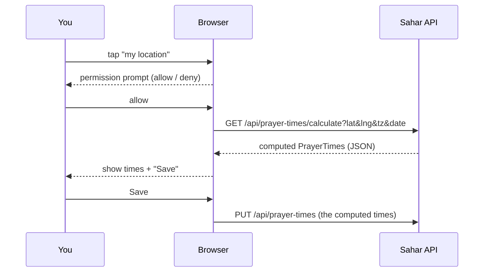

# 15 - Location-aware prayer times (geolocation + a calculation endpoint)

_Beyond the core course: ask the browser for your location, send it to the backend, and compute the day's
prayer times with real astronomy — then optionally save them._

> **Where this lives.** This feature was added to the finished app in [`app/`](../../app/), not to a
> numbered checkpoint. The earlier checkpoints stay frozen as the course; from here on, `app/` is the
> evolving product. Package is `com.ramishtaha.sahar`.

## Why this matters

Until now the prayer times were hand-entered (step 04) and seeded for Thane. But they depend entirely on
**where you are** and **the date** — travel 500 km or wait a month and they shift. This step makes them
*computable*: the browser's **Geolocation API** gets your latitude/longitude, the backend computes the
five times for that location with the standard astronomical method (Karachi 18° twilight, Hanafi Asr),
and you can save the result through the PUT endpoint you already built.

It's a great two-sided learning point:
- **Frontend:** a real permission-gated browser API (Geolocation), and the UX of asking for, using, and
  gracefully surviving a *denied* permission.
- **Backend:** a pure, stateless **domain service** (no DB, no HTTP) holding genuine domain logic, exposed
  by a thin controller — and unit-tested in isolation.

## Theory

### The Geolocation API and its permission model

`navigator.geolocation.getCurrentPosition(success, error, options)` asks the browser for the device's
location. Key facts:

- It is **permission-gated**: the browser shows a prompt; the user can allow or deny. Your code must
  handle **both**, plus "no answer".
- It only works in a **secure context** — HTTPS, or `http://localhost` during development. (That's why
  running the app locally is fine, and a real deploy must be HTTPS.)
- `success` receives a `position` with `position.coords.latitude` / `.longitude`.
- `error.code === 1` means *permission denied* — the most important case to handle kindly.



### How prayer times are computed (the short version)

Prayer times come from the **sun's position** for a date and place. The algorithm
([praytimes.org/calculation](http://praytimes.org/calculation)) is:

1. From the date, get the sun's **declination** (how far north/south it is) and the **equation of time**
   (the difference between clock noon and solar noon).
2. **Dhuhr** = local solar noon = `12 + timezone − longitude/15 − equationOfTime`.
3. Sunrise/Maghrib are when the sun is `0.833°` below the horizon (refraction + the sun's radius);
   **Fajr/Isha** are when it's `18°` below (the *Karachi* convention). Each is a symmetric **hour-angle**
   offset from Dhuhr.
4. **Asr** (Hanafi) is when an object's shadow equals **2×** its height plus the noon shadow — a sun
   altitude, converted to an after-noon hour angle.

All of this is plain trigonometry in degrees. It's the kind of self-contained, deterministic logic that
*screams* "unit test me".

## Start from

The finished app after the UI work, or just open [`app/`](../../app/). This step adds one backend service,
one endpoint, one test, and a bit of frontend.

## Build it

### 1. The calculator — a pure domain service

[`app/src/main/java/com/ramishtaha/sahar/service/PrayerTimeCalculator.java`](../../app/src/main/java/com/ramishtaha/sahar/service/PrayerTimeCalculator.java)
is a stateless `@Component`. No database, no HTTP — just inputs and outputs, which makes it trivially
testable.

```java
@Component
public class PrayerTimeCalculator {
    private static final double FAJR_ANGLE = 18.0;   // Karachi
    private static final double ISHA_ANGLE = 18.0;   // Karachi
    private static final double ASR_FACTOR = 2.0;    // Hanafi
    private static final double SUNRISE_DIP = 0.833;

    public PrayerTimes calculate(double lat, double lng, double tzHours, LocalDate date) {
        // ... sun position (declination + equation of time) ...
        double dhuhr = 12.0 + tzHours - lng / 15.0 - eqt;
        double fajr    = dhuhr - hourAngleBelowHorizon(FAJR_ANGLE, lat, decl);
        double sunrise = dhuhr - hourAngleBelowHorizon(SUNRISE_DIP, lat, decl);
        double maghrib = dhuhr + hourAngleBelowHorizon(SUNRISE_DIP, lat, decl);
        double isha    = dhuhr + hourAngleBelowHorizon(ISHA_ANGLE, lat, decl);
        double asrAltitude = dacot(ASR_FACTOR + dtan(Math.abs(lat - decl)));
        double asr     = dhuhr + hourAngleAboveHorizon(asrAltitude, lat, decl);
        return new PrayerTimes(fmt(fajr), fmt(sunrise), fmt(dhuhr), fmt(asr), fmt(maghrib), fmt(isha), note);
    }
}
```

The little `dsin`/`dcos`/`dacot` helpers just wrap `Math.*` so the formulas can be written in degrees, the
way the references state them. Read the full file — it is commented line by line.

### 2. The endpoint — thin, validating, read-only

In [`PrayerTimesController`](../../app/src/main/java/com/ramishtaha/sahar/web/PrayerTimesController.java)
the calculator is injected (constructor DI) alongside the service, and exposed as a GET (it's a pure
computation with no side effects, so GET + query params, not POST):

```java
@GetMapping("/api/prayer-times/calculate")
public PrayerTimes calculate(@RequestParam double lat, @RequestParam double lng,
                             @RequestParam(defaultValue = "0") int tz,
                             @RequestParam(required = false) String date) {
    if (lat < -90 || lat > 90 || lng < -180 || lng > 180)
        throw new ResponseStatusException(HttpStatus.BAD_REQUEST, "lat must be -90..90 and lng -180..180");
    LocalDate day = (date == null || date.isBlank()) ? LocalDate.now() : LocalDate.parse(date);
    return calculator.calculate(lat, lng, tz / 60.0, day);   // tz is MINUTES east of UTC (what the browser sends)
}
```

Note `@RequestParam` (values from the query string, the counterpart to the `@PathVariable` and
`@RequestBody` you met in [step 07](./07-full-crud.md)), and that `tz` arrives in **minutes** because that
is exactly what the browser's `Date.getTimezoneOffset()` gives.

### 3. The unit test — pin the math to reality

[`PrayerTimeCalculatorTest`](../../app/src/test/java/com/ramishtaha/sahar/service/PrayerTimeCalculatorTest.java)
is a plain JUnit test (no Spring context — the class is a POJO) that asserts the Thane numbers match the
seed within a tolerance, and that the times come out in order. This is the fast, focused testing the
[roadmap](./99-roadmap.md) points at:

```java
PrayerTimes pt = calc.calculate(19.22, 72.98, 5.5, LocalDate.of(2026, 6, 15));
assertWithin(pt.fajr(), "04:37", 10);   // within 10 minutes of the seeded value
```

Run just it: `./mvnw test -Dtest=PrayerTimeCalculatorTest`.

### 4. The frontend — ask, compute, offer to save

In [`app.js`](../../app/src/main/resources/static/app.js), the "📍 my location" button:

```js
navigator.geolocation.getCurrentPosition(async (pos) => {
    const lat = pos.coords.latitude, lng = pos.coords.longitude;
    const tz = -new Date().getTimezoneOffset();          // minutes EAST of UTC (note the minus)
    const date = new Date().toISOString().slice(0, 10);
    const res = await fetch(`/api/prayer-times/calculate?lat=${lat}&lng=${lng}&tz=${tz}&date=${date}`);
    showCalcResult(await res.json());                    // a modal with the times + a Save button
}, (err) => {
    toast(err.code === 1 ? 'Location permission denied — you can still edit times by hand' : 'Could not get location', 'err');
});
```

"Save" just reuses the existing `PUT /api/prayer-times`. The editor ([`admin.js`](../../app/src/main/resources/static/admin.js))
has the same calculation wired to *fill the form* so you can review before saving.

> **Why minus `getTimezoneOffset()`?** The browser returns minutes you must *add to local time to get UTC*
> — so IST (UTC+5:30) reports `-330`. We want "minutes east of UTC" (+330), hence the minus. Getting this
> sign wrong is the classic bug; the test for Thane (tz `5.5` hours) is your reference.

## High-latitude caveat (a real-world edge case)

Near the poles in summer the sun may never drop 18° below the horizon, so Fajr/Isha have **no exact
solution** and the formula degenerates (London in June returns nonsense). For Sahar's use (Thane, ~19°N)
this never happens, so the calculator deliberately does **not** implement a "higher-latitude" rule. Real
apps add one (middle-of-the-night, or 1/7th-of-the-night conventions). Knowing the limitation *is* the
lesson — see the note in the calculator's Javadoc.

## End state

- `GET /api/prayer-times/calculate?lat=&lng=&tz=&date=` returns computed times for any location/date.
- The home page and the editor can fill prayer times from your device location and save them.
- A unit test pins the algorithm to the known Thane values.

## Common mistakes and how to debug them

- **"Geolocation doesn't prompt / fails silently."** It only works on **HTTPS or `localhost`**. Over plain
  `http://<lan-ip>` the browser blocks it. Test on `localhost`, deploy on HTTPS.
- **Times off by hours.** Timezone sign error. `tz` is **minutes east of UTC**; remember the minus on
  `getTimezoneOffset()`.
- **Times off by ~degrees-worth.** Mixing degrees and radians — every trig call here must use the degree
  helpers, not `Math.sin` directly.
- **Equal/garbage Fajr and Isha.** You're at a high latitude in summer (the caveat above).
- **400 from the endpoint.** lat/lng out of range, or a malformed `date` (must be `yyyy-MM-dd`).

## Check yourself

1. Why is the calculator a GET, while saving the times is a PUT?
2. Why can `PrayerTimeCalculator` be tested without starting Spring at all?
3. What does the `tz` parameter mean, and why the minus sign on `getTimezoneOffset()`?
4. What happens at high latitudes in summer, and why?
5. Which existing endpoint does "Save" reuse, and what does that say about layering?

---
Prev: [14 - Deploy](./14-deploy.md) | Next: [16 - UI polish & PWA](./16-ui-and-pwa.md) | Lives in: [app/](../../app/) | See also: [HTTP & REST](../theory/http-and-rest.md), [testing on the roadmap](./99-roadmap.md)
