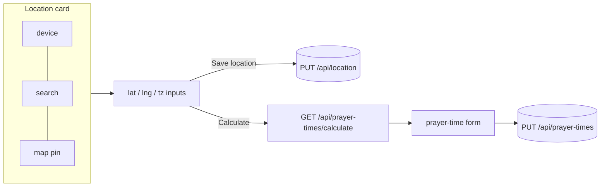

# 16 - The location picker, UI polish, an editable diet plan & a PWA

_Beyond the core course: the browser side — theming, a weekly board, a live prayer countdown, a
user-controlled location picker (device / search / map pin), an editable meal plan, and an installable,
offline PWA._

> **Checkpoint:** [`step-16-ui-and-pwa`](../../checkpoints/step-16-ui-and-pwa/) — the finished, enhanced
> app (identical to [`app/`](../../app/)). It builds on the [step 15](./15-geolocation-prayer-times.md)
> backend.

## Why this matters

A routine you open every morning has to be fast to scan and pleasant to use. This step is the "make it
good software, not just correct software" pass, and it wires the [step 15](./15-geolocation-prayer-times.md)
backend (calculation + geocoding + saved location) to a UI the user actually controls.

## What changed, and the ideas

### 1. Light / dark theming, no flash
Every colour is a CSS variable; `:root[data-theme="light"]` overrides the dark defaults. A tiny script in
`<head>` sets `data-theme` from `localStorage` or the OS preference *before paint*, so there's no flash.
The ☀/☾ button flips and saves it; the editor inherits it. `<meta name="theme-color">` tints the mobile
address bar to match.

### 2. Concise by default
The page leads with prayer times, a **This week** board, and the block; the long reference content
(timeline, supplements, nutrition, journal, rules) collapses into native `
` foldables — scannable
in one screen, no framework.

### 3. The weekly board + live prayer countdown
[`app.js`](../../checkpoints/step-16-ui-and-pwa/src/main/resources/static/app.js) merges the training grid
with the meal plan into a 7-day board, highlights **today**, and opens a **modal** with a day's detail on
tap. A timer finds the **next** prayer and shows "Next · Maghrib in 2h 14m", dimming the ones that passed;
the timeline gets a "◀ now" marker.

### 4. The user-controlled location picker
This is the heart of the step. The editor's **Location** card lets the user set location three ways, then
calculate prayer times from it:

- **Device** — "📍 My location" calls the Geolocation API, then `GET /api/geocode/reverse` to label it.
- **Search** — a box that calls `GET /api/geocode?q=` and lists matches to pick from.
- **Map pin** — a [Leaflet](https://leafletjs.com/) map (OpenStreetMap tiles) with a draggable marker;
  dragging or clicking sets the coordinates and reverse-geocodes the name.

Latitude/longitude/UTC-offset inputs stay in sync with all three, so it degrades gracefully if the map (a
CDN script) or Nominatim is offline. "Save location" does `PUT /api/location`; "Calculate prayer times
from here" calls the step-15 endpoint and fills the prayer-time form to review and save. The home page
shows the saved location and a one-tap "📍 my location" that remembers it.

### 5. Editable diet plan
The meal plan moved into a table (Flyway V3) with a repository and `GET/PUT /api/diet-plan/{day}` — the
same CRUD + migration patterns as [step 07](./07-full-crud.md) and [step 10](./10-seed-and-migrations.md) —
and the editor grew a per-day form. Reference content that isn't meant to be edited (journal, rules) still
comes from the seed.

### 6. A Progressive Web App
[`manifest.json`](../../checkpoints/step-16-ui-and-pwa/src/main/resources/static/manifest.json) +
[`service-worker.js`](../../checkpoints/step-16-ui-and-pwa/src/main/resources/static/service-worker.js) +
icons make it installable and offline-capable: **cache-first** for the app shell, **network-first** for
`GET /api/*` (fresh online, last-known offline). Writes are never cached.

> Geolocation, the service worker, and (for tiles) the map all want **HTTPS or `localhost`**.

## Start from
[`step-15`](../../checkpoints/step-15-geolocation-prayer-times/) (the backend). This step is the frontend
for it, plus the editable-diet-plan slice and the PWA files.

## Common mistakes and how to debug them

- **Theme flashes on load** — the theme script must be inline in `<head>`, before the stylesheet.
- **Old UI after deploy** — bump `CACHE` in `service-worker.js`; the `activate` handler clears old caches.
- **Map is blank / no pin** — Leaflet loads from a CDN and tiles need internet; offline, use search-less
  manual lat/lng entry (it still works).
- **`PUT /api/diet-plan/{day}` 404** — use a real day key (`Mon`..`Sun`).
- **Manifest ignored** — serve it as JSON; we use `manifest.json` (`application/json`).

## Check yourself

1. How does theming avoid a flash of the wrong colours?
2. What are the three ways the user can set location, and which endpoints back each?
3. What's the service worker's rule for the shell vs `/api/*`, and why?
4. Why does the location picker keep working when the map or Nominatim is unavailable?

---
Prev: [15 - Location-aware prayer times](./15-geolocation-prayer-times.md) | Next: [99 - Roadmap](./99-roadmap.md) | Checkpoint: [step-16](../../checkpoints/step-16-ui-and-pwa/) | See also: [the diet plan](../diet-plan.md), [Containers & DevOps](../theory/containers-and-devops.md)
