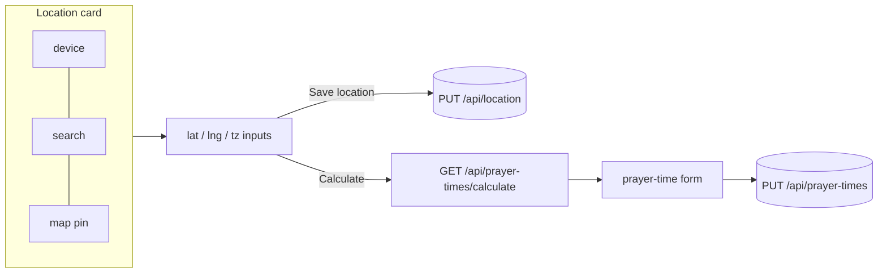

# 16 - The location picker, UI polish, an editable diet plan & a PWA

_Beyond the core course: the browser side — theming, a weekly board, a live prayer countdown, a
user-controlled location picker (device / search / map pin), an editable meal plan, and an installable,
offline PWA._

> [!IMPORTANT]
> **Checkpoint:** [`step-16-ui-and-pwa`](../../checkpoints/step-16-ui-and-pwa/) — the finished, enhanced
> app (identical to [`app/`](../../app/)). It builds on the [step 15](./15-geolocation-prayer-times.md)
> backend. Package is `com.ramishtaha.sahar`.

## 🎯 Why this matters

A routine you open every morning has to be fast to scan and pleasant to use. This step is the "make it
good software, not just correct software" pass, and it wires the [step 15](./15-geolocation-prayer-times.md)
backend (calculation + geocoding + saved location) to a UI the user actually controls.

> [!NOTE]
> **What changed from Spring Boot 3.x** — this step is mostly browser code, so the framework deltas are
> light, but two matter. (1) Static files under `src/main/resources/static` are still served from the
> **classpath** (the set of folders/JARs the app loads at runtime — primer in
> [Fundamentals](../../reference/cheatsheet-fundamentals.md)); Boot 4 keeps that convention, so
> `manifest.json`, the service worker, `app.js`, and icons just ship inside the jar (a **fat jar** bundles
> the app *and* its dependencies — see Fundamentals). (2) The geocoding the picker calls (from
> [step 15](./15-geolocation-prayer-times.md)) uses **`RestClient`**, Boot's modern HTTP client that
> replaces `RestTemplate` — see [REST clients](../theory/rest-clients.md). For the full Boot 3→4 / Spring
> 6→7 / Java 17→25 / `javax`→`jakarta` story across the whole app, see the
> [Version deltas](../../reference/cheatsheet-version-deltas.md) cheatsheet.

## 🛠️ What changed, and the ideas

### 1. Light / dark theming, no flash
Every colour is a CSS variable; `:root[data-theme="light"]` overrides the dark defaults. A tiny script in
`<head>` sets `data-theme` from `localStorage` or the OS preference *before paint*, so there's no flash.
The ☀/☾ button flips and saves it; the editor inherits it. `<meta name="theme-color">` tints the mobile
address bar to match.

### 2. Concise by default
The page leads with prayer times, a **This week** board, and the block; the long reference content
(timeline, supplements, nutrition, journal, rules) collapses into native `
` foldables — scannable
in one screen, no framework.

### 3. The weekly board + live prayer countdown
[`app.js`](../../checkpoints/step-16-ui-and-pwa/src/main/resources/static/app.js) merges the training grid
with the meal plan into a 7-day board, highlights **today**, and opens a **modal** with a day's detail on
tap. A timer finds the **next** prayer and shows "Next · Maghrib in 2h 14m", dimming the ones that passed;
the timeline gets a "◀ now" marker.

### 4. The user-controlled location picker
This is the heart of the step. The editor's **Location** card lets the user set location three ways, then
calculate prayer times from it:

- **Device** — "📍 My location" calls the browser's Geolocation API, then uses `fetch` (the browser's
  built-in HTTP function, which returns a Promise — a placeholder for a value that arrives later; see
  [Browser JS basics](../foundations/browser-javascript-basics.md)) to hit `GET /api/geocode/reverse` and
  label it.
- **Search** — a box that calls `GET /api/geocode?q=` and lists matches to pick from.
- **Map pin** — a [Leaflet](https://leafletjs.com/) map (OpenStreetMap tiles) with a draggable marker;
  dragging or clicking sets the coordinates and reverse-geocodes the name.

Latitude/longitude/UTC-offset inputs stay in sync with all three, so it degrades gracefully if the map (a
CDN script) or Nominatim is offline. "Save location" does `PUT /api/location`; "Calculate prayer times
from here" calls the step-15 endpoint and fills the prayer-time form to review and save. The home page
shows the saved location and a one-tap "📍 my location" that remembers it.

### 5. Editable diet plan
The meal plan moved into a table (Flyway V3) with a repository and `GET/PUT /api/diet-plan/{day}` — the
same CRUD + migration patterns as [step 07](./07-full-crud.md) and [step 10](./10-seed-and-migrations.md) —
and the editor grew a per-day form. Reference content that isn't meant to be edited (journal, rules) still
comes from the seed.

### 6. A Progressive Web App
A **PWA** (Progressive Web App — a normal website that, with a manifest + service worker, can be installed
to the home screen and work offline; full primer in
[PWA & service workers](../theory/pwa-and-service-workers.md)) is built from three files.
[`manifest.json`](../../checkpoints/step-16-ui-and-pwa/src/main/resources/static/manifest.json) +
[`service-worker.js`](../../checkpoints/step-16-ui-and-pwa/src/main/resources/static/service-worker.js) +
icons make it installable and offline-capable. A **service worker** is a script the browser runs in the
background, between the page and the network, so it can intercept requests and serve cached responses:
**cache-first** for the app shell, **network-first** for `GET /api/*` (fresh online, last-known offline).
Writes are never cached.

> [!WARNING]
> Geolocation, the service worker, and (for tiles) the map all want **HTTPS or `localhost`**.

## 🚦 Start from
[`step-15`](../../checkpoints/step-15-geolocation-prayer-times/) (the backend). This step is the frontend
for it, plus the editable-diet-plan slice and the PWA files.

## ✅ End state

- The page leads with prayer times, a **This week** board, and a live next-prayer countdown; reference
  content collapses into `
` foldables.
- Light/dark theming is flash-free (inline `<head>` script) and the editor inherits it.
- The **Location** card sets location three ways (device / search / map pin), all kept in sync, backed by
  `GET /api/geocode[/reverse]`, `PUT /api/location`, and the step-15 calculate endpoint.
- The diet plan is editable per day (Flyway V3 + `GET/PUT /api/diet-plan/{day}`).
- The app is an installable, offline-capable **PWA**: cache-first shell, network-first `GET /api/*`, and
  writes are never cached.

## 💼 Interview angle

**Q: How do you prevent a "flash of the wrong theme" on page load?**
A: Set `data-theme` from `localStorage`/OS preference in an **inline `<head>` script that runs before the
stylesheet paints**. Doing it after load, or in a deferred script, means the default colours render first
and then snap — the flash.

**Q: Explain a service worker's cache strategy and when you'd pick each.**
A: **Cache-first** serves the cached copy immediately (great for an unchanging app shell — instant, works
offline). **Network-first** tries the network and falls back to cache (right for `GET /api/*` data — fresh
when online, last-known when offline). Writes (`PUT/POST/DELETE`) bypass the cache entirely.

**Q: Why call a geocoder from your backend instead of directly from the browser?**
A: The server can set a required `User-Agent`, hide/rotate keys, cache, and rate-limit — and it avoids
CORS and browser-policy headaches. The browser just calls your own `GET /api/geocode`, which proxies to
Nominatim via `RestClient`.

**Q: After deploying a UI change, users still see the old page. Why, and how do you fix it?**
A: The service worker is serving the cached app shell (cache-first). Bump the `CACHE` version constant; the
`activate` handler deletes caches whose key no longer matches, so the new shell takes over on next load.

**Q: How do you design a feature to degrade gracefully when a third-party dependency is down?**
A: Keep the source of truth local and let extras fail soft. Here the lat/lng/UTC-offset inputs are
authoritative; the Leaflet map and Nominatim search only *populate* them. If the CDN map script or the
geocoder is offline, the user types coordinates manually and everything downstream still works.

## 🐞 Common mistakes and how to debug them

- **Theme flashes on load** — the theme script must be inline in `<head>`, before the stylesheet.
- **Old UI after deploy** — bump `CACHE` in `service-worker.js`; the `activate` handler clears old caches.
- **Map is blank / no pin** — Leaflet loads from a CDN and tiles need internet; offline, use search-less
  manual lat/lng entry (it still works).
- **`PUT /api/diet-plan/{day}` 404** — use a real day key (`Mon`..`Sun`).
- **Manifest ignored** — serve it as JSON (JavaScript Object Notation, the text format browsers and APIs
  exchange — see [Serialization & JSON](../theory/serialization-and-json.md)); we use `manifest.json`
  (`application/json`).

## ❓ Check yourself

1. How does theming avoid a flash of the wrong colours?
2. What are the three ways the user can set location, and which endpoints back each?
3. What's the service worker's rule for the shell vs `/api/*`, and why?
4. Why does the location picker keep working when the map or Nominatim is unavailable?

---
⬅️ Prev: [15 - Location-aware prayer times](./15-geolocation-prayer-times.md) · ➡️ Next: [99 - Roadmap](./99-roadmap.md) · 📍 Checkpoint: [step-16](../../checkpoints/step-16-ui-and-pwa/) · 🔗 See also: [PWA & service workers](../theory/pwa-and-service-workers.md) · [Browser JS basics](../foundations/browser-javascript-basics.md) · [Interview-prep](../../reference/interview-prep.md)
