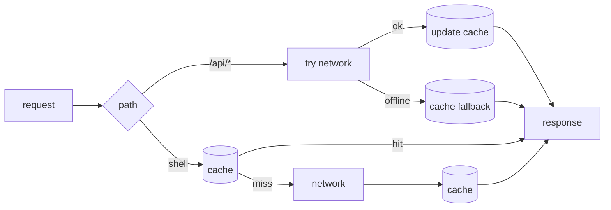

# 16 - UI polish, an editable diet plan, and a PWA

_Beyond the core course: theming, a weekly board, a live prayer countdown, an editable meal plan, and
turning the app into an installable, offline-capable PWA._

> **Where this lives.** All in [`app/`](../../app/). Frontend in `src/main/resources/static/`; one new
> backend slice for the editable diet plan.

## Why this matters

A routine app you actually open every morning has to be *fast to scan* and *pleasant*. This step is the
"make it good software, not just correct software" pass: a real design system (theming), progressive
disclosure (so the page is concise), live interactivity (a ticking countdown, today highlighted), and the
modern web baseline — an installable, offline PWA. It also adds one more honest backend slice: the diet
plan becomes **editable**, which is a clean recap of the CRUD + Flyway-migration patterns from
[step 07](./07-full-crud.md) and [step 10](./10-seed-and-migrations.md).

## What changed, and the ideas behind it

### 1. Light / dark theming with no flash

The whole stylesheet is driven by **CSS custom properties** (variables). Dark is the default `:root`; a
`:root[data-theme="light"]` block overrides the same variables. A tiny script in the `<head>` (runs
*before* paint) reads the saved choice or the OS preference and sets `data-theme`, so there's **no flash**
of the wrong theme:

```html
<script>
  const saved = localStorage.getItem('sahar-theme');
  document.documentElement.setAttribute('data-theme',
      saved || (matchMedia('(prefers-color-scheme: light)').matches ? 'light' : 'dark'));
</script>
```

The ☀/☾ button flips it and saves to `localStorage`. Because every colour is a variable, switching is
instant and the editor (`admin.html`) inherits it for free. (`<meta name="theme-color">` also matches, so
the mobile address bar tints correctly.)

### 2. Concise by default: progressive disclosure

The page leads with what you need at a glance — prayer times, a **This week** board, the block — and tucks
the long reference content (daily timeline, supplements, nutrition principles, journal prompts, rules)
into native `<details>`/`<summary>` foldables that are **collapsed by default**. No framework, fully
keyboard-accessible, and the page is scannable in one screen.

### 3. The weekly board: training + meals, today highlighted, tap for detail

[`app.js`](../../app/src/main/resources/static/app.js) merges the weekly training grid with the meal plan
into one 7-day board, highlights **today** (`new Date().getDay()`), scrolls it into view on mobile, and
opens a **modal** with that day's full detail (and, for today, the timeline) when tapped. Each day is a
`<button>` — accessible and obvious.

### 4. A live prayer countdown + a "now" marker

A small timer (`setInterval`, every 20 s) finds the **next** prayer from the times, shows
"Next · Maghrib in 2h 14m", highlights it in the strip and dims the ones that have passed. The daily
timeline marks the **current slot** ("◀ now") and dims earlier ones. Pure client-side, computed from the
times already in `/api/config`.

### 5. The diet plan becomes editable (backend recap)

Previously the meal plan was static seed content. Now it's a table you can edit, using exactly the
patterns from earlier steps:

- **A Flyway migration**,
  [`V3__meal_plan.sql`](../../app/src/main/resources/db/migration/V3__meal_plan.sql), creates and seeds a
  `meal_plan` table. Being a *new versioned* migration, it runs once — on a fresh DB after V1/V2, and on
  an existing DB on the next startup (no manual steps). This is the payoff of [step 10](./10-seed-and-migrations.md).
- **A repository**,
  [`MealPlanRepository`](../../app/src/main/java/com/ramishtaha/sahar/repo/MealPlanRepository.java)
  (`findAll`, `findByDay`, `update`) — same `JdbcTemplate` + `RowMapper` shape as [step 06](./06-jdbctemplate-h2.md).
- **A controller**,
  [`DietPlanController`](../../app/src/main/java/com/ramishtaha/sahar/web/DietPlanController.java):
  `GET /api/diet-plan` and `PUT /api/diet-plan/{day}` — the CRUD verbs from [step 07](./07-full-crud.md).
- The service now reads the plan from the DB (instead of the seed) and the editor grew a per-day form.

The reference content that *isn't* meant to be edited (journal prompts, the three rules) still comes from
`RoutineSeed` — the same "not everything belongs in a table" judgement from [step 06](./06-jdbctemplate-h2.md).

### 6. A Progressive Web App (installable + offline)

Three pieces make it a PWA:

- [`manifest.json`](../../app/src/main/resources/static/manifest.json) — name, colours, and icons, so the
  browser offers **"Install app"** and it launches standalone.
- [`service-worker.js`](../../app/src/main/resources/static/service-worker.js) — a background script the
  browser keeps. Its caching strategy: **cache-first** for the app shell (HTML/CSS/JS load instantly and
  offline), **network-first** for `GET /api/*` (fresh when online, last-known data when offline). Writes
  (PUT/POST/DELETE) are never cached.
- Icons (`icon.svg`, `icon-192.png`, `icon-512.png`).



> Service workers, like geolocation ([step 15](./15-geolocation-prayer-times.md)), only run on **HTTPS or
> `localhost`**.

## Common mistakes and how to debug them

- **Theme flashes on load.** The theme script must be **inline in `<head>`**, before the stylesheet paints
  — not in a deferred file.
- **Old UI after a deploy.** The service worker cached the previous shell. Bump `CACHE` in
  `service-worker.js` (e.g. `sahar-v2`); the `activate` handler deletes old caches.
- **Manifest ignored.** Serve it as JSON. We use `manifest.json` (served `application/json`); a
  `.webmanifest` file needs the server to send `application/manifest+json`.
- **`PUT /api/diet-plan/{day}` returns 404.** Use a real day key (`Mon`..`Sun`); the lookup is
  case-insensitive but the day must exist.
- **Countdown stuck.** It recomputes every 20 s from `CONFIG.prayerTimes`; if you change times, re-render
  (the Save flow already re-fetches `/api/config`).

## Check yourself

1. How does theming avoid a flash of the wrong colours on first paint?
2. Why are `<details>` elements a good fit for "concise by default"?
3. What's the service worker's caching rule for the shell vs. for `/api/*`, and why the difference?
4. Which earlier steps' patterns does the editable diet plan reuse?
5. Why must geolocation and the service worker run on HTTPS or localhost?

---
Prev: [15 - Geolocation prayer times](./15-geolocation-prayer-times.md) | Next: [99 - Roadmap](./99-roadmap.md) | Lives in: [app/](../../app/) | See also: [the diet plan](../diet-plan.md), [Containers & DevOps](../theory/containers-and-devops.md)
