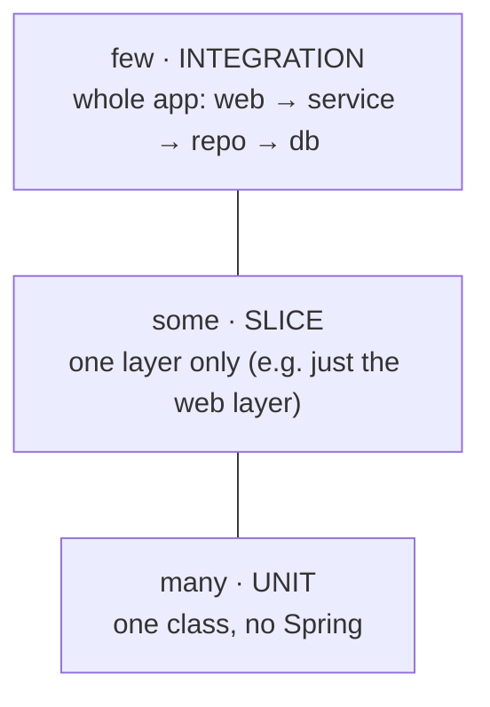

# 18 - Testing: the pyramid, for real

_Beyond the core course: grow from a single "does it start?" test into a real testing pyramid — a pure
unit test, a web-slice test, a repository test, and a full end-to-end integration test — using Spring Boot
4's modern test slices and `@MockitoBean`._

> [!IMPORTANT]
> **Checkpoint:** [`step-18-testing`](../../checkpoints/step-18-testing/) — the same app as before, now with
> four tests that each live at a different level of the pyramid. Read the four files under
> [`src/test/java/com/ramishtaha/sahar/`](../../checkpoints/step-18-testing/src/test/java/com/ramishtaha/sahar/)
> alongside this chapter. Package is `com.ramishtaha.sahar`.

> [!TIP]
> **IntelliJ IDEA Ultimate** — put the cursor in any test class and press the green ▶ in the gutter to run
> just that test or method; the **Run** tool window shows the JUnit tree and stack traces inline. [More →](../../reference/intellij-ultimate.md)

## 🎯 Why this matters

Tests are how you change code without fear. A good suite tells you *which* layer broke and does it in
seconds, so you ship on a Friday and sleep on Saturday.

But not all tests cost the same. A test that boots the whole application is thorough but slow; a test that
checks one method in isolation is instant but narrow. The skill here is **picking the right level for each
thing you want to prove** — and that is exactly what an interviewer is checking when they ask "how do you
test a Spring app?"

This step turns one lonely context-loads test into four tests, one at each level, so you can *feel* the
trade-offs instead of just reading about them.

## 🧠 Theory

### The testing pyramid

The **testing pyramid** is a rule of thumb for *how many* tests of each kind to write. The wider the band,
the more tests you should have:



Why this shape? **Unit tests** are fast and pinpoint failures, so write lots of them. **Integration tests**
boot everything and catch wiring bugs the small tests can't see, but they're slow and a failure could be
*anywhere*, so write only a handful. **Slice tests** sit in between: they load *part* of Spring. Invert the
pyramid (mostly slow end-to-end tests) and your suite becomes a coffee break you run reluctantly.

Three terms, defined once:

- **Unit test** — exercises a single class with plain `new`, no framework. Microseconds.
- **Slice test** — starts a *thin slice* of Spring (just the web layer, or just the data layer) and fakes
  the rest. Fast-ish.
- **Integration / end-to-end (e2e) test** — starts the **whole** application context, real beans, real
  (in-memory) database. Slowest, most realistic.

### Test doubles and mocking

A **mock** is a fake object you hand to the code under test so you can (a) avoid the real, slow, or external
collaborator and (b) script exactly what it returns. In a web-slice test we mock the service so the test
depends only on the controller — if the controller's JSON is wrong the test fails; if the *service's* logic
is wrong, a different (unit) test fails. That separation is the whole point.

## 🚦 Start from

[`step-17-visual-polish`](../../checkpoints/step-17-visual-polish/). The app already has the controllers,
the `RoutineService`, the repositories, and Flyway migrations. We add nothing to `src/main` here — every
file in this step lives under `src/test`.

> [!NOTE]
> **Spring Boot 4 moved the test annotations.** `@WebMvcTest` and `@AutoConfigureMockMvc` now live in
> `org.springframework.boot.webmvc.test.autoconfigure` (the old `...test.autoconfigure.web.servlet` package
> is gone), and `@MockBean` is replaced by `@MockitoBean` from
> `org.springframework.test.context.bean.override.mockito`. The pom also splits the old single
> `spring-boot-starter-test` into **modular test starters**. Copy the imports from the checkpoint exactly.

## 🛠️ Build it

### 1. The modular test starters (pom.xml)

In Spring Boot 3 you added one `spring-boot-starter-test`. In 4.x the test support is split per feature; we
pull exactly the slices we use. From [`pom.xml`](../../checkpoints/step-18-testing/pom.xml):

```xml
<dependency>
    <groupId>org.springframework.boot</groupId>
    <artifactId>spring-boot-starter-webmvc-test</artifactId>
    <scope>test</scope>
</dependency>
<dependency>
    <groupId>org.springframework.boot</groupId>
    <artifactId>spring-boot-starter-jdbc-test</artifactId>
    <scope>test</scope>
</dependency>
<!-- plus validation-test and flyway-test -->
```

Each starter brings **JUnit 5** (the test framework — `@Test` etc.), **AssertJ** (the fluent
`assertThat(x).isEqualTo(y)` assertions), and the matching Spring test slice. `<scope>test</scope>` keeps
them out of the shipped jar.

### 2. A throwaway database for tests (application.properties)

Tests must never touch your real data. [`src/test/resources/application.properties`](../../checkpoints/step-18-testing/src/test/resources/application.properties)
points every test at a fresh **in-memory H2** database:

```properties
spring.datasource.url=jdbc:h2:mem:sahar-test;DB_CLOSE_DELAY=-1
spring.datasource.username=sa
spring.datasource.password=
spring.sql.init.mode=never
```

`mem:` means the database lives in RAM and vanishes when the JVM exits — perfectly isolated. `DB_CLOSE_DELAY=-1`
keeps it alive for the whole test run (otherwise it would disappear the instant the last connection closes).
Flyway still runs its migrations and seed here, so tests exercise the *real* startup path.

### 3. A pure unit test (no Spring)

[`PrayerTimeCalculatorTest`](../../checkpoints/step-18-testing/src/test/java/com/ramishtaha/sahar/service/PrayerTimeCalculatorTest.java)
just calls `new PrayerTimeCalculator()` — no `@SpringBootTest`, no annotations on the class at all. That's
what makes it instant:

```java
class PrayerTimeCalculatorTest {

    private final PrayerTimeCalculator calc = new PrayerTimeCalculator();

    @Test
    void thaneMidJuneIsCloseToTheSeededTimes() {
        PrayerTimes pt = calc.calculate(19.22, 72.98, 5.5, LocalDate.of(2026, 6, 15));
        assertWithin(pt.fajr(), "04:37", 10);   // within 10 minutes of the seed
        assertWithin(pt.dhuhr(), "12:37", 10);
    }
}
```

It pins the math to the known Thane values, so an accidental edit to a formula fails the build immediately.

### 4. A web-slice test (`@WebMvcTest` + `@MockitoBean`)

[`ConfigControllerTest`](../../checkpoints/step-18-testing/src/test/java/com/ramishtaha/sahar/web/ConfigControllerTest.java)
loads **only** the web layer for one controller and fakes the service:

```java
@WebMvcTest(ConfigController.class)
class ConfigControllerTest {

    @Autowired MockMvc mvc;
    @MockitoBean RoutineService routine;   // a fake; no real service is created

    @Test
    void getConfigReturnsJson() throws Exception {
        given(routine.getConfig()).willReturn(new RoutineConfig(
                "Sahar", "recover, build, fight", "June 2026", /* ... */));

        mvc.perform(get("/api/config"))
                .andExpect(status().isOk())
                .andExpect(jsonPath("$.title").value("Sahar"))
                .andExpect(jsonPath("$.month").value("June 2026"));
    }
}
```

- `@WebMvcTest(ConfigController.class)` starts the `DispatcherServlet`, JSON mapping, and that one
  controller — **not** the database or other beans. Fast and focused on HTTP wiring.
- `@MockitoBean` replaces the real `RoutineService` with a Mockito mock; `given(...).willReturn(...)` scripts
  its answer. The test proves the *controller's* URL/status/JSON, not the service's logic.
- `MockMvc` drives requests **without opening a network port** — it calls the servlet stack directly.

### 5. A repository test (real H2 + Flyway)

[`MealPlanRepositoryTest`](../../checkpoints/step-18-testing/src/test/java/com/ramishtaha/sahar/repo/MealPlanRepositoryTest.java)
runs your SQL against the real in-memory database, with Flyway having migrated and seeded the `meal_plan`
table:

```java
@SpringBootTest
class MealPlanRepositoryTest {

    @Autowired MealPlanRepository mealPlan;

    @Test
    void updateRoundTrips() {
        int changed = mealPlan.update("Tue", "Test lunch", "Test dinner", "test note");
        assertThat(changed).isEqualTo(1);
        assertThat(mealPlan.findByDay("Tue")).get()
                .extracting(MealDay::lunch).isEqualTo("Test lunch");
    }
}
```

This is the test that protects your hand-written SQL — a typo in the `UPDATE` statement would surface here,
not in production.

### 6. An end-to-end integration test (`@SpringBootTest` + `@AutoConfigureMockMvc`)

[`RoutineApiIntegrationTest`](../../checkpoints/step-18-testing/src/test/java/com/ramishtaha/sahar/RoutineApiIntegrationTest.java)
boots the **whole** app — real controllers, real service, real repositories, real (in-memory) DB — and
drives it over HTTP with `MockMvc`:

```java
@SpringBootTest
@AutoConfigureMockMvc
class RoutineApiIntegrationTest {

    @Autowired MockMvc mvc;

    @Test
    void editingTheMonthRoundTrips() throws Exception {
        mvc.perform(put("/api/month").contentType("application/json")
                        .content("{\"month\":\"August 2026\"}"))
                .andExpect(status().isOk())
                .andExpect(jsonPath("$.month").value("August 2026"));

        mvc.perform(get("/api/config"))
                .andExpect(jsonPath("$.month").value("August 2026"));
    }
}
```

The PUT really flows web → service → repository → database, and the follow-up GET proves it persisted. A
third test (`aBadPrayerTimeIsRejected`) confirms validation returns **400** end to end. Nothing is mocked —
that's the difference from step 4's slice test.

## ▶️ Try it

```bash
# run the whole suite (all four levels)
mvn -q test

# run just the pure unit test
mvn -q test -Dtest=PrayerTimeCalculatorTest

# run just the web-slice test
mvn -q test -Dtest=ConfigControllerTest
```

> [!TIP]
> Watch the timings. The unit test finishes almost instantly; `ConfigControllerTest` spins up a thin slice;
> the `@SpringBootTest` classes are noticeably slower because they boot the full context. That gap *is* the
> pyramid.

## ✅ End state

- Four tests, one per pyramid level: unit (`PrayerTimeCalculatorTest`), slice (`ConfigControllerTest`),
  repository (`MealPlanRepositoryTest`), integration (`RoutineApiIntegrationTest`).
- Tests run against a throwaway in-memory H2 with Flyway, never your real data.
- `mvn -q test` is green and the same checks run in [CI](../../.github/workflows/ci.yml).

## 💼 Interview angle

**Q: Explain the testing pyramid and why it's shaped that way.**
Many fast unit tests at the base, some slice tests in the middle, a few end-to-end tests at the top. Unit
tests are fast and pinpoint failures; e2e tests are slow and a failure could be anywhere, so you keep them
few. An inverted pyramid (mostly e2e) gives a slow, flaky, hard-to-diagnose suite.

**Q: Difference between a unit, a slice, and an integration test in Spring?**
A unit test uses plain `new`, no Spring (e.g. `PrayerTimeCalculatorTest`). A slice test loads *part* of the
context — `@WebMvcTest` loads only the web layer. An integration test (`@SpringBootTest`) starts the whole
context with real beans and DB.

**Q: In a `@WebMvcTest`, why do you mock the service?**
So the test depends only on the controller. `@WebMvcTest` doesn't load service or repository beans anyway;
mocking the service with `@MockitoBean` lets you script its return value and assert purely on HTTP behaviour
(URL, status, JSON). Business-logic bugs are caught by separate unit tests — clean separation of concerns.

**Q: What is `MockMvc`?**
A test helper that drives Spring MVC requests by calling the servlet stack directly, **without** opening a
real network port or server. Fast and deterministic. `@AutoConfigureMockMvc` wires it into a `@SpringBootTest`;
`@WebMvcTest` provides it automatically.

**Q: How do you keep tests isolated from real data?**
A separate `src/test/resources/application.properties` points at an in-memory H2 (`jdbc:h2:mem:...`) that
lives only for the test JVM. Flyway still migrates and seeds it, so each run starts from a known, throwaway
state and never touches the production database file.

**Q: What is `@MockitoBean` and why did it replace `@MockBean`?**
`@MockitoBean` (from `org.springframework.test.context.bean.override.mockito`) replaces a bean in the context
with a Mockito mock. It's part of Spring's unified **bean-override** mechanism; Spring Boot 4 removed the old
`@MockBean` in favour of it, so new code uses `@MockitoBean`.

## 🐞 Common mistakes and how to debug them

- **`cannot find symbol: @MockBean` / wrong import for `@WebMvcTest`** — you're on Spring Boot 4 syntax now.
  Use `@MockitoBean` from `org.springframework.test.context.bean.override.mockito`, and import `@WebMvcTest`
  / `@AutoConfigureMockMvc` from `org.springframework.boot.webmvc.test.autoconfigure`.
- **`No qualifying bean of type RoutineService` in a `@WebMvcTest`** — the web slice doesn't load services.
  Declare it with `@MockitoBean` (as `ConfigControllerTest` does).
- **A `@SpringBootTest` reads or wipes your real DB** — your test `application.properties` isn't on the test
  classpath (must be `src/test/resources/`) or doesn't use `jdbc:h2:mem:`.
- **In-memory DB "table not found" mid-run** — you forgot `DB_CLOSE_DELAY=-1`; the DB vanished when a
  connection closed.
- **`MockMvc` is null** — you used `@SpringBootTest` without `@AutoConfigureMockMvc`. Add it (or switch to
  `@WebMvcTest`, which supplies `MockMvc`).
- **Mocked method returns `null` unexpectedly** — you never wrote a `given(mock.x()).willReturn(...)` for
  that call, so Mockito returns its default (`null`/empty/0).

## ❓ Check yourself

1. Why does `PrayerTimeCalculatorTest` run so much faster than `RoutineApiIntegrationTest`?
2. In `ConfigControllerTest`, what would still pass if `RoutineService` had a logic bug — and which test
   would catch that bug instead?
3. What does `@AutoConfigureMockMvc` add that `@SpringBootTest` alone does not?
4. Why use an in-memory H2 with `DB_CLOSE_DELAY=-1` for tests instead of the real database file?
5. Which Spring Boot 4 annotation replaced `@MockBean`, and which package does `@WebMvcTest` now come from?

---
⬅️ Prev: [17 - Visual polish](./17-visual-polish.md) · ➡️ Next: [19 - A clean error model](./19-error-handling.md) · 📍 Checkpoint: [step-18-testing](../../checkpoints/step-18-testing/) · 🔗 See also: [Spring & DI](../theory/spring-and-di.md) · [interview-prep](../../reference/interview-prep.md)
