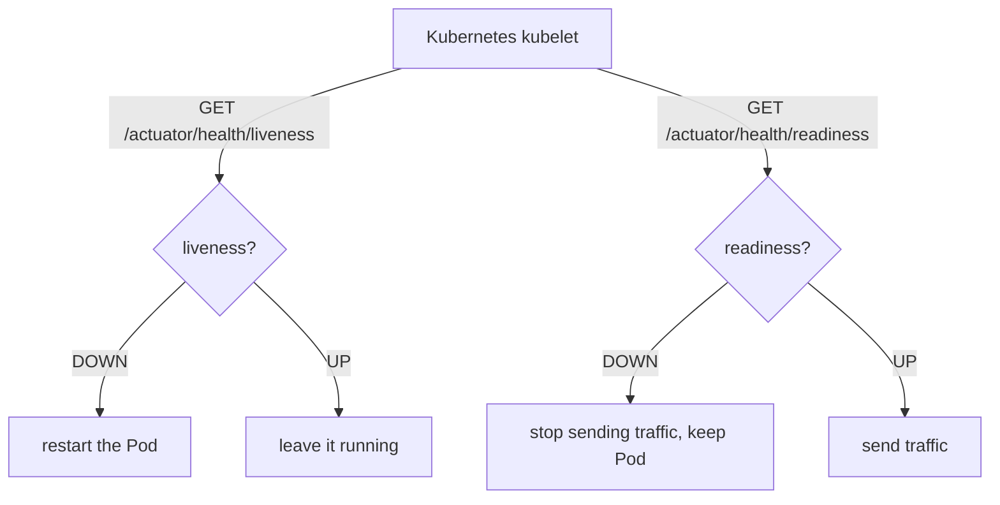

# 20 - Observability with Actuator

_Beyond the core course: bolt on Spring Boot Actuator so your app can answer "am I healthy, am I ready for traffic, and what am I doing right now?" — including a custom domain health check and the Kubernetes liveness/readiness probes a real deployment needs._

> [!IMPORTANT]
> **Checkpoint:** [`step-20-observability`](../../checkpoints/step-20-observability/) — the full app with Actuator wired in, a custom `RoutineHealthIndicator`, and the K8s probes repointed at Actuator's health groups. Package is `com.ramishtaha.sahar`.

> [!TIP]
> **Observability** is the umbrella term for being able to tell *what a running system is doing from the outside* — without attaching a debugger. Its three classic pillars are **metrics** (numbers over time, e.g. request count), **logs** (events), and **traces** (one request's path through services). Actuator gives you the first one for free and a health story on top.

## 🎯 Why this matters

Up to now "is the app okay?" meant *eyeballing the logs*. That does not scale, and it does not work at all once a platform — a load balancer, Cloud Run, Kubernetes — is making automated decisions about your app. Those platforms need a **machine-readable** answer to two different questions:

- **"Are you alive, or should I kill and restart you?"** (liveness)
- **"Are you ready to receive traffic *right now*?"** (readiness)

[Spring Boot Actuator](https://docs.spring.io/spring-boot/reference/actuator/) is the production-readiness library that answers exactly these — plus a `/metrics` feed and an `/info` card — through plain HTTP endpoints. This step is the difference between an app that *runs on your laptop* and one that *operates in production*.

## 🧠 Theory

### What Actuator gives you

Adding one starter exposes a family of **management endpoints** under `/actuator`. The important ones for us:

| Endpoint | Answers |
| --- | --- |
| `/actuator/health` | One overall status (`UP`/`DOWN`) aggregated from many checks. |
| `/actuator/health/liveness` | Is the app's *internal state* broken beyond recovery? |
| `/actuator/health/readiness` | Can the app *serve requests* right now (DB reachable, warmed up)? |
| `/actuator/info` | Static facts about the build (name, version, your `info.*` keys). |
| `/actuator/metrics` | A catalogue of numeric measurements (JVM memory, HTTP timings…). |

> [!NOTE]
> Actuator endpoints are **disabled over HTTP by default** (except a bare `/actuator/health`). You *opt in* to each one explicitly. That default is a security feature — see the interview section on locking it down.

### Health vs liveness vs readiness

These three are easy to confuse, so pin them down once:

- **Health** is the *aggregate* — Actuator rolls up every `HealthIndicator` (the datasource, disk space, your custom checks) into a single status. If any is `DOWN`, the whole thing is `DOWN`.
- **Liveness** = "is this process irrecoverably broken?" If it fails, the right fix is to **restart** the container. A failing DB should *not* fail liveness (restarting won't fix the DB) — that would cause a restart loop.
- **Readiness** = "should traffic be routed here?" If it fails, the platform **stops sending requests** but leaves the app running (e.g. while it warms up, or while a dependency is briefly down).



### Custom health indicators

Built-in checks know about *infrastructure* (is the database connection pool okay?). They do **not** know whether your app is *functionally* correct. Sahar can be technically "up" — Tomcat listening, DB connected — yet useless because the seed data never loaded. A **custom `HealthIndicator`** lets you assert a *domain* fact: "the routine is seeded and readable." That signal is what a readiness probe should actually react to.

> [!IMPORTANT]
> **Spring Boot 4 change.** The health contributor types moved packages. In Boot 3 you implemented `org.springframework.boot.actuate.health.HealthIndicator`; in **Boot 4 it is `org.springframework.boot.health.contributor.HealthIndicator`** (and `...health.contributor.Health`). Same idea, new import — copying a Boot-3 snippet will not compile. Confirm in [`RoutineHealthIndicator.java`](../../checkpoints/step-20-observability/src/main/java/com/ramishtaha/sahar/health/RoutineHealthIndicator.java).

## 🚦 Start from

[`step-19-error-handling`](../../checkpoints/step-19-error-handling/) — the app with its clean error model in place. This step is purely additive: it does not touch any existing controller or repository behaviour, it only *adds* the Actuator starter, some properties, one new class, and the probe paths in the deployment manifest.

## 🛠️ Build it

### 1. Add the Actuator starter

One dependency pulls in all the endpoints plus **Micrometer** (the metrics facade). From [`pom.xml`](../../checkpoints/step-20-observability/pom.xml):

```xml
<!-- Actuator (step 20): production-readiness endpoints (health, info, metrics) + Micrometer. -->
<dependency>
    <groupId>org.springframework.boot</groupId>
    <artifactId>spring-boot-starter-actuator</artifactId>
</dependency>
```

### 2. Expose a deliberate set of endpoints

By default only `health` is reachable over HTTP. We *explicitly* opt in to a small set — never `*` ("everything"). From [`application.properties`](../../checkpoints/step-20-observability/src/main/resources/application.properties):

```properties
# Expose a small, deliberate set of management endpoints over HTTP (NOT everything).
management.endpoints.web.exposure.include=health,info,metrics
```

### 3. Turn on health details

By default `/actuator/health` shows only `{"status":"UP"}`. To see *which* component is `DOWN` (and our custom details), turn on details:

```properties
# Show health component details (DB, disk, our custom RoutineHealthIndicator).
management.endpoint.health.show-details=always
```

> [!WARNING]
> `show-details=always` exposes internal facts (DB vendor, our location name) to anyone who can hit the endpoint. Great for a personal app and for *learning*; in a public service you would set `show-details=when-authorized` and put auth in front of it. The interview section returns to this.

### 4. Enable the Kubernetes probe groups

This single flag makes Actuator publish the two **probe groups** at `/actuator/health/liveness` and `/actuator/health/readiness`:

```properties
# Enable the Kubernetes-style liveness/readiness probe groups.
management.endpoint.health.probes.enabled=true
```

Spring auto-detects when it is running in Kubernetes and turns these on for you, but enabling the flag explicitly means they work everywhere (locally, in plain Docker), which is exactly what you want for testing.

### 5. Populate `/actuator/info`

`/actuator/info` is empty until you give it something. We let it surface `info.*` properties:

```properties
# Let /actuator/info surface the info.* values below.
management.info.env.enabled=true
info.app.name=Sahar
info.app.description=recover, build, fight - a personal routine app
info.app.stack=Spring Boot 4.0.6, Java 25
```

### 6. The custom `RoutineHealthIndicator`

The heart of the step. A `@Component` that implements `HealthIndicator`; Spring registers it automatically and its bean name (minus `HealthIndicator`) becomes the component key — here, `routine`. From [`RoutineHealthIndicator.java`](../../checkpoints/step-20-observability/src/main/java/com/ramishtaha/sahar/health/RoutineHealthIndicator.java):

```java
import org.springframework.boot.health.contributor.Health;          // Boot 4 package!
import org.springframework.boot.health.contributor.HealthIndicator;

@Component
public class RoutineHealthIndicator implements HealthIndicator {

    private final MetaRepository meta;

    public RoutineHealthIndicator(MetaRepository meta) { this.meta = meta; }

    @Override
    public Health health() {
        var found = meta.find();
        if (found.isEmpty()) {
            return Health.down().withDetail("reason", "app_meta is not seeded").build();
        }
        Health.Builder up = Health.up()
                .withDetail("title", found.get().title())
                .withDetail("month", found.get().month());
        meta.findLocation().ifPresent(loc -> up.withDetail("location", loc.placeName()));
        return up.build();
    }
}
```

It calls the existing [`MetaRepository.find()`](../../checkpoints/step-20-observability/src/main/java/com/ramishtaha/sahar/repo/MetaRepository.java) — no new query. If the single `app_meta` row is missing, the app is *functionally broken* and this reports `DOWN` with a reason; otherwise `UP` with helpful detail.

### 7. Repoint the Kubernetes probes

Finally, the deployment manifest's probes point at Actuator's groups instead of guessing a custom path. From [`deploy/k8s/deployment.yaml`](../../checkpoints/step-20-observability/deploy/k8s/deployment.yaml):

```yaml
readinessProbe:           # "is it ready for traffic yet?"
  httpGet:
    path: /actuator/health/readiness
    port: 8080
  initialDelaySeconds: 10
  periodSeconds: 5
livenessProbe:            # "is it still alive, or should K8s restart it?"
  httpGet:
    path: /actuator/health/liveness
    port: 8080
  initialDelaySeconds: 30
  periodSeconds: 15
```

Note the **timing asymmetry**: readiness checks often (every 5s, short delay) so traffic is steered quickly; liveness checks rarely with a long initial delay (30s) so a slow startup is never mistaken for a crash.

## ▶️ Try it

Start the app (`./mvnw spring-boot:run`) and hit the endpoints:

```bash
# Aggregate health - now with component details (db, diskSpace, routine, ...)
curl localhost:8080/actuator/health

# The readiness probe group K8s polls before sending traffic
curl localhost:8080/actuator/health/readiness

# Build/info card from the info.* properties
curl localhost:8080/actuator/info

# Catalogue of available metrics
curl localhost:8080/actuator/metrics

# Drill into a single metric (note the path segment is the metric name)
curl localhost:8080/actuator/metrics/jvm.memory.used
```

The health response shows our custom component:

```json
{
  "status": "UP",
  "components": {
    "db": { "status": "UP", "details": { "database": "H2" } },
    "diskSpace": { "status": "UP" },
    "routine": {
      "status": "UP",
      "details": { "title": "Sahar", "month": "...", "location": "Thane" }
    }
  }
}
```

> [!TIP]
> Want to *see* it go `DOWN`? Temporarily point at a fresh, unseeded database (or delete the `app_meta` row) and re-hit `/actuator/health` — the `routine` component flips to `DOWN` with `"reason": "app_meta is not seeded"`, and the aggregate goes `DOWN` with it.

## ✅ End state

- `spring-boot-starter-actuator` is on the classpath; only `health`, `info`, `metrics` are exposed over HTTP.
- `/actuator/health` reports component details, including a custom **`routine`** component.
- `/actuator/health/liveness` and `/actuator/health/readiness` answer the two K8s probe questions.
- `/actuator/info` carries the app name/description/stack; `/actuator/metrics` lists JVM and HTTP metrics.
- The K8s [`deployment.yaml`](../../checkpoints/step-20-observability/deploy/k8s/deployment.yaml) probes point at Actuator's health groups.

## 💼 Interview angle

**Q: What is the difference between health, liveness, and readiness, and how does Kubernetes use each?**
*Health is the aggregate UP/DOWN. **Liveness** answers "is the process irrecoverably broken?" — if it fails, K8s **restarts** the Pod. **Readiness** answers "can it serve traffic now?" — if it fails, K8s **stops routing traffic** but leaves the Pod running. The key consequence: a transient DB outage should fail readiness (stop traffic), not liveness (restarting won't bring the DB back and you'd get a crash loop).*

**Q: What does a custom `HealthIndicator` add over the built-in DB/disk checks?**
*Built-in checks verify infrastructure (connection pool open, disk free). They can't tell whether the app is **functionally** correct. A custom indicator asserts a domain invariant — e.g. "the routine is seeded and readable" — so a readiness probe reacts to the app being genuinely usable, not just the socket being open.*

**Q: How do you write one in Spring Boot 4 specifically?**
*Implement `HealthIndicator` and return `Health.up()/down()` with `withDetail(...)`. Register it as a `@Component`; the bean name (minus the `HealthIndicator` suffix) becomes the component key. The Boot-4 gotcha is the package: it's `org.springframework.boot.health.contributor`, not the Boot-3 `org.springframework.boot.actuate.health`.*

**Q: What is Micrometer and what does `/actuator/metrics` give you?**
*Micrometer is a vendor-neutral **metrics facade** — like SLF4J but for metrics. You instrument once and ship to Prometheus, Datadog, etc. by adding a registry. `/actuator/metrics` lists named meters (JVM memory/GC, HTTP request timers, connection pool stats); append the name (`/actuator/metrics/jvm.memory.used`) to read one. In production a Prometheus registry usually scrapes `/actuator/prometheus`.*

**Q: What should you NOT expose publicly, and how do you lock Actuator down?**
*Never expose `env`, `heapdump`, `threaddump`, `loggers`, or `mappings` to the internet — they leak config, secrets, and internals. Concretely: keep `exposure.include` to a deliberate allowlist (we use `health,info,metrics`), set `show-details=when-authorized`, move the endpoints to a separate `management.server.port` not routed publicly, and put authentication in front. Spring Security can secure `/actuator/**` with its own rules.*

**Q: Why can health details leak information?**
*With `show-details=always`, the response includes things like DB vendor/version, disk paths, and any details you add (we add the location name). That's reconnaissance for an attacker and possibly PII. Hence the default is `never`, and `when-authorized` is the production choice.*

## 🐞 Common mistakes and how to debug them

- **`/actuator/info` is empty.** Exposing the endpoint isn't enough — you also need `management.info.env.enabled=true` *and* some `info.*` properties (or build info). Both are required.
- **`/actuator/health/liveness` returns 404.** You forgot `management.endpoint.health.probes.enabled=true` (and you're not in an auto-detected K8s environment). The plain `/actuator/health` works but the groups don't appear.
- **Compile error: cannot resolve `org.springframework.boot.actuate.health.HealthIndicator`.** That's the **Boot-3** package. Use the Boot-4 import `org.springframework.boot.health.contributor.HealthIndicator` (and `...Health`).
- **`/actuator/metrics` works but `/actuator/env` 404s — "is it broken?"** No, that's *correct*: only `health,info,metrics` are exposed. Anything else is intentionally hidden.
- **Health shows only `{"status":"UP"}` with no components.** `show-details` is at its default (`never`). Set it to `always` (dev) or `when-authorized` (prod).
- **Liveness flapping causes restart loops.** You put a dependency check (DB) into the liveness group. Dependency health belongs in **readiness**; liveness should reflect only irrecoverable internal state.

## ❓ Check yourself

1. Why should a failing database connection affect **readiness** but not **liveness**?
2. What makes the bean's component key come out as `routine` rather than `routineHealthIndicator`?
3. Which one property turns on the `/actuator/health/{liveness,readiness}` groups, and why enable it even outside Kubernetes?
4. Name two endpoints you would *never* expose to the public internet, and one config change that limits the blast radius.
5. What is Micrometer, and how would you ship Sahar's metrics to Prometheus?

---
⬅️ Prev: [19 - A clean error model](./19-error-handling.md) · ➡️ Next: [21 - Hardening an outbound call](./21-resilient-geocoder.md) · 📍 Checkpoint: [step-20-observability](../../checkpoints/step-20-observability/) · 🔗 See also: [Containers & DevOps](../theory/containers-and-devops.md) · [interview-prep](../../reference/interview-prep.md)
