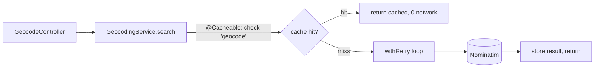

# 21 - Hardening an outbound call (config, timeouts, retry, cache)

_Beyond the core course: take the working Nominatim geocoder from step 15 and make it production-grade with externalised config, timeouts, a retry loop, and a Caffeine cache — the four habits every outbound call needs._

> [!IMPORTANT]
> **Checkpoint:** [`step-21-resilient-geocoder`](../../checkpoints/step-21-resilient-geocoder/) — the geocoder, now hardened, with cache metrics you can actually watch tick over. Package is `com.ramishtaha.sahar`.

## 🎯 Why this matters

In [step 15](./15-geolocation-prayer-times.md) you called OpenStreetMap's **geocoder** (turns a place name like "Thane" into latitude/longitude) from Spring with a `RestClient`. It worked — on a good day. But it has the classic flaws of a naïve outbound call:

- The URL, the `User-Agent`, every knob is **hard-coded** — you'd recompile to change them.
- There's **no timeout** — if Nominatim hangs, *your* request thread hangs with it, and a few slow calls can exhaust your whole thread pool. This is how a slow dependency takes your app down with it.
- One blip = one failure. **No retry.**
- Every search re-hits the network, even for "Thane" typed ten times — wasteful, and it burns through Nominatim's ~1 request/second rate limit.

This step fixes all four. None of it is geocoding-specific: **config, timeout, retry, cache** is the checklist for *any* call to a service you don't own — a payment gateway, a maps API, another team's microservice. It's also one of the most reliable interview topics in the "designed a resilient system" bucket.

## 🧠 Theory

### Externalised, type-safe config

A config value (a URL, a timeout) should live *outside* the code so you can change it per environment without rebuilding — that's the "**config**" factor of the [twelve-factor app](https://12factor.net/config). Spring gives you two ways to read it:

- **`@Value("${sahar.geocoding.base-url}")`** — injects one property string into one field. Fine for a one-off, but the key is a magic string with no compile-time check, no default, and no grouping.
- **`@ConfigurationProperties`** — binds a *whole group* of related keys (everything under `sahar.geocoding.*`) into one **typed** object. The types are validated at startup, IntelliJ autocompletes the keys, and your code depends on a small documented object instead of scattered strings. This is the idiomatic choice for more than one or two related settings. More on Spring's binding in [Spring & DI](../theory/spring-and-di.md).

### Timeout + retry = the floor of resilience

**Resilience** is staying healthy when a dependency misbehaves. The two cheapest, highest-value tools:

- A **timeout** caps how long you'll wait. Two kinds: a **connect timeout** (how long to wait for the TCP connection to open) and a **read timeout** (how long to wait for bytes after connecting). Without them, a hung server holds your thread *forever*.
- A **retry** re-attempts a failed call a couple of times. It papers over *transient* failures (a dropped packet, a brief 503). It only makes sense for **idempotent** operations — ones safe to repeat. A `GET` is idempotent by definition, so retrying our geocode lookups is safe; blindly retrying a `POST /charge` could double-bill someone.

### The cache-aside pattern

A **cache** is a fast local store of recent answers. The **cache-aside** flow: *check the cache → on a hit, return it (no network) → on a miss, call the service, store the answer, return it.* Spring's `@Cacheable` implements exactly this for you. We use **[Caffeine](https://github.com/ben-manes/caffeine)**, a high-performance in-memory (per-JVM) cache, as the backing store.



> [!NOTE]
> Caffeine here is **in-process**: the cache lives in your app's heap, one copy per instance. That's perfect for a single-node personal app. A multi-instance deployment that needs a *shared* cache would reach for Redis — but the `@Cacheable` code wouldn't change, only the `CacheManager` behind it. That decoupling is the point of Spring's cache abstraction.

## 🚦 Start from

[`step-20-observability`](./20-observability.md) — the geocoder still calls Nominatim the old way, and Actuator's `/actuator/metrics` is live. We'll reuse that metrics endpoint to *prove* the cache works.

## 🛠️ Build it

### 1. Add the cache dependencies

The geocoder needs Spring's cache abstraction plus the Caffeine engine. From [`pom.xml`](../../checkpoints/step-21-resilient-geocoder/pom.xml):

```xml
<dependency>
    <groupId>org.springframework.boot</groupId>
    <artifactId>spring-boot-starter-cache</artifactId>
</dependency>
<dependency>
    <groupId>com.github.ben-manes.caffeine</groupId>
    <artifactId>caffeine</artifactId>
</dependency>
<!-- so the IDE autocompletes our @ConfigurationProperties keys -->
<dependency>
    <groupId>org.springframework.boot</groupId>
    <artifactId>spring-boot-configuration-processor</artifactId>
    <optional>true</optional>
</dependency>
```

### 2. Type-safe config as a record

[`GeocodingProperties`](../../checkpoints/step-21-resilient-geocoder/src/main/java/com/ramishtaha/sahar/config/GeocodingProperties.java) is an immutable `record` bound from `sahar.geocoding.*`. Each `@DefaultValue` means the app works with **zero** config set:

```java
@ConfigurationProperties(prefix = "sahar.geocoding")
public record GeocodingProperties(
        @DefaultValue("https://nominatim.openstreetmap.org") String baseUrl,
        @DefaultValue("Sahar/1.0 (https://github.com/ramishtaha/spring-boot-sahar)") String userAgent,
        @DefaultValue("3000") int connectTimeoutMs,
        @DefaultValue("5000") int readTimeoutMs,
        @DefaultValue("2") int maxRetries) {
}
```

### 3. Switch on the binding (no extra annotation per record)

Spring only binds the record if something tells it to scan. In [`SaharApplication`](../../checkpoints/step-21-resilient-geocoder/src/main/java/com/ramishtaha/sahar/SaharApplication.java) we add **one** annotation that finds *all* `@ConfigurationProperties` records, so you never repeat yourself:

```java
@SpringBootApplication
@ConfigurationPropertiesScan
public class SaharApplication { ... }
```

### 4. Wire timeouts into the RestClient

In [`GeocodingService`](../../checkpoints/step-21-resilient-geocoder/src/main/java/com/ramishtaha/sahar/service/GeocodingService.java)'s constructor, a `SimpleClientHttpRequestFactory` carries the connect and read timeouts. Note Boot 4 takes a `Duration`, not a raw int:

```java
public GeocodingService(GeocodingProperties props) {
    SimpleClientHttpRequestFactory factory = new SimpleClientHttpRequestFactory();
    factory.setConnectTimeout(Duration.ofMillis(props.connectTimeoutMs()));
    factory.setReadTimeout(Duration.ofMillis(props.readTimeoutMs()));

    this.client = RestClient.builder()
            .baseUrl(props.baseUrl())
            .defaultHeader("User-Agent", props.userAgent())
            .requestFactory(factory)
            .build();
    this.maxRetries = props.maxRetries();
}
```

### 5. A tiny retry loop

Still in [`GeocodingService`](../../checkpoints/step-21-resilient-geocoder/src/main/java/com/ramishtaha/sahar/service/GeocodingService.java) — wrap the call, retry on any `RuntimeException` (timeout, 5xx, connection refused), and return `null` once exhausted so callers can degrade gracefully:

```java
private <T> T withRetry(java.util.function.Supplier<T> call) {
    RuntimeException last = null;
    for (int attempt = 0; attempt <= maxRetries; attempt++) {
        try {
            return call.get();
        } catch (RuntimeException ex) {
            last = ex; // timeout, 5xx, connection refused - try again
        }
    }
    return null; // all attempts failed
}
```

### 6. Cache successes only

The two lookup methods are `@Cacheable`. The crucial detail is **`unless`** on `search` — it skips caching an *empty* list, so a transient outage that returns "no results" can't poison the cache for 24 hours:

```java
@Cacheable(cacheNames = "geocode", key = "#query", unless = "#result.isEmpty()")
public List<GeoResult> search(String query) { ... }

@Cacheable(cacheNames = "reverse", key = "#lat + ',' + #lng")
public GeoResult reverse(double lat, double lng) { ... }
```

### 7. `@EnableCaching` lives in its OWN class

This is the subtle, interview-worthy bit. `@EnableCaching` is in [`CacheConfig`](../../checkpoints/step-21-resilient-geocoder/src/main/java/com/ramishtaha/sahar/config/CacheConfig.java), **not** on `SaharApplication`:

```java
@Configuration
@EnableCaching
public class CacheConfig {
}
```

Why? A `@WebMvcTest` slice loads the application class to find configuration, but deliberately leaves out cache auto-configuration. An app-level `@EnableCaching` would then demand a `CacheManager` the slice never creates — and the slice would fail to start. A web slice doesn't load `@Configuration` classes like `CacheConfig`, so the coupling disappears.

### 8. Configure Caffeine + expose metrics

From [`application.properties`](../../checkpoints/step-21-resilient-geocoder/src/main/resources/application.properties) — the named caches match the `cacheNames` above, and `recordStats` is what lets Micrometer surface hit/miss counts:

```properties
spring.cache.type=caffeine
spring.cache.cache-names=geocode,reverse
# recordStats exposes cache.gets{result=hit|miss} under /actuator/metrics
spring.cache.caffeine.spec=maximumSize=500,expireAfterWrite=24h,recordStats
```

> [!TIP]
> The `sahar.geocoding.*` keys are *also* listed in `application.properties` for visibility, but since every field has a `@DefaultValue`, deleting them changes nothing. They're there to show you what externalised config looks like.

## ▶️ Try it

Run the app (`./mvnw spring-boot:run`), then:

```bash
# First call: a cache MISS -> hits Nominatim (slower).
curl "localhost:8080/api/geocode?q=Thane"

# Same query again: a cache HIT -> returned from Caffeine, no network (instant).
curl "localhost:8080/api/geocode?q=Thane"

# Prove the hit happened: Micrometer's cache.gets, filtered to hits on the 'geocode' cache.
curl "localhost:8080/actuator/metrics/cache.gets?tag=result:hit&tag=cache:geocode"
```

That last call returns JSON with a `COUNT` measurement of at least `1.0` — a real, observable cache hit. Bump the read timeout absurdly low (`sahar.geocoding.read-timeout-ms=1`) and watch the retry loop give up and return an empty list instead of hanging.

> [!NOTE]
> First-call results need internet access to Nominatim. Offline, `search` returns `[]` (the graceful fallback) and nothing is cached (thanks to `unless`), so a later online call still works.

## ✅ End state

- `sahar.geocoding.*` is bound into a typed `GeocodingProperties` record with sensible defaults.
- The `RestClient` has connect + read timeouts; a slow Nominatim can no longer pin a thread.
- Failed calls retry up to `maxRetries` times, then degrade gracefully.
- Repeat lookups are served from a Caffeine cache; failures are never cached.
- A cache hit is visible in `/actuator/metrics/cache.gets`.
- The existing `@WebMvcTest` slices still pass, because caching is isolated in `CacheConfig`.

## 💼 Interview angle

**Q: `@ConfigurationProperties` vs `@Value` — when do you reach for each?**
`@Value` injects a single property into a single field — fine for a one-off value. `@ConfigurationProperties` binds a *group* of related keys (a prefix) into one typed, immutable object, with type validation at startup, defaults, IDE autocomplete, and optional bean validation. Once you have more than a couple of related settings, `@ConfigurationProperties` is the idiomatic choice.

**Q: Why cache a geocoder at all, and what pattern is this?**
It's the **cache-aside** pattern: check the cache, return on hit, otherwise call the service and store the result. Geocoding answers are stable (a place's coordinates don't change), repeated, and the upstream is rate-limited (~1 req/s) and slow — a textbook caching candidate. Caching cuts latency and keeps us under the rate limit.

**Q: Why `unless = "#result.isEmpty()"` on `@Cacheable`?**
`unless` evaluates *after* the method runs and skips caching when true. An empty result usually means a transient failure (offline, rate-limited), not "this place doesn't exist." Without `unless`, one outage could cache an empty answer for the full TTL and keep returning nothing long after Nominatim recovered. **Never cache a transient failure.**

**Q: Why does `@EnableCaching` placement matter?**
On `SaharApplication`, every test slice that loads the application class would demand a `CacheManager` — but a `@WebMvcTest` slice doesn't auto-configure caching, so those tests fail to start. Putting `@EnableCaching` in a standalone `@Configuration` (`CacheConfig`) that web slices don't load decouples the cross-cutting concern from the test slices. General lesson: keep cross-cutting `@Enable...` config out of the main class when it would over-constrain your slices.

**Q: A teammate ships a `RestClient` with no timeout. What's the danger?**
The default is *infinite wait*. If the upstream hangs, the request thread blocks forever; under load, blocked threads pile up until the pool is exhausted and the whole app stops serving — a slow dependency cascades into a full outage. Always set both a connect and a read timeout.

**Q: Is it safe to retry this call? When is retry dangerous?**
Yes — these are `GET`s, which are **idempotent** (repeating them has no side effect), so retrying is safe. Retry is dangerous on non-idempotent operations like `POST /charge`: a retry after a timeout might double-execute. Safe retries there need an idempotency key or a server that dedupes.

## 🐞 Common mistakes and how to debug them

- **Keys don't bind / `GeocodingProperties` is all defaults.** You forgot `@ConfigurationPropertiesScan` (or `@EnableConfigurationProperties`). Also check kebab-case: the property is `connect-timeout-ms`, mapping to the field `connectTimeoutMs`.
- **`@Cacheable` does nothing.** `@EnableCaching` isn't active (it's in `CacheConfig` — make sure that class is component-scanned), or you're calling the cached method *from within the same bean* (self-invocation bypasses the proxy). The first symptom is `cache.gets` never recording a hit.
- **App hangs on a slow Nominatim.** The timeouts aren't wired — verify the `SimpleClientHttpRequestFactory` is passed via `.requestFactory(factory)` on the builder. Boot 4 wants a `Duration`, so `setConnectTimeout(3000)` won't even compile against the new API.
- **A `@WebMvcTest` fails with "no CacheManager bean."** `@EnableCaching` leaked onto `SaharApplication` or another config the slice loads. Move it to `CacheConfig`.
- **`cache.gets` metric is absent.** You dropped `recordStats` from `spring.cache.caffeine.spec`; without it Caffeine doesn't track stats and Micrometer has nothing to expose.

## ❓ Check yourself

1. Why is `@ConfigurationProperties` preferable to four separate `@Value` fields here?
2. What exactly does `unless = "#result.isEmpty()"` prevent, and why does it matter?
3. Why is `@EnableCaching` in `CacheConfig` instead of on `SaharApplication`?
4. What are the two timeouts on `SimpleClientHttpRequestFactory`, and what disaster do they prevent?
5. Why is retrying these geocode calls safe, but retrying a `POST /charge` is not?

---
⬅️ Prev: [20 - Observability with Actuator](./20-observability.md) · ➡️ Next: [22 - Domain events](./22-domain-events.md) · 📍 Checkpoint: [step-21-resilient-geocoder](../../checkpoints/step-21-resilient-geocoder/) · 🔗 See also: [Spring & DI](../theory/spring-and-di.md) · [interview-prep](../../reference/interview-prep.md)
