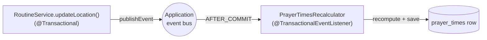

# 22 - Domain events: decoupling with the application event bus

_Beyond the core course: let saving a location quietly trigger a prayer-times recalculation — without the
code that saves the location knowing (or caring) that recalculation happens at all._

> [!IMPORTANT]
> **Checkpoint:** [`step-22-domain-events`](../../checkpoints/step-22-domain-events/) — the same app as
> step 21, plus a tiny event (`LocationChangedEvent`) and a listener (`PrayerTimesRecalculator`) that reacts
> to it. Package is `com.ramishtaha.sahar`.

## 🎯 Why this matters

Right now, "save the location" and "recompute prayer times" are two facts about the same moment. The naive
way is to make `updateLocation` do both: save, then call the calculator, then save the times. That works —
until you add a third consequence ("clear the geocoding cache"), and a fourth ("send a push notification").
Soon a one-line write balloons into a method that knows about half the app.

A **domain event** breaks that knot. The writer states a fact — *"the location changed"* — and walks away.
Anything that cares **subscribes**. You can add or remove reactions without ever editing the writer. This is
the same decoupling instinct behind dependency injection ([Spring & DI](../theory/spring-and-di.md)), applied
to *what happens next* instead of *what gets wired in*.

It is also a very common interview topic: event-driven design, in-process vs. message brokers, and the
subtle-but-important `AFTER_COMMIT` timing all come up. By the end of this step you'll have shipped a real
example and be able to talk about it.

## 🧠 Theory

### What is a domain event?

A **domain event** is an immutable object that records *something that already happened* in your domain,
phrased in the past tense: `LocationChanged`, `OrderPlaced`, `UserRegistered`. It is a fact, not a command —
nobody is being told to do anything. Interested parties listen and decide for themselves how to react.

The **publisher** (the code that did the thing) and the **subscriber** (the code that reacts) never reference
each other. They only share the event type. That inversion — *the source knows nothing about its consumers* —
is the whole point.

> [!NOTE]
> **Since Spring Framework 6, any object can be an event.** In older Spring you had to extend
> `ApplicationEvent`. Today a plain `record` carrying just the data is the idiomatic shape — which is exactly
> what we use.

### The application event bus

Spring's `ApplicationContext` *is* an event bus. You inject an
[`ApplicationEventPublisher`](https://docs.spring.io/spring-framework/docs/current/javadoc-api/org/springframework/context/ApplicationEventPublisher.html)
and call `publishEvent(...)`. Spring finds every bean method annotated `@EventListener` (or
`@TransactionalEventListener`) whose parameter type matches and invokes it. **By default this is synchronous
and in-process** — the listener runs on the same thread, in the same JVM, before `publishEvent` returns.



### `@EventListener` vs `@TransactionalEventListener`

This is the crux of the step. A plain `@EventListener` fires **the instant `publishEvent` is called** — which,
in a `@Transactional` method, is still *inside* the open transaction, before anything is committed. If the
transaction then rolls back, you've already reacted to a fact that never became true.

`@TransactionalEventListener(phase = AFTER_COMMIT)` instead waits until the surrounding transaction
**commits successfully**, then fires. So the reaction can never get ahead of the fact it reacts to. If the
write rolls back, the listener simply never runs.

| Annotation | Fires when | Risk |
| --- | --- | --- |
| `@EventListener` | immediately, inside the transaction | reacts to changes that may roll back |
| `@TransactionalEventListener(AFTER_COMMIT)` | only after a successful commit | needs an active transaction (else it's skipped) |

> [!WARNING]
> An `AFTER_COMMIT` listener only fires if a transaction is actually active and commits. That's why the
> publisher (`updateLocation`) is annotated `@Transactional` — no transaction, no event delivery to this
> phase.

## 🚦 Start from

[`step-21-resilient-geocoder`](../../checkpoints/step-21-resilient-geocoder/). The app already saves a
location (`PUT /api/location`) and computes prayer times with `PrayerTimeCalculator`. In step 21 those two
were unrelated; this step wires the second to follow the first — through an event, not a direct call.

## 🛠️ Build it

### 1. Define the event (a plain record)

The event carries just the new `Location`. No base class, no annotations — a `record` is enough.

```java
public record LocationChangedEvent(Location location) {
}
```

From [`LocationChangedEvent.java`](../../checkpoints/step-22-domain-events/src/main/java/com/ramishtaha/sahar/event/LocationChangedEvent.java).
Notice it lives in a new `event` package and depends only on the
[`Location`](../../checkpoints/step-22-domain-events/src/main/java/com/ramishtaha/sahar/domain/Location.java)
record — it has no idea who will react.

### 2. Publish it from the service

`RoutineService.updateLocation` injects `ApplicationEventPublisher`, becomes `@Transactional`, and — after
saving — publishes the fact. It does **not** recompute anything itself.

```java
@Transactional
public Location updateLocation(Location location) {
    meta.updateLocation(location);
    Location saved = meta.findLocation().orElseThrow();
    events.publishEvent(new LocationChangedEvent(saved));
    return saved;
}
```

From [`RoutineService.java`](../../checkpoints/step-22-domain-events/src/main/java/com/ramishtaha/sahar/service/RoutineService.java).
The `events` field is the constructor-injected `ApplicationEventPublisher`. That's the entire publisher side —
one save, one fact announced.

### 3. Listen and react after commit

A new `@Component` subscribes. It reuses the same pure
[`PrayerTimeCalculator`](../../checkpoints/step-22-domain-events/src/main/java/com/ramishtaha/sahar/service/PrayerTimeCalculator.java)
the API already exposes, then saves the result via
[`PrayerTimesRepository.update`](../../checkpoints/step-22-domain-events/src/main/java/com/ramishtaha/sahar/repo/PrayerTimesRepository.java).

```java
@Component
public class PrayerTimesRecalculator {

    @TransactionalEventListener(phase = TransactionPhase.AFTER_COMMIT)
    public void onLocationChanged(LocationChangedEvent event) {
        Location loc = event.location();
        // tzOffset is minutes east of UTC; the calculator wants hours (IST 330 -> 5.5).
        PrayerTimes recomputed = calculator.calculate(loc.lat(), loc.lng(), loc.tzOffset() / 60.0, LocalDate.now());
        prayerTimes.update(recomputed);
    }
}
```

From [`PrayerTimesRecalculator.java`](../../checkpoints/step-22-domain-events/src/main/java/com/ramishtaha/sahar/event/PrayerTimesRecalculator.java).
The `AFTER_COMMIT` phase is what makes this safe: the recompute fires only once the location row is durably
committed.

> [!TIP]
> The listener method name doesn't matter — Spring matches on the **parameter type** (`LocationChangedEvent`).
> A method can listen to several event types by overloading, and you can narrow further with a SpEL
> `condition = "..."`.

### 4. Prove it with an integration test

[`RoutineApiIntegrationTest.changingLocationRecalculatesPrayerTimes`](../../checkpoints/step-22-domain-events/src/test/java/com/ramishtaha/sahar/RoutineApiIntegrationTest.java)
starts the whole context (`@SpringBootTest`), moves the location to **Null Island** (0,0, UTC), and asserts the
saved `fajr` is no longer Thane's seeded `04:37` — which can only happen if the `AFTER_COMMIT` listener fired.

```java
mvc.perform(put("/api/location")
        .contentType("application/json")
        .content("{\"placeName\":\"Null Island\",\"lat\":0.0,\"lng\":0.0,\"tzOffset\":0}"))
        .andExpect(status().isOk());

mvc.perform(get("/api/prayer-times"))
        .andExpect(status().isOk())
        .andExpect(jsonPath("$.fajr").value(Matchers.not("04:37")));
```

It captures the seeded location and times up front and restores them in a `finally` block, so the test leaves
the shared H2 database exactly as it found it (JUnit's method order isn't guaranteed, and other tests assert
the seeded values).

## ▶️ Try it

Run the app, change the location, and watch the prayer times follow — with no code path that explicitly
recalculates after the `PUT`.

```bash
# Move the location to Mecca. updateLocation publishes LocationChangedEvent.
curl -X PUT localhost:8080/api/location \
  -H "Content-Type: application/json" \
  -d "{\"placeName\":\"Mecca\",\"lat\":21.42,\"lng\":39.83,\"tzOffset\":180}"

# Read the prayer times back: they were recomputed by the AFTER_COMMIT listener.
curl localhost:8080/api/prayer-times
```

HTTPie version of the same two calls:

```bash
http PUT :8080/api/location placeName=Mecca lat:=21.42 lng:=39.83 tzOffset:=180
http :8080/api/prayer-times
```

The `fajr`/`dhuhr`/`maghrib` values in the second response differ from the pre-change ones — proof the
listener ran. Repeat the `PUT` with different coordinates and the times shift again.

## ✅ End state

- A new `event` package with `LocationChangedEvent` (a plain record) and `PrayerTimesRecalculator` (a
  `@Component` listener).
- `RoutineService.updateLocation` is `@Transactional` and publishes the event via `ApplicationEventPublisher`;
  it no longer knows how prayer times get recomputed.
- `PrayerTimesRecalculator` reacts only `AFTER_COMMIT`, reusing the existing calculator and repository.
- `changingLocationRecalculatesPrayerTimes` passes and self-restores the seeded state.

## 💼 Interview angle

**Q: Why use a domain event instead of just calling the recalculation directly?**
Decoupling. The publisher states a fact and depends on nothing downstream; subscribers depend only on the
event type. You can add, remove, or change reactions (recompute, clear cache, notify) without touching the
code that saves the location. It keeps the write path small and honours the single-responsibility principle.

**Q: What's the difference between `@EventListener` and `@TransactionalEventListener`?**
A plain `@EventListener` fires synchronously the moment `publishEvent` is called — inside the still-open
transaction. `@TransactionalEventListener` binds the callback to a transaction *phase*; with
`AFTER_COMMIT` it fires only after a successful commit. Use the transactional one whenever the reaction must
not happen if the originating write rolls back. Note it requires an active transaction — outside one, an
`AFTER_COMMIT` listener is silently skipped (unless you set `fallbackExecution = true`).

**Q: Why `AFTER_COMMIT` specifically here?**
Recomputing prayer times for a location that was never actually saved would be a lie. `AFTER_COMMIT`
guarantees the location row is durably committed before we react, so the recompute can never get ahead of the
fact it depends on.

**Q: These are in-process Spring events. When would you graduate to Kafka or RabbitMQ?**
Spring's event bus is in-memory, single-JVM, and not durable — if the process crashes after commit but before
the listener runs, the reaction is lost. Reach for a real message broker when you need: cross-service
communication (other apps subscribe), durability and retry/replay, ordering or partitioning guarantees, or
back-pressure and buffering. For in-process side effects within one service, Spring events are simpler and
have no infrastructure cost. A common bridge is the **transactional outbox**: write an outbox row in the same
transaction, then a relay publishes it to the broker.

**Q: A post-commit side effect fails — what happens, and how do you handle it?**
By default the listener runs on the publishing thread *after* the transaction has already committed, so it
cannot roll the commit back — the location stays saved while the recompute failed. Options: catch and log,
retry (e.g. `@Retryable`), publish a compensating event, or use the outbox pattern so the work is durable and
replayable. The key interview point is recognising that the side effect and the originating commit are no
longer atomic.

**Q: Synchronous vs. `@Async` listeners — trade-offs?**
By default listeners run synchronously on the caller's thread, so they add latency to the request and any
exception propagates to the caller. Add `@Async` (with `@EnableAsync` and a configured executor) to run the
listener on a separate thread for fire-and-forget work — at the cost that exceptions no longer reach the
caller and you lose the original thread's transaction/security context. Choose sync when the reaction must
complete (and you want its errors); async when it's a slow, non-critical side effect like sending email.

## 🐞 Common mistakes and how to debug them

- **Listener never fires.** The most common cause with `AFTER_COMMIT` is **no active transaction**. The
  publisher must be `@Transactional` (here, `updateLocation` is). Symptom: the location saves but prayer
  times don't change. Fix: confirm `@Transactional` on the publishing method; for a quick sanity check,
  temporarily switch to a plain `@EventListener` and see if it fires.
- **Recompute happens even when the write fails.** You're using a plain `@EventListener` (fires inside the
  transaction) instead of `@TransactionalEventListener(AFTER_COMMIT)`.
- **DB writes inside the listener seem to vanish.** Work done in an `AFTER_COMMIT` listener runs *after* the
  original transaction closed, so it needs its **own** transaction. Here `PrayerTimesRepository.update` uses
  `JdbcTemplate`, which manages its own connection, so it commits fine. If your listener uses JPA, annotate it
  `@Transactional(propagation = REQUIRES_NEW)` so its writes are flushed.
- **`ClassCastException` / listener not matched.** Spring dispatches by the parameter type. Make sure the
  method parameter is exactly your event type (`LocationChangedEvent`), not a supertype you didn't intend.
- **Forgetting the listener bean exists.** `PrayerTimesRecalculator` must be a Spring `@Component` (or
  `@Bean`) for its `@TransactionalEventListener` to be registered. A new-ed-up object is invisible to the bus.

## ❓ Check yourself

1. Why is `LocationChangedEvent` a plain `record` with no base class — what changed in Spring 6 to allow that?
2. What would go wrong if `PrayerTimesRecalculator` used `@EventListener` instead of
   `@TransactionalEventListener(AFTER_COMMIT)`?
3. Why must `updateLocation` be `@Transactional` for the `AFTER_COMMIT` listener to fire at all?
4. The recompute fails after the location commit succeeds — is the location still saved? How would you make
   the side effect reliable?
5. When would you replace this in-process event with a real broker like Kafka, and what would you gain and
   lose?

---
⬅️ Prev: [21 - Hardening an outbound call](./21-resilient-geocoder.md) · ➡️ Next: [23 - Spring Data JPA](./23-spring-data-jpa.md) · 📍 Checkpoint: [step-22-domain-events](../../checkpoints/step-22-domain-events/) · 🔗 See also: [Spring & DI](../theory/spring-and-di.md) · [interview-prep](../../reference/interview-prep.md)
