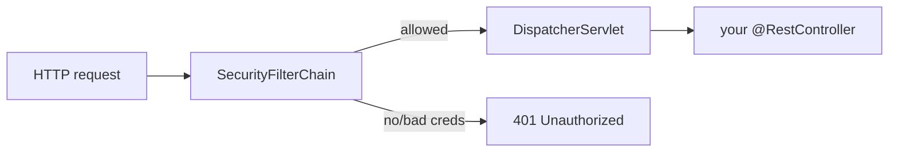

# 24 - Spring Security: open reads, guarded writes

_Beyond the core course: lock the whole app down with one dependency, then deliberately re-open the public
reads and keep the writes behind a single admin password — the "secure by default, open on purpose" posture._

> [!IMPORTANT]
> **Checkpoint:** [`step-24-security`](../../checkpoints/step-24-security/) — the full Sahar app with Spring
> Security wired in: public reads, admin-only writes, HTTP Basic over a stateless API, and tests that pin the
> policy. Package is `com.ramishtaha.sahar`.

> [!WARNING]
> The default credentials are **`admin` / `sahar`** for **local development only**. In any real deployment,
> override the password with an environment variable — `SAHAR_ADMIN_PASSWORD` — and **never** commit a real
> secret. Because HTTP Basic sends the password on every request (Base64, *not* encryption), always serve it
> over **HTTPS** in production.

## 🎯 Why this matters

Up to now, anyone who could reach Sahar could *edit* it — `PUT /api/month`, drop a training week, rewrite the
diet plan. That was fine while you ran it on `localhost`, but the moment it's on the internet it's an open
door. This step closes that door for **writes** while keeping the home page open to **anyone with the link**.

Two new ideas land here, and both come up in almost every backend interview:

- **Authentication vs authorization** — *who are you?* then *are you allowed to do this?*
- A **security filter chain** that runs **before** your controllers, deciding each request's fate.

We do it the honest way for an app with exactly one writer: a single in-memory admin user, HTTP Basic, no
session, no login form. Small footprint, real concepts.

## 🧠 Theory

### Authentication vs authorization

Two words that sound alike and mean different things:

- **Authentication** (authn): *proving who you are.* Sahar's proof is a username + password sent in the
  `Authorization: Basic` header.
- **Authorization** (authz): *deciding what you're allowed to do.* In Sahar: anyone may `GET`; only the
  authenticated admin may `POST` / `PUT` / `DELETE`.

You authenticate **once per request**, then the rules authorize that request.

### The security filter chain (runs before your controllers)

Spring Security is a chain of **servlet filters** that sits *in front of* your `DispatcherServlet`. Every
request passes through it first. If a request is rejected (no credentials, wrong password), the filter
returns `401`/`403` and **your controller never runs**. This is why a controller bug can't accidentally leak
data the policy forbids — the gate is upstream of your code.



### Secure by default

The instant `spring-boot-starter-security` is on the classpath, **every** endpoint requires authentication —
nothing is reachable until you say so. That's the safe default: you *opt in* to what's public rather than
*remembering* to lock things down. Our `SecurityConfig` then re-opens exactly the reads and static files that
must stay open. See it added in the [`pom.xml`](../../checkpoints/step-24-security/pom.xml).

### HTTP Basic, stateless, and why CSRF is off

- **HTTP Basic** = the client sends `Authorization: Basic base64(user:pass)` on each request. Simple, and
  ideal for an API where there's no human filling in a login form every time.
- **Stateless** (`SessionCreationPolicy.STATELESS`) = the server keeps **no session**, issues no `JSESSIONID`
  cookie. Each request stands alone, authenticated by its own header. Nothing to fixate, expire, or leak.
- **CSRF off** — *Cross-Site Request Forgery* is an attack where a malicious page tricks your browser into
  sending a request to Sahar using **ambient credentials the browser attaches automatically** (a logged-in
  cookie/session). A stateless Basic API has *no* ambient credential: the browser never replays Basic creds
  to a cross-site `fetch`, so there's nothing for a forged request to ride on. Disabling CSRF is the correct,
  documented choice for this shape of API. (Turn CSRF back **on** the day you switch to cookie/session auth.)

### Why passwords are hashed

We never store the raw password. A **`DelegatingPasswordEncoder`** stores it as `{bcrypt}$2a$...` — a one-way
**BCrypt** hash with a built-in salt and a deliberately slow work factor, so a leaked store can't be reversed.
The `{bcrypt}` prefix means the scheme can *evolve* later without breaking existing hashes.

## 🚦 Start from

[`step-23-spring-data-jpa`](../../checkpoints/step-23-spring-data-jpa/). Everything works but **nothing is
protected** — every `PUT`/`DELETE` is wide open. This step adds the one dependency and the one config bean
that change that.

## 🛠️ Build it

### 1. Add the dependency (and it locks everything down)

In [`pom.xml`](../../checkpoints/step-24-security/pom.xml):

```xml
<dependency>
    <groupId>org.springframework.boot</groupId>
    <artifactId>spring-boot-starter-security</artifactId>
</dependency>
```

Run the app now and *every* endpoint returns `401` — that's "secure by default" doing its job. The next bean
re-opens what should be public.

### 2. The policy: one `SecurityFilterChain` bean

This is the heart of the step. From
[`SecurityConfig`](../../checkpoints/step-24-security/src/main/java/com/ramishtaha/sahar/config/SecurityConfig.java):

```java
@Bean
SecurityFilterChain securityFilterChain(HttpSecurity http) throws Exception {
    http
        .authorizeHttpRequests(auth -> auth
            .requestMatchers("/actuator/health/**", "/actuator/info").permitAll()
            .requestMatchers("/h2-console/**").permitAll()
            .requestMatchers(HttpMethod.GET, "/api/**").permitAll()
            .requestMatchers(HttpMethod.POST, "/api/**").authenticated()
            .requestMatchers(HttpMethod.PUT, "/api/**").authenticated()
            .requestMatchers(HttpMethod.DELETE, "/api/**").authenticated()
            .requestMatchers("/actuator/**").authenticated()
            .anyRequest().permitAll()) // index.html, CSS/JS, manifest, service worker, icons
        .httpBasic(Customizer.withDefaults())
        .csrf(csrf -> csrf.disable())
        .sessionManagement(s -> s.sessionCreationPolicy(SessionCreationPolicy.STATELESS))
        .headers(h -> h.frameOptions(frame -> frame.sameOrigin())); // the H2 console renders in a frame
    return http.build();
}
```

> [!NOTE]
> This is the **Spring Boot 4 lambda DSL**: you configure a `SecurityFilterChain` **bean** rather than
> extending the old (removed) `WebSecurityConfigurerAdapter`. Rules are read **top to bottom** — the first
> matcher that matches wins, so order matters. `anyRequest().permitAll()` at the end keeps the static site
> and PWA open. `frameOptions.sameOrigin()` lets the H2 console (which renders in a frame) work.

### 3. The admin credential as typed config

[`AdminProperties`](../../checkpoints/step-24-security/src/main/java/com/ramishtaha/sahar/config/AdminProperties.java)
binds `sahar.admin.*` into a record, with safe local defaults:

```java
@ConfigurationProperties(prefix = "sahar.admin")
public record AdminProperties(
        @DefaultValue("admin") String username,
        @DefaultValue("sahar") String password) {
}
```

In
[`application.properties`](../../checkpoints/step-24-security/src/main/resources/application.properties) those
defaults are spelled out, with the production note inline:

```properties
sahar.admin.username=admin
sahar.admin.password=sahar
# In any real deployment override the password with an env var and NEVER commit a secret:
#   set SAHAR_ADMIN_PASSWORD=...   (relaxed binding maps it to sahar.admin.password)
```

> [!TIP]
> **Relaxed binding** means Spring maps the environment variable `SAHAR_ADMIN_PASSWORD` to the property
> `sahar.admin.password` automatically. That's how you inject the real secret at deploy time without touching
> code or committing it.

### 4. The user and the password encoder

Still in
[`SecurityConfig`](../../checkpoints/step-24-security/src/main/java/com/ramishtaha/sahar/config/SecurityConfig.java),
one in-memory admin and a delegating encoder:

```java
@Bean
PasswordEncoder passwordEncoder() {
    return PasswordEncoderFactories.createDelegatingPasswordEncoder();
}

@Bean
UserDetailsService userDetailsService(AdminProperties props, PasswordEncoder encoder) {
    UserDetails admin = User.withUsername(props.username())
            .password(encoder.encode(props.password()))  // stored as {bcrypt}...
            .roles("ADMIN")
            .build();
    return new InMemoryUserDetailsManager(admin);
}
```

Sahar has exactly one writer, so a whole `users` table would be ceremony — one `InMemoryUserDetailsManager`
user is the honest amount of auth here.

### 5. The admin page sends the header on writes only

[`admin.js`](../../checkpoints/step-24-security/src/main/resources/static/admin.js) prompts once, caches the
credentials in `sessionStorage` (cleared when the tab closes), and attaches them **only** to writes — reads
stay public:

```javascript
function authHeader(method) {
    if (method === 'GET') return null;            // reads are public; never send creds for them
    let creds = sessionStorage.getItem('sahar-auth');
    if (!creds) {
        const user = prompt('Admin username:', 'admin');
        const pass = prompt('Admin password:');
        creds = btoa(user + ':' + pass);          // Base64-encode "user:pass"
        sessionStorage.setItem('sahar-auth', creds);
    }
    return 'Basic ' + creds;
}
```

On a `401` it clears the cached creds and prompts again next time — so a wrong password self-corrects.

## ▶️ Try it

Start the app (`./mvnw spring-boot:run`), then:

```bash
# 1. A read is public — 200, no credentials needed.
curl http://localhost:8080/api/config

# 2. A write with no credentials — 401 Unauthorized.
curl -i -X PUT http://localhost:8080/api/month \
  -H "Content-Type: application/json" \
  -d '{"month":"July 2026"}'

# 3. The same write WITH the admin Basic creds — 200, it saves.
curl -X PUT http://localhost:8080/api/month \
  -u admin:sahar \
  -H "Content-Type: application/json" \
  -d '{"month":"July 2026"}'
```

`curl -u admin:sahar` is exactly the `Authorization: Basic` header the browser sends. Try a wrong password
(`-u admin:nope`) and you'll get `401` again.

### How the tests pin it

- [`SecurityRulesTest`](../../checkpoints/step-24-security/src/test/java/com/ramishtaha/sahar/SecurityRulesTest.java)
  drives the **real** filter chain from the outside (no mock user): read is `200`, write with no creds is
  `401`, write with `httpBasic("admin", "sahar")` is `200`, wrong password is `401`.

  ```java
  mvc.perform(put("/api/month")
          .with(httpBasic("admin", "sahar"))
          .contentType("application/json")
          .content("{\"month\":\"July 2026\"}"))
      .andExpect(status().isOk());
  ```

- [`ConfigControllerTest`](../../checkpoints/step-24-security/src/test/java/com/ramishtaha/sahar/web/ConfigControllerTest.java)
  is a **slice** test and turns the filters **off** so it can prove HTTP/JSON wiring without fighting security:

  ```java
  @WebMvcTest(ConfigController.class)
  @AutoConfigureMockMvc(addFilters = false)   // security is tested in SecurityRulesTest, not here
  ```

- [`RoutineApiIntegrationTest`](../../checkpoints/step-24-security/src/test/java/com/ramishtaha/sahar/RoutineApiIntegrationTest.java)
  runs the full app and authenticates its writes with `.with(httpBasic("admin", "sahar"))`.

`httpBasic(...)` and `@WithMockUser` come from **`spring-security-test`**, added in the
[`pom.xml`](../../checkpoints/step-24-security/pom.xml).

## ✅ End state

- `GET /api/**` and the static site/PWA are **public**; `POST`/`PUT`/`DELETE /api/**` require the admin.
- `/actuator/health` and `/actuator/info` stay open; other actuator endpoints need auth.
- Auth is **HTTP Basic + stateless + CSRF disabled**, with the password stored as a BCrypt hash.
- The admin page prompts once and sends the header on writes only.
- Three tests cover it: a security-rules test, a filter-free slice test, and a full integration test.

## 💼 Interview angle

**Q: Authentication vs authorization — what's the difference?**
A: Authentication is *proving who you are* (the username/password in the Basic header). Authorization is
*deciding what you're allowed to do* (anyone may `GET`; only the admin may write). You authenticate first,
then authorize the action.

**Q: Where does Spring Security run relative to my controllers?**
A: *Before* them. It's a chain of servlet filters in front of the `DispatcherServlet`. A rejected request
gets `401`/`403` and the controller never executes — the gate is upstream of application code.

**Q: What does "secure by default" mean here?**
A: Adding `spring-boot-starter-security` locks down **every** endpoint immediately; you then explicitly
re-open what should be public. You opt *into* exposure rather than relying on remembering to lock things —
the failure mode is "too closed," which is safe.

**Q: What is CSRF, and why is it safe to disable it for this API?**
A: CSRF tricks a browser into sending a state-changing request using **ambient credentials it attaches
automatically** — a logged-in cookie/session. Sahar is stateless HTTP Basic: there's no cookie/session, and
browsers don't replay Basic creds to cross-site `fetch`es, so there's no ambient credential to forge against.
Disabling CSRF is correct for a stateless token/Basic API; you'd keep it **on** for cookie/session auth.

**Q: Stateless vs session-based auth — trade-offs?**
A: Stateless (`SessionCreationPolicy.STATELESS`) keeps no server session; each request carries its own creds,
which scales horizontally with no sticky sessions and nothing to fixate. Sessions are friendlier for
browser-form logins but need server/shared-store state and CSRF protection.

**Q: Why hash passwords, and what's a delegating encoder?**
A: BCrypt is a slow, salted one-way hash, so a leaked store can't be reversed and identical passwords don't
collide. A `DelegatingPasswordEncoder` stores the algorithm as a prefix (`{bcrypt}...`) so you can migrate to
a stronger scheme later without invalidating existing hashes.

**Q: Why does the controller slice test disable the security filters?**
A: A `@WebMvcTest` slice should prove HTTP/JSON wiring (URL, status, body shape), not the security policy.
`@AutoConfigureMockMvc(addFilters = false)` turns the filter chain off so assertions aren't masked by `401`s;
the policy itself is pinned in its own `SecurityRulesTest`.

## 🐞 Common mistakes and how to debug them

- **Everything returns 401 after adding the starter** — that's *expected* until you add the
  `SecurityFilterChain` bean. Re-open the public reads as in step 2.
- **A `GET` is unexpectedly blocked / a write is unexpectedly allowed** — rule **order**. Matchers are
  evaluated top to bottom, first match wins. A broad `anyRequest()` placed too early swallows later rules.
- **Slice test fails with 401 instead of 200** — you forgot `@AutoConfigureMockMvc(addFilters = false)` on the
  `@WebMvcTest`, so security is locking the endpoint under test.
- **`401` even with the right password in a test** — you're missing `.with(httpBasic(...))`, or
  `spring-security-test` isn't on the test classpath.
- **H2 console shows a blank/broken frame** — `frameOptions` is denying the frame; the config uses
  `frameOptions.sameOrigin()` to allow same-origin framing.
- **Committed a real password** — never put the production secret in `application.properties`; inject it via
  `SAHAR_ADMIN_PASSWORD` (relaxed binding) at deploy time, and serve Basic over **HTTPS** only.

## ❓ Check yourself

1. What single change makes the whole app require authentication, and which bean re-opens the public reads?
2. Why is disabling CSRF *correct* here but *wrong* for a cookie/session login?
3. Where in the request lifecycle does the security filter chain run, and why does that matter for safety?
4. Why does `ConfigControllerTest` use `addFilters = false` while `SecurityRulesTest` does not?
5. How would you supply the admin password in production without committing it, and what transport must you use?

---
⬅️ Prev: [23 - Spring Data JPA](./23-spring-data-jpa.md) · ➡️ Next: [25 - OpenAPI + continuous delivery](./25-openapi-cicd.md) · 📍 Checkpoint: [step-24-security](../../checkpoints/step-24-security/) · 🔗 See also: [glossary](../../reference/glossary.md) · [interview-prep](../../reference/interview-prep.md)
