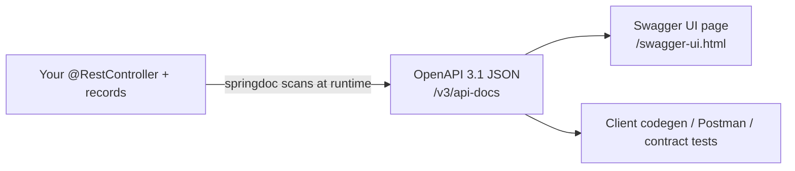
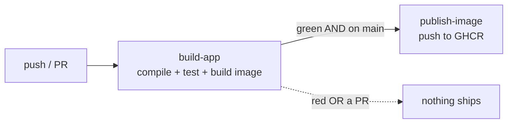

# 25 - OpenAPI docs + continuous delivery

_Beyond the core course: let the app document its own API (interactive Swagger UI from your live controllers),
then turn green tests into a shipped image automatically — the difference between **CI** and **CD**._

> [!IMPORTANT]
> **Checkpoint:** [`step-25-openapi-cicd`](../../checkpoints/step-25-openapi-cicd/) — the finished app plus
> the second CI job. Package is `com.ramishtaha.sahar`. Note: the workflow file you'll study lives at the
> **repository root** in [`.github/workflows/ci.yml`](../../.github/workflows/ci.yml), *not* inside the
> checkpoint — GitHub only runs workflows from the repo root.

## 🎯 Why this matters

Two finishing touches that turn a working app into a *shippable* one.

1. **API docs.** Right now the only way to know your endpoints is to read the controllers. That doesn't scale:
   a frontend dev, a mobile dev, or *future you* needs a contract they can read, try, and generate clients
   from. We'll auto-generate that contract from the code — so it can never drift out of date.
2. **Continuous delivery.** Step 13 gave you **CI**: every push compiles and tests. But a green build that
   nobody ships is just a feeling. We'll add a second job that, **only when tests pass on `main`**, publishes
   the container image. Code → tests → image, with no human hand on the lever.

> [!TIP]
> Everything here is "free" in the sense that you *describe* what you want and the tooling does the work:
> springdoc reads your controllers; GitHub Actions reads your YAML. No hand-written docs, no manual `docker push`.

## 🧠 Theory

### What is OpenAPI? (and what is Swagger UI?)

**OpenAPI** is a standard, language-neutral *format* for describing a REST API: its paths, parameters,
request/response shapes, and security. It's a machine-readable contract — a JSON (or YAML) document. The
older name for the spec was "Swagger", which is why the tooling still carries that brand.

Two things people confuse:

- **OpenAPI document** — the JSON contract itself, served at **`/v3/api-docs`**. Other tools read it: code
  generators that emit a typed client, Postman, contract tests.
- **Swagger UI** — a pre-built web page that *renders* that document into a clickable explorer with a "Try it
  out" button. Served at **`/swagger-ui.html`**.

So: OpenAPI is the data; Swagger UI is one viewer of that data.



The win is that the document is **derived from the running code**. You don't maintain it; you can't forget to
update it.

### CI vs CD — the green gate

- **CI (Continuous Integration)** — every change is compiled and tested automatically, fast, on every push and
  PR. It answers *"is the code still good?"* That's the [step 13](./13-ci-with-github-actions.md) job.
- **CD (Continuous Delivery)** — when CI is green on the release branch, the build is *automatically* turned
  into a shippable artifact (here, a Docker image pushed to a registry). It answers *"is there always a
  ready-to-deploy build?"*

The crucial rule: **CD only runs after CI passes.** Nothing ships unless the tests are green first. In GitHub
Actions you express that two ways at once — `needs:` (wait for the other job) and an `if:` (only on `main`).



## 🚦 Start from

[`step-24-security`](../../checkpoints/step-24-security/) — the app already has Spring Security, so reads are
public and writes need the admin. That matters here: the docs paths must be **permitted**, and Swagger UI's
**Authorize** button must know how to send credentials so "Try it out" works on the write endpoints.

## 🛠️ Build it

### 1. Add springdoc (pinned, because Boot doesn't manage it)

springdoc-openapi is the library that scans your controllers at runtime and serves both `/v3/api-docs` and
Swagger UI. One dependency in [`pom.xml`](../../checkpoints/step-25-openapi-cicd/pom.xml):

```xml
<dependency>
    <groupId>org.springdoc</groupId>
    <artifactId>springdoc-openapi-starter-webmvc-ui</artifactId>
    <version>3.0.3</version>
</dependency>
```

> [!IMPORTANT]
> Two Boot-4 gotchas baked into those three lines:
> - **Version is pinned.** The Spring Boot BOM (the parent pom that decides versions for you) does **not**
>   manage springdoc, so you must give a `<version>`. Omit it and the build fails to resolve.
> - **Use the 3.0.x line.** springdoc **3.0.3** is built for Spring Boot 4 / Spring Framework 7. The popular
>   **2.x** line targets Boot 3 and won't boot here. (3.0.3 is verified against this app on Boot 4.0.6.) The
>   generated document is OpenAPI **3.1**.

That's it for the docs to appear — springdoc auto-configures itself. The next step only adds *polish*.

### 2. Describe the API and declare the security scheme

springdoc already knows your paths and schemas from the code. [`OpenApiConfig`](../../checkpoints/step-25-openapi-cicd/src/main/java/com/ramishtaha/sahar/config/OpenApiConfig.java)
adds the human metadata (title, version, license) and — the load-bearing part — declares a **`basic`**
security scheme so Swagger UI renders an **Authorize** button:

```java
@Bean
OpenAPI saharOpenAPI() {
    return new OpenAPI()
            .info(new Info()
                    .title("Sahar API")
                    .version("v1")
                    .license(new License().name("MIT")))
            .components(new Components().addSecuritySchemes("basic",
                    new SecurityScheme().type(SecurityScheme.Type.HTTP).scheme("basic")))
            .addSecurityItem(new SecurityRequirement().addList("basic"));
}
```

A **security scheme** tells Swagger UI *how* to authenticate. `Type.HTTP` + `scheme("basic")` means HTTP
Basic — exactly the auth set up in step 24. After you click Authorize once and enter `admin` / `sahar`, every
"Try it out" call sends the `Authorization: Basic …` header, so the write endpoints work straight from the page.

> [!NOTE]
> Because the requirement is added *globally* (`addSecurityItem`), a lock icon shows on **every** operation —
> even the public `GET`s, which simply ignore the header. The alternative (annotating only the writes with
> `@SecurityRequirement`) is more precise but noisier. The checkpoint chooses simple. See the class Javadoc.

### 3. Let the docs paths through Security

Spring Security is "secure by default" — the moment it's on the classpath, *every* path needs auth, including
`/swagger-ui.html`. So [`SecurityConfig`](../../checkpoints/step-25-openapi-cicd/src/main/java/com/ramishtaha/sahar/config/SecurityConfig.java)
explicitly permits the three docs paths:

```java
.requestMatchers("/v3/api-docs/**", "/swagger-ui/**", "/swagger-ui.html").permitAll() // OpenAPI docs (step 25)
```

> [!WARNING]
> Forget this line and you'll be greeted by a Basic-auth popup (or a `401`) when you open Swagger UI. Note all
> three patterns are needed: the JSON (`/v3/api-docs/**`), the UI assets (`/swagger-ui/**`), and the entry URL
> (`/swagger-ui.html`), which **302-redirects** to `/swagger-ui/index.html`.

### 4. Add the publish-image job (CD)

This is **not** in the checkpoint app — it's the repo-root [`.github/workflows/ci.yml`](../../.github/workflows/ci.yml).
The first job, `build-app`, is the step-13 quality gate (compile, test, build the image as validation). Step 25
adds a **second** job that ships:

```yaml
publish-image:
  name: Publish image to GHCR (only on green main)
  needs: build-app                                   # gate: waits for build-app to pass
  if: github.event_name == 'push' && github.ref == 'refs/heads/main'
  runs-on: ubuntu-latest
  permissions:
    contents: read
    packages: write                                  # least privilege: just enough to push to GHCR
```

Read those four lines as a sentence: *run after `build-app` succeeds, only on a push to `main`, with just
enough token power to write packages.*

### 5. Log in and push (with the built-in token)

The same job logs in to **GHCR** (GitHub Container Registry) and pushes — using `GITHUB_TOKEN`, the short-lived
credential GitHub mints for the run. No personal access token to create, rotate, or leak:

```yaml
- name: Log in to GHCR
  uses: docker/login-action@v3
  with:
    registry: ghcr.io
    username: ${{ github.actor }}
    password: ${{ secrets.GITHUB_TOKEN }}         # the built-in, short-lived token - no secret to manage

- name: Build and push the image
  uses: docker/build-push-action@v6
  with:
    context: app
    push: true
    tags: |
      ${{ steps.img.outputs.name }}:latest
      ${{ steps.img.outputs.name }}:${{ github.sha }}
```

Two tags on purpose: **`:latest`** is a moving pointer ("the newest"), and **`:<sha>`** is an *immutable* tag
pinned to the exact commit. The image is built from the same [`Dockerfile`](../../checkpoints/step-25-openapi-cicd/Dockerfile)
you wrote in step 11.

> [!TIP]
> The `permissions: packages: write` block grants this *one job* the ability to push images and nothing else.
> That's **least privilege** — if the job (or an action it calls) is compromised, the blast radius is tiny.

## ▶️ Try it

Run the app, then exercise both halves.

```bash
# fetch the raw OpenAPI 3.1 contract (the JSON other tools consume)
curl localhost:8080/v3/api-docs

# the human, clickable explorer — opens, then 302-redirects to /swagger-ui/index.html
open http://localhost:8080/swagger-ui.html        # macOS;  Linux: xdg-open;  Windows: start
```

In the Swagger UI page: click **Authorize**, enter `admin` / `sahar`, then expand any `POST`/`PUT`/`DELETE`,
hit **Try it out**, and **Execute** — the call goes through with the Basic header. A public `GET` works without
authorizing at all.

For the CD half (after pushing to `main` on GitHub): watch the **Actions** tab — `build-app` runs, and only if
it's green does `publish-image` start. The pushed image then appears under the repo's **Packages**, tagged both
`:latest` and `:<commit-sha>`.

## ✅ End state

- `GET /v3/api-docs` returns an OpenAPI 3.1 document generated from your controllers.
- `/swagger-ui.html` serves an interactive explorer with a working **Authorize** button.
- Security permits the docs paths; the rest of the policy is unchanged.
- CI (`build-app`) still gates everything; a new `publish-image` job pushes `:latest` + `:<sha>` to GHCR — but
  **only** on green `main`.

## 💼 Interview angle

**Q: Why bother with an OpenAPI contract at all?**
A: It's a single, machine-readable source of truth for the API. Clients can be **code-generated** from it
(typed SDKs in any language), consumers can **trust** the shapes instead of guessing, and it's a **living doc**
that never drifts because it's generated from the running code rather than hand-maintained.

**Q: OpenAPI vs Swagger UI — what's the difference?**
A: OpenAPI is the *spec/format* — the JSON document at `/v3/api-docs`. Swagger UI is just one *renderer* of
that document into an interactive page at `/swagger-ui.html`. The document is the asset; the UI is a convenience
on top of it. "Swagger" is the old name for the OpenAPI spec, which is why the tooling keeps the brand.

**Q: CI vs CD?**
A: CI (Continuous Integration) is automatically building and testing every change so the codebase stays
healthy. CD (Continuous Delivery) is automatically producing a deployable artifact whenever CI is green on the
release branch. CI answers "is the code good?"; CD answers "is there always a shippable build ready?"

**Q: How do you ensure nothing ships unless tests pass?**
A: A **green gate**. In GitHub Actions the publish job uses `needs: build-app` (it won't even start until the
build/test job succeeds) plus `if: github.ref == 'refs/heads/main'` and `github.event_name == 'push'` (so PRs
and other branches never publish). Both conditions must hold.

**Q: Why tag an image with both `:latest` and `:<sha>`?**
A: `:latest` is a *mutable* pointer that moves to whatever you pushed last — convenient but ambiguous. The
**`:<sha>`** tag is *immutable*: it's pinned to one commit forever, so a deployment, a rollback, or an incident
report can reference an exact, reproducible image. Deploy by SHA, browse by `latest`.

**Q: Why use `GITHUB_TOKEN` with `packages: write` instead of a stored secret?**
A: `GITHUB_TOKEN` is **short-lived** (minted per run, expires when the job ends) and **scoped** — granting only
`packages: write` is least privilege, so a compromised job can't touch anything else. A long-lived Personal
Access Token, by contrast, must be created, stored, rotated, and can leak — broader power, longer life, more risk.

## 🐞 Common mistakes and how to debug them

- **Swagger UI prompts for login / returns 401.** You didn't permit the docs paths in `SecurityConfig`. Add
  `/v3/api-docs/**`, `/swagger-ui/**`, **and** `/swagger-ui.html` to `permitAll()` — all three.
- **App won't start / `NoSuchMethodError` after adding springdoc.** You used the **2.x** line (Boot 3) on Boot
  4. Pin **`3.0.x`** (the checkpoint uses `3.0.3`).
- **Maven can't resolve springdoc.** You omitted `<version>` — the Boot BOM doesn't manage springdoc, so the
  version is mandatory.
- **`/swagger-ui.html` "404"** — it isn't a 404, it's a **302 redirect** to `/swagger-ui/index.html`. A raw
  `curl` without `-L` just shows the redirect; open it in a browser.
- **No Authorize button / "Try it out" gets 401 on writes.** The `basic` security scheme isn't declared in
  `OpenApiConfig`, so Swagger UI never sends credentials.
- **`publish-image` ran on a feature branch (or a PR).** The `if:` condition is wrong or missing — it must
  require both `event_name == 'push'` **and** `ref == 'refs/heads/main'`.
- **`denied: permission_check_failed` pushing to GHCR.** The job lacks `permissions: packages: write` (or the
  image path isn't lowercase — GHCR requires it; the workflow lowercases the owner before building the name).

## ❓ Check yourself

1. What's the difference between the document at `/v3/api-docs` and the page at `/swagger-ui.html`?
2. Why must springdoc carry an explicit `<version>`, and why the 3.0.x line specifically on Boot 4?
3. Which two YAML keys together make `publish-image` "only on green `main`," and what does each do?
4. Why ship both a `:latest` and a `:<sha>` tag for the same image?
5. Why is `GITHUB_TOKEN` with `packages: write` safer than a stored long-lived token?

---
⬅️ Prev: [24 - Spring Security](./24-security.md) · ➡️ Next: [99 - Roadmap](./99-roadmap.md) · 📍 Checkpoint: [step-25-openapi-cicd](../../checkpoints/step-25-openapi-cicd/) · 🔗 See also: [Containers & DevOps](../theory/containers-and-devops.md) · [interview-prep](../../reference/interview-prep.md)
