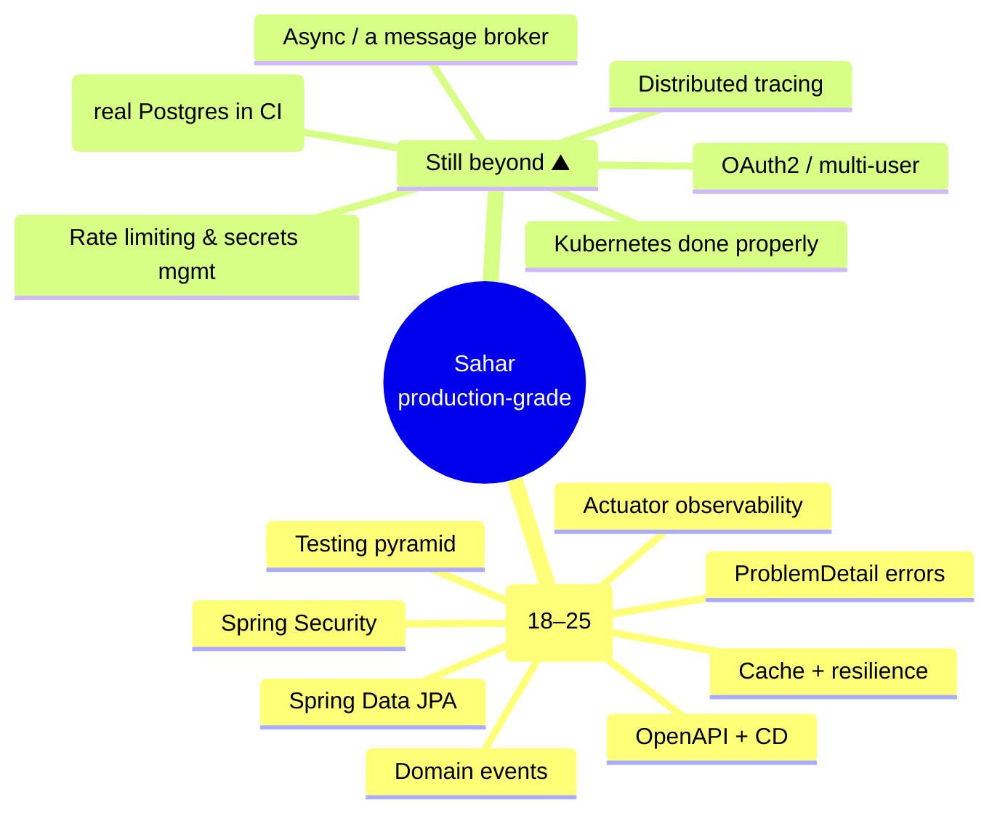

# 99 - Roadmap: where to go next

_You no longer have "a tutorial app." After the advanced track (steps 18–25) you have a **tested, observable, secured, documented** Spring Boot 4 service with a real delivery pipeline. This doc is the honest map of what you already built, and the handful of things a production team would still reach for next._

> [!IMPORTANT]
> **Checkpoint:** the finished line is [`step-25-openapi-cicd`](../../checkpoints/step-25-openapi-cicd/) — and [`app/`](../../app/) equals it. Package is `com.ramishtaha.sahar`. There is **no code to write here**: this is a reading map, not a step.

## 🎯 Why this matters

When this course first ended at step 14, this page was a list of *gaps* — "no tests, no auth, no observability, a build that doesn't deploy." **The advanced track closed almost all of them.** So the roadmap's job has changed: first to show you that the scary-sounding production checklist is now mostly _done_ (and where), and then to point honestly at what genuinely remains. Knowing the difference between "I've done this" and "I know this exists" is exactly the self-awareness interviews probe — so treat this page as both a victory lap and a reading list.

## 🧠 Theory

You finished with a clean layered app — `web → service → repo → database` — and then wrapped the cross-cutting concerns around it. Here's the shape of what's built versus what's beyond:

The pattern to notice: the advanced track deepened **every layer** and added the **cross-cutting** concerns (tests, errors, security, observability) plus the **world around the process** (CD). What remains is mostly *scale* — more users, more traffic, more services, more environments. None of it is "harder Spring"; it's "more system."

## 🚦 Start from

[`step-25-openapi-cicd`](../../checkpoints/step-25-openapi-cicd/) — the complete app with tests, `ProblemDetail`, Actuator, a Caffeine-cached + timed geocoder, domain events, a JPA `journal` module, Spring Security, Swagger UI, and a [CI→CD pipeline](../../.github/workflows/ci.yml). Every reference below is real code from that checkpoint.

## 🏆 What you already built (and where)

Before charting new ground, here's the production checklist this page used to forecast — now with the step that delivered it:

| Concern | Done in | The one-liner |
|---|---|---|
| **Testing** beyond a context-load | [18](./18-testing.md) | A real pyramid: unit, `@WebMvcTest` slice, repo, full `@SpringBootTest`. |
| **Typed, standard errors** | [19](./19-error-handling.md) | Domain exceptions → one `@RestControllerAdvice` → RFC 9457 `ProblemDetail`. |
| **Observability** | [20](./20-observability.md) | Actuator health/info/metrics, liveness/readiness probes, a custom indicator. |
| **Resilience for outbound calls** | [21](./21-resilient-geocoder.md) | Typed config, timeouts, retry, and a Caffeine cache (proven via metrics). |
| **Decoupling** | [22](./22-domain-events.md) | `ApplicationEventPublisher` + `@TransactionalEventListener(AFTER_COMMIT)`. |
| **Spring Data JPA** | [23](./23-spring-data-jpa.md) | A JPA `journal` module beside JdbcTemplate — feel the trade-off first-hand. |
| **Security** | [24](./24-security.md) | Public reads, Basic-auth writes, stateless, CSRF reasoning, hashed password. |
| **CD (not just CI)** | [25](./25-openapi-cicd.md) | OpenAPI docs + a gated job that publishes the image to GHCR on green `main`. |

If you can _explain_ each row (not just point at it), you're carrying a genuinely strong backend story into any interview — the [interview-prep bank](../../reference/interview-prep.md) drills exactly these.

## 🛠️ Where to go next

Six honest next destinations. Each: **what** it is, **why Sahar specifically** wants it, and the **docs** to open.

### 1. Testcontainers — test against real Postgres, not H2

**What.** Step 18's integration tests run on in-memory H2. [Testcontainers](https://java.testcontainers.org/) spins up a throwaway **real Postgres in Docker** for the test, then tears it down.

**Why for Sahar.** Step 09 made Sahar run on both H2 *and* Postgres. H2 hides dialect differences (types, reserved words, sequence behaviour); the only way to *prove* the Postgres path works in CI — without a hosted database — is a Testcontainers Postgres test driving the same `mvn verify`. It's the missing top of the pyramid.

**Docs.** [Testcontainers for Java](https://java.testcontainers.org/) · [Boot + Testcontainers](https://docs.spring.io/spring-boot/4.0.6/reference/testing/testcontainers.html).

### 2. Kubernetes, done properly

**What.** `deploy/k8s/` has a `Deployment` and a `Service`, and step 20 already pointed the probes at `/actuator/health/{liveness,readiness}`. Real K8s adds **Ingress** (a real hostname + TLS), **ConfigMap** (non-secret config like `SPRING_PROFILES_ACTIVE=postgres`), **Secret** (the DB password), and **Helm** (template the YAML into a versioned chart).

**Why for Sahar.** The step-09 profile/env-var design *is* the K8s contract: a ConfigMap feeds the profile, a Secret feeds `SAHAR_DB_*`. Ingress is what turns the cluster-internal Service into something you can open in a browser; the Actuator probes you already added are what keeps a wedged pod from receiving traffic.

**Docs.** [Kubernetes concepts](https://kubernetes.io/docs/concepts/) · [Helm](https://helm.sh/docs/) · [Boot on Kubernetes](https://docs.spring.io/spring-boot/4.0.6/how-to/deployment/cloud.html#howto.deployment.cloud.kubernetes) · see [Containers & DevOps](../theory/containers-and-devops.md).

### 3. OAuth2 / OIDC login and more than one user

**What.** Step 24 secures writes with a single in-memory Basic-auth user. The next rung: a real **user store** (`UserDetailsService` + BCrypt over a DB table) for multiple users, then **OAuth2/OIDC** ("Sign in with Google/GitHub") so you never store a password at all. With more than one user comes **method security** (`@PreAuthorize`) and ownership checks.

**Why for Sahar.** The moment Sahar is more than *your* routine — a friend's training block, a coach with clients — "one admin" stops being enough. Spring Security is already wired; this is swapping the user source and adding authorization rules, not starting over.

**Docs.** [Spring Security reference](https://docs.spring.io/spring-security/reference/) · [OAuth2 login](https://docs.spring.io/spring-security/reference/servlet/oauth2/login/index.html) · [Boot security](https://docs.spring.io/spring-boot/4.0.6/reference/web/spring-security.html).

### 4. Distributed tracing (OpenTelemetry)

**What.** Step 20 gave you metrics (Micrometer). **Tracing** follows one request across `web → service → repo → database` (and out to Nominatim) so you can see *where* a slow `/api/config` spends its time. Boot integrates Micrometer Tracing with OpenTelemetry/Zipkin.

**Why for Sahar.** Less critical for a single service, essential the moment Sahar calls anything else (it already calls Nominatim). A trace would show, for example, whether a slow location save is the geocoder or the DB — the kind of thing logs alone can't answer.

**Docs.** [Boot tracing](https://docs.spring.io/spring-boot/4.0.6/reference/actuator/tracing.html) · [OpenTelemetry Java](https://opentelemetry.io/docs/languages/java/).

### 5. Graduate domain events to a message broker

**What.** Step 22's events are **in-process** — publisher and listener live in the same JVM and transaction. A broker (**Kafka**, **RabbitMQ**) makes them cross-process and durable: the event survives a crash, and other services can subscribe.

**Why for Sahar.** Today the `LocationChangedEvent → recompute prayer times` reaction is perfect in-process. The day a *second* service needs to react (a notifications service, an analytics pipeline), you publish to a broker instead. You already understand the *shape* (publish a fact, subscribers react); this changes the *transport* and adds delivery guarantees, retries, and ordering to think about.

**Docs.** [Spring for Apache Kafka](https://docs.spring.io/spring-kafka/reference/) · [Spring AMQP (RabbitMQ)](https://docs.spring.io/spring-amqp/reference/).

### 6. The operational long tail

**What.** The smaller, real-world hardening: **rate limiting** (protect the public reads and your Nominatim quota), **secrets management** (move `SAHAR_DB_PASSWORD` / `SAHAR_ADMIN_PASSWORD` out of env into Vault or a cloud secret manager), **connection-pool tuning & read replicas** as traffic grows, and **blue-green / canary** deploys so a bad release never takes everyone down at once.

**Why for Sahar.** Each is small on its own and none is urgent for a personal app — but together they're the difference between "it runs" and "it runs at 3am unattended." Pick them up when the pain appears, not before.

**Docs.** [Bucket4j rate limiting](https://bucket4j.com/) · [Spring Cloud Vault](https://docs.spring.io/spring-cloud-vault/reference/) · [HikariCP](https://github.com/brettwooldridge/HikariCP) · [Argo Rollouts (canary)](https://argo-rollouts.readthedocs.io/).

## ✅ End state

Nothing in the repository changed — this is a map, not a code step. What changed is your **picture of the work**: you've gone from "I finished a tutorial" to "I built a tested, secured, observable, documented, continuously-delivered service, and I can name exactly what's left and why." That sentence is a backend engineer's job description.

In rough priority for a personal-but-public app: **Testcontainers** (trust your Postgres path) → **OAuth2/multi-user** (if anyone else uses it) → **Kubernetes properly** (when one container isn't enough) → **tracing** (when there's a second hop to debug) → **a broker** (when a second service must react) → **the operational long tail** (when scale demands it).

## 🐞 Common mistakes and how to debug them

- **Trusting H2 as a Postgres stand-in.** Your tests can be green while the Postgres path is broken (dialects, types, reserved words). Add a Testcontainers Postgres test before you trust CI on the production DB.
- **Reaching for Kafka on day one.** Step 22's in-process events are the *right* tool until a second process needs the event. A broker adds delivery guarantees you must now reason about — adopt it for a reason.
- **Leaving the default admin password in production.** Step 24 ships `admin/sahar` for local use. The instant Sahar is public, override `SAHAR_ADMIN_PASSWORD` (and serve over HTTPS so Basic credentials aren't sent in the clear) — better, move to a real user store.
- **Adding metrics but no tracing, then guessing at latency.** A `/api/config` that's "sometimes slow" is unanswerable with metrics alone once there's a network hop (Nominatim). Tracing tells you *which* span is slow.
- **base64 in a committed manifest is not a secret.** A Kubernetes `Secret` checked into Git is encoded, not encrypted. Keep credentials in a secret manager and inject them.
- **Scaling before measuring.** Read replicas, canaries, and pool tuning solve problems you can *prove* you have. Add the Actuator/metrics signal first, then optimize what it shows.

## ❓ Check yourself

1. The advanced track implemented the production checklist this page used to forecast. Name three of those concerns and the step that delivered each.
2. Sahar's integration tests run on H2. What concrete bug could that hide, and what does a Testcontainers Postgres test add?
3. Step 24 secures writes with one Basic-auth user. What two changes turn that into real multi-user auth, and which is "authentication" vs "authorization"?
4. Step 22's events are in-process. Give one signal that it's time to move them onto a message broker — and what new problems the broker introduces.
5. In Kubernetes, which object holds `SPRING_PROFILES_ACTIVE=postgres` and which holds `SAHAR_DB_PASSWORD` — and why is that the same 12-factor idea from [step 09](./09-swap-to-postgres.md)?
6. You have metrics (step 20) but a `/api/config` is intermittently slow. Why won't metrics alone tell you why, and what observability layer would?

## ---

⬅️ Prev: [25 - OpenAPI + continuous delivery](./25-openapi-cicd.md) · ➡️ Next: _(none — this is the final doc)_ · 📍 Checkpoint: [step-25-openapi-cicd](../../checkpoints/step-25-openapi-cicd/)

Related reading: [interview-prep](../../reference/interview-prep.md) · [jdbc-vs-jpa.md](../theory/jdbc-vs-jpa.md) · [persistence-landscape.md](../theory/persistence-landscape.md) · [containers-and-devops.md](../theory/containers-and-devops.md) · [glossary.md](../../reference/glossary.md) · [README](../../README.md) · [progress](../../progress.md) · [questions](../../questions.md)
