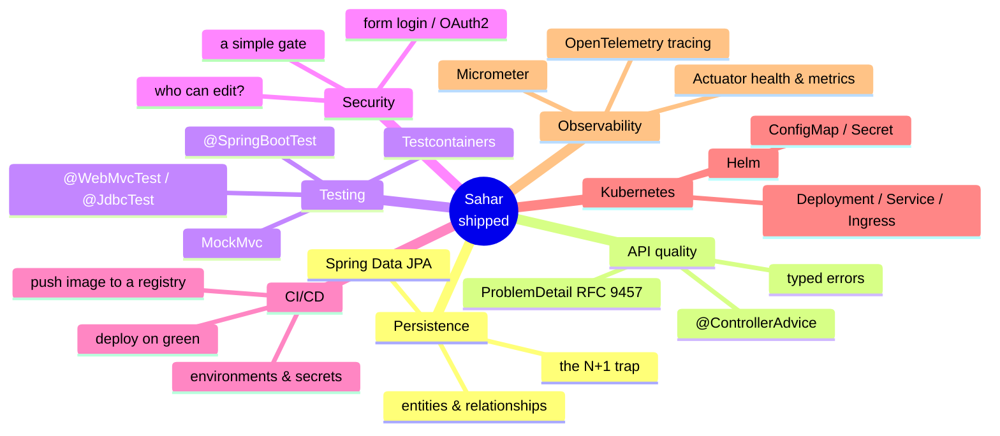

# 99 - Roadmap: where to go next

_You have a real, deployed Spring Boot 4 app. Here is the honest map of the seven things a production team would do next to Sahar, why each one matters for THIS app, and where the official docs live._

## 🎯 Why this matters

Sahar is finished as a codealong, but it is not finished as software. Right now it is a single-replica app, with `JdbcTemplate` repositories, validation that returns a hand-rolled error body, no tests beyond a context-load check, **no authentication at all**, a CI pipeline that builds but does not deploy, a flat Kubernetes manifest, and zero runtime visibility. None of that is wrong for a personal project that lives behind your own network — but every one of those is exactly where a production engineer's instinct goes next, and you are a working software engineer.

This doc is a map, not a tutorial. For each topic it answers three questions in a short paragraph: **what** it is, **why it matters for Sahar specifically** (not in the abstract), and **where to read the real docs**. The point is to turn "I finished a tutorial" into "I know the shape of the next six months." You will not change a single line of code here. Treat it as a reading list with opinions.

A word of honesty about ordering: of everything below, **Spring Security comes first in priority**, because the moment Sahar is reachable on the public internet, _anyone who can load `/admin.html` can rewrite your training block_. Everything else is improvement; that one is a hole.

## 🧠 Theory

You finished with a clean layered app: `web -> service -> repo -> database`. Each topic below either deepens one of those layers, wraps a cross-cutting concern around all of them, or changes what happens _around_ the running process (build, ship, run, observe).



Three of these (Security, Testing, Observability) are **cross-cutting** — they touch every layer. Three (CI/CD, Kubernetes, Observability-in-prod) are about the world _around_ the process. Only the first one (JPA) is a swap _inside_ a layer. Keep that distinction in mind; it tells you how disruptive each change is.

## 🚦 Start from

This is the closing doc, so there is nothing to copy. The thing you are extending is the final deploy checkpoint: [`checkpoints/step-14-deploy/`](../../checkpoints/step-14-deploy/) — the complete app with the `Dockerfile`, `docker-compose.yml`, the `.github/workflows/ci.yml` pipeline, and the `deploy/k8s/` manifests. Every code reference below is real code from that checkpoint.

## 🛠️ Build it

There is no code to build in this step. Each numbered item is a destination: what it is, why Sahar needs it, and the doc to open.

### 1. Spring Data JPA in full (and when NOT to use it)

**What it is.** Sahar's repositories are hand-written `JdbcTemplate` classes. Look at the real `BlockRepository`:

```java
private static final RowMapper<Week> WEEK_MAPPER = (rs, rowNum) -> new Week(
        rs.getInt("ordinal"),
        rs.getString("name"),
        rs.getString("start_date"),
        rs.getString("end_date"),
        rs.getString("training_focus"),
        rs.getString("backend_focus"),
        rs.getBoolean("deload"));

public BlockPlan find() {
    String label = jdbc.queryForObject("SELECT label FROM blocks WHERE id = 1", String.class);
    List<Week> weeks = jdbc.query(
            "SELECT * FROM weeks WHERE block_id = 1 ORDER BY ordinal", WEEK_MAPPER);
    return new BlockPlan(label, weeks);
}
```

You write the SQL, you map each column to a record field by hand, and the parent/child relationship between `blocks` and `weeks` is something _you_ wire together. **Spring Data JPA** flips that: you declare an `@Entity` class, mark the relationship (`@OneToMany List<Week> weeks`), and extend `JpaRepository<BlockPlan, Long>`. JPA (via Hibernate) generates the SQL, maps rows to objects, tracks changes, and gives you `findById`, `save`, `deleteById`, and derived queries like `findByBlockIdOrderByOrdinal(...)` from the method _name_ alone.

**Why it matters for Sahar.** The `BlockRepository.replace()` "update the parent, delete the old children, re-insert them" dance is exactly the kind of aggregate write that JPA's cascade + orphan-removal handles declaratively. As Sahar grows (history of past blocks, multiple users, more relationships), the hand-mapped SQL becomes the bottleneck. JPA buys you less boilerplate and real relationship navigation.

**The trap to learn before you adopt it.** The **N+1 select problem**: load 5 weeks, then lazily touch each week's children, and Hibernate quietly fires 1 + 5 queries instead of 1. It is the single most common JPA performance bug. JPA is _more_ power and _more_ footguns than `JdbcTemplate`; that is the whole trade. We chose `JdbcTemplate` for this course precisely so you would _see_ the SQL — read [jdbc-vs-jpa.md](../theory/jdbc-vs-jpa.md) for the full argument, and [persistence-landscape.md](../theory/persistence-landscape.md) for where both sit among the alternatives.

**Docs.** [Spring Data JPA reference](https://docs.spring.io/spring-data/jpa/reference/) · [Spring Boot 4.0.6 data section](https://docs.spring.io/spring-boot/4.0.6/reference/data/sql.html).

### 2. Robust validation and error handling (ProblemDetail / RFC 9457)

**What it is.** Sahar already has a good first version of centralized error handling. The real `ApiExceptionHandler` is a `@RestControllerAdvice` that catches `MethodArgumentNotValidException` and returns a custom record:

```java
@RestControllerAdvice
public class ApiExceptionHandler {

    public record ApiError(int status, String error, List<String> messages) { }

    @ExceptionHandler(MethodArgumentNotValidException.class)
    @ResponseStatus(HttpStatus.BAD_REQUEST)
    public ApiError handleValidation(MethodArgumentNotValidException ex) { ... }
}
```

That `ApiError` shape is _our invention_. The next step is to stop inventing error shapes and adopt the standard one. **RFC 9457 Problem Details for HTTP APIs** defines a `application/problem+json` body with agreed fields (`type`, `title`, `status`, `detail`, `instance`). Spring has first-class support via the `ProblemDetail` class and `ResponseEntityExceptionHandler`, so your validation handler can return a standards-compliant body that any client library already understands.

**Why it matters for Sahar.** Today only `MethodArgumentNotValidException` is handled; a `DataAccessException` from the DB, or your custom `@DeloadLast` rule failing in an unexpected path, falls through to Spring's default. A mature `@ControllerAdvice` maps _each_ exception type to a typed `ProblemDetail` with a consistent shape, so `admin.js` can show a precise message instead of a generic "something went wrong." Typed, predictable errors are the difference between an API and a guessing game.

**Docs.** [Spring MVC error handling & ProblemDetail](https://docs.spring.io/spring-framework/reference/web/webmvc/mvc-ann-rest-exceptions.html) · [RFC 9457](https://www.rfc-editor.org/rfc/rfc9457.html) · [Boot 4.0.6 error handling](https://docs.spring.io/spring-boot/4.0.6/reference/web/servlet.html#web.servlet.spring-mvc.error-handling).

### 3. Testing: from a context-load check to real confidence

**What it is.** Sahar ships exactly one test — `SaharApplicationTests`, a `@SpringBootTest` that asserts the context loads. That is the floor, not the ceiling. Notice the `pom.xml` already pulls the **modular Boot 4 test starters** (a deliberate Spring Boot 4 change from the single `spring-boot-starter-test` of 3.x):

```xml
<artifactId>spring-boot-starter-webmvc-test</artifactId>     <!-- @WebMvcTest + MockMvc -->
<artifactId>spring-boot-starter-jdbc-test</artifactId>       <!-- @JdbcTest + a test DataSource -->
<artifactId>spring-boot-starter-validation-test</artifactId> <!-- Bean Validation in tests -->
<artifactId>spring-boot-starter-flyway-test</artifactId>     <!-- migrations in tests -->
```

The dependencies are _already there_; you just have not used them yet. The testing pyramid for Sahar:

- **Slice tests** — `@WebMvcTest(BlockController.class)` loads only the web layer with a mocked `RoutineService`, and you drive it with **MockMvc** (`mockMvc.perform(put("/api/block")...).andExpect(status().isOk())`). Fast, focused on HTTP + JSON + validation. `@JdbcTest` does the same for a repository against an in-memory DB, so you can assert that `BlockRepository.replace()` really wipes-and-reinserts the weeks.
- **`@SpringBootTest`** — the full app wired together, for end-to-end flows (PUT a block, GET `/api/config`, assert it came back changed).
- **Testcontainers** — for the integration tests that matter most: run them against a _real Postgres in a throwaway Docker container_ rather than H2. This catches the dialect differences H2 hides, and it is exactly what your CI's `mvn -B -ntp verify` should exercise.

**Why it matters for Sahar.** The `@DeloadLast` rule ("deload is always the last week") and the 4-or-5-week block logic are real business rules with real edge cases. Those deserve unit tests on `RoutineService`, not a manual click through `/admin.html`. And because step 09 made Sahar run on _both_ H2 and Postgres, a Testcontainers Postgres test is the only way to prove the Postgres path actually works in CI without a hosted database.

**Docs.** [Boot 4.0.6 testing](https://docs.spring.io/spring-boot/4.0.6/reference/testing/index.html) · [Testcontainers for Java](https://java.testcontainers.org/) · [Boot + Testcontainers](https://docs.spring.io/spring-boot/4.0.6/reference/testing/testcontainers.html).

### 4. Spring Security — close the open door

**What it is.** Right now there is **no authentication anywhere**. `/admin.html` and every `PUT`/`POST`/`DELETE` under `/api` are wide open. On your laptop that is fine; on the public internet it means a stranger can roll your training block forward or delete your schedule. **Spring Security** is the framework that adds an authentication and authorization layer in front of your controllers via a servlet filter chain — before a request ever reaches `BlockController`.

**Why it matters for Sahar.** Sahar has a clean split that maps perfectly onto authorization: `/` (`index.html`) is a **read-only** public view, and `/admin.html` plus the write endpoints are **owner-only**. You want exactly one identity (you) to be able to edit. Three realistic options, cheapest first:

- **A simple gate** — HTTP Basic or form login with a single configured user. A `SecurityFilterChain` bean that permits `GET` on `/`, `/api/config`, `/api/prayer-times` and requires authentication for everything else. Minutes of config, closes the hole today.
- **Form login with a user store** — the same, but credentials in the DB with a `UserDetailsService` and a `PasswordEncoder` (BCrypt). The step up if Sahar ever gets more than one user.
- **OAuth2 / OIDC login** — "Sign in with Google/GitHub." Spring Security is a registered OAuth2 client; you never store a password. Overkill for one user, the right call if you publish it.

Start with the gate. The principle to internalize: **authentication** (who are you) and **authorization** (what may you do) are separate questions, and Spring Security answers both with the same filter chain.

**Docs.** [Spring Security reference](https://docs.spring.io/spring-security/reference/) · [Boot 4.0.6 security](https://docs.spring.io/spring-boot/4.0.6/reference/web/spring-security.html).

### 5. Deeper CI/CD — build is not deploy

**What it is.** The current `ci.yml` is a solid _CI_ pipeline: on every push and PR it sets up JDK 25, runs `mvn -B -ntp verify`, and builds the Docker image with `docker build -t sahar:ci .` — but it does **not** push or deploy. That is on purpose: the publish job is sitting in the file, commented out, waiting for you:

```yaml
  # publish-image:
  #   needs: build
  #   if: github.event_name == 'push' && github.ref == 'refs/heads/main'
  #   ...
  #     - uses: docker/build-push-action@v6
  #       with:
  #         push: true
  #         tags: ghcr.io/${{ github.repository }}:latest
```

**Why it matters for Sahar.** _Continuous Delivery_ means: when `main` goes green, an image is **pushed to a registry** (GHCR here, using the `GITHUB_TOKEN` GitHub injects — no secret to manage, just grant `packages: write`), and then something **deploys it**. Next steps from where you are:

- Uncomment the `publish-image` job so every green `main` produces a versioned, pullable image.
- Add a **deploy job** that pulls that image into an environment (your Cloud Run notes in [`deploy/cloud-run.md`](../../checkpoints/step-14-deploy/deploy/cloud-run.md), or the K8s manifests in `deploy/k8s/`).
- Introduce **environments** (staging vs production) and **GitHub Actions secrets** for the things that must not be in Git — your `SAHAR_DB_URL`, `SAHAR_DB_USERNAME`, `SAHAR_DB_PASSWORD` from step 09. This is the 12-factor "config in the environment" principle carried all the way into the pipeline.

**Docs.** [GitHub Actions](https://docs.github.com/actions) · [Publishing to GHCR](https://docs.github.com/packages/working-with-a-github-packages-registry/working-with-the-container-registry) · [GitHub Actions environments & secrets](https://docs.github.com/actions/deployment/targeting-different-environments/using-environments-for-deployment) · see [containers-and-devops.md](../theory/containers-and-devops.md).

### 6. Kubernetes, properly

**What it is.** The checkpoint's `deploy/k8s/` has a `deployment.yaml` and a `service.yaml` — enough to run one copy of Sahar behind a stable in-cluster name. Real Kubernetes is a handful more primitives working together:

- **Deployment** — declares "I want N replicas of this image," handles rolling updates and self-healing. (You have this.)
- **Service** — a stable virtual IP/DNS name in front of those replicas. (You have this.)
- **Ingress** — routes external HTTP/HTTPS traffic and TLS to your Service, so Sahar gets a real hostname instead of a port-forward.
- **ConfigMap** — non-secret config (e.g. `SPRING_PROFILES_ACTIVE=postgres`) injected as env vars.
- **Secret** — the database credentials, base64-stored and mounted as env vars, so `SAHAR_DB_PASSWORD` lives in the cluster, not the manifest.
- **Helm** — once you have five YAML files per app, you template them. Helm packages your manifests into a versioned, parameterized **chart** so "deploy to staging" and "deploy to prod" differ only by a values file.

**Why it matters for Sahar.** The clean profile/env-var design from step 09 is _built_ for this: the `postgres` profile reads everything from `SAHAR_DB_*`, which is precisely what a ConfigMap (profile) plus a Secret (credentials) feed in. Adding Ingress is what turns the cluster-internal Service into something you can actually open in a browser. And the Actuator health endpoints from item 7 are what Kubernetes uses for its `livenessProbe` and `readinessProbe` — so these last two items dovetail.

**Docs.** [Kubernetes concepts](https://kubernetes.io/docs/concepts/) · [Helm](https://helm.sh/docs/) · [Boot 4.0.6 deploying to Kubernetes](https://docs.spring.io/spring-boot/4.0.6/how-to/deployment/cloud.html#howto.deployment.cloud.kubernetes).

### 7. Observability — Actuator, Micrometer, OpenTelemetry

**What it is.** Once Sahar runs somewhere you cannot attach a debugger to, you need it to _tell you_ how it is doing. Three layers, lowest effort first:

- **Spring Boot Actuator** — add `spring-boot-starter-actuator` and you instantly get operational endpoints: `/actuator/health` (is it up? is the DB reachable?), `/actuator/info`, `/actuator/metrics`. The health endpoint is the direct answer to Kubernetes' liveness/readiness probes from item 6.
- **Micrometer** — the metrics facade Actuator uses. Point it at a backend (Prometheus, etc.) and you get JVM memory, HTTP request timings, HikariCP connection-pool usage, and your own custom counters ("blocks rolled forward this month") — all scrapeable and graphable.
- **OpenTelemetry tracing** — distributed traces that follow one request across the `web -> service -> repo -> database` path, so you can see _where_ a slow `/api/config` spends its time. Less critical for a single-service app, essential the moment Sahar talks to anything else.

**Why it matters for Sahar.** A health check that verifies the Postgres connection is the smallest, highest-value addition you can make to a deployed app — it is what lets the platform restart a wedged instance automatically. Metrics on the connection pool would have made the N+1 problem from item 1 _visible_ instead of mysterious. Observability is how a running app stops being a black box.

**Docs.** [Boot 4.0.6 Actuator](https://docs.spring.io/spring-boot/4.0.6/reference/actuator/index.html) · [Micrometer](https://docs.micrometer.io/micrometer/reference/) · [OpenTelemetry Java](https://opentelemetry.io/docs/languages/java/).

## ✅ End state

Nothing in the repository changed — this is a reading map, not a code step. What changed is your **picture of the work ahead**. You now have, in priority order for a personal-but-public app:

1. **Spring Security** (close the open `/admin.html` door — do this first if Sahar leaves your network).
2. **Tests** that actually exercise the rules (`@WebMvcTest`, `@JdbcTest`, Testcontainers Postgres) using the modular starters already in the `pom.xml`.
3. **CI/CD** that pushes a green image and deploys it (uncomment `publish-image`, add a deploy job, use environments + secrets).
4. **Observability** (Actuator health first — it pays for itself immediately).
5. **Kubernetes** with Ingress/ConfigMap/Secret/Helm when you outgrow a single container.
6. **ProblemDetail** error handling when the API gains real clients.
7. **Spring Data JPA** if and when the hand-written `JdbcTemplate` SQL becomes the thing slowing you down — not before.

The finished app this all extends lives at [`checkpoints/step-14-deploy/`](../../checkpoints/step-14-deploy/).

## 🐞 Common mistakes and how to debug them

- **Reaching for JPA on day one.** JPA is not "the grown-up version" of `JdbcTemplate`; it is a different tool with different failure modes (N+1, lazy-loading exceptions outside a transaction, surprise schema changes). Adopt it for a _reason_, and read [jdbc-vs-jpa.md](../theory/jdbc-vs-jpa.md) first.
- **Deploying publicly before adding Security.** The single biggest real risk in this whole list. If `/admin.html` is reachable from the internet, your data is editable by anyone. Add the gate _before_ the public Ingress, not after.
- **Confusing CI with CD.** A green `mvn verify` proves the build is good; it does not put anything anywhere. Pushing an image and deploying it are _separate_ jobs you must add. The current `ci.yml` deliberately stops at "build image, do not push."
- **Inventing your own error format forever.** The `ApiError` record was a fine starting point, but every bespoke error shape is something clients must special-case. Migrate to `ProblemDetail` (RFC 9457) before you have many consumers.
- **Putting secrets in manifests.** A Kubernetes `Secret` that is just base64 in a committed YAML is _not_ a secret — base64 is encoding, not encryption. Keep credentials in GitHub Actions secrets / a real secret manager, and inject them; never commit `SAHAR_DB_PASSWORD`.
- **No health endpoint, then wondering why K8s never restarts a wedged pod.** Without Actuator's `/actuator/health` wired to the `livenessProbe`/`readinessProbe`, Kubernetes has no idea your app has hung. Add Actuator before you add probes.
- **Skipping Testcontainers and trusting H2.** Tests that only run on H2 can pass while the Postgres production path is broken (dialect, types, reserved words). The portable DDL helps, but a real-Postgres integration test is the only proof.

## ❓ Check yourself

1. Sahar uses `JdbcTemplate`. Name one concrete thing Spring Data JPA would simplify in `BlockRepository`, and one new risk (footgun) it introduces.
2. What standard does `ProblemDetail` implement, and why is a standardized error body better than the custom `ApiError` record for an API with many clients?
3. The `pom.xml` lists four test starters. Which one gives you `MockMvc` for testing `BlockController` without starting the whole app, and what does Testcontainers add on top?
4. Right now, what stops a stranger from editing your training block via `/admin.html`? What is the smallest change that fixes it?
5. The `ci.yml` builds the Docker image but does not push it. Which job is commented out, what would un-commenting it do, and where would the database password live in a deploy job?
6. In Kubernetes, which object holds `SPRING_PROFILES_ACTIVE=postgres` and which holds `SAHAR_DB_PASSWORD` — and why is that split the same 12-factor idea from [step 09](./09-swap-to-postgres.md)?
7. Why does adding Spring Boot Actuator make item 6 (Kubernetes) work better?

## ---

⬅️ Prev: [14 - Deploy](./14-deploy.md) · ➡️ Next: _(none — this is the final doc)_ · 📍 Checkpoint: [step-14-deploy](../../checkpoints/step-14-deploy/)

Related reading: [jdbc-vs-jpa.md](../theory/jdbc-vs-jpa.md) · [persistence-landscape.md](../theory/persistence-landscape.md) · [containers-and-devops.md](../theory/containers-and-devops.md) · [glossary.md](../../reference/glossary.md) · [README](../../README.md) · [progress](../../progress.md) · [questions](../../questions.md)
