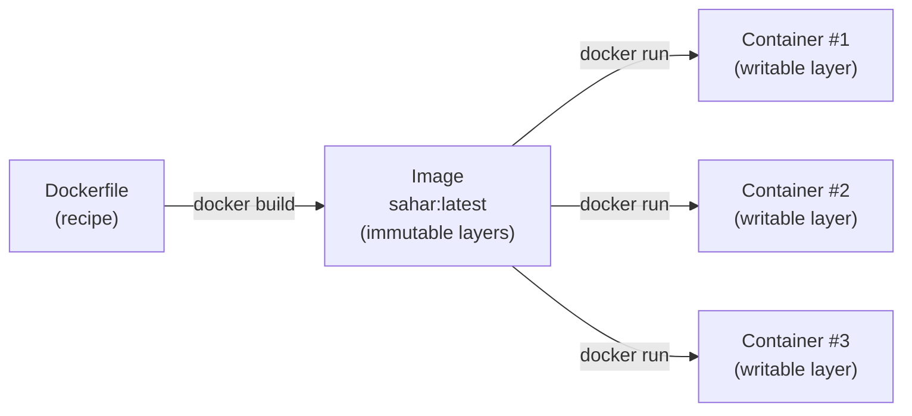
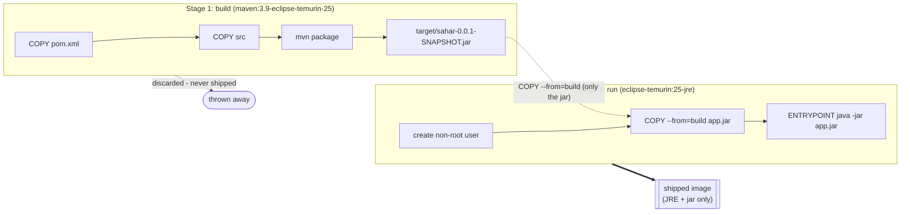
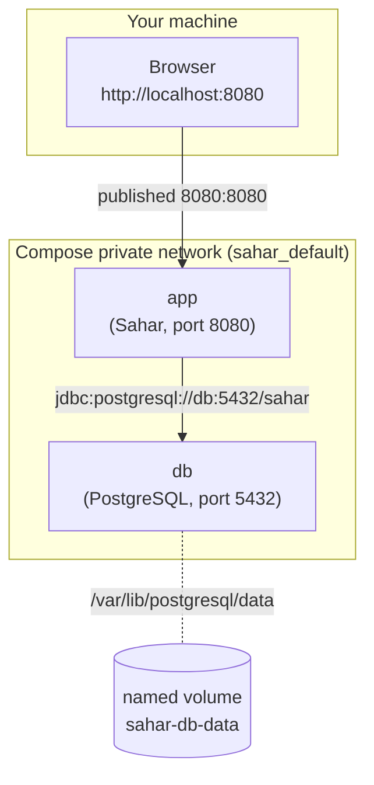
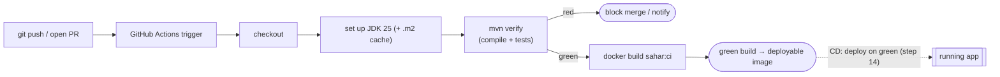

# Containers and DevOps

> One-line summary: a container packages Sahar and *everything it needs to run* into one portable, immutable artifact; this page explains images vs containers, why they are portable (OCI), Docker vs Podman, layer caching, multi-stage builds, Compose for multi-service stacks, why Kubernetes exists (and why Sahar does not need it), and how CI/CD turns "it builds on my machine" into "it builds, tests, and ships on every push."

**What you will get from this page**

- A clear mental model of **image vs container** and why "it works on my machine" stops being a sentence anyone says.
- Why an image built with Docker runs unchanged under Podman or Kubernetes: the **OCI** standard.
- How **image layers** and **build caching** make rebuilds fast, and how the Sahar `Dockerfile` is ordered to exploit that.
- Why Sahar uses a **multi-stage build** (a big image to *build*, a tiny image to *ship*).
- How `docker compose` declares the whole Sahar stack (app + PostgreSQL) in one file, including **service-name networking** and **volumes** for persistence.
- What **Kubernetes** solves and why it is overkill for a personal app.
- **CI/CD** in plain terms, mapped onto the actual Sahar GitHub Actions workflow.

This is theory. The hands-on steps are [step 11 — Dockerize](../steps/11-dockerize.md), [step 12 — Compose](../steps/12-compose.md), [step 13 — CI with GitHub Actions](../steps/13-ci-with-github-actions.md), and [step 14 — Deploy](../steps/14-deploy.md).

---

## 🎯 The problem containers solve

You ran Sahar locally and it worked. Then you tried to run it on a server and discovered: the server has Java 17, not Java 25; PostgreSQL is a different minor version; an environment variable you set in IntelliJ is missing; the working directory the app writes its H2 file into does not exist or is not writable. None of these are bugs in Sahar. They are bugs in the *gap between environments*.

A container closes that gap. Instead of shipping "the jar, plus a list of things the server must already have," you ship **the jar plus a frozen, minimal Linux userland that already has exactly the right JRE and exactly the right directory layout.** The thing you test is byte-for-byte the thing that runs in production. The phrase "works on my machine" loses meaning, because the machine *is* the artifact.

Crucially, a container is **not** a virtual machine. A VM ships a whole guest operating system and boots a kernel. A container shares the host kernel and isolates only the process tree, filesystem, and network using Linux primitives (namespaces and cgroups). That is why a container starts in well under a second and a Sahar image is tens of MB instead of gigabytes.

---

## 🔑 Images vs containers

This is the single most important distinction in the whole topic, and it trips up everyone at first.

| | Image | Container |
|---|---|---|
| What it is | A read-only **template** — a stack of filesystem layers plus metadata (entrypoint, env, exposed port) | A **running (or stopped) instance** of an image |
| Mutability | Immutable. Building again with the same inputs gives the same image | Has a thin writable layer on top; changes are discarded when it is removed |
| Analogy | A class, or an installer `.iso` | An object, or an installed-and-running program |
| Count | One image | Many containers from the same image, all isolated |
| Lifecycle verb | `build` | `run` / `start` / `stop` / `rm` |

You **build** an image once. You **run** it to get a container. You can run the *same* image ten times and get ten independent Sahar containers, each with its own writable layer, its own port mapping, its own environment.



A consequence worth internalising: **containers are disposable.** If a Sahar container writes its H2 database file into its own writable layer and you then `docker rm` the container, that data is gone. Persistence has to live somewhere outside the container — that is what *volumes* are for, covered below. The container being throwaway is a feature, not a hazard: it forces you to be explicit about what state actually matters.

---

## 🌐 Why images are portable: the OCI standard

You build Sahar's image with Docker on your laptop. Your friend runs it with Podman. A cloud platform runs it under Kubernetes. None of them re-build anything, and it just works. That interoperability is not luck — it is a written standard.

The **Open Container Initiative (OCI)** is a Linux Foundation project that publishes three specifications:

- **Image spec** — the exact on-disk/on-wire format of an image: how layers are stored, the manifest, the config (entrypoint, env, exposed ports).
- **Runtime spec** — how a runtime turns an unpacked image plus a config into a running container.
- **Distribution spec** — how images are pushed to and pulled from a registry (Docker Hub, GitHub Container Registry, etc.).

Because Docker, Podman, containerd, and Kubernetes all read and write **OCI images**, an image is a universal currency. "Build once, run anywhere a kernel and an OCI runtime exist" is the practical payoff. When the Sahar CI workflow runs `docker build -t sahar:ci .`, the resulting image is an OCI image; the deploy step (step 14) can hand that same image to a cloud runtime without rebuilding.

> Reference: the specs live at <https://opencontainers.org/>. You rarely read them, but knowing they exist explains *why* the tools below are interchangeable.

---

## ⚖️ Docker vs Podman

Both build and run OCI images. Both expose nearly identical command-line interfaces. The difference is architecture.

| | Docker | Podman |
|---|---|---|
| Architecture | A long-running background **daemon** (`dockerd`); the `docker` CLI talks to it | **Daemonless**; each `podman` command runs the container directly, no central service |
| Privilege | Daemon traditionally runs as root | **Rootless by default** — containers run as your user |
| CLI | `docker build`, `docker run`, `docker compose` | `podman build`, `podman run`, `podman compose` — deliberately the same verbs |
| Images | OCI | OCI (the *same* images) |

The daemonless, rootless model is Podman's headline security argument: there is no privileged daemon to compromise, and a container breakout lands the attacker as your unprivileged user rather than as root. Podman is close enough to a drop-in replacement that many people alias `docker=podman`.

For the Sahar codealong, **either tool works.** The steps are written with `docker`/`docker compose`; if you are on Podman, substitute `podman`/`podman compose`. The Dockerfile and compose file are unchanged because both consume the same standard formats. See the [Docker / Podman cheatsheet](../../reference/cheatsheet-docker-podman.md) for the command-by-command mapping.

> [!TIP]
> Tip from the Sahar Dockerfile: it runs as a **non-root user** regardless of which engine you use (`useradd ... sahar`, then `USER sahar`). That is defence in depth — even under root-daemon Docker, the *process inside* the container is not root.

---

## 🗂️ Image layers and build caching

An image is a **stack of layers**. Each instruction in a Dockerfile that changes the filesystem (`FROM`, `COPY`, `RUN`) produces a new layer on top of the previous ones. Layers are content-addressed and read-only; the final image is all the layers merged (a "union" filesystem) plus metadata.

Two big benefits fall out of this:

1. **Sharing.** Two images that both start `FROM eclipse-temurin:25-jre` physically share that base layer on disk and over the network. You download the JRE layer once.
2. **Caching.** When you rebuild, the builder walks the Dockerfile top to bottom. For each instruction it checks: *did the inputs to this layer change?* If not, it reuses the cached layer and moves on. **The first instruction whose inputs changed invalidates that layer and everything below it** — but everything above is reused instantly.

That cache-invalidation rule is *the* reason Dockerfile instruction order matters. Look at how the Sahar build stage is sequenced:

```dockerfile
# Copy the pom first and resolve dependencies on its own layer. Because Docker caches layers and only
# rebuilds from the first changed line down, editing Java source does NOT re-download dependencies.
COPY pom.xml .

COPY src ./src
RUN --mount=type=cache,target=/root/.m2 mvn -B -ntp -DskipTests clean package
```

The `pom.xml` is copied **before** the source. Your dependencies change rarely; your Java source changes constantly. By putting the rarely-changing thing on an earlier layer, a normal code edit invalidates only the `COPY src` layer and below — the (potentially large) dependency-download work above it stays cached. If you copied everything in one `COPY . .`, *every* edit would bust the cache and re-resolve dependencies.

There is a second, subtler optimisation in that `RUN`:

```dockerfile
RUN --mount=type=cache,target=/root/.m2 mvn -B -ntp -DskipTests clean package
```

`--mount=type=cache,target=/root/.m2` is a **BuildKit cache mount.** It keeps Maven's `~/.m2` download cache *between builds* without baking it into a layer. So even on a clean rebuild that does invalidate the dependency layer, Maven re-uses already-downloaded artifacts. This is a build-time cache only — it is **not** part of the final image, which keeps the shipped image small. (BuildKit is enabled by the `# syntax=docker/dockerfile:1` line at the top of the file.)

---

## 🏗️ Multi-stage builds: build image vs run image

Here is the tension. To *build* Sahar you need a full JDK and Maven — together, hundreds of MB of compiler, build tool, and downloaded plugins. To *run* Sahar you need only a JRE and the jar. You do not want to ship the compiler to production: it bloats the image, slows pulls, and widens the attack surface (every tool in the image is something an attacker could use).

A **multi-stage build** resolves this. You declare more than one `FROM`. Early stages do the heavy work; the final stage starts from a clean, minimal base and copies in *only the artifacts it needs* from earlier stages. Everything else — compiler, Maven, intermediate files — is left behind.



The whole Sahar `Dockerfile`, annotated:

```dockerfile
# syntax=docker/dockerfile:1

# ---- Stage 1: build ---------------------------------------------------------
# Full JDK + Maven. Used only to compile and package; thrown away after.
FROM maven:3.9-eclipse-temurin-25 AS build
WORKDIR /app
COPY pom.xml .
COPY src ./src
RUN --mount=type=cache,target=/root/.m2 mvn -B -ntp -DskipTests clean package

# ---- Stage 2: run -----------------------------------------------------------
# A slim JRE - no compiler, no Maven. The shipped image is a fraction of the build image's size.
FROM eclipse-temurin:25-jre AS run
WORKDIR /app

# Create a non-root user. If the container is ever compromised, the attacker is not root.
RUN useradd --system --no-create-home --uid 10001 sahar

# Copy ONLY the built jar out of the build stage. Nothing else from stage 1 comes along.
COPY --from=build /app/target/sahar-0.0.1-SNAPSHOT.jar app.jar

# Make /app (the jar AND the ./data folder the default H2 file needs) writable by our user, then drop to it.
RUN mkdir -p /app/data && chown -R sahar:sahar /app
USER sahar

# Document the port the app listens on (this does not publish it - `-p` at run time does).
EXPOSE 8080

# All configuration comes from the environment (12-factor), e.g.:
#   -e SPRING_PROFILES_ACTIVE=postgres
#   -e SAHAR_DB_URL=jdbc:postgresql://db:5432/sahar -e SAHAR_DB_USERNAME=sahar -e SAHAR_DB_PASSWORD=...
ENTRYPOINT ["java", "-jar", "app.jar"]
```

Things to notice, beyond the staging:

- **`AS build` / `AS run`** name the stages so `COPY --from=build` can reach back into the build stage's filesystem. Only the named path is copied — the JDK and Maven do not come along.
- **`EXPOSE 8080`** is documentation, not action. It records which port the app listens on. It does **not** publish anything; publishing happens at run time with `-p 8080:8080` (or in Compose, the `ports:` key).
- **Configuration via environment, not baked in.** The image contains no database password, no profile choice. That is the [twelve-factor](https://12factor.net/config) principle: the *same* image runs against H2 locally (no env set) or PostgreSQL in production (`SPRING_PROFILES_ACTIVE=postgres` plus the `SAHAR_DB_*` vars). One artifact, many environments — exactly the portability promise, now extended to config. (See [step 09 — Swap to PostgreSQL](../steps/09-swap-to-postgres.md) for where those profiles come from.)
- **Non-root user.** `useradd` then `USER sahar` means the JVM runs as uid 10001. The `chown` is necessary so that non-root user can create `./data` for the default H2 file.

> [!CAUTION]
> A note that will age: base image tags like `maven:3.9-eclipse-temurin-25` and `eclipse-temurin:25-jre` move forward over time. Pin to the versions your project targets and re-check the official tags at <https://hub.docker.com/_/eclipse-temurin> and <https://hub.docker.com/_/maven>.

---

## 🐳 docker compose: the whole stack in one file

A single container is enough for the H2 build of Sahar. But the realistic deployment has **two** services that must start in the right order and talk to each other: the Sahar app and a PostgreSQL database. Wiring that by hand (`docker network create`, two `docker run` commands with the right flags, waiting for the DB) is tedious and easy to get wrong.

`docker compose` lets you *declare* the stack in `docker-compose.yml` and bring it up with one command. Here is Sahar's, in full:

```yaml
services:
  db:
    image: postgres:17-alpine
    environment:
      POSTGRES_DB: sahar
      POSTGRES_USER: sahar
      POSTGRES_PASSWORD: sahar
    volumes:
      # Named volume -> Postgres data lives OUTSIDE the container, so it persists across restarts,
      # recreation, and image upgrades. Without it, `down` would wipe the database.
      - sahar-db-data:/var/lib/postgresql/data
    healthcheck:
      # Compose uses this to know when the DB is actually ready to accept connections, not just "started".
      test: ["CMD-SHELL", "pg_isready -U sahar -d sahar"]
      interval: 5s
      timeout: 3s
      retries: 10

  app:
    build: .                     # build the image from the Dockerfile in this folder
    depends_on:
      db:
        condition: service_healthy   # wait for the DB healthcheck before starting the app
    environment:
      SPRING_PROFILES_ACTIVE: postgres
      SAHAR_DB_URL: jdbc:postgresql://db:5432/sahar
      SAHAR_DB_USERNAME: sahar
      SAHAR_DB_PASSWORD: sahar
    ports:
      # hostPort:containerPort - open http://localhost:8080.
      - "${SAHAR_HOST_PORT:-8080}:8080"

volumes:
  sahar-db-data:
```

`docker compose up` builds the app image, starts Postgres, waits until the database is *healthy*, then starts the app pointed at it. `docker compose down` stops and removes the containers. Let us unpack the three concepts that make this work.

### Service-name networking

Compose creates a private network for the stack and gives every service a **DNS name equal to its service name.** So the app reaches the database at the hostname **`db`** — that is exactly what the connection URL says:

```
SAHAR_DB_URL: jdbc:postgresql://db:5432/sahar
                                 ^^
                                 the service name "db", resolved on the Compose network
```

No IP addresses, no `localhost`, no manually published ports between the two services. Inside the network, the database listens on `5432` and the app simply dials `db:5432`. The *only* port published to your laptop is the app's `8080`, via the `ports:` key. Postgres is reachable from the app but not from the outside world — a sensible default.



### Volumes for persistence

Recall that a container's writable layer dies with the container. PostgreSQL's data files live at `/var/lib/postgresql/data` *inside* the db container — so by default they would be wiped on `docker compose down`. The fix is a **named volume**:

```yaml
volumes:
  - sahar-db-data:/var/lib/postgresql/data
```

This mounts a Docker-managed volume named `sahar-db-data` over that path. The data now lives **outside** the container's lifecycle. You can `down` and `up` again, recreate the container, even upgrade the `postgres:17-alpine` image, and your tables survive. The bottom-level `volumes: sahar-db-data:` block declares the volume so Compose manages it.

### Ordering and readiness: `depends_on` + healthcheck

Starting the app before Postgres can accept connections gives you a crash on boot. `depends_on` with `condition: service_healthy` makes Compose **wait until the db's healthcheck passes** before launching the app. The healthcheck runs `pg_isready` on an interval; "started" is not the same as "ready," and this distinction is what stops the classic race condition. (Spring Boot's connection pool would retry, but failing fast and clearly beats a flaky startup.)

### Configurable host port without editing the file

```yaml
- "${SAHAR_HOST_PORT:-8080}:8080"
```

`${SAHAR_HOST_PORT:-8080}` means "use the `SAHAR_HOST_PORT` environment variable, or default to `8080`." If port 8080 is already taken on your machine, run `SAHAR_HOST_PORT=8086 docker compose up` and reach Sahar at `http://localhost:8086` — no file edit needed. The `:8080` after the colon is the container port and never changes.

> [!IMPORTANT]
> Modern Compose needs **no** top-level `version:` key — it is obsolete and current Compose warns about it. See <https://docs.docker.com/compose/>.

---

## 🧭 Why orchestration (Kubernetes) exists — and why Sahar does not need it

Compose is great for *one machine*. The moment you need many copies of a service across **many machines**, with automatic recovery and zero-downtime updates, you have crossed into **orchestration**, and the de-facto standard there is **Kubernetes**.

An orchestrator's job is to take a *desired state* ("run 5 replicas of this image, expose it here, keep it healthy") and continuously reconcile reality to match it. Concretely it provides:

| Capability | What it means | Why a single host can't do it |
|---|---|---|
| **Scheduling** | Decides which machine each container runs on, by available CPU/memory | You only have one machine |
| **Self-healing** | Restarts crashed containers; reschedules them if a whole node dies | A dead node takes your app with it |
| **Horizontal scaling** | Run N replicas; add/remove them by load | One container, one ceiling |
| **Rolling updates / rollback** | Replace old version with new gradually, no downtime; revert if unhealthy | Single container = a restart gap |
| **Service discovery & load balancing** | A stable virtual address fronting N changing replicas | One container needs none of this |

These are real problems — *at scale.* Sahar is a **personal app**: one user, modest traffic, one small server. It has no replicas to balance, no fleet to schedule across, no zero-downtime SLA. Adding Kubernetes would mean a control plane, networking layer, and a pile of YAML to babysit — vastly more operational surface than the app itself. The honest engineering call is: **a single container, or a two-service Compose stack on one host, is the right size.** Knowing what Kubernetes does is valuable precisely so you can recognise that Sahar is *below* the threshold where it pays off.

If you ever outgrow that — multiple users, high availability, several services — the OCI image you already built is exactly what a Kubernetes cluster would run. You would not rebuild Sahar; you would write deployment manifests around the same artifact. That is the portability story paying off again.

---

## 🔁 CI/CD: build/test/ship on every push

DevOps tooling above gives you a *reproducible artifact*. **CI/CD** gives you a *reproducible process* for producing and shipping it.

- **CI — Continuous Integration:** on every push (and pull request), an automated system checks out the code, builds it, and runs the tests, on a clean machine. The point is to catch "works on my machine, broken everywhere else" *immediately* and to keep the main branch always in a known-good ("green") state. The clean machine matters: it has none of your local config, so it surfaces hidden assumptions.
- **CD — Continuous Delivery/Deployment:** when CI is green, the artifact is automatically prepared for release, and (in Continuous *Deployment*) shipped to the running environment without a human gate.

The mantra: **CI = build + test on every push; CD = deploy on green.**

Sahar uses **GitHub Actions** — a *workflow* is a YAML file under `.github/workflows/` that GitHub runs on configured events. Here is Sahar's `ci.yml`:

```yaml
name: CI

on:
  push:
    branches: [ main ]
  pull_request:

jobs:
  build-app:
    runs-on: ubuntu-latest
    defaults:
      run:
        working-directory: app      # build the main application
    steps:
      - name: Check out the code
        uses: actions/checkout@v4

      - name: Set up JDK 25
        uses: actions/setup-java@v4
        with:
          distribution: temurin
          java-version: '25'
          cache: maven

      - name: Build and test app/
        run: mvn -B -ntp verify

      - name: Build the Docker image
        run: docker build -t sahar:ci .
```

Reading it top to bottom:

- **`on:`** — the triggers. This runs on every push to `main` and on every pull request. PRs get checked *before* merge, so broken code never reaches `main`.
- **`runs-on: ubuntu-latest`** — a fresh, throwaway Linux VM provisioned per run. No leftover state from a previous build.
- **`working-directory: app`** — the repo is a teaching monorepo (docs + checkpoints + the real `app/`); GitHub only runs workflows from the repo root, so this points the build at the real application.
- **`actions/checkout@v4`** — pulls the repository onto the runner.
- **`actions/setup-java@v4`** — installs Temurin JDK 25 (matching the pinned project Java) and, via `cache: maven`, caches `~/.m2` between runs so dependencies are not re-downloaded every time. This is the CI analogue of the Dockerfile's `.m2` cache mount.
- **`mvn -B -ntp verify`** — the **CI step proper.** `verify` compiles *and* runs the full test suite (the modular `spring-boot-starter-*-test` slices); a single failing test fails the whole job and turns the run red. `-B` (batch) and `-ntp` (no transfer progress) keep the logs clean.
- **`docker build -t sahar:ci .`** — proves the *image* builds too, not just the jar. A green run therefore guarantees: it compiles, the tests pass, **and** it containerises. That image is the deployable artifact.



This workflow is pure **CI** plus an image-build sanity check. Turning it into **CD** means adding a step that pushes the image to a registry and tells a host to run the new version once the build is green — which is the subject of [step 14 — Deploy](../steps/14-deploy.md). The pattern is the same regardless of target: *green build produces an OCI image; deployment runs that exact image.*

> [!NOTE]
> Action versions like `actions/checkout@v4` and `actions/setup-java@v4` are pinned major versions and will advance over time; check the official docs at <https://docs.github.com/actions> when revisiting.

---

## 🧵 The through-line

Every concept on this page is one idea applied at a different scale:

1. **Image** = the frozen, reproducible artifact (built via a cache-friendly, multi-stage `Dockerfile`).
2. **OCI** = the standard that makes that artifact portable across Docker, Podman, and Kubernetes.
3. **Compose** = declaring a small multi-service stack of those artifacts on one host, with service-name networking and volumes for the state that must survive.
4. **Kubernetes** = the same artifacts, but scheduled and self-healed across many hosts — power Sahar is correct to decline.
5. **CI/CD** = automation that rebuilds and re-tests that artifact on every change, and ships it when green.

Build the artifact once, ship the same artifact everywhere, automate the path between them. That is the whole game.

---

## 🔗 Related

- Step: [11 — Dockerize](../steps/11-dockerize.md) — write and build the Sahar `Dockerfile`.
- Step: [12 — Compose](../steps/12-compose.md) — bring up app + PostgreSQL with `docker compose`.
- Step: [13 — CI with GitHub Actions](../steps/13-ci-with-github-actions.md) — green build on every push.
- Step: [14 — Deploy](../steps/14-deploy.md) — turn a green build into a running app.
- Step: [09 — Swap to PostgreSQL](../steps/09-swap-to-postgres.md) — the `postgres` profile and `SAHAR_DB_*` config the container consumes.
- Reference: [Docker / Podman cheatsheet](../../reference/cheatsheet-docker-podman.md) — command-by-command, both engines.
- Theory: [Spring and dependency injection](./spring-and-di.md) — what is actually inside the jar the image runs.
- Repo: [README](../../README.md)
- Official docs: [Docker](https://docs.docker.com/) · [Podman](https://podman.io/) · [Compose](https://docs.docker.com/compose/) · [OCI](https://opencontainers.org/) · [GitHub Actions](https://docs.github.com/actions) · [Kubernetes](https://kubernetes.io/docs/) · [Twelve-Factor App](https://12factor.net/)
