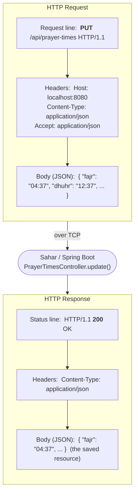

# HTTP and REST

> The vocabulary every Sahar endpoint speaks: HTTP methods, status codes, and the REST conventions that make `GET /api/prayer-times` and `POST /api/schedule` predictable.

**What you will get from this page**

- A concrete mental model of an HTTP request and response — method, path, query, headers, body, status — and how Spring maps each piece.
- The verbs (`GET`/`POST`/`PUT`/`PATCH`/`DELETE`), what they *mean*, and which Sahar endpoint uses each.
- Status code families, and exactly why Sahar returns `200`, `201`, `204`, `400`, and `404`.
- When to put data in the **path** vs the **query** vs the **body**.
- REST principles at a pragmatic level (resources, representations, statelessness, uniform interface) — enough to design good endpoints, not a thesis.
- **Safety** and **idempotency** — why you can retry a `PUT` but not a `POST` — with a table you can keep.
- How content negotiation and JSON work (`Content-Type`, `Accept`, Jackson 3).
- `curl` recipes you can paste against a running Sahar, including the exact `400` body you get on a validation failure.

This is theory you can act on. Every rule below is illustrated by a real Sahar controller. The *how* of writing those controllers lives in the step docs linked at the end.

---

## 1. What HTTP actually is

HTTP is a **request/response** protocol. A client (browser, `curl`, the Sahar admin UI's JavaScript) sends one request; the server sends back exactly one response; the conversation is over. The server does not "keep a line open" or remember you between requests (more on that under *statelessness*).

Every request says four things:

1. **A verb** — what kind of action ("read", "replace", "create", "delete").
2. **A path** (and optional query string) — *which thing* you are acting on.
3. **Headers** — metadata about the request (what format I am sending, what format I will accept).
4. **An optional body** — the payload, for verbs that carry one.

Every response says three things:

1. **A status code** — did it work, and if not, whose fault was it.
2. **Headers** — metadata about the response (what format the body is in).
3. **An optional body** — the payload.

### Anatomy of a request and response

Here is a real Sahar exchange — replacing the month's prayer times — with every part labelled.



The same exchange on the wire, roughly:

```http
PUT /api/prayer-times HTTP/1.1
Host: localhost:8080
Content-Type: application/json
Accept: application/json

{"fajr":"04:37","sunrise":"05:59","dhuhr":"12:37","asr":"17:12","maghrib":"19:13","isha":"20:36","methodNote":"ISNA"}
```

```http
HTTP/1.1 200 OK
Content-Type: application/json

{"fajr":"04:37","sunrise":"05:59","dhuhr":"12:37","asr":"17:12","maghrib":"19:13","isha":"20:36","methodNote":"ISNA"}
```

### How Spring maps each part

You almost never touch raw HTTP in Sahar. Spring's web layer (`spring-boot-starter-webmvc` in Boot 4 — note the rename from the old `spring-boot-starter-web`) parses the request and hands you typed Java. Here is the mapping, using `PrayerTimesController`:

```java
@RestController
public class PrayerTimesController {

    @GetMapping("/api/prayer-times")            // verb + path
    public PrayerTimes get() {                  // return value -> response body (JSON)
        return routine.getPrayerTimes();
    }

    @PutMapping("/api/prayer-times")            // verb + path
    public PrayerTimes update(@Valid @RequestBody PrayerTimes prayerTimes) {
        return routine.updatePrayerTimes(prayerTimes);   // @RequestBody = request body -> Java
    }
}
```

| HTTP part | Where it appears in Spring |
|---|---|
| Verb | `@GetMapping`, `@PutMapping`, `@PostMapping`, `@DeleteMapping` (and `@PatchMapping`) |
| Path | the string argument: `@GetMapping("/api/prayer-times")` |
| Path segment (variable) | `@PathVariable Long id` for `/api/schedule/{id}` |
| Query parameter | `@RequestParam` (Sahar's endpoints don't need any yet) |
| Request body | `@RequestBody PrayerTimes prayerTimes` (Jackson deserializes the JSON) |
| Response body | your `return` value (Jackson serializes it to JSON) |
| Status code | defaults to `200`; overridden with `@ResponseStatus(...)` |
| `Content-Type` / `Accept` | handled by content negotiation; you rarely set them by hand |

`@RestController` is the key: it means "every method's return value *is* the response body, serialized to JSON" — the mirror image of `@RequestBody` on the way in.

---

## 2. The verbs and what they mean

A verb is a promise about *intent*. The server is free to do what it likes, but well-behaved REST APIs honour the conventional meaning so that clients, caches, and proxies can reason about them.

| Verb | Conventional meaning | Has a request body? | Sahar example |
|---|---|---|---|
| `GET` | Read a resource. Must not change anything. | No | `GET /api/config`, `GET /api/prayer-times`, `GET /api/schedule` |
| `POST` | Create a new sub-resource, or run a process/command. | Usually | `POST /api/schedule` (create slot), `POST /api/block/roll-forward`, `POST /api/block/weeks` |
| `PUT` | Replace the resource at this URL with what I send. Full replacement. | Yes | `PUT /api/prayer-times`, `PUT /api/block`, `PUT /api/schedule/{id}`, `PUT /api/month`, `PUT /api/block/weeks/{ordinal}` |
| `PATCH` | Partially update a resource — apply a diff. | Yes | *Sahar does not use PATCH* (we replace whole resources) |
| `DELETE` | Remove the resource at this URL. | No | `DELETE /api/schedule/{id}`, `DELETE /api/block/weeks/{ordinal}` |

### Why PUT for prayer-times, but POST for creating a schedule slot?

This is the single most useful distinction to internalise, and Sahar's own code comments call it out.

`PUT /api/prayer-times` **replaces** the one prayer-times resource. The URL already names the thing; you are saying "make the resource at this URL equal to this body." Send it once or send it ten times — the end state is identical. That is a textbook `PUT`.

`POST /api/schedule` **creates** a new slot. There is no URL for the slot yet, because it doesn't exist and has no id. The server assigns the id. The `ScheduleItem` record carries `id` as `null` on the way in and populated on the way out:

```java
public record ScheduleItem(
        Long id,                                 // null when creating; the DB assigns it
        @NotBlank @Pattern(regexp = PrayerTimes.TIME, message = "time must be like 06:30") String time,
        @NotBlank(message = "title is required") String title,
        String detail,
        @NotBlank(message = "category is required") String category,
        String dayType
) {}
```

Call `POST /api/schedule` five times with the same body and you get five rows. That is exactly why `POST` is *not* idempotent — and exactly why creating things is a `POST`, not a `PUT`.

### Why roll-forward is a POST, not a PUT

`POST /api/block/roll-forward` is the "command" flavour of `POST`. It is not creating a thing at a known URL and it is not a pure read — it *runs a process* ("start next month's block from the template"). When an action doesn't map cleanly onto "replace this resource", `POST` is the honest choice. `BlockController` documents this directly:

```java
@PostMapping("/roll-forward")
public BlockPlan rollForward() {
    return routine.rollForward();
}
```

### Editing one named thing: PUT to its URL

When the thing already has a stable URL — like a specific week — editing it is a `PUT` to *that* URL, and the path variable identifies which one:

```java
@PutMapping("/weeks/{ordinal}")
public BlockPlan updateWeek(@PathVariable int ordinal, @Valid @RequestBody WeekUpdate update) {
    return routine.updateWeek(ordinal, update);
}

@DeleteMapping("/weeks/{ordinal}")
public BlockPlan dropWeek(@PathVariable int ordinal) {
    return routine.dropWeek(ordinal);
}
```

---

## 3. Status codes

The status code is the first thing a client reads. It comes in **families**, and the leading digit tells you whose problem it is.

| Family | Meaning | "Whose fault?" |
|---|---|---|
| `1xx` | Informational (rare in app code) | — |
| `2xx` | Success | It worked |
| `3xx` | Redirection ("look elsewhere") | — |
| `4xx` | Client error | *You* sent something wrong |
| `5xx` | Server error | *The server* broke |

The `4xx`/`5xx` split matters: a `4xx` means "don't retry the same request, it will fail again — fix your request." A `5xx` means "the server hiccuped — retrying might work."

### The codes Sahar actually returns

| Code | Name | When Sahar uses it |
|---|---|---|
| `200` | OK | The default success for `GET` and `PUT`. `GET /api/config`, `PUT /api/prayer-times` (returns the saved body). |
| `201` | Created | `POST /api/schedule` — a new slot was created; the body is the new resource *including* its assigned `id`. |
| `204` | No Content | `DELETE /api/schedule/{id}` — done, and there is deliberately nothing to send back. |
| `400` | Bad Request | A `@Valid @RequestBody` failed Bean Validation (e.g. `fajr` is `"7am"` not `04:37`). |
| `404` | Not Found | `PUT`/`DELETE /api/schedule/{id}` (or `/api/block/weeks/{ordinal}`) for an id/ordinal that doesn't exist. |

#### 200 vs 201 vs 204 — and how Spring sets them

By default a Spring controller method returns `200 OK`. You opt into a different code with `@ResponseStatus`. `ScheduleController` shows all three success codes in one file:

```java
@RestController
@RequestMapping("/api/schedule")
public class ScheduleController {

    @GetMapping
    public List<ScheduleItem> list() {              // 200 OK (default), body = the list
        return routine.listSchedule();
    }

    @PostMapping
    @ResponseStatus(HttpStatus.CREATED)             // 201 Created
    public ScheduleItem create(@Valid @RequestBody ScheduleItem item) {
        return routine.createScheduleItem(item);    // body = new item, id populated
    }

    @PutMapping("/{id}")
    public ScheduleItem update(@PathVariable Long id, @Valid @RequestBody ScheduleItem item) {
        return routine.updateScheduleItem(id, item); // 200 OK, body = updated item
    }

    @DeleteMapping("/{id}")
    @ResponseStatus(HttpStatus.NO_CONTENT)          // 204 No Content
    public void delete(@PathVariable Long id) {
        routine.deleteScheduleItem(id);             // void return -> empty body
    }
}
```

Note the deliberate design choices the controller's own Javadoc spells out: *"201 says 'created, here it is', 204 says 'done, nothing to return'."* `204` pairs naturally with a `void` method — there is no body, so there is nothing for Jackson to serialize.

A small, friendly convention worth copying: Sahar's `PUT`s **return the saved resource** in the body even though `200` doesn't require one. That saves the client a follow-up `GET`. `MetaController` even echoes back the new value:

```java
@PutMapping("/api/month")
public Map<String, String> updateMonth(@RequestBody MonthUpdate body) {
    return Map.of("month", routine.updateMonth(body.month()));  // {"month":"July 2026"}
}
```

#### 400 Bad Request — the validation failure

When you `PUT` a prayer time of `"7am"`, the `@Pattern` constraint on `PrayerTimes.fajr` fails. Spring throws `MethodArgumentNotValidException`, and Sahar's global handler turns it into a tidy `400`:

```java
@RestControllerAdvice
public class ApiExceptionHandler {

    public record ApiError(int status, String error, List<String> messages) {}

    @ExceptionHandler(MethodArgumentNotValidException.class)
    @ResponseStatus(HttpStatus.BAD_REQUEST)              // 400
    public ApiError handleValidation(MethodArgumentNotValidException ex) {
        List<String> messages = new ArrayList<>();
        for (FieldError fe : ex.getBindingResult().getFieldErrors()) {
            messages.add(fe.getField() + ": " + fe.getDefaultMessage());
        }
        for (ObjectError oe : ex.getBindingResult().getGlobalErrors()) {
            messages.add(oe.getDefaultMessage());        // e.g. the @DeloadLast rule
        }
        Collections.sort(messages);
        return new ApiError(400, "validation failed", messages);
    }
}
```

So a bad `PUT /api/prayer-times` returns exactly this body, with a `400` status:

```json
{
  "status": 400,
  "error": "validation failed",
  "messages": [
    "fajr: Fajr must be a 24-hour time like 04:37"
  ]
}
```

This is the contract: status code `400` *plus* a predictable body shape (`status`, `error`, `messages`) the admin UI can render. The full story of where these messages come from — including the class-level `@DeloadLast` rule that produces a *global* error rather than a field error — is in [step 05](../steps/05-validation-and-rules.md).

> **Why a `400` and not a `500`?** A malformed body is the *client's* mistake, so it belongs in the `4xx` family. Retrying the same bad body will fail the same way — the fix is to send valid data. Reserve `5xx` for "the server itself broke."

---

## 4. Where does the data go: path vs query vs body

Three places can carry data into a request. Choosing the right one is most of what "designing an endpoint" means.

| Carrier | Use it for | Visible in URL? | Sahar example |
|---|---|---|---|
| **Path** | Identifying *which* resource. Part of the resource's address. | Yes | `/api/schedule/{id}`, `/api/block/weeks/{ordinal}` |
| **Query** | Filtering, sorting, paging, optional modifiers on a read. | Yes | *(not used yet — e.g. a future `GET /api/schedule?dayType=weekend`)* |
| **Body** | The payload you are creating or replacing. | No | the `PrayerTimes` / `ScheduleItem` / `BlockPlan` JSON in a `PUT`/`POST` |

Rules of thumb:

- **Path = identity.** If removing the value would make the URL point at a different (or no) resource, it belongs in the path. `42` in `/api/schedule/42` *is* the address of slot 42. Pull it out with `@PathVariable Long id`.
- **Query = options on a read.** Query parameters tweak a `GET` without changing *what* resource you're addressing — `?dayType=weekend`, `?sort=time`. They're optional, order-independent, and great for filters. Spring binds them with `@RequestParam`.
- **Body = the content.** Anything large or structured that you're sending *to* the server — the new prayer times, the replacement block plan — goes in the body. Don't try to cram a JSON object into a query string.

A practical anti-pattern to avoid: **never put secrets or large blobs in the path or query.** URLs end up in browser history, server logs, and proxy logs. Bodies generally don't.

---

## 5. REST principles, pragmatically

REST is an architectural style, not a spec you can fail a unit test against. Four ideas carry almost all the value:

### Resources

Model your domain as **nouns** addressed by URLs, and let the *verb* express the action. Sahar's URLs are all nouns:

- `/api/config` — the whole routine
- `/api/prayer-times` — the prayer times (a single, "singleton" resource)
- `/api/schedule` — the collection of slots; `/api/schedule/{id}` — one slot
- `/api/block` — the training block; `/api/block/weeks/{ordinal}` — one week

You will *not* see `/api/getPrayerTimes` or `/api/deleteSchedule?id=5`. The verb lives in the HTTP method, never the URL. `GET /api/prayer-times` reads; `PUT /api/prayer-times` replaces. Same noun, different verbs.

### Representations

A resource is an abstract thing (the slot, the block). What travels on the wire is a **representation** of it — in Sahar, always JSON. The same `ScheduleItem` could in principle be represented as XML or CSV; we choose JSON. Crucially, the representation you `PUT` and the one you `GET` back share a shape, which is why round-tripping works.

### Statelessness

Each request carries everything the server needs to handle it. The server keeps no per-client conversational memory between requests — there is no server-side "session" that remembers you sent a `GET` a moment ago. State that must persist lives in the **database** (the `schedule_items`, `prayer_times`, `blocks` tables), not in server memory tied to a connection.

Why care? Statelessness is what lets you run two copies of Sahar behind a load balancer and have any request hit either one. It is also why your first in-memory version ([step 04](../steps/04-in-memory-edit.md)) had a subtle flaw — edits lived in one process's memory — that [step 06](../steps/06-jdbctemplate-h2.md) fixes by moving state to a database.

### Uniform interface

Every resource is manipulated through the *same small, predictable* set of operations: the HTTP verbs, applied consistently. Once you know that `GET` reads, `PUT` replaces, `POST` creates, and `DELETE` removes, you can guess how *any* Sahar endpoint behaves without reading its code. That uniformity is the whole point — `ScheduleController` and a brand-new `SupplementController` would look and behave alike.

---

## 6. Safety and idempotency

Two formal properties decide whether a client, a cache, or a retry-on-failure layer can act on a request without thinking.

- **Safe** = the request does not change server state. Safe requests can be cached and prefetched freely. `GET` is safe.
- **Idempotent** = sending the request *N* times leaves the same end state as sending it once. Idempotent requests can be **retried** safely after a network blip.

A safe method is automatically idempotent (doing nothing twice changes nothing). The interesting cases are the methods that *do* change state but are still idempotent.

| Verb | Safe? | Idempotent? | Why | Sahar |
|---|---|---|---|---|
| `GET` | ✅ | ✅ | Read only; changes nothing. | `GET /api/config` |
| `PUT` | ❌ | ✅ | "Set the resource to *this*." Twice = same final value. | `PUT /api/prayer-times` |
| `DELETE` | ❌ | ✅ | After the first delete it's gone; deleting again leaves it gone. | `DELETE /api/schedule/{id}` |
| `POST` | ❌ | ❌ | "Create a new one / run it again." Twice = two rows / two runs. | `POST /api/schedule` |
| `PATCH` | ❌ | ⚠️ Not guaranteed | A diff *can* be idempotent, but isn't required to be. | *(unused in Sahar)* |

### The retry test

The practical question idempotency answers is: *"My request timed out and I don't know if it landed. Can I just send it again?"*

- `PUT /api/prayer-times` — **yes, retry.** Worst case you set the same times twice; the end state is identical.
- `DELETE /api/schedule/42` — **yes, retry.** Slot 42 ends up gone either way. (Sahar returns `404` if the second attempt finds it already gone, which is a fine, honest answer.)
- `POST /api/schedule` — **no, do not blindly retry.** You might create a duplicate slot. The id mismatch (`null` in, real id out) is the structural reason this can't be idempotent: each call mints a new identity.

This is *the* reason creating uses `POST` and replacing uses `PUT`. It's not bureaucracy — it's what makes the API safe to operate over an unreliable network.

---

## 7. Content negotiation and JSON

How does the server know to send JSON, and how does it turn a `PrayerTimes` record into `{"fajr":"04:37",...}` and back? Two headers and one library.

### The two headers

| Header | Set by | Means |
|---|---|---|
| `Content-Type` | the **sender** | "The body I am sending is in *this* format." |
| `Accept` | the **client** | "Please reply in a format from *this* list." |

When the Sahar admin UI sends a `PUT`, it sets `Content-Type: application/json` so Spring knows to parse the body as JSON, and `Accept: application/json` so Spring knows to reply with JSON. Spring's **content negotiation** matches the client's `Accept` against the formats it can produce and picks one. With only JSON on the menu, that match is trivial — but the machinery is the same one that *could* serve XML if you added the right library.

### Jackson 3

The library that does JSON ↔ Java in Spring Boot 4 is **Jackson 3** (package `tools.jackson`, a change from Boot 3's Jackson 2 under `com.fasterxml.jackson`). You almost never call it directly. `@RestController` + `@RequestBody` wire it in:

- **Outbound:** your method returns a `PrayerTimes` record → Jackson serializes it to a JSON object whose keys are the record's component names (`fajr`, `sunrise`, …).
- **Inbound:** `@RequestBody PrayerTimes prayerTimes` → Jackson reads the JSON body and constructs the record. Records work cleanly here because their component names are the JSON keys.

That symmetry is why a `GET` then `PUT` round-trips: the JSON you read back has exactly the keys the `PUT` expects.

> **Version note:** the Jackson-3-on-`tools.jackson` detail is specific to Spring Boot 4 / Spring Framework 7. If you read older tutorials referencing `com.fasterxml.jackson`, they're describing Boot 3.x. See the [Spring Boot 4.0.6 reference](https://docs.spring.io/spring-boot/4.0.6/) for the current state.

---

## 8. curl recipes

Run Sahar locally (`./mvnw spring-boot:run`, default port `8080`) and try these. `-i` shows the response status line and headers; `-s` is quiet; `-X` sets the verb; `-d` sends a body.

**Read the whole config (`GET`, `200`):**

```bash
curl -s http://localhost:8080/api/config
```

**Read the prayer times (`GET`, `200`):**

```bash
curl -i http://localhost:8080/api/prayer-times
```

**Replace the prayer times (`PUT`, `200`, idempotent — run it twice, same result):**

```bash
curl -i -X PUT http://localhost:8080/api/prayer-times \
  -H "Content-Type: application/json" \
  -d '{"fajr":"04:37","sunrise":"05:59","dhuhr":"12:37","asr":"17:12","maghrib":"19:13","isha":"20:36","methodNote":"ISNA"}'
```

**Trigger a validation `400` (bad `fajr`):**

```bash
curl -i -X PUT http://localhost:8080/api/prayer-times \
  -H "Content-Type: application/json" \
  -d '{"fajr":"7am","sunrise":"05:59","dhuhr":"12:37","asr":"17:12","maghrib":"19:13","isha":"20:36"}'
```

```http
HTTP/1.1 400 Bad Request
Content-Type: application/json

{"status":400,"error":"validation failed","messages":["fajr: Fajr must be a 24-hour time like 04:37"]}
```

**Create a schedule slot (`POST`, `201` — note the body comes back *with* an `id`):**

```bash
curl -i -X POST http://localhost:8080/api/schedule \
  -H "Content-Type: application/json" \
  -d '{"time":"06:30","title":"Morning walk","detail":null,"category":"train","dayType":"weekday"}'
```

```http
HTTP/1.1 201 Created
Content-Type: application/json

{"id":9,"time":"06:30","title":"Morning walk","detail":null,"category":"train","dayType":"weekday"}
```

**Replace that slot (`PUT /{id}`, `200` — or `404` if the id doesn't exist):**

```bash
curl -i -X PUT http://localhost:8080/api/schedule/9 \
  -H "Content-Type: application/json" \
  -d '{"time":"06:45","title":"Morning walk","detail":"longer route","category":"train","dayType":"weekday"}'
```

**Delete the slot (`DELETE /{id}`, `204` — no body):**

```bash
curl -i -X DELETE http://localhost:8080/api/schedule/9
```

```http
HTTP/1.1 204 No Content
```

**Run a command-style POST (`POST /api/block/roll-forward`, `200`):**

```bash
curl -i -X POST http://localhost:8080/api/block/roll-forward
```

Want a one-screen lookup of verbs, codes, and `curl` flags? Keep the [HTTP & REST cheatsheet](../../reference/cheatsheet-http-rest.md) open beside you.

---

## Related

- [Step 02 — Your first REST endpoint](../steps/02-first-rest-endpoint.md) — `GET /api/config` and how `@RestController` returns JSON.
- [Step 04 — In-memory edit](../steps/04-in-memory-edit.md) — the first `PUT`, and why in-process state is fragile.
- [Step 05 — Validation and rules](../steps/05-validation-and-rules.md) — where the `400` body comes from, including the `@DeloadLast` global error.
- [Step 07 — Full CRUD](../steps/07-full-crud.md) — `ScheduleController` with all five verbs and their status codes.
- [Step 08 — Editable admin UI](../steps/08-editable-admin-ui.md) — the JavaScript client that sets `Content-Type`/`Accept` and consumes these endpoints.
- [HTTP & REST cheatsheet](../../reference/cheatsheet-http-rest.md) — dense, scannable reference for verbs, codes, and `curl`.
- [Spring Boot 4.0.6 reference](https://docs.spring.io/spring-boot/4.0.6/) — official docs for the web layer and Jackson 3.
- [README](../../README.md) — project overview and the full step index.
