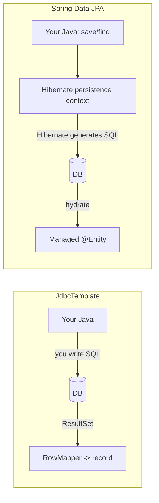

# JdbcTemplate vs Spring Data JPA

> A side-by-side of the two ways Spring teaches you to talk to a relational database, using real Sahar code as the JdbcTemplate side and a faithful sketch of the JPA side.

**What you will get from this page:** a concrete feel for what each approach actually makes you write, where the boilerplate goes, who controls the SQL, and the traps (especially N+1) you trade for convenience. By the end you should be able to say *out loud* why Sahar uses `JdbcTemplate` and when you would reach for JPA instead — not as dogma, but as an engineering call.

This is a comparison page, not a how-to. The how-to for `JdbcTemplate` lives in [step 06](../steps/06-jdbctemplate-h2.md). For the wider map of every persistence option Spring offers (raw JDBC, JdbcTemplate, JdbcClient, Spring Data JDBC, JPA/Hibernate, R2DBC, MyBatis), see [persistence-landscape.md](./persistence-landscape.md).

---

## TL;DR

| | JdbcTemplate | Spring Data JPA (Hibernate) |
|---|---|---|
| You write | SQL + a `RowMapper` | An `@Entity` + a `JpaRepository` interface |
| Who writes the SQL | **You** | **Hibernate**, from your method names / JPQL / the object graph |
| Mapping | Explicit, per column | Annotations on the entity; reflection at runtime |
| Relationships | You join / you do a second query | `@OneToMany` etc.; loaded lazily or eagerly |
| Schema | You own it (Flyway) | You own it (Flyway) **or** let `ddl-auto` generate it |
| Surprises | The SQL is right there; few | Lazy loading, N+1, flush timing, dirty checking |
| Lines of code for simple CRUD | More | Far fewer |
| Lines of code for a weird query | About the same | Sometimes *more* (fighting the abstraction) |
| Best at | Control, predictability, learning | Rich object graphs, rapid CRUD, big teams |

Sahar deliberately picks the left column. The rest of this page explains why that is a reasonable default for *this* app, and exactly what you would gain (and pay) by switching.

---

## The two mental models

The single most important difference is not syntax — it is *where the SQL comes from*.



- **JdbcTemplate** is a thin, helpful wrapper over plain JDBC. It opens connections, sets parameters, iterates the `ResultSet`, and closes everything — so you never write `try/catch/finally` plumbing — but *you* supply every SQL string and *you* turn each row into an object. There is no hidden cache, no "managed" object, no magic flush. What you call is what runs.

- **Spring Data JPA** is an abstraction *over* JPA, which is itself an abstraction (usually Hibernate) over JDBC. You describe your tables as annotated `@Entity` classes and your queries as *method names on an interface*. Hibernate generates the SQL, tracks loaded objects in a **persistence context**, and writes your changes back automatically when the transaction commits ("dirty checking"). Powerful, and occasionally spooky.

Keep that diagram in mind; almost every trade-off below falls out of it.

---

## A representative Sahar operation: the block and its weeks

Sahar's `BlockPlan` is an **aggregate** — one parent (`blocks` row) plus an ordered list of children (`weeks` rows). It is the most interesting shape in the app because it spans two tables, so it shows the relationship handling that JPA is famous for.

The domain types are plain Java records (no persistence annotations at all):

```java
@DeloadLast
public record BlockPlan(String label,
                        @NotEmpty @Size(min = 4, max = 5) @Valid List<Week> weeks) { }

public record Week(int ordinal, String name, String startDate, String endDate,
                   String trainingFocus, String backendFocus, boolean deload) { }
```

### The JdbcTemplate way (real Sahar code)

This is the actual `BlockRepository` from `win.l0ve.sahar.repo`:

```java
@Repository
public class BlockRepository {

    private static final RowMapper<Week> WEEK_MAPPER = (rs, rowNum) -> new Week(
            rs.getInt("ordinal"),
            rs.getString("name"),
            rs.getString("start_date"),
            rs.getString("end_date"),
            rs.getString("training_focus"),
            rs.getString("backend_focus"),
            rs.getBoolean("deload"));

    private final JdbcTemplate jdbc;

    public BlockRepository(JdbcTemplate jdbc) { this.jdbc = jdbc; }

    public BlockPlan find() {
        String label = jdbc.queryForObject("SELECT label FROM blocks WHERE id = 1", String.class);
        List<Week> weeks = jdbc.query(
                "SELECT * FROM weeks WHERE block_id = 1 ORDER BY ordinal", WEEK_MAPPER);
        return new BlockPlan(label, weeks);
    }

    /** Replace the whole block: set the label, wipe the weeks, re-insert them in order. */
    public void replace(BlockPlan block) {
        jdbc.update("UPDATE blocks SET label = ? WHERE id = 1", block.label());
        jdbc.update("DELETE FROM weeks WHERE block_id = 1");
        insertWeeks(block);
    }

    private void insertWeeks(BlockPlan block) {
        for (Week w : block.weeks()) {
            jdbc.update("""
                    INSERT INTO weeks
                        (block_id, ordinal, name, start_date, end_date, training_focus, backend_focus, deload)
                    VALUES (1, ?, ?, ?, ?, ?, ?, ?)
                    """,
                    w.ordinal(), w.name(), w.startDate(), w.endDate(),
                    w.trainingFocus(), w.backendFocus(), w.deload());
        }
    }
}
```

Read it once and you know *exactly* what hits the database: two `SELECT`s on read, and on replace an `UPDATE`, a bulk `DELETE`, then N `INSERT`s. The mapping is the `WEEK_MAPPER` — explicit, column by column. The "load parent then load ordered children" is two deliberate queries; there is no third query you didn't ask for.

Note the **replace** strategy: rather than diffing which weeks changed, Sahar wipes and re-inserts the children. That is honest about the aggregate — a `BlockPlan` is meaningful only as a whole — and the [service](../steps/06-jdbctemplate-h2.md) wraps it in `@Transactional` so a half-written block is never visible. This is the kind of decision JdbcTemplate forces you to make consciously.

### The Spring Data JPA way (sketch)

The same feature in JPA moves the work from the repository into **mapped entities**. Records can't be entities (Hibernate needs a no-arg constructor and mutable fields / proxies), so you'd introduce classes:

```java
@Entity
@Table(name = "blocks")
class BlockEntity {
    @Id
    private Long id;
    private String label;

    @OneToMany(mappedBy = "block", cascade = CascadeType.ALL, orphanRemoval = true)
    @OrderBy("ordinal")
    private List<WeekEntity> weeks = new ArrayList<>();

    // no-arg ctor, getters, setters (or Lombok) ...
}

@Entity
@Table(name = "weeks")
class WeekEntity {
    @Id @GeneratedValue
    private Long id;
    private int ordinal;
    private String name;
    @Column(name = "start_date") private String startDate;
    @Column(name = "end_date")   private String endDate;
    @Column(name = "training_focus") private String trainingFocus;
    @Column(name = "backend_focus")  private String backendFocus;
    private boolean deload;

    @ManyToOne @JoinColumn(name = "block_id")
    private BlockEntity block;
    // ...
}
```

The repository then becomes a one-line interface — Spring Data writes the implementation at startup:

```java
interface BlockJpaRepository extends JpaRepository<BlockEntity, Long> { }
```

And "load the block with its weeks" is:

```java
BlockEntity block = blockRepo.findById(1L).orElseThrow();
List<WeekEntity> weeks = block.getWeeks(); // ordered by @OrderBy
```

"Replace" becomes "mutate the managed entity and let dirty checking + `orphanRemoval` do the DELETE/INSERT for you":

```java
@Transactional
void replace(Long id, List<WeekEntity> newWeeks) {
    BlockEntity block = blockRepo.findById(id).orElseThrow();
    block.getWeeks().clear();          // orphanRemoval -> DELETEs
    newWeeks.forEach(w -> w.setBlock(block));
    block.getWeeks().addAll(newWeeks); // -> INSERTs on flush
    // no save() needed: a managed entity flushes at commit
}
```

Notice three things you traded:
1. There is far less code, but there is far more *implicit behaviour* (`cascade`, `orphanRemoval`, dirty checking, flush-at-commit). You must learn the rules to predict the SQL.
2. You added `id`/`@GeneratedValue` to `WeekEntity` and a back-reference (`@ManyToOne block`). Sahar's `weeks` table has no surface need for a synthetic per-week id — JPA's identity model wants one.
3. `block.getWeeks()` only works inside an open session. Outside it, you can get the dreaded `LazyInitializationException` (see below).

---

## A second operation: CRUD a schedule item

`ScheduleRepository` is plain CRUD over a single table — the case where JPA shines hardest. Here's the real Sahar `create`, which has to hand back the database-generated id:

```java
public ScheduleItem create(ScheduleItem item) {
    String dayType = item.dayType() == null ? "weekday" : item.dayType();
    KeyHolder keys = new GeneratedKeyHolder();
    jdbc.update(con -> {
        PreparedStatement ps = con.prepareStatement("""
                INSERT INTO schedule_items (slot_time, title, detail, category, day_type, sort_order)
                VALUES (?, ?, ?, ?, ?, 0)
                """, Statement.RETURN_GENERATED_KEYS);
        ps.setString(1, item.time());
        ps.setString(2, item.title());
        ps.setString(3, item.detail());
        ps.setString(4, item.category());
        ps.setString(5, dayType);
        return ps;
    }, keys);
    Long id = keys.getKey().longValue();
    return findById(id).orElseThrow();
}

public int update(Long id, ScheduleItem item) {
    return jdbc.update("""
            UPDATE schedule_items
               SET slot_time = ?, title = ?, detail = ?, category = ?, day_type = ?
             WHERE id = ?
            """, item.time(), item.title(), item.detail(), item.category(), item.dayType(), id);
}

public int delete(Long id) {
    return jdbc.update("DELETE FROM schedule_items WHERE id = ?", id);
}
```

That `KeyHolder` dance is the honest cost of generated keys in raw-ish JDBC. In JPA it disappears entirely:

```java
@Entity @Table(name = "schedule_items")
class ScheduleItemEntity {
    @Id @GeneratedValue(strategy = GenerationType.IDENTITY)
    private Long id;
    // slotTime, title, detail, category, dayType ...
}

interface ScheduleJpaRepository extends JpaRepository<ScheduleItemEntity, Long> {
    List<ScheduleItemEntity> findAllByOrderBySlotTimeAscIdAsc(); // derived query
}
```

```java
ScheduleItemEntity saved = repo.save(item);   // INSERT; id is populated on the entity
Long id = saved.getId();                       // no KeyHolder
repo.deleteById(id);                           // DELETE
List<ScheduleItemEntity> all = repo.findAllByOrderBySlotTimeAscIdAsc();
```

That `findAllByOrderBySlotTimeAscIdAsc()` is a **derived query**: Spring Data parses the *method name* into SQL at startup. No body, no string. For straight CRUD-by-id and simple filters, this is genuinely less code and fewer bugs — there is no SQL to typo and no `RowMapper` to keep in sync with the columns.

The flip side: the moment your query is interesting (Sahar's `ORDER BY slot_time, id` is already pushing the method-name DSL toward unreadable), you fall back to `@Query("...")` with JPQL, and you are writing query strings again — just in a second dialect you also have to learn.

---

## The N+1 trap (the JPA tax everyone eventually pays)

This is the single most important reason to understand what JPA does under the hood.

Suppose you list **all blocks** and print each block's week count. With the JPA entities above and lazy `@OneToMany`:

```java
for (BlockEntity b : blockRepo.findAll()) {   // 1 query: SELECT * FROM blocks
    System.out.println(b.getWeeks().size());    // +1 query PER block, on first touch
}
```

If there are 100 blocks, that's **1 + 100 = 101 queries** — the "N+1 select problem". Nothing in your code looks wrong; the extra 100 round-trips are emitted lazily by Hibernate the first time you touch `getWeeks()`. It is invisible until it's a production latency incident.

The fixes exist (`JOIN FETCH`, `@EntityGraph`, batch fetching, DTO projections) but they require knowing the trap is there and reaching past the convenient API:

```java
@Query("select b from BlockEntity b left join fetch b.weeks")
List<BlockEntity> findAllWithWeeks();
```

Now compare Sahar's JdbcTemplate: there *is no N+1*, because you can't accidentally fire a query. `BlockRepository.find()` runs exactly two SELECTs, always, and you can read that off the code. To list many blocks you would deliberately write one parent query and one `WHERE block_id IN (...)` children query and stitch them in Java — more code, zero surprises. **Predictability is the headline win of the left column.**

Related JPA surprises in the same family:
- **`LazyInitializationException`** — touching a lazy collection after the session closed (e.g. in a controller or a serializer). With records returned from JdbcTemplate, the object is already fully built; there is no session to close.
- **Flush timing / dirty checking** — JPA may write to the DB at times you didn't call `save()`. Convenient, until you're debugging *why* an UPDATE happened.
- **First-level cache returning stale-feeling objects** within a transaction.

None of these are *flaws* — they are the cost of the abstraction that also gives you the productivity. You just have to budget the learning for them.

---

## Migrations vs `ddl-auto`

Both approaches can (and in Sahar, do) use **Flyway** for versioned, reviewable schema migrations — `V1__init.sql`, `V2__seed.sql`, applied in order, tracked in `flyway_schema_history`. Owning your DDL as code is the same good idea regardless of how you read the rows.

JPA *additionally* tempts you with `spring.jpa.hibernate.ddl-auto`, which generates or updates the schema **from your entities**:

| `ddl-auto` value | Effect | Verdict |
|---|---|---|
| `none` | Hibernate touches nothing | Correct for real apps — let Flyway own the schema |
| `validate` | Boots only if entities match the existing schema | Useful safety net alongside Flyway |
| `update` | Alters tables to fit entities | Convenient in toy apps; **dangerous** in prod (silent, un-reviewed, no down path) |
| `create` / `create-drop` | Drops & recreates on startup | Tests / throwaway demos only |

The honest position: `ddl-auto=update` feels magical for the first week and becomes a liability the moment two people share a database or you need to know *what* changed. Sahar uses Flyway from [step 10](../steps/06-jdbctemplate-h2.md) precisely so the schema is explicit and version-controlled — that discipline is independent of JdbcTemplate vs JPA, and you should keep it if you adopt JPA later (`ddl-auto: validate` + Flyway is a fine combo).

---

## Boilerplate, honestly counted

A fair tally, not a hatchet job:

| Task | JdbcTemplate | JPA |
|---|---|---|
| `find by id` | a method + SQL + RowMapper | free (`JpaRepository`) |
| `save` / `delete` | a method + SQL | free |
| `findAll ordered` | one SQL string | a derived method name |
| Generated keys | `KeyHolder` boilerplate | free (`@GeneratedValue`) |
| One-to-many read | two explicit queries | one mapping + lazy/eager choice |
| A genuinely custom report query | write the SQL | write JPQL or native `@Query` (about the same) |
| Mapping a new column | edit the RowMapper + SQL | add a field |

So JPA wins decisively on *repetitive* CRUD and loses its edge on *bespoke* queries. The crossover point is roughly: the more your app is "many similar tables, mostly save/load by id, rich graphs," the more JPA pays off; the more it is "a handful of tables, hand-tuned reads, predictable writes," the more JdbcTemplate pays off.

---

## When each one wins

**Reach for JdbcTemplate when:**
- The schema is small and stable (Sahar: eight tables).
- You want **full control of the SQL** and to read latency straight off the code.
- **Predictable performance** matters more than typing speed — no hidden queries, no N+1.
- You are **learning the fundamentals** — SQL, transactions, the `ResultSet`, what a primary key and a join actually are. You can't hide from any of it, which is exactly the point in a teaching repo.
- The data is naturally relational/tabular rather than a deep object graph.

**Reach for Spring Data JPA when:**
- You have a **rich object graph** (orders → line items → products → categories) that you genuinely navigate as objects.
- You are **CRUD-heavy** across many tables and want to stop writing the same insert/update/select by hand.
- A **large team** benefits from a consistent, declarative repository style and less SQL to review.
- You want vendor-portable-ish querying and are willing to learn JPQL, fetch strategies, and the persistence-context model.
- Rapid iteration on the domain matters more than squeezing the query plan.

A pragmatic middle ground worth knowing: **Spring Data JDBC** and the newer **`JdbcClient`** give you repository ergonomics and a fluent API without Hibernate's persistence context — much of JPA's convenience, far fewer of its surprises. Those, plus R2DBC and MyBatis, are mapped out in [persistence-landscape.md](./persistence-landscape.md).

---

## Why Sahar uses JdbcTemplate (and where JPA fits)

Sahar is a teaching codealong, and the choice is pedagogical first:

1. **You see the SQL.** Every read and write in `BlockRepository` / `ScheduleRepository` is a string you wrote. When something is slow or wrong, the cause is on screen, not three layers down in Hibernate.
2. **No magic to un-learn later.** Once you understand `RowMapper`, transactions, generated keys, and "load parent then children," the JPA conveniences make sense *as conveniences* — you know what they're saving you from.
3. **The schema shape is honest.** Sahar's `BlockPlan` is a true aggregate written via wipe-and-reinsert under one `@Transactional`. That makes transaction boundaries, not annotations, the thing you reason about.
4. **The app is small.** Eight tables and mostly tailored reads sit squarely in JdbcTemplate's sweet spot; JPA's CRUD savings wouldn't pay for its learning cost here.

**JPA is on the [roadmap](../steps/99-roadmap.md)** — not because JdbcTemplate "ran out," but because re-implementing one slice (likely the block aggregate) as entities is the *best possible way to learn JPA*: you already know the exact SQL it should produce, so you can turn on `spring.jpa.show-sql=true`, watch Hibernate's queries, and immediately spot an N+1 or an extra UPDATE. Learning the abstraction *after* the fundamentals is the whole pedagogical bet of this repo.

> Rule of thumb: **learn JdbcTemplate to understand the database; reach for JPA to stop repeating yourself — once you can predict the SQL it will generate.**

---

## Related

- [Step 06 — JdbcTemplate + H2](../steps/06-jdbctemplate-h2.md) — the hands-on build of the repositories quoted here.
- [Step 99 — Roadmap](../steps/99-roadmap.md) — where the JPA re-implementation slice lives.
- [Theory — The persistence landscape](./persistence-landscape.md) — the full map: JDBC, JdbcTemplate, JdbcClient, Spring Data JDBC, JPA/Hibernate, R2DBC, MyBatis.
- [README](../../README.md) — project overview and the full step list.
