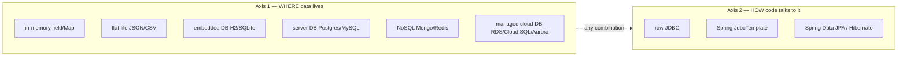
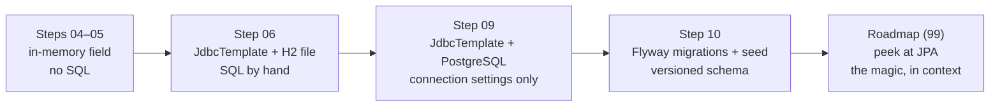

# The persistence landscape

> Where your data can live, how your code talks to it, and why Sahar deliberately starts in a field, graduates to a file-based H2 database, then to a PostgreSQL server — touching JPA only at the very end.

**What you will get from this page**

- A clear mental map of the *two independent questions* every app must answer about persistence: **where does the data physically live**, and **how does my code read and write it**.
- An honest comparison of storage options (in-memory, flat file, embedded DB, server DB, NoSQL, managed cloud DB) on the axes that actually decide the choice: cost, operational burden, concurrency, durability, scaling.
- An honest comparison of access styles (raw JDBC, Spring `JdbcTemplate`, Spring Data JPA / Hibernate) on the axes that bite you: control vs. boilerplate vs. magic.
- A precise explanation of **SQL vs. ORM** and the **N+1 query trap** — what it is, why ORMs cause it, how to spot it, how to fix it.
- The *pedagogy* behind Sahar's path: why we see the machinery before the magic.

This is a theory page. The hands-on versions live in the steps: [JdbcTemplate + H2](../steps/06-jdbctemplate-h2.md), [swap to Postgres](../steps/09-swap-to-postgres.md), [seed & migrations](../steps/10-seed-and-migrations.md).

---

## Two questions, not one

People say "I need a database" as if it were a single decision. It is two:

1. **Where does the data physically live?** (a Java field? a JSON file? a Postgres server in another container?)
2. **How does your code talk to that place?** (hand-written JDBC? `JdbcTemplate`? an ORM that writes the SQL for you?)

These axes are *independent*. You can read a Postgres server with raw JDBC, with `JdbcTemplate`, or with JPA. You can run JPA against embedded H2 or against managed Aurora. Mixing them up is the single most common source of confusion for engineers new to Spring, so we keep them apart for the whole page.



Sahar walks a deliberate diagonal: it starts at the cheap, simple corner of *both* axes (an in-memory field, no SQL at all), then moves one axis at a time so you only ever absorb one new idea per step.

---

## Axis 1 — Where the data lives

Sahar's job is to store one person's routine: a `RoutineConfig` aggregating `PrayerTimes`, a `BlockPlan` (weeks of training), a daily `ScheduleItem` timeline, `Supplement`s, `DietSection`s, and a `weekly_grid`. That data is tiny — kilobytes — but it must survive a restart and tolerate a couple of edits at once. Here is the full menu, and how each option scores on the things that decide the choice.

| Option | Where it lives | Durability (survives restart? crash?) | Concurrency | Scaling | Operational burden | Cost | Sahar verdict |
|---|---|---|---|---|---|---|---|
| **In-memory** (a field or `Map`) | RAM inside the JVM process | None — dies with the process | One JVM only; you hand-synchronize | Vertical only (bigger box) | Zero | Free | Steps 04–05 use exactly this |
| **Flat file** (JSON/CSV) | A file on disk | Survives restart; partial writes can corrupt it | Whole-file lock; no real concurrent writes | None | Low, but *you* write the read/write/locking code | Free | Tempting but a trap (see below) |
| **Embedded DB** (H2, SQLite) | A file (or RAM) driven by an in-process DB engine | Survives restart; real transactions and ACID | Limited but real — H2 file mode allows a 2nd connection | Vertical only | Almost zero — it's a library, no server to run | Free | Step 06: H2 **file** mode |
| **Server DB** (PostgreSQL, MySQL) | A separate process, often another machine/container | Full ACID; survives app crashes entirely independently | Many concurrent clients, row-level locking, MVCC | Vertical + read replicas | You run/patch/back up a server (or a container) | Free software; you pay for the box | Step 09: PostgreSQL 17 |
| **NoSQL document** (MongoDB) | A server storing schemaless JSON-ish docs | Full durability when configured | High; horizontal sharding | Horizontal (built in) | A server/cluster to operate | Free + infra, or managed | Overkill for one routine |
| **NoSQL key-value** (Redis) | Mostly in-memory server, optional disk | Optional/weaker by default (it's a cache first) | Extremely high throughput | Horizontal | A server to operate | Free + infra, or managed | Wrong tool — it's a cache, not a system of record |
| **Managed cloud DB** (RDS, Cloud SQL, Aurora) | A server *someone else operates* | Full ACID + automated backups, failover, point-in-time restore | Same as server DB, plus easy replicas | Vertical + replicas; Aurora autoscales storage | Lowest of all the *durable* options — the cloud runs it | Highest $$ — you pay for managed convenience | Where a real deploy of Sahar would land ([step 14](../steps/14-deploy.md)) |

### Reading the table the way an engineer should

- **Durability is the whole reason a routine app needs storage.** In step 05 you edit your prayer times, restart the app, and they vanish — the field was re-seeded from `RoutineSeed.defaultConfig()`. That's the limitation that motivates step 06. Anything from "embedded DB" down the table fixes durability.
- **Concurrency is rarely the deciding factor for a personal app**, but it teaches the right reflexes. Sahar's in-memory service guards writes anyway:

  ```java
  // RoutineService, step 05 — state is one field; writes are synchronized.
  private RoutineConfig config = RoutineSeed.defaultConfig();

  public synchronized RoutineConfig updatePrayerTimes(PrayerTimes prayerTimes) {
      config = config.withPrayerTimes(prayerTimes);
      return config;
  }
  ```

  A database hands you concurrency control for free (transactions, locking, MVCC) — you stop hand-rolling `synchronized`.
- **Operational burden is the hidden cost.** Embedded H2 has none — it's a JAR on the classpath; there is no server to install, start, secure, or back up. A PostgreSQL server is a *process you are now responsible for*. A managed cloud DB sells you back that responsibility. This is precisely why Sahar learns persistence on H2 first: you study transactions and SQL without also learning to run a database server on day one.

### Why not "just a JSON file"?

It's the obvious shortcut and it's a trap. To do flat files *correctly* you must hand-write: atomic writes (write to a temp file, fsync, rename) so a crash mid-write doesn't corrupt everything; file locking so two requests don't clobber each other; and your own query/filter/update logic for every read. An embedded database like H2 gives you durability, atomicity, concurrency, and a query language (SQL) — for less code than the file approach, because the hard parts are already written. So Sahar skips flat files entirely and goes from "a field" straight to "a real database that happens to be a file." That database is **H2 in file mode**:

```properties
# application.properties (step 06)
# A real database engine, persisting to ./data/sahar.mv.db — survives restarts.
spring.datasource.url=jdbc:h2:file:./data/sahar;AUTO_SERVER=TRUE
spring.datasource.username=sa
spring.datasource.password=
spring.datasource.driver-class-name=org.h2.Driver
```

`AUTO_SERVER=TRUE` even lets the [H2 console](https://docs.spring.io/spring-boot/4.0.6/) attach a second connection while the app runs (Boot 4 ships it as the `spring-boot-h2console` module). It is a genuine SQL database — it just lives inside your process instead of beside it.

### Embedded vs. server — the one distinction that matters most

| | Embedded (H2, step 06) | Server (PostgreSQL, step 09) |
|---|---|---|
| Lifecycle | Lives inside the app's JVM; dies with it | Separate process; outlives every app restart |
| Setup | A dependency on the classpath | Install/run a server (or `docker run postgres:17`) |
| Concurrent apps | One JVM | Many apps/users at once |
| Production-ready? | Great for dev, tests, demos | Yes — this is what you deploy |
| Sahar's switch cost | — | **Connection settings only — zero code change** |

The punchline of step 09 is that swapping engines costs *no Java*. Sahar puts Postgres behind a Spring **profile**, so only the properties differ:

```properties
# application-postgres.properties (step 09) — activated with --spring.profiles.active=postgres
# 12-factor: host/credentials come from the environment, with a local default after the colon.
spring.datasource.url=${SAHAR_DB_URL:jdbc:postgresql://localhost:5432/sahar}
spring.datasource.username=${SAHAR_DB_USERNAME:sahar}
spring.datasource.password=${SAHAR_DB_PASSWORD:sahar}
spring.datasource.driver-class-name=org.postgresql.Driver
```

Because Sahar's `schema.sql` is portable SQL (`GENERATED BY DEFAULT AS IDENTITY`, `BOOLEAN`), the *same* schema runs on both engines. That portability is not luck — it's a payoff of choosing `JdbcTemplate` and standard SQL on Axis 2, which is where we turn next.

---

## Axis 2 — How the code talks to the data

Once data lives in a SQL database, your Java code needs to send SQL and turn rows back into objects. There are three rungs on this ladder, from most control to most magic.

| Style | What *you* write | What the framework does | Control | Boilerplate | "Magic" | Sahar uses it? |
|---|---|---|---|---|---|---|
| **Raw JDBC** | Everything: open connection, prepare statement, set params, loop the `ResultSet`, close/`finally` everything | Nothing — it's the bare `java.sql` API | Total | Brutal | None | No (shown for contrast) |
| **`JdbcTemplate`** | The SQL + a tiny `RowMapper` (row → object) | Connections, pooling, statement prep, `ResultSet` looping, resource cleanup, exception translation | High — *you* own every query | Low | Almost none | **Yes — steps 06–08** |
| **Spring Data JPA / Hibernate** | An `@Entity` mapping + a repository *interface* (often zero method bodies) | Generates the SQL, manages a persistence context/cache, dirty-checking, lazy loading, change flushing | Low until you fight it | Lowest | High | Only **peeked at** ([roadmap](../steps/99-roadmap.md)) |

### Raw JDBC — the thing you should never write by hand twice

```java
// Raw JDBC: correct, durable, and exhausting. Note the try/finally resource dance.
List<ScheduleItem> items = new ArrayList<>();
String sql = "SELECT * FROM schedule_items ORDER BY sort_order, slot_time";
try (Connection c = dataSource.getConnection();
     PreparedStatement ps = c.prepareStatement(sql);
     ResultSet rs = ps.executeQuery()) {
    while (rs.next()) {
        items.add(new ScheduleItem(
            rs.getString("slot_time"), rs.getString("title"),
            rs.getString("detail"), rs.getString("category"), rs.getString("day_type")));
    }
}
// Plus: checked SQLException everywhere, manual transactions, no connection pooling.
```

Every database call needs that connection/statement/result-set choreography. Get the resource handling wrong and you leak connections until the pool starves. This is *boilerplate that is also dangerous*, which is exactly the kind of thing a framework should erase.

### `JdbcTemplate` — Sahar's choice

`JdbcTemplate` keeps the SQL in your hands but deletes the dangerous plumbing. Here is a real Sahar repository, unedited:

```java
// ScheduleRepository, step 06 — you write SQL + a RowMapper; JdbcTemplate does the rest.
private static final RowMapper<ScheduleItem> MAPPER = (rs, rowNum) -> new ScheduleItem(
        rs.getString("slot_time"), rs.getString("title"), rs.getString("detail"),
        rs.getString("category"), rs.getString("day_type"));

public List<ScheduleItem> findAll() {
    return jdbc.query("SELECT * FROM schedule_items ORDER BY sort_order, slot_time", MAPPER);
}

public void insertAll(List<ScheduleItem> items) {
    int order = 0;
    for (ScheduleItem it : items) {
        jdbc.update("""
                INSERT INTO schedule_items (slot_time, title, detail, category, day_type, sort_order)
                VALUES (?, ?, ?, ?, ?, ?)
                """,
                it.time(), it.title(), it.detail(), it.category(), it.dayType(), order++);
    }
}
```

No `Connection`, no `try/finally`, no leaked resources. `JdbcTemplate` borrows a pooled connection (Spring Boot auto-builds a HikariCP pool from `spring.datasource.*`), runs the statement, maps the rows, and returns them. The `?` placeholders are parameterized, so this is SQL-injection-safe by construction. You still *see and own* every query — which is the entire point for learning. When an aggregate spans two tables, you simply write two statements and (where it matters) wrap them in a transaction:

```java
// BlockRepository.replace(...) — block + its weeks live in two tables.
public void replace(BlockPlan block) {
    jdbc.update("UPDATE blocks SET label = ? WHERE id = 1", block.label());
    jdbc.update("DELETE FROM weeks WHERE block_id = 1");
    insertWeeks(block);          // re-insert children in order
}
```

```java
// RoutineService — @Transactional makes that 3-statement replace atomic.
@Transactional
public RoutineConfig updateBlock(BlockPlan block) {
    blocks.replace(block);       // if anything throws, the whole thing rolls back
    return getConfig();
}
```

That `@Transactional` is the moment a database earns its keep: a reader can *never* catch the block with half its weeks deleted. You could not get that guarantee from a JSON file without writing a transaction system yourself.

### Spring Data JPA / Hibernate — the magic, and its price

JPA flips the model. You describe your tables as annotated `@Entity` classes and declare a repository *interface*; Spring Data **generates the SQL and the implementation** at runtime. A method named `findByCategory(String category)` becomes a `SELECT ... WHERE category = ?` with no body. For large CRUD apps this is a massive win — far less code than even `JdbcTemplate`.

The price is **magic you must eventually understand**:

- **A persistence context (first-level cache)** tracks entities and **dirty-checks** them — changing a field on a loaded entity can silently emit an `UPDATE` at transaction commit. Powerful, but surprising if you don't know it's happening.
- **Lazy loading**: a collection isn't fetched until you touch it — which can fire a query at a moment you didn't expect, including *after* the transaction closed (the dreaded `LazyInitializationException`).
- **The SQL is generated**, so to debug a slow query you must reverse-engineer what Hibernate produced. That's a step removed from "read the query I wrote."

The most famous consequence is the N+1 problem.

---

## SQL vs. ORM, and the N+1 query trap

**SQL-first** (raw JDBC, `JdbcTemplate`): you think in tables and queries. **ORM-first** (JPA/Hibernate): you think in objects and the framework derives the queries. The trade is *expressiveness and control* (SQL) vs. *less code and a uniform object model* (ORM). Neither is "better"; they fail differently. The classic ORM failure is **N+1**.

### What it is

You load a list of N parent rows (**1** query). Then, for each parent, the ORM lazily loads its children — **N** more queries. One screen render = **N + 1** round trips to the database. With 50 parents that's 51 queries where 1 or 2 would do; over a network to a server DB, that's the difference between 3 ms and 300 ms.

### Why ORMs cause it (and SQL rarely does)

It's a side effect of lazy loading + object thinking. The code *looks* like a harmless in-memory loop, so nothing warns you that each `.getWeeks()` is a fresh `SELECT`:

```java
// JPA pseudo-code — looks innocent, secretly fires N+1 queries.
List<Block> blocks = blockRepo.findAll();          // 1 query: SELECT * FROM blocks
for (Block b : blocks) {
    for (Week w : b.getWeeks()) {                  // N queries: one SELECT weeks per block!
        render(w.getName());
    }
}
```

You'd never write that in SQL by accident, because in SQL the round trips are *visible* — you'd reach for a `JOIN` or a single `WHERE block_id IN (...)`. Sahar's `BlockRepository` reads a block in exactly **two** deliberate queries (the block, then all its weeks ordered by `ordinal`) and they never multiply with the number of weeks. That's N+1 made impossible by construction.

### How to spot it

- Turn on SQL logging (`spring.jpa.show-sql=true`, or log Hibernate at DEBUG) and watch identical `SELECT`s repeat in a tight burst.
- Watch query counts in dev tools or an APM; a count that grows linearly with rows on a list page is the tell.
- Latency that scales with row count rather than staying flat.

### How to fix it (in ORM land)

- A **fetch join**: `SELECT b FROM Block b JOIN FETCH b.weeks` — load parents and children in one query.
- An **entity graph** (`@EntityGraph`) to declare what to fetch eagerly for a given query.
- A **batch fetch** (`@BatchSize` / `hibernate.default_batch_fetch_size`) to collapse the N selects into a few `IN (...)` queries.
- Or drop to a projection / native query for that hot path.

The meta-lesson: every one of those fixes is you *reaching back toward the SQL you'd have written by hand*. Which is the whole reason Sahar teaches the SQL first.

---

## Why Sahar takes this exact path

Sahar moves one variable at a time so each step has exactly one new idea.



| Step | Axis 1 — where | Axis 2 — how | The one new idea |
|---|---|---|---|
| [04–05](../steps/04-in-memory-edit.md) | In-memory field | None (plain Java) | State, the service layer, validation — *no persistence noise* |
| [06](../steps/06-jdbctemplate-h2.md) | Embedded H2 (file) | `JdbcTemplate` + SQL | Durability, transactions, mapping rows ↔ records |
| [09](../steps/09-swap-to-postgres.md) | PostgreSQL server | `JdbcTemplate` (unchanged) | A real server DB — and that it's a *config* change, not a *code* change |
| [10](../steps/10-seed-and-migrations.md) | PostgreSQL server | `JdbcTemplate` + Flyway | Versioned, repeatable schema evolution (`V1`/`V2`) |
| [99](../steps/99-roadmap.md) | (any) | Spring Data JPA | What the magic *was hiding* — now that you can see through it |

**The pedagogy: machinery before magic.** If your first encounter with persistence is JPA, the database feels like a black box — you can't tell what's a feature, what's an optimization, and what's an N+1 footgun. By writing the SQL and the `RowMapper`s yourself in steps 06–08, you learn what a database actually *does*: connections, transactions, atomicity, rows mapping to objects. Then, when the roadmap finally peeks at JPA, you can see it for what it is — a code generator over the SQL you already understand. You'll know exactly what query it *should* produce, you'll recognize N+1 on sight, and you'll know how to drop back to `JdbcTemplate` for the queries you want to own. Magic is delightful once you've seen the trick; bewildering before.

A practical bonus of this path: because Sahar commits to standard SQL through `JdbcTemplate`, the **same** schema and the **same** repository code run unchanged on H2 (dev/tests) and PostgreSQL (deploy). Portability falls out for free — and it's the cleanest possible demonstration that Axis 1 and Axis 2 really are independent.

> A note on aging flags/versions: connection-pool and JPA defaults, and starter names, shift between Spring Boot minors. This page targets **Spring Boot 4.0.6 / Java 25 / PostgreSQL 17**. Always confirm property names and behavior against the [Spring Boot 4.0.6 reference](https://docs.spring.io/spring-boot/4.0.6/), and database specifics against the [PostgreSQL 17 docs](https://www.postgresql.org/docs/17/).

---

## Related

- Step: [JdbcTemplate + H2](../steps/06-jdbctemplate-h2.md) — Sahar's first real persistence.
- Step: [Swap to PostgreSQL](../steps/09-swap-to-postgres.md) — embedded → server, config-only.
- Step: [Seed & migrations](../steps/10-seed-and-migrations.md) — Flyway-managed schema evolution.
- Step: [Roadmap](../steps/99-roadmap.md) — where JPA gets its cameo.
- Theory: [JDBC vs. JPA](./jdbc-vs-jpa.md) — Axis 2 in depth.
- Theory: [Spring and dependency injection](./spring-and-di.md) — how repositories get wired in.
- Reference: [SQL & JDBC cheatsheet](../../reference/cheatsheet-sql-jdbc.md).
- [Spring Boot 4.0.6 reference](https://docs.spring.io/spring-boot/4.0.6/) · [PostgreSQL 17 docs](https://www.postgresql.org/docs/17/) · [Flyway docs](https://flywaydb.org/documentation/)
- [README](../../README.md)
