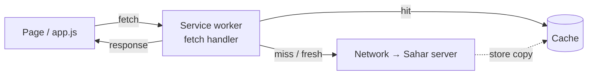

# What is a PWA? Manifest, service worker & offline caching

*A PWA is just your website — but one the browser lets you install to the home screen and keep using when the Wi-Fi drops.*

**What you will get from this page**

- A plain-language picture of what a **PWA** (Progressive Web App — a website that can be installed and run offline like a native app) actually is, and the *three* things a site needs to become one.
- What a **service worker** is — a background script the browser runs as a programmable network proxy — and how it intercepts requests.
- **Cache-first vs network-first**, and the precise reason Sahar caches the static *app shell* but never caches an API write.
- Why all of this is a **browser** standard that has nothing to do with Spring Boot — your backend just serves the files.
- Sahar's real `manifest.json` and `service-worker.js`, read line by line.

This is theory you can act on. The hands-on version — wiring these files into the app — is [step 16 — UI & PWA](../steps/16-ui-and-pwa.md).

---

## 💼 1. What is a PWA, really?

A **PWA** is not a new kind of app and not a framework. It is an ordinary website that has crossed three thresholds, after which the browser starts treating it more like a native app:

- the user can **install** it (an "Add to Home Screen" prompt, a real icon, its own window with no address bar);
- it keeps **working offline**, or on a flaky connection, instead of showing the dinosaur error page;
- it *feels* like an app — full screen, themed, fast on the second load.

The "progressive" part means it **enhances gracefully**: in a browser that supports installation, the user gets the app experience; in one that doesn't, the exact same URL still loads as a normal website. You never ship two versions.

> [!TIP]
> A PWA is a *spectrum*, not a switch. Sahar is a website first; the PWA features are a thin layer on top. Open it in any browser and it just works — install it and it works better.

---

## 🧱 2. The three requirements

To be installable and offline-capable, a site needs exactly three things. Sahar has all three.

| # | Requirement | What it is | Sahar's version |
| --- | --- | --- | --- |
| 1 | **Web app manifest** | A small JSON file describing the app: name, icons, colours, how it should open. | [`manifest.json`](../../checkpoints/step-16-ui-and-pwa/src/main/resources/static/manifest.json) |
| 2 | **Service worker** | A background script that can serve responses offline (see §4). | [`service-worker.js`](../../checkpoints/step-16-ui-and-pwa/src/main/resources/static/service-worker.js) |
| 3 | **HTTPS** | The page must be served over a secure connection (the encrypted, padlock version of HTTP). | Cloud Run gives Sahar HTTPS for free; `localhost` is trusted too. |

That third one trips people up, so it gets its own note.

> [!WARNING]
> Service workers (and the Geolocation API the location picker uses) **only run over HTTPS** — with one deliberate exception: `localhost` is always treated as secure, so you can develop without a certificate. Deploy to `http://` and the service worker silently refuses to register. This is a hard browser rule, not a Sahar choice.

---

## 📄 3. The manifest — describing the app

The **web app manifest** (a JSON metadata file the browser reads) is what turns "a tab" into "an installable app". It answers the browser's questions: what is this called, what icon do I pin, what colour is the window, how should it open?

Here is Sahar's, from the checkpoint — short on purpose:

```json
{
  "name": "Sahar — recover, build, fight",
  "short_name": "Sahar",
  "description": "Your training, prayer and nutrition routine.",
  "start_url": "/",
  "scope": "/",
  "display": "standalone",
  "background_color": "#0d1117",
  "theme_color": "#0d1117",
  "icons": [
    { "src": "/icon-192.png", "sizes": "192x192", "type": "image/png", "purpose": "any" },
    { "src": "/icon-512.png", "sizes": "512x512", "type": "image/png", "purpose": "any" },
    { "src": "/icon.svg", "sizes": "any", "type": "image/svg+xml", "purpose": "maskable" }
  ]
}
```

Reading it field by field:

- **`name` / `short_name`** — the full title, and the short one shown under the home-screen icon where space is tight.
- **`start_url`** — the page that opens when the icon is tapped (`/`, the home page).
- **`scope`** — which URLs count as "inside the app" (`/`, i.e. everything). Navigate outside the scope and the browser hands you back to a normal tab.
- **`display: "standalone"`** — open in its own window with **no browser address bar**, so it looks like a native app (other values include `browser` and `fullscreen`).
- **`theme_color` / `background_color`** — the colour of the toolbar/status bar, and of the blank screen shown while the app loads. `#0d1117` is Sahar's dark background, so launching feels seamless.
- **`icons`** — the home-screen icons. Providing a `192` and a `512` PNG covers phones and splash screens; the `maskable` SVG lets the OS crop the icon into whatever shape it likes (circle, squircle) without clipping content.

> [!NOTE]
> The manifest only has to be linked from your HTML (`<link rel="manifest" href="/manifest.json">`) and served with a JSON content type. It is plain static data — there is **no code** in it. All the *behaviour* lives in the service worker.

---

## ⚙️ 4. The service worker — a programmable network proxy

This is the heart of the PWA, so go slowly.

A **service worker** is a JavaScript file the browser runs **in the background**, separate from any page — it keeps running (or wakes up) even when no tab of your site is open. Its superpower is that it sits **between your web pages and the network**, like a checkpoint every request must pass through. That position is called a **network proxy** (a middleman that intercepts requests and can answer them itself, forward them, or modify them).



Every `fetch` the page makes is handed to the service worker first. It decides: answer from the **cache**, go to the **network**, or some mix. Because *you* write that decision, you control exactly what works offline.

A service worker has a small **lifecycle** — three events you handle:

| Event | When | What Sahar does |
| --- | --- | --- |
| **`install`** | First time the browser sees this worker (or a changed one). | Pre-fetch the app shell into the cache. |
| **`activate`** | After install, when the new worker takes over. | Delete *old* caches so stale files don't linger. |
| **`fetch`** | Every network request the page makes. | Apply the cache-first / network-first rules. |

> [!IMPORTANT]
> A service worker **cannot touch the page's DOM** (the live HTML on screen). It is a request interceptor, not a script that runs inside the page. It also runs only over HTTPS (or `localhost`). Keep its single job in mind: decide where each response comes from.

---

## 🗂️ 5. The app shell, and cache-first vs network-first

Two caching strategies matter, and the whole design hinges on choosing the right one per request.

- **Cache-first** — look in the cache first; only hit the network if it's missing. *Fast and offline-proof*, but can serve stale content. Right for files that rarely change.
- **Network-first** — go to the network first; fall back to the cache only if offline. *Always fresh when online*, still usable offline. Right for data that changes.

The trick is knowing which files are which. That's the **app shell** idea: the *shell* is the static skeleton of the UI — the HTML, CSS, JavaScript, and icons that make up the frame of the app, and that almost never change between visits. The *content* — your prayer times, your weekly board — is the data that fills the shell in, and it *does* change.

So the rule writes itself:

- **App shell → cache-first.** It's static; cache it once and the UI loads instantly, even with no signal.
- **API data (`GET /api/*`) → network-first.** Fetch fresh when online; fall back to the last cached copy when offline so the app still shows *something*.

> [!TIP]
> The shell is what makes a PWA feel instant on the second load: the UI is already on the device, so there's nothing to download before the first paint — only the data has to arrive.

---

## 🚫 6. Why Sahar never caches a write

Here is the rule the brief cares about most, and the reasoning behind it.

The service worker only ever caches **`GET`** requests — reads. It explicitly **ignores writes** (`POST`, `PUT`, `DELETE`). Why never cache a write response?

- A write **changes server state** — "save these prayer times", "update this meal". The interesting thing about a write is the *effect on the database*, not the response body. Replaying a cached response would be meaningless; the change has to reach the server.
- The HTTP **Cache API is built for `GET`** and rejects non-`GET` requests as cache keys — trying to cache a `POST` is an error, not just a bad idea.
- Quietly "succeeding" a write from cache while it never reached the backend would be a **silent data-loss bug**: the user thinks they saved, but the server never heard about it.

So writes always go straight to the network. If you're offline, a write *fails* — loudly and correctly — instead of pretending to work.

> [!WARNING]
> Caching only ever makes **reads** faster or available offline. The moment a request *mutates* data, it must hit the server. "Cache the shell, never cache the write" is the one-line summary of Sahar's whole strategy.

---

## 🧩 7. Sahar's service worker, in full

Here is the real file from the checkpoint — [`service-worker.js`](../../checkpoints/step-16-ui-and-pwa/src/main/resources/static/service-worker.js). Cache name `sahar-v1`:

```javascript
const CACHE = 'sahar-v1';
const SHELL = [
    '/', '/index.html', '/styles.css', '/app.js',
    '/admin.html', '/admin.js',
    '/icon.svg', '/manifest.json'
];

self.addEventListener('install', (event) => {
    event.waitUntil(
        caches.open(CACHE).then((c) => c.addAll(SHELL)).then(() => self.skipWaiting())
    );
});

self.addEventListener('activate', (event) => {
    event.waitUntil(
        caches.keys()
            .then((keys) => Promise.all(keys.filter((k) => k !== CACHE).map((k) => caches.delete(k))))
            .then(() => self.clients.claim())
    );
});

self.addEventListener('fetch', (event) => {
    const req = event.request;
    if (req.method !== 'GET') return; // never cache writes (PUT/POST/DELETE)
    const url = new URL(req.url);

    if (url.pathname.startsWith('/api/')) {
        // network-first: fresh online, cached fallback offline
        event.respondWith(
            fetch(req)
                .then((res) => {
                    const copy = res.clone();
                    caches.open(CACHE).then((c) => c.put(req, copy));
                    return res;
                })
                .catch(() => caches.match(req))
        );
    } else {
        // cache-first for the static shell
        event.respondWith(
            caches.match(req).then((cached) =>
                cached || fetch(req).then((res) => {
                    const copy = res.clone();
                    caches.open(CACHE).then((c) => c.put(req, copy));
                    return res;
                })
            )
        );
    }
});
```

Walking the three handlers:

- **`install`** opens the cache named `sahar-v1` and `addAll`s the eight `SHELL` URLs — pre-loading the whole shell in one go. `skipWaiting()` tells a freshly-installed worker to take over immediately instead of waiting for every old tab to close.
- **`activate`** lists every cache, keeps the current `sahar-v1`, and **deletes the rest**. This is why you *bump the cache name* (e.g. to `sahar-v2`) when you ship new shell files: the new worker installs the new shell under the new name, then wipes the old one. `clients.claim()` lets it control already-open pages right away.
- **`fetch`** is the proxy. The very first line — `if (req.method !== 'GET') return;` — is §6 in code: a non-`GET` request is left entirely alone, straight to the network, never cached. Then `GET /api/*` takes the **network-first** branch (fetch, stash a copy, fall back to cache on failure), and everything else — the shell — takes the **cache-first** branch (serve the cached copy if present, otherwise fetch and cache it).

> [!NOTE]
> Notice what's *not* here: a single line of Java, Spring, or backend anything. This file is pure browser JavaScript, governed by web standards (the Service Worker and Cache APIs). Sahar's Spring Boot backend only ever **serves** `service-worker.js` and `manifest.json` as ordinary static files from `src/main/resources/static` — exactly the way it serves any HTML or CSS, as you saw in [step 01 — serve static](../steps/01-serve-static.md). The PWA behaviour is identical whether the backend is Spring, Node, or a plain file server. (These are also browser-version concerns, not the Boot 4 / Spring 7 / Java 25 / `jakarta` / Jackson 3 modernisation you meet elsewhere in the course — that whole story lives on the server side and is irrelevant to the service worker.)

---

## 💼 8. Q&A — quick answers you can say out loud

**Q: What makes a website "installable"?**
Three things together: a linked **web app manifest** (name, icons, `display`, colours), a registered **service worker** that can serve the app offline, and the site being served over **HTTPS** (or `localhost`). Hit all three and the browser offers an "Add to Home Screen" prompt and opens the app in its own window.

**Q: What is a service worker?**
A background JavaScript file the browser runs separately from any page, sitting between your pages and the network as a **programmable proxy**. It intercepts every `fetch` and decides whether to answer from cache or the network, which is what makes offline use possible. It can't touch the page's DOM and only runs over HTTPS/`localhost`.

**Q: Why never cache a `POST`/`PUT` response?**
Because a write's job is to **change server state**, not to return a reusable body — replaying a cached write response is meaningless, and "succeeding" a save that never reached the backend is silent data loss. (The Cache API also only accepts `GET` requests as keys.) So Sahar's worker bails out on the first line for any non-`GET` request: writes always go to the network, and offline they fail honestly rather than pretending to work.

---

## 🔗 Related
- [16 — Location picker, UI & PWA](../steps/16-ui-and-pwa.md) · [17 — Visual polish](../steps/17-visual-polish.md)
- [How a web app works](../foundations/how-a-web-app-works.md)
- [Interview-prep](../../reference/interview-prep.md) · ⬆️ [README](../../README.md)
