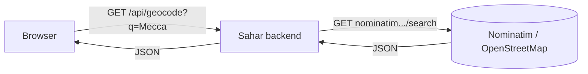

# Calling other services: RestClient vs RestTemplate vs WebClient

> Your backend is also a *client*: when Sahar needs a map lookup it calls OpenStreetMap, and the tool it reaches for is Spring's `RestClient`.

**What you will get from this page**

- *Why* a third-party API call belongs on the **server**, not in the browser — CORS, caching, rate limits, hiding keys, and sending an honest `User-Agent`.
- The three HTTP clients Spring ships — **RestClient**, **RestTemplate**, **WebClient** — what each is for, and a clear rule for picking one.
- How Sahar's `GeocodingService` builds a `RestClient`, and how [step 21](../steps/21-resilient-geocoder.md) hardens it with **timeouts**, **retry**, and a **Caffeine cache**.
- A version-comparison story so old tutorials (full of `RestTemplate`) don't confuse you.

This is the conceptual companion to two hands-on steps: [15 — geolocation & prayer times](../steps/15-geolocation-prayer-times.md) introduces the client; [21 — resilient geocoder](../steps/21-resilient-geocoder.md) makes it production-grade.

---

## 🌍 1. Your backend is a client too

So far Sahar has been a *server*: the browser asks, your controllers answer. But real apps also need data they don't own — a payment provider, a weather feed, a map service. When that happens your backend turns around and becomes a **client** of someone else's API.

Sahar's example is geocoding (turning a place name like "Mecca" into latitude/longitude, and back). It calls **Nominatim** — OpenStreetMap's free geocoding service (a service that converts between place names and coordinates). The call happens **server-side**: the browser asks *Sahar*, and Sahar asks Nominatim.



That extra hop is not laziness — it's the right design, and the next section says exactly why.

---

## 🛡️ 2. Why call a third-party API from the server, not the browser

It is tempting to let the browser's JavaScript call Nominatim directly and skip a hop. Resist it. Putting the call on the server buys you five concrete things.

- **No CORS wall.** CORS (Cross-Origin Resource Sharing — the browser rule that a page may only call an API on a *different* origin if that API opts in with headers) blocks browser-to-third-party calls unless the third party allows your origin. Many APIs don't. Server-to-server calls have no such rule — CORS is a *browser* policy only. (More on CORS in [the glossary](../../reference/glossary.md).)
- **Caching.** A server can remember an answer and reuse it. Sahar caches geocoding results so a repeated "Mecca" lookup never touches the network (see §6). A browser tab can't share a cache with the next visitor.
- **Rate-limit safety.** Nominatim's usage policy allows roughly **one request per second** for light use. From the server you can throttle and cache to stay under that ceiling; thousands of independent browsers cannot coordinate, and would get you blocked.
- **Hiding keys.** Many APIs need a secret key. Anything the browser sends is visible in DevTools, so a browser-side key is a *leaked* key. A server keeps the key in config the user never sees. (Nominatim needs no key — but the habit matters the moment you call an API that does.)
- **A reliable `User-Agent`.** Nominatim's policy *requires* callers to identify themselves with a `User-Agent` header (a header naming the calling application). The server sets one honest value for every call; browsers send their own and can't be trusted to comply.

> [!IMPORTANT]
> **The rule of thumb:** if a call needs a secret, a cache, retries, or polite rate-limiting, it belongs on the **backend**. The browser talks to *your* API; *your* API talks to the world. Sahar's `GeocodingService` is exactly that boundary.

---

## 🧰 3. The three Spring HTTP clients

Spring gives you three ways to make an outbound HTTP call. They are not three flavours of the same thing — they were born in different eras with different goals. Here is the whole landscape on one screen.

| Client | Style | Introduced | Status today | Reach for it when… |
| --- | --- | --- | --- | --- |
| **`RestClient`** | Synchronous, **fluent** (chained `.get().uri().retrieve()` calls) | Spring **6.1** / Boot **3.2** | **The modern default** | You want a clean, blocking client in a normal Spring MVC app — *this is Sahar's choice* |
| **`RestTemplate`** | Synchronous, template-method (lots of overloaded `getForObject(...)` methods) | Spring **3** (2010) | **Maintenance mode** — not deprecated, but no new features | You're maintaining old code; it's what most tutorials still show |
| **`WebClient`** | **Reactive**, non-blocking (returns `Mono`/`Flux`, from the WebFlux stack) | Spring **5** | Active, but reactive-first | You're on the reactive (WebFlux) stack, or need true non-blocking concurrency / streaming |

A little more on each:

**`RestClient` — the modern default.** A *synchronous* client (it blocks the calling thread until the response arrives) with a *fluent* API (you build the call by chaining short methods that read like a sentence). It's the spiritual successor to `RestTemplate` — same blocking simplicity, far nicer ergonomics — and the one to learn first.

**`RestTemplate` — the old guard.** For over a decade this was *the* way to call HTTP from Spring. It still works and is **not deprecated**, but it's in **maintenance mode**: it gets bug fixes, not new features. If you're following a tutorial written before late 2023, it almost certainly uses `RestTemplate`. Mentally translate it to `RestClient`.

**`WebClient` — the reactive one.** Born in Spring WebFlux (Spring's *reactive*, non-blocking web framework — an alternative to the classic servlet stack). It's *non-blocking*: instead of returning a `String`, it returns a `Mono<String>` (a promise of a value that arrives later) and frees the thread while waiting. Powerful for high-concurrency or streaming, but it pulls in the reactive programming model. **Sahar is a classic servlet (Spring MVC) app, so it does not need WebClient.**

> [!TIP]
> **Decision shortcut.** New code on the servlet stack → `RestClient`. Already deep in WebFlux, or need to fan out thousands of concurrent calls → `WebClient`. Touching legacy code → it's probably `RestTemplate`; leave it or migrate to `RestClient`. Sahar picks `RestClient` and never looks back.

---

## 🧪 4. How Sahar builds a RestClient

In [step 15](../steps/15-geolocation-prayer-times.md), `GeocodingService` builds its client through the **static factory** `RestClient.builder()` — no bean wiring, the service stays self-contained ([GeocodingService.java](../../checkpoints/step-15-geolocation-prayer-times/src/main/java/com/ramishtaha/sahar/service/GeocodingService.java)):

```java
this.client = RestClient.builder()
        .baseUrl("https://nominatim.openstreetmap.org")
        .defaultHeader("User-Agent", "Sahar/1.0 (https://github.com/ramishtaha/spring-boot-sahar)")
        .build();
```

Read the builder top to bottom: a **base URL** every request is relative to, and a **default header** (the polite `User-Agent` from §2) attached to every call. `.build()` hands back an immutable, reusable client you store in a `final` field.

> [!NOTE]
> Spring Boot also *auto-configures* a `RestClient.Builder` bean you can inject and customise. Sahar uses the static `RestClient.builder()` instead so the service has no extra wiring to explain — both reach the same `RestClient`.

Making a call reads almost like the HTTP request it sends:

```java
List<Map<String, Object>> raw = client.get()                 // verb
        .uri(b -> b.path("/search")                          // path under the base URL
                .queryParam("q", query)                      // ?q=Mecca
                .queryParam("format", "jsonv2")
                .queryParam("limit", 6)
                .build())
        .retrieve()                                          // execute, check status
        .body(new ParameterizedTypeReference<List<Map<String, Object>>>() {});  // parse JSON
```

The fluent chain is the whole appeal: `get()` picks the verb, `uri(...)` builds the path and query params safely (the `UriBuilder` URL-encodes them for you — no manual string-stuffing), `retrieve()` runs the call, and `body(...)` deserializes the JSON. The `ParameterizedTypeReference` is a small trick to keep the *generic* type `List<Map<String, Object>>` at runtime (Java erases generics otherwise), so Jackson knows the exact shape to build.

If anything fails (offline, rate-limited, garbage response), the step-15 version catches the exception and returns an empty list — search degrades to "no suggestions" rather than crashing the page.

---

## ⏱️ 5. Stopping a slow third party from hanging your threads

Here's a trap that bites every team eventually. Remember from [Spring & DI](./spring-and-di.md) that Tomcat handles each request on **one worker thread** from a fixed pool. A *synchronous* client like `RestClient` blocks that thread until the response comes back. So if Nominatim goes slow and you set **no timeout**, that thread waits… and waits. Enough hung calls and the whole pool is exhausted — now *every* Sahar request stalls, because of one sick dependency.

The fix is **timeouts**: a hard cap on how long you'll wait. [Step 21](../steps/21-resilient-geocoder.md) adds a connect timeout and a read timeout via a custom *request factory* (the object that actually opens the connection) ([GeocodingService.java](../../checkpoints/step-21-resilient-geocoder/src/main/java/com/ramishtaha/sahar/service/GeocodingService.java)):

```java
SimpleClientHttpRequestFactory factory = new SimpleClientHttpRequestFactory();
factory.setConnectTimeout(Duration.ofMillis(props.connectTimeoutMs()));  // 3000 ms
factory.setReadTimeout(Duration.ofMillis(props.readTimeoutMs()));        // 5000 ms

this.client = RestClient.builder()
        .baseUrl(props.baseUrl())
        .defaultHeader("User-Agent", props.userAgent())
        .requestFactory(factory)        // <- timeouts live on the request factory
        .build();
```

Two distinct timeouts, both worth knowing:

- **Connect timeout** — cap on establishing the TCP connection ("is anyone even answering?"). Sahar: 3 s.
- **Read timeout** — cap on waiting for the response *after* connecting ("they answered, but how long until the data arrives?"). Sahar: 5 s.

When a timeout fires, the call throws instead of hanging forever — which lets the **retry** logic step in. `GeocodingService` wraps each call in a small `withRetry(...)` loop that retries a couple of times (`sahar.geocoding.max-retries=2`) and, if every attempt fails, returns `null` so the caller can fall back gracefully (empty list for search, raw coordinates for reverse).

> [!WARNING]
> A `RestClient` with **no timeout** waits forever by default. On a blocking servlet stack that is how one slow dependency takes down a healthy app. Always set connect *and* read timeouts on any outbound call — it's the cheapest resilience you'll ever add.

The timeout values aren't hard-coded literals: they're bound from `sahar.geocoding.*` into a type-safe `GeocodingProperties` record ([GeocodingProperties.java](../../checkpoints/step-21-resilient-geocoder/src/main/java/com/ramishtaha/sahar/config/GeocodingProperties.java)), so you can tune them in `application.properties` without recompiling.

---

## 🗄️ 6. Why cache geocoding results

The same place gets looked up again and again — "Mecca" doesn't move. Calling Nominatim every single time would be slow, wasteful, and would burn through its ~1 req/sec budget for no reason. So step 21 **caches** answers: the first lookup hits the network, every repeat is served from memory.

Spring's cache abstraction makes this almost free. One annotation on the method does it ([GeocodingService.java](../../checkpoints/step-21-resilient-geocoder/src/main/java/com/ramishtaha/sahar/service/GeocodingService.java)):

```java
@Cacheable(cacheNames = "geocode", key = "#query", unless = "#result.isEmpty()")
public List<GeoResult> search(String query) { ... }
```

How to read it: `@Cacheable` means "before running this method, check the cache under `key`; if there's a hit, return it and skip the body entirely." The `key` is the query string, so each distinct search is cached separately. The `unless = "#result.isEmpty()"` clause refuses to cache an *empty* result — so a transient outage (which returns nothing) can't poison the cache with a bad "no results" answer that sticks around.

The cache itself is **Caffeine** (a fast in-memory Java caching library), auto-configured from `application.properties`:

```properties
spring.cache.type=caffeine
spring.cache.cache-names=geocode,reverse
spring.cache.caffeine.spec=maximumSize=500,expireAfterWrite=24h,recordStats
```

That spec caps the cache at 500 entries and **expires each after 24 hours** — fresh enough for place data, old enough to save almost every repeat call. Caching is switched on by a tiny `@EnableCaching` config class kept separate from the main app so test slices don't trip over it ([CacheConfig.java](../../checkpoints/step-21-resilient-geocoder/src/main/java/com/ramishtaha/sahar/config/CacheConfig.java)).

Why it's worth it, in one breath: **fewer network calls → faster responses, lower latency, and automatic respect for the rate limit.** Caching turns a polite-but-slow third party into something that feels instant.

> [!NOTE]
> **Version story — old tutorials vs Sahar.** The single biggest gotcha here is the *client*. Code from the **Boot 3.x / Spring 5–6** era (often on **Java 17**, the **`javax.*`** namespace, and **Jackson 2** under `com.fasterxml.jackson`) almost always uses **`RestTemplate`** — `restTemplate.getForObject(url, Type.class)`. Sahar is **Boot 4 / Spring 7 / Java 25**, with the **`jakarta.*`** namespace and **Jackson 3** (`tools.jackson`), so it uses the newer **`RestClient`** (`RestClient.builder()...retrieve().body(...)`) — synchronous like `RestTemplate` but fluent. `RestTemplate` still compiles in Boot 4; it's just in maintenance mode, so prefer `RestClient` for anything new. When a tutorial shows `RestTemplate`, you now know it's older and how to translate it. Full table in [the version-deltas cheatsheet](../../reference/cheatsheet-version-deltas.md).

---

## 💼 7. Interview angle

**Q: Why call an external API from the server instead of the browser?**
Five reasons. (1) **CORS** — browsers block cross-origin calls unless the third party opts in; server-to-server has no CORS. (2) **Caching** — the server can remember and reuse answers; a browser can't share a cache across users. (3) **Rate limits** — the server can throttle and cache to stay under the provider's ceiling; uncoordinated browsers can't. (4) **Hiding keys** — anything the browser sends is visible in DevTools, so a server keeps secrets safe. (5) **Reliable headers** like a required `User-Agent`. Sahar calls Nominatim server-side for exactly these reasons.

**Q: RestClient vs RestTemplate vs WebClient — when do you use which?**
`RestClient` is the modern synchronous default (Spring 6.1 / Boot 3.2+) — fluent and blocking; use it for new code on the servlet stack (Sahar does). `RestTemplate` is the older synchronous client, now in maintenance mode — no new features, but what most existing code and tutorials use. `WebClient` is the reactive, non-blocking client from WebFlux — reach for it on the reactive stack or when you need true non-blocking concurrency or streaming. Rule of thumb: new + servlet → `RestClient`; reactive → `WebClient`; legacy → `RestTemplate`.

**Q: How do you stop a slow third party from hanging your threads?**
Set **timeouts**. On a synchronous client like `RestClient`, each call blocks one Tomcat worker thread; with no timeout a slow dependency can exhaust the whole thread pool and stall the entire app. Configure a **connect timeout** (cap on opening the connection) and a **read timeout** (cap on awaiting the response) — Sahar uses 3 s and 5 s via a `SimpleClientHttpRequestFactory`. When a timeout fires the call throws instead of hanging, which lets a retry-with-fallback layer handle it cleanly.

**Q: Why cache geocoding results?**
Because the same place is looked up repeatedly and place data barely changes, so re-calling the API every time is slow and wasteful. Caching means the first lookup hits the network and every repeat is served from memory — cutting latency, reducing load, and **respecting the provider's rate limit** (Nominatim allows ~1 req/sec). Sahar uses `@Cacheable` over a Caffeine cache (max 500 entries, 24-hour expiry) and the `unless = "#result.isEmpty()"` guard so a transient failure never gets cached.

---
## 🔗 Related
- [15 — Geolocation & prayer times](../steps/15-geolocation-prayer-times.md) · [21 — Resilient geocoder](../steps/21-resilient-geocoder.md)
- [HTTP & REST](./http-and-rest.md)
- [Version deltas](../../reference/cheatsheet-version-deltas.md) · [Interview-prep](../../reference/interview-prep.md) · ⬆️ [README](../../README.md)
