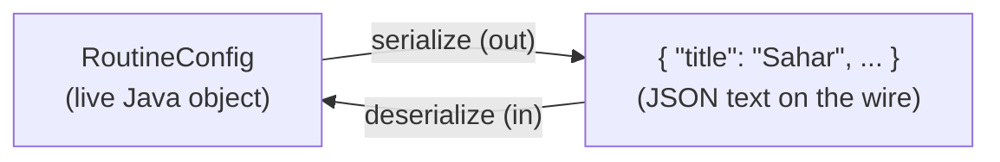
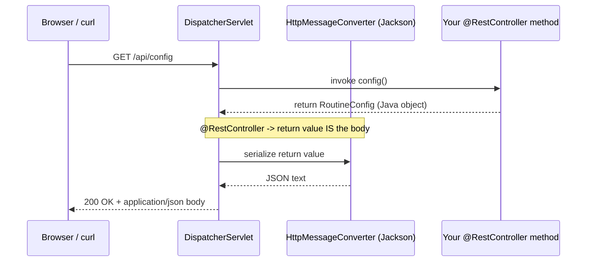

# Serialization & JSON: how a Java object becomes a response body

*You return a Java object; the browser receives text — this is the quiet translation that makes that happen, and you never had to write it.*

**What you will get from this page**

- A plain-English picture of **serialization** (turning a live Java object into bytes/text) and **deserialization** (the reverse), and why a network forces you to do it.
- What **JSON** is and why it's the wire format Sahar speaks.
- *Who* actually does the converting in Spring — an `HttpMessageConverter` backed by Jackson — and *what triggers it* (`@RestController` on the way out, `@RequestBody` on the way in).
- How Jackson maps a Java **record** to JSON keys with **zero annotations**.
- **Content negotiation** in one line: the two headers that decide the format.
- Sahar's real `RoutineConfig` record turning into a JSON response body.

This is the conceptual companion to the request lifecycle in [Spring & DI](./spring-and-di.md) and the wire-format details in [HTTP & REST](./http-and-rest.md). You build the endpoints it describes in [step 02](../steps/02-first-rest-endpoint.md) and [step 03](../steps/03-model-the-domain.md).

---

## 📦 1. What serialization even is

A running Java object lives in your program's memory as a tangle of references — a `RoutineConfig` points at a `PrayerTimes`, which points at seven `String`s, and so on. That arrangement is private to one JVM (Java Virtual Machine — the process running your code). The browser on the other end of the wire cannot see your memory; all it can receive is a **stream of bytes**.

So you need a translation step:

- **Serialization** (object → text/bytes) — flatten a live object graph into a portable sequence of characters that can travel over the network or be written to disk.
- **Deserialization** (text/bytes → object) — the exact reverse: read that sequence back and rebuild a live object in *your* memory.

> [!TIP]
> Think of it like flat-pack furniture. Serialization is disassembling the chair into a flat box with an instruction sheet so it fits through the door. Deserialization is rebuilding the chair on the other side from that same box. The chair you end up with has the same shape — it just travelled as something simpler.

The key idea: an object and its serialized form are *the same information in two shapes*. One is convenient for your code (you can call methods on it); the other is convenient for transport (it's just text).

---

## 📝 2. JSON: the wire format

The "text" Sahar serializes to is **JSON** (JavaScript Object Notation — a lightweight, human-readable text format for structured data). It has only a handful of building blocks:

- **objects** — `{ "key": value, ... }`, an unordered set of key/value pairs;
- **arrays** — `[ value, value, ... ]`, an ordered list;
- **strings** — `"04:37"`;
- **numbers** — `42`, `3.14`;
- **booleans** — `true` / `false`;
- **null** — `null`.

That's the whole language. A `PrayerTimes` record becomes a JSON object; a `List<ScheduleItem>` becomes a JSON array of objects. JSON wins as the default wire format because it's compact, every language can read and write it, and — crucially for a learner — you can eyeball it in a terminal and *understand* it.

> [!NOTE]
> JSON is just one possible representation. The same `PrayerTimes` could be sent as XML, CSV, or a binary format. Sahar always chooses JSON, but the machinery (section 5) would let you serve other formats by adding the right library. See the "representations" idea in [HTTP & REST](./http-and-rest.md).

---

## 🔁 3. The round trip, end to end

Serialization and deserialization are mirror images, and Sahar uses both directions constantly:

| Direction | HTTP part | What happens | Sahar example |
|---|---|---|---|
| **Out** (serialize) | Response **body** | Your method returns a Java object → it becomes JSON text | `GET /api/config` returns a `RoutineConfig` |
| **In** (deserialize) | Request **body** | Incoming JSON text → a Java object handed to your method | `PUT /api/prayer-times` receives a `PrayerTimes` |



Because the two directions use the *same* rules, a `GET` then a `PUT` **round-trips**: the JSON you read back has exactly the keys a `PUT` expects, so you can fetch a resource, tweak one field, and send it straight back.

---

## 🛠️ 4. Who does it, and what triggers it

Here's the part beginners reasonably assume must be their job — and it isn't. You never call Jackson. Spring does, on your behalf, through a piece of machinery called an **`HttpMessageConverter`** (a Spring component whose job is to convert between HTTP request/response bodies and Java objects).

When Sahar starts, auto-configuration registers a JSON message converter backed by **Jackson** (the de-facto Java library for JSON ↔ object conversion). From then on:

- **On the way out** — because your class is a `@RestController`, Spring knows your return value *is* the response body, not the name of an HTML page to render. So it picks the JSON `HttpMessageConverter`, which calls Jackson to **serialize** your returned object into the body.
- **On the way in** — when a method parameter is annotated `@RequestBody`, Spring picks the same converter to **deserialize** the incoming JSON body into that Java argument before your method even runs.



So the trigger is the *annotation*, not a method call you write. `@RestController` (out) and `@RequestBody` (in) are the two switches that flip the converter on. The full request lifecycle around this — Tomcat, the `DispatcherServlet`, handler mapping — lives in [Spring & DI](./spring-and-di.md).

> [!IMPORTANT]
> You should almost never `new` up Jackson or hand-build a JSON string yourself in a controller. If you find yourself concatenating `"{ \"fajr\": \"" + ... `, stop — that's the converter's job, and doing it by hand re-introduces exactly the typo-prone fragility that records and Jackson exist to remove.

---

## 🗝️ 5. How Jackson knows the keys: records for free

Now the satisfying part. Look at how few annotations are on Sahar's domain — *none*. Here is the real `PrayerTimes` record ([`PrayerTimes.java`](../../checkpoints/step-03-model-the-domain/src/main/java/com/ramishtaha/sahar/domain/PrayerTimes.java)):

```java
public record PrayerTimes(
        String fajr,
        String sunrise,
        String dhuhr,
        String asr,
        String maghrib,
        String isha,
        String methodNote
) {}
```

A Java **record** (a compact, immutable data carrier introduced in Java 16) automatically generates an accessor method per component — `fajr()`, `sunrise()`, and so on. Jackson's rule for the JSON keys is simply: **the component name becomes the JSON key.** No `@JsonProperty`, no config, no mapping file. `fajr` the component → `"fajr"` the key.

So that record serializes to exactly:

```json
{
  "fajr": "04:37",
  "sunrise": "05:59",
  "dhuhr": "12:37",
  "asr": "17:12",
  "maghrib": "19:13",
  "isha": "20:36",
  "methodNote": "Karachi 18° Fajr/Isha, Hanafi Asr, computed for Thane..."
}
```

Deserialization runs the same rule backwards: Jackson reads the JSON keys, matches each to a record component, and calls the record's **canonical constructor** to build the object. Records suit this beautifully — they're immutable, so once the server hands one out, nobody can mutate it by accident, and the compiler guarantees the shape.

> [!TIP]
> This is the upgrade [step 03](../steps/03-model-the-domain.md) makes over [step 02](../steps/02-first-rest-endpoint.md). Step 02's `ConfigController` returned an untyped `Map<String, Object>` and put keys in by hand (`cfg.put("title", ...)`) — a typo in a key is invisible to the compiler. Step 03 swaps in records and **the JSON shape stays byte-for-byte identical**, but now the compiler guarantees the keys. Same wire format, far less fragility.

---

## 🤝 6. Content negotiation, in one line

How does Spring know to *produce* JSON, and to *parse* the incoming body as JSON? Two headers: the sender's **`Content-Type`** says "the body I'm sending is in this format," and the client's **`Accept`** says "please reply in a format from this list" — Spring's content negotiation matches `Accept` against what its converters can produce and picks one (here, trivially, JSON). More detail lives in [HTTP & REST](./http-and-rest.md).

---

## 🧩 7. Sahar's RoutineConfig, all the way to a body

The payoff: `GET /api/config` returns Sahar's aggregate root, the `RoutineConfig` record ([`RoutineConfig.java`](../../checkpoints/step-03-model-the-domain/src/main/java/com/ramishtaha/sahar/domain/RoutineConfig.java)):

```java
public record RoutineConfig(
        String title,
        String tagline,
        String month,
        PrayerTimes prayerTimes,
        BlockPlan block,
        List<GridDay> weeklyGrid,
        List<ScheduleItem> schedule,
        // ...more components...
        List<String> notes
) {}
```

This single record *composes* all the smaller ones. Jackson walks the whole tree with the one rule from section 5 — component name → key, recursing into nested records and lists — and produces:

```json
{
  "title": "Sahar",
  "tagline": "recover, build, fight",
  "month": "June 2026",
  "prayerTimes": { "fajr": "04:37", "sunrise": "05:59", "...": "..." },
  "block": { "label": "4-week block...", "weeks": [ { "ordinal": 1, "...": "..." } ] },
  "weeklyGrid": [ { "day": "Mon", "discipline": "Muay Thai (technical)" } ],
  "schedule": [ { "id": 1, "time": "06:30", "...": "..." } ],
  "notes": [ "..." ]
}
```

Notice what you did *not* write: no loop over fields, no string concatenation, no key names typed twice. You returned one object; the `@RestController` triggered the converter; Jackson did the rest. That is the whole bargain.

---

## 💼 8. Interview angle

Short, honest answers to the questions this page sets you up to nail.

**Q: Who turns your returned object into JSON?**
An `HttpMessageConverter` registered by Spring, backed by the Jackson library. You don't call it — Spring's `DispatcherServlet` selects the JSON converter and invokes Jackson to serialize your return value into the response body. You write the return statement; the converter is the machinery behind it.

**Q: How does Jackson know the JSON keys for a record?**
By the record's **component names**. Jackson reads each component's generated accessor (`fajr()` → key `"fajr"`) with **no annotations required**. The component name *is* the JSON key, and deserialization reverses it via the record's canonical constructor. That's why Sahar's domain records carry zero `@JsonProperty` annotations.

**Q: What's the difference between `@RestController` and `@Controller` for serialization?**
`@RestController` = `@Controller` + `@ResponseBody`. A plain `@Controller` treats a method's return value as a **view name** (an HTML page to render). `@RestController` treats the return value as the **response body itself**, so it goes through an `HttpMessageConverter` and gets serialized (to JSON in Sahar). Every Sahar web class is a `@RestController` because it serves data, not pages.

**Q: `@RequestBody` vs `@ResponseBody`?**
They're the two directions of the same converter. `@RequestBody` on a method *parameter* means "deserialize the incoming request body into this argument" (JSON → object, inbound). `@ResponseBody` on a method/return means "serialize this return value into the response body" (object → JSON, outbound). `@RestController` applies `@ResponseBody` to every method for you, which is why you only ever see `@RequestBody` written out in Sahar's controllers.

---

> [!NOTE]
> **Older vs newer: the versions this page assumes.** Sahar targets **Spring Boot 4 / Spring Framework 7 / Java 25** with the **`jakarta.*`** namespace and **Jackson 3** (package **`tools.jackson`**). If you read older tutorials they'll show **Boot 3.x / Spring 5–6 / Java 17**, the **`javax.*`** namespace, and **Jackson 2** (package **`com.fasterxml.jackson`**) — so an old guide's `com.fasterxml.jackson.databind.ObjectMapper` is `tools.jackson.databind.ObjectMapper` here. The *concepts* on this page (converters, the record-name → key rule, `@RestController`/`@RequestBody`) are identical across both; only the import packages move. The full list of renames is in [Version deltas](../../reference/cheatsheet-version-deltas.md).

---
## 🔗 Related
- [02 — First REST endpoint](../steps/02-first-rest-endpoint.md) · [03 — Model the domain](../steps/03-model-the-domain.md)
- [HTTP & REST](./http-and-rest.md) · [Spring & DI](./spring-and-di.md)
- [Version deltas](../../reference/cheatsheet-version-deltas.md) · [Interview-prep](../../reference/interview-prep.md) · ⬆️ [README](../../README.md)
