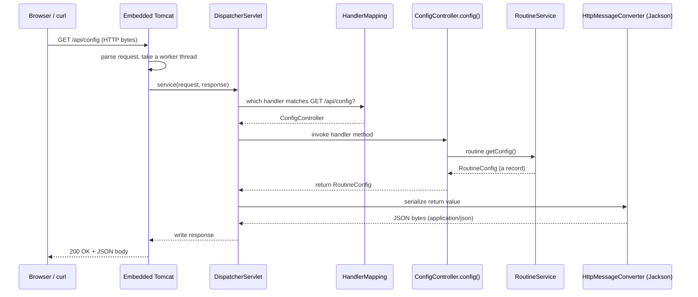
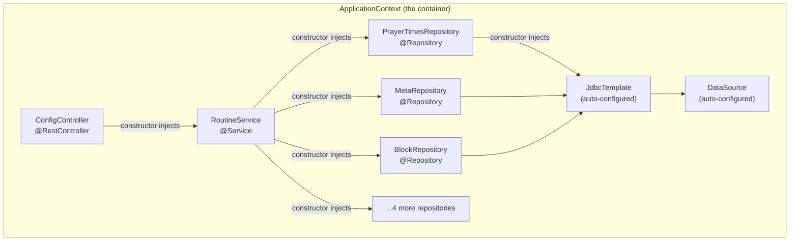
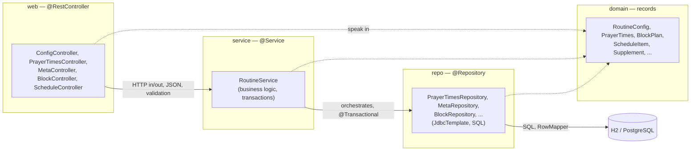

# Spring, servlets, and dependency injection

> How an HTTP request reaches one of your Java methods, who creates your objects for you, and why Sahar is split into web / service / repo / domain layers.

**What you will get from this page**

- A clear mental model of what a *servlet* is and what the *embedded Tomcat* server Spring Boot starts actually does.
- The full request lifecycle: socket → Tomcat → `DispatcherServlet` → your handler method → JSON response.
- What *Inversion of Control* and *Dependency Injection* mean, why constructor injection is preferred, and why "don't call `new`" makes code testable.
- What *beans* and the *ApplicationContext* are, how *component scanning* and the stereotype annotations register your classes, and how *auto-configuration* wires beans from the classpath.
- Why Sahar is layered, told through a real before/after: step 04 held state in a field, step 06 moved it to a database — and **the controllers never changed**.

This is the conceptual foundation. The hands-on versions of everything here are in [00 — baseline](../steps/00-baseline.md), [02 — first REST endpoint](../steps/02-first-rest-endpoint.md), [04 — in-memory edit](../steps/04-in-memory-edit.md), and [06 — JdbcTemplate + H2](../steps/06-jdbctemplate-h2.md).

---

## 1. What is a servlet, and what is Tomcat doing?

Long before Spring existed, the Java standard for "a thing that handles HTTP requests" was the **servlet** — an interface (today `jakarta.servlet.Servlet`, formerly `javax.servlet.Servlet`; the `javax` → `jakarta` rename happened in the Spring 2 → 3 / Jakarta EE transition and is unrelated to the Boot 3 → 4 move) with one method that matters:

```java
// Conceptually. You almost never write this yourself in Spring.
public interface Servlet {
    void service(ServletRequest req, ServletResponse res);
}
```

A **servlet container** is the program that:

1. opens a TCP socket and listens on a port (Sahar uses `8080`),
2. parses raw bytes off the wire into an HTTP request object,
3. finds the right servlet and calls its `service(...)` method,
4. serializes the servlet's response back into HTTP bytes,
5. manages a *thread pool* so many requests can be handled concurrently.

**Tomcat** is the servlet container Sahar uses. The crucial Spring Boot fact: Tomcat is **embedded**. There is no separate web server to install, configure, and deploy a `.war` into. Tomcat is a plain Maven dependency, pulled in transitively by `spring-boot-starter-webmvc`, and your app *starts it* as ordinary Java code:

```java
@SpringBootApplication
public class SaharApplication {
    public static void main(String[] args) {
        // Boots the Spring "application context" (the container that holds all beans),
        // starts the embedded Tomcat server, and blocks until the app is shut down.
        SpringApplication.run(SaharApplication.class, args);
    }
}
```

> **Why this matters.** "Run `main` and a web server starts" sounds trivial, but it inverts decades of Java tradition (build a WAR, hand it to an app server an ops team manages). The embedded model is why Sahar ships as one self-contained executable jar in [step 11 — dockerize](../steps/11-dockerize.md): the server is *inside* the artifact.

You can swap the container — `spring-boot-starter-webmvc` lets you exclude Tomcat and pull in Jetty or Undertow instead — but Tomcat is the default and Sahar never changes it.

---

## 2. The request lifecycle: from socket to your method and back

Here is the part that confuses newcomers: in a Spring MVC app there is **exactly one servlet** doing the real routing. It is the `DispatcherServlet`, and it is a *front controller* — every request funnels through it, and it dispatches to the right handler. You write `ConfigController`, `PrayerTimesController`, and friends, but Tomcat never calls them directly; it calls the `DispatcherServlet`, which then calls *you*.

Walk through `GET /api/config`:



Step by step:

| Stage | What happens |
| --- | --- |
| **1. Tomcat accepts** | A worker thread is taken from the pool; the raw HTTP request is parsed into a request object. |
| **2. DispatcherServlet** | Tomcat hands the request to the single front controller. |
| **3. HandlerMapping** | The dispatcher asks: which method handles `GET /api/config`? It finds `ConfigController#config()` via the `@GetMapping("/api/config")` annotation. |
| **4. Argument binding** | For methods with parameters, Spring binds path variables, query params, and the request body (deserialized by Jackson) into method arguments. `config()` takes none, so this is a no-op here. |
| **5. Handler invocation** | Spring calls your method. It returns a `RoutineConfig` (a plain Java record). |
| **6. Message conversion** | Because the class is a `@RestController`, the return value is *not* a view name — an `HttpMessageConverter` (Jackson, **Jackson 3 / `tools.jackson`** in Boot 4) serializes the record straight to JSON. |
| **7. Response** | The dispatcher writes status `200`, `Content-Type: application/json`, and the body. Tomcat flushes the bytes and returns the thread to the pool. |

The real handler is tiny — all the lifecycle machinery above is Spring's, not yours:

```java
@RestController
public class ConfigController {

    private final RoutineService routine;

    public ConfigController(RoutineService routine) {
        this.routine = routine;
    }

    @GetMapping("/api/config")
    public RoutineConfig config() {
        return routine.getConfig();
    }
}
```

You build this endpoint for real in [step 02 — first REST endpoint](../steps/02-first-rest-endpoint.md). The `@RestController`-vs-`@Controller` distinction, and how `@RequestBody` / `@PathVariable` feed stage 4, are catalogued in the [Spring annotations cheatsheet](../../reference/cheatsheet-spring-annotations.md).

> **One thread per request.** Each in-flight request occupies one Tomcat worker thread for its whole duration (this is the classic blocking model — fine for Sahar, a single-user personal app). It also means your singleton beans are shared across threads, which is why the step-04 service used `synchronized` on its read/write methods.

---

## 3. Inversion of Control and Dependency Injection

Notice what `ConfigController` did **not** do: it never wrote `new RoutineService(...)`. It declared *"I need a `RoutineService"* as a constructor parameter, and one arrived. That is the whole idea.

### The terms, demystified

- **Inversion of Control (IoC)** — Normally your code is in charge: it decides what to build and when (`new`). With IoC you hand that control to a framework. *It* builds your objects and decides their lifecycle; your code just declares what it needs. The "inversion" is *who calls whom*: instead of your code calling a library, the framework calls your code.
- **Dependency Injection (DI)** — the specific technique for achieving IoC for *collaborators*. Instead of an object reaching out and constructing the things it depends on, those dependencies are *handed in* ("injected") from outside.

### Why "don't call `new`" actually matters

Compare two versions of the same controller.

**Without DI — the dependency is hard-wired:**

```java
public class ConfigController {
    // ConfigController now decides exactly which RoutineService exists,
    // and which repositories THAT needs, and so on, all the way down.
    private final RoutineService routine = new RoutineService(/* ...7 repositories... */);
}
```

This compiles, but it is rigid:

- **Untestable in isolation.** To test the controller you are forced to build a real `RoutineService`, which drags in seven real repositories, which drag in a real `JdbcTemplate`, which needs a real database. You cannot test the controller's *own* logic without standing up the entire stack.
- **No swapping.** You are welded to one concrete `RoutineService`. You can't substitute a fake, a stub, or a different implementation.
- **Duplicated, scattered construction.** Every class that needs a `RoutineService` repeats the construction recipe.

**With DI — the dependency is requested:**

```java
public ConfigController(RoutineService routine) {   // "give me one of these"
    this.routine = routine;
}
```

Now in a test you simply pass whatever you like:

```java
RoutineService stub = mock(RoutineService.class);
when(stub.getConfig()).thenReturn(sampleConfig());

ConfigController controller = new ConfigController(stub);   // honest, isolated
assertEquals(sampleConfig(), controller.config());
```

The controller is decoupled from *how* a `RoutineService` is built. In production Spring injects the real one; in a test you inject a stand-in. **That choice moved out of the class** — which is exactly the inversion of control.

### Constructor injection is the preferred form

Spring supports field injection (`@Autowired` on a field) and setter injection, but **constructor injection is the recommended default**, and it is what every Sahar class uses. Why:

| Benefit | Explanation |
| --- | --- |
| **`final` fields** | Dependencies can be `final` — assigned once, never reassigned, guaranteed set. |
| **Fully-initialised object** | An instance cannot exist in a half-wired state; if a required dependency is missing, construction fails loudly at startup, not with a `NullPointerException` later. |
| **Honest about dependencies** | The constructor signature *is* the list of what the class needs. A constructor with seven parameters is a visible smell telling you the class may do too much. |
| **No Spring needed to test** | `new ConfigController(stub)` works in a plain JUnit test — no container, no reflection, no `@Autowired`. |

A single constructor needs **no annotation** — since Spring Framework 6 (so certainly in Sahar's Spring Framework 7), Spring autowires the sole constructor automatically. That is why `ConfigController` has no `@Autowired` anywhere.

`RoutineService` shows the same pattern with seven collaborators, each a repository bean:

```java
@Service
public class RoutineService {

    private final MetaRepository meta;
    private final PrayerTimesRepository prayerTimes;
    private final BlockRepository blocks;
    private final ScheduleRepository schedule;
    private final GridRepository grid;
    private final SupplementRepository supplements;
    private final DietRepository diet;

    public RoutineService(MetaRepository meta, PrayerTimesRepository prayerTimes, BlockRepository blocks,
                          ScheduleRepository schedule, GridRepository grid,
                          SupplementRepository supplements, DietRepository diet) {
        this.meta = meta;
        this.prayerTimes = prayerTimes;
        // ...assign the rest...
    }
}
```

---

## 4. Beans and the ApplicationContext

A **bean** is just an object that Spring creates, configures, and manages for you. There is nothing magical about the object itself — `RoutineService` is an ordinary class. What makes its *instance* a bean is that Spring constructed it and holds a reference.

The **ApplicationContext** is the *container*: the in-memory registry of every bean, keyed mostly by type. When `SpringApplication.run(...)` executes, it:

1. creates the ApplicationContext,
2. discovers bean definitions (via component scanning, §5, and auto-configuration, §6),
3. instantiates each bean, working out the order from the dependency graph,
4. injects each bean's dependencies through its constructor,
5. then starts Tomcat once everything is wired.

By default every bean is a **singleton** — one shared instance for the whole application. This is why a single in-memory edit is visible to the next request: every controller that needs `RoutineService` is handed *the same* object.

Here is the actual wiring graph the context builds for the read path of `GET /api/config`:



Read the arrows as "needs": `ConfigController` needs `RoutineService`, which needs the seven repositories, each of which needs the auto-configured `JdbcTemplate`, which needs the `DataSource`. Spring topologically sorts this graph and builds leaves first. If a needed bean is missing — say no `JdbcTemplate` exists because the `spring.datasource.*` properties weren't set — startup fails with a clear message instead of a runtime surprise.

---

## 5. Component scanning and stereotypes

How does the context *know* `RoutineService` should be a bean? You told it, with an annotation. `@SpringBootApplication` includes `@ComponentScan`, which at startup scans the package of `SaharApplication` (`win.l0ve.sahar`) **and every sub-package** for classes carrying a *stereotype* annotation, and registers each one as a bean definition.

> **This is why the base package matters.** Component scanning starts at `win.l0ve.sahar` and goes down. Every Sahar class lives under that package, so it gets found. A class placed *outside* the base package would be silently ignored — a classic "why isn't my controller working?" trap.

The stereotypes are all `@Component` under the hood; the specialised names document a class's role and, in some cases, add behaviour:

| Annotation | Layer | Means | Sahar examples |
| --- | --- | --- | --- |
| `@Component` | any | "generic Spring-managed bean" | the base; the others are specialisations of it |
| `@RestController` | web | controller whose return values become the JSON response body | `ConfigController`, `PrayerTimesController`, `MetaController`, `BlockController`, `ScheduleController` |
| `@Service` | service | business-logic bean | `RoutineService` |
| `@Repository` | repo | data-access bean; **also** translates raw JDBC/persistence exceptions into Spring's consistent `DataAccessException` hierarchy | `PrayerTimesRepository`, `MetaRepository`, `BlockRepository`, `ScheduleRepository`, `GridRepository`, `SupplementRepository`, `DietRepository` |

`@Repository` earns its keep beyond labelling: it activates exception translation, so a vendor-specific `SQLException` from H2 or Postgres surfaces to the service as a uniform Spring `DataAccessException`. The service doesn't need to know which database threw it.

A fuller catalogue of these and their companions (`@GetMapping`, `@RequestBody`, `@Transactional`, `@Valid`, …) lives in the [Spring annotations cheatsheet](../../reference/cheatsheet-spring-annotations.md).

---

## 6. Auto-configuration and starters

Component scanning explains *your* beans. But you never wrote a `JdbcTemplate`, a `DataSource`, or a `DispatcherServlet` — yet they exist. That is **auto-configuration**, the second half of `@SpringBootApplication` (the `@EnableAutoConfiguration` part).

The mental model: **Spring Boot looks at what's on the classpath and configures sensible beans accordingly — but always backs off if you've defined your own.** Auto-config classes are guarded by *conditions* like "only if class X is present" and "only if no bean of type Y already exists."

| What Boot sees on the classpath | What it auto-configures |
| --- | --- |
| `spring-boot-starter-webmvc` (brings Spring MVC + Tomcat) | An embedded Tomcat server, the `DispatcherServlet`, JSON message converters (Jackson 3), exception handling |
| A `DataSource` + `spring-boot-starter-jdbc` (brings `JdbcTemplate`) | A connection-pooled `DataSource` from `spring.datasource.*`, and a ready-to-inject `JdbcTemplate` |
| `spring-boot-starter-flyway` + `flyway-database-postgresql` | A Flyway bean that runs migrations on startup (see [step 10](../steps/10-seed-and-migrations.md)) |
| `spring-boot-h2console` | The browser H2 console |

A **starter** is a curated, dependency-only Maven module — it pulls in a coherent, version-aligned set of libraries so you don't assemble them by hand. Boot 4 names worth pinning to memory (they changed from Boot 3.x):

- the web starter is `spring-boot-starter-webmvc` (renamed from `spring-boot-starter-web`);
- Flyway comes via `spring-boot-starter-flyway` plus `flyway-database-postgresql` (not the old `flyway-core`);
- tests use modular starters — `spring-boot-starter-webmvc-test`, `-jdbc-test`, `-validation-test`, `-flyway-test` — instead of one `spring-boot-starter-test`.

So the chain is: **add a starter → its libraries land on the classpath → auto-configuration sees them → beans appear in the context.** That is the entire reason `PrayerTimesRepository` can just *ask* for a `JdbcTemplate`:

```java
@Repository
public class PrayerTimesRepository {

    private final JdbcTemplate jdbc;

    public PrayerTimesRepository(JdbcTemplate jdbc) {   // auto-configured; we never built it
        this.jdbc = jdbc;
    }
    // ...
}
```

For the exact dependencies and the `@SpringBootApplication` breakdown, see [step 00 — baseline](../steps/00-baseline.md). Versions and starter names may shift over time — when in doubt, check the [Spring Boot 4.0.6 reference](https://docs.spring.io/spring-boot/4.0.6/).

---

## 7. The layered architecture — and why it pays off

Sahar is split into four layers, each a package, each with one job:



| Layer | Responsibility | Knows about | Does **not** know about |
| --- | --- | --- | --- |
| **web** | HTTP: routing, status codes, JSON in/out, kicking off validation | the service interface, domain records | SQL, the database, JDBC |
| **service** | business logic, orchestrating repositories, transaction boundaries (`@Transactional`) | repositories, domain | HTTP, request/response objects |
| **repo** | persistence: SQL, `RowMapper`s, bind parameters | `JdbcTemplate`, domain | who called it, why, or the web |
| **domain** | the data itself — immutable Java records | nothing (no dependencies) | everything above it |

**Why bother?**

- **Separation of concerns.** A bug in JSON serialization is a web-layer problem; a bug in a SQL `WHERE` clause is a repo-layer problem. Layers tell you *where to look*.
- **Each layer is testable in isolation** (back to §3): test a controller against a stubbed service, a service against stubbed repositories, a repository against a real H2 database.
- **You can swap an implementation without touching the layers around it** — provided the *contract* (the method signatures) holds steady.

### The proof: step 04 → step 06 changed only the service

This is not theoretical. In [step 04](../steps/04-in-memory-edit.md), `RoutineService` kept the entire routine in a single field:

```java
@Service
public class RoutineService {

    private RoutineConfig config = RoutineSeed.defaultConfig();   // state lives in memory

    public synchronized RoutineConfig getConfig() {
        return config;
    }

    public synchronized RoutineConfig updatePrayerTimes(PrayerTimes prayerTimes) {
        config = config.withPrayerTimes(prayerTimes);
        return config;
    }
    // ...
}
```

In [step 06](../steps/06-jdbctemplate-h2.md), the guts were rewritten to read and write a real H2 database through repositories:

```java
@Service
public class RoutineService {

    private final MetaRepository meta;
    private final PrayerTimesRepository prayerTimes;
    // ...five more repositories...

    public RoutineService(MetaRepository meta, PrayerTimesRepository prayerTimes, /* ... */) { /* assign */ }

    public RoutineConfig getConfig() {
        MetaRepository.Meta m = meta.find().orElseThrow(/* ... */);
        PrayerTimes pt = prayerTimes.find().orElseThrow(/* ... */);
        BlockPlan block = blocks.find();
        // ...assemble a RoutineConfig from each table...
    }

    public RoutineConfig updatePrayerTimes(PrayerTimes prayerTimes) {
        this.prayerTimes.update(prayerTimes);
        return getConfig();
    }
}
```

The implementation behind these methods changed completely — "a mutable field" became "rows in H2." But the **method signatures did not change**: `getConfig()`, `updatePrayerTimes(PrayerTimes)`, `updateMonth(String)`, `updateBlock(BlockPlan)` all kept their shape. So **every controller compiled and ran untouched.** `ConfigController` still just calls `routine.getConfig()` and has no idea whether that data came from a field or a database.

The step-06 service even documents the payoff in its own Javadoc:

> *This is the payoff of layering: the controllers did not change at all. ... We swapped the implementation behind those methods from "a mutable field" to "rows in H2", and the web layer never noticed. That is the whole reason we separated web / service / data.*

The same insulation pays off again in [step 09 — swap to Postgres](../steps/09-swap-to-postgres.md): moving from H2 to PostgreSQL is a *wiring* change (a profile and a `DataSource`), and the SQL lives entirely in the repo layer — the service and controllers don't move.

---

## 8. Putting it all together

For a single `GET /api/config`, here is the complete chain, with every concept on this page in play:

1. **Startup (once):** `SpringApplication.run` builds the **ApplicationContext**. **Component scanning** registers `ConfigController`, `RoutineService`, and the seven repositories as **beans**. **Auto-configuration** sees `webmvc` and `jdbc` on the classpath and creates the **embedded Tomcat**, the `DispatcherServlet`, and a `JdbcTemplate`. **Constructor injection** wires the graph from §4. Tomcat starts.
2. **Request:** Tomcat parses `GET /api/config`, hands it to the `DispatcherServlet` (the **front controller**), which maps it to `ConfigController#config()`.
3. **Down the layers:** the controller (web) calls `RoutineService` (service), which calls the repositories (repo), which run SQL against H2 and map rows into **domain** records.
4. **Back up and out:** the `RoutineConfig` record returns to the controller; Jackson 3 serializes it to JSON; Tomcat writes `200 OK`.

None of your classes called `new` on another bean, opened a socket, parsed HTTP, or managed a thread. You wrote small, single-responsibility classes and declared their dependencies — Spring did the assembly. That is the bargain Spring offers, and the rest of Sahar is just applying it.

---

## Related

- [00 — baseline](../steps/00-baseline.md) — the project skeleton, `@SpringBootApplication`, and the starters.
- [02 — first REST endpoint](../steps/02-first-rest-endpoint.md) — `@RestController`, `@GetMapping`, and the request lifecycle in practice.
- [04 — in-memory edit](../steps/04-in-memory-edit.md) — the service holding state in a field (the "before").
- [06 — JdbcTemplate + H2](../steps/06-jdbctemplate-h2.md) — the repository layer and the swap that proved layering (the "after").
- [HTTP and REST](./http-and-rest.md) — methods, status codes, and resource design.
- [Spring annotations cheatsheet](../../reference/cheatsheet-spring-annotations.md) — quick reference for every annotation named here.
- Official: [Spring Boot 4.0.6 reference](https://docs.spring.io/spring-boot/4.0.6/) · [back to the README](../../README.md).
