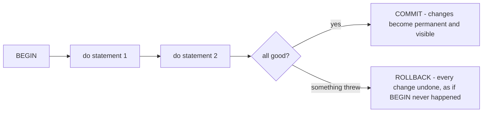
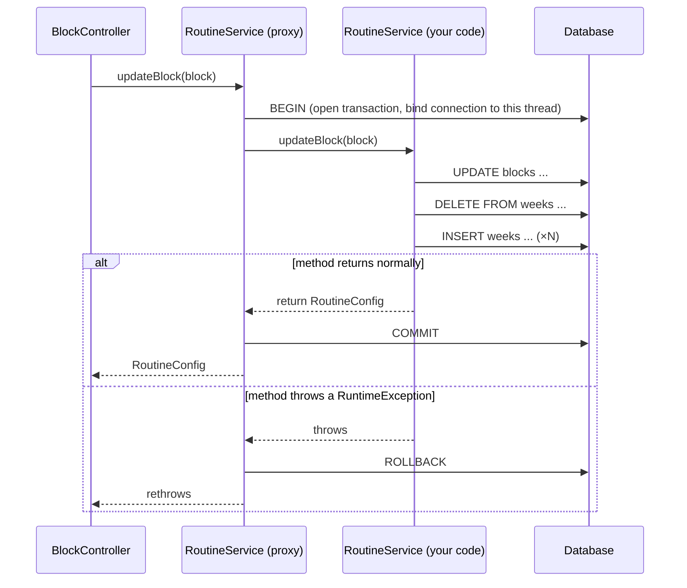

# Transactions, ACID & @Transactional

*A transaction is a promise the database makes you: these steps happen all together, or none of them happen at all.*

**What you will get from this page**

- A solid mental model of a **database transaction** (a group of operations treated as one indivisible unit of work) and the four **ACID** guarantees, one clear sentence each.
- The difference between **commit** (make it permanent) and **rollback** (undo it all).
- Why Sahar's block-replace is the textbook reason transactions exist — shown through the *real* `@Transactional` method in `RoutineService`.
- How Spring actually puts a transaction *around* your method, and the one gotcha that bites everybody: the **proxy self-invocation** trap.
- Two small but important extras: what `@Repository`'s exception translation buys you, and when to mark a method `readOnly`.
- A 💼 interview-prep section at the end so you can say all of this out loud.

This is a theory deep-dive. The hands-on builds that use transactions are [06 — JdbcTemplate & H2](../steps/06-jdbctemplate-h2.md) and [07 — Full CRUD](../steps/07-full-crud.md); the Spring Data JPA contrast lives in [23 — Spring Data JPA](../steps/23-spring-data-jpa.md).

---

## 🧱 1. What a transaction actually is

A **transaction** (a sequence of database operations treated as a single, indivisible unit of work) is the database's way of letting you say: *"treat these statements as one thing."* Either every statement inside it takes effect, or — if anything goes wrong — none of them do. There is no in-between.

The classic picture is a bank transfer: debit account A, credit account B. If the power dies after the debit but before the credit, money has *vanished*. A transaction forbids that outcome — both writes land, or neither does.

You begin a transaction, do your work, and then end it one of two ways:

- **commit** — "I'm done and everything succeeded; make all of it permanent."
- **rollback** — "something went wrong; pretend none of it happened and restore the prior state."

That's the whole shape. Everything else on this page is *why* that promise holds and *how* Spring gives it to you without you writing `BEGIN`/`COMMIT` by hand.

> [!NOTE]
> A transaction is about **a unit of work**, not about how many tables you touch. One `UPDATE` is implicitly its own transaction. The interesting cases are when *several* statements must succeed or fail together — which is exactly Sahar's block-replace below.

---

## 🔤 2. ACID, one clause each

**ACID** is the four-letter checklist of what a real transaction guarantees. Each letter is one promise:

- **A — Atomicity** (all-or-nothing): every statement in the transaction either all commits together or all rolls back together; a half-finished transaction is never visible.
- **C — Consistency** (valid-to-valid): a transaction moves the database from one rule-satisfying state to another, so constraints (primary keys, foreign keys, `NOT NULL`, your `CHECK`s) hold before *and* after.
- **I — Isolation** (no peeking at half-done work): concurrent transactions don't see each other's uncommitted changes; each runs as if it had the database to itself (the strictness of this is the *isolation level*).
- **D — Durability** (survives a crash): once a transaction commits, its changes are written to permanent storage and survive a power loss or process crash.

> [!TIP]
> A one-breath summary: **A**ll-or-nothing, **C**onstraints stay true, **I**solated from others, and **D**urable once committed. If you can recite that, you understand transactions better than most.

For Sahar's single-user app, the headliner is **Atomicity** — that's the property the block-replace leans on. Isolation matters more the moment many users write at once; we'll note where it bites.

---

## 🔁 3. Commit vs rollback — the two endings

Think of a transaction as a draft that nobody else can read yet:



- On **commit**, your changes become permanent (Durability) and visible to everyone else (Isolation lifts).
- On **rollback**, the database discards the draft entirely — you're back to exactly the state at `BEGIN`.

The crucial part for the rest of this page: **you almost never type `COMMIT` or `ROLLBACK` in Sahar.** Spring decides which ending happens, based on whether your method returned normally or threw. That's what `@Transactional` is for.

---

## 🧩 4. Why Sahar's block-replace *must* be atomic

Here's the operation that makes transactions concrete. Sahar's `BlockPlan` is an **aggregate** (one parent that's only meaningful together with its ordered children): one `blocks` row plus four or five `weeks` rows. To save an edited block, [`BlockRepository.replace()`](../../checkpoints/step-06-jdbctemplate-h2/src/main/java/com/ramishtaha/sahar/repo/BlockRepository.java) does three separate writes:

```java
// checkpoints/step-06-jdbctemplate-h2 — BlockRepository.replace()
public void replace(BlockPlan block) {
    jdbc.update("UPDATE blocks SET label = ? WHERE id = 1", block.label());  // 1. parent
    jdbc.update("DELETE FROM weeks WHERE block_id = 1");                      // 2. wipe children
    insertWeeks(block);                                                       // 3. re-insert children
}
```

Now imagine **no** transaction, and the third step throws (a bad row, a constraint violation, the process dies). The `DELETE` already happened and committed. A reader calling `GET /api/config` would now see a block with a label but **zero weeks** — a corrupt, impossible state the app's own validation says can't exist.

Atomicity is the fix: wrap all three writes in one transaction. If `insertWeeks` throws, the `UPDATE` *and* the `DELETE` roll back too. Either the whole new block is there, or the old one is — never a torn half. The repository itself stays transaction-agnostic; the boundary is drawn one layer up, in the service.

> [!IMPORTANT]
> Notice *where* the transaction lives. The repository writes rows; the **service** decides what counts as one unit of work. That's deliberate — the transaction boundary is a business decision ("a block is replaced atomically"), and business decisions belong in the service layer.

---

## 🏷️ 5. The real `@Transactional` method

Here is the actual service method from step 06 — `@Transactional` (Spring's annotation, `org.springframework.transaction.annotation.Transactional`) is the entire mechanism:

```java
// checkpoints/step-06-jdbctemplate-h2 — RoutineService
@Transactional
public RoutineConfig updateBlock(BlockPlan block) {
    blocks.replace(block);   // UPDATE + DELETE + N×INSERT, all in one transaction
    return getConfig();
}
```

That single annotation is the whole promise from §4. By step 07 the same idea has grown into a *family* of block operations — [`replaceBlock`, `rollForward`, `addWeek`, `dropWeek`, `updateWeek`](../../checkpoints/step-07-full-crud/src/main/java/com/ramishtaha/sahar/service/RoutineService.java) — every one annotated `@Transactional`, because every one calls `blocks.replace(...)` and so does the same multi-statement wipe-and-reinsert. The annotation is what makes "the deload must be the last week" safe even when a rule check throws mid-operation: the partial write is rolled back, and the database is untouched.

---

## ⚙️ 6. How Spring opens, commits, and rolls back the transaction

You wrote one annotation and got `BEGIN`/`COMMIT`/`ROLLBACK` for free. Here's the machinery.

At startup Spring wraps your `@Transactional` bean in a **proxy** (a generated stand-in object that has the same methods as your class but adds behaviour around them). When something calls `updateBlock(...)`, it's really calling the proxy. The proxy runs this script:



The two rules to memorise:

1. **Return normally → COMMIT.** The proxy commits the transaction after your method hands back its value.
2. **Throw a `RuntimeException` (or `Error`) → ROLLBACK.** The proxy catches it, rolls back, and rethrows.

> [!WARNING]
> By default, only **unchecked** exceptions (`RuntimeException` and `Error`) trigger rollback. A *checked* exception **commits** — Spring leaves it alone unless you say `@Transactional(rollbackFor = ...)`. Sahar's writes throw unchecked exceptions (`ResponseStatusException`, `DataAccessException`, `IllegalStateException`), so rollback Just Works — but this default surprises people coming from other frameworks.

---

## 🪤 7. The self-invocation gotcha (the proxy only wraps the *door*)

This is the single most common `@Transactional` bug, and it follows directly from §6: **the transaction lives on the proxy, not on your object.** The proxy only sees calls that come in *through it* — from outside the bean. A call from one method of your class to another method *of the same class* uses plain `this`, bypasses the proxy entirely, and so **gets no transaction**.

```java
@Service
public class RoutineService {

    public RoutineConfig doTwoThings(BlockPlan block) {
        updateBlock(block);   // ⚠️ this.updateBlock(...) — bypasses the proxy, NO transaction!
        // ...
    }

    @Transactional
    public RoutineConfig updateBlock(BlockPlan block) { /* ... */ }
}
```

Here `updateBlock`'s `@Transactional` is silently ignored, because the call never left the object to pass through the proxy. The fix is to make sure the transactional entry point is called *from outside* — typically by having the controller call the `@Transactional` method directly, or by extracting the transactional work into a separate bean.

### A clean contrast: step 22's event listener

Sahar's [step 22](../steps/22-domain-events.md) shows the *right* shape, and it's a useful mirror image. [`RoutineService.updateLocation`](../../checkpoints/step-22-domain-events/src/main/java/com/ramishtaha/sahar/service/RoutineService.java) is `@Transactional`, saves the location, and *publishes an event* — it does not call the recalculation itself:

```java
// checkpoints/step-22-domain-events — RoutineService
@Transactional
public Location updateLocation(Location location) {
    meta.updateLocation(location);
    Location saved = meta.findLocation().orElseThrow();
    events.publishEvent(new LocationChangedEvent(saved));   // announce; don't self-call
    return saved;
}
```

A *separate bean*, [`PrayerTimesRecalculator`](../../checkpoints/step-22-domain-events/src/main/java/com/ramishtaha/sahar/event/PrayerTimesRecalculator.java), reacts — and crucially it listens with `@TransactionalEventListener(AFTER_COMMIT)`, so it only fires *after* the location's transaction has durably committed:

```java
// checkpoints/step-22-domain-events — PrayerTimesRecalculator
@TransactionalEventListener(phase = TransactionPhase.AFTER_COMMIT)
public void onLocationChanged(LocationChangedEvent event) {
    PrayerTimes recomputed = calculator.calculate(/* ... */);
    prayerTimes.update(recomputed);
}
```

Why this is the contrast that matters: the reaction lives in *another bean*, so it's a genuine cross-bean call — it goes through that bean's proxy and is properly transaction-aware. And `AFTER_COMMIT` is itself a transaction concept: it ties the side effect to a *successful commit*, so we never recompute prayer times for a location that rolled back. Decoupling the reaction into its own bean sidesteps the self-invocation trap *and* gives the listener a clean commit boundary to hang off.

> [!TIP]
> Rule of thumb: a `@Transactional` method only does its job when it's entered **through the proxy** — i.e. called from a *different* bean. If you find yourself calling a transactional method from the same class, that's the smell; move it to its own bean.

---

## 🛡️ 8. `@Repository` and exception translation

There's a quiet helper that makes the rollback story consistent. Marking a data-access class `@Repository` doesn't just register it as a bean — it activates **exception translation**: Spring converts the vendor-specific, *checked* `SQLException` that H2 or PostgreSQL throws into one of Spring's *unchecked* `DataAccessException`s.

Two payoffs:

1. **Your service stays database-agnostic.** A duplicate-key or constraint failure surfaces the same way whether you're on H2 (dev) or Postgres (prod). The service never imports a vendor exception.
2. **Rollback Just Works.** Because `DataAccessException` is a `RuntimeException` (§6), a SQL failure inside a `@Transactional` method automatically triggers rollback — you don't have to remember `rollbackFor`.

So `@Repository` and `@Transactional` are quietly complementary: the first guarantees data failures arrive as unchecked exceptions, and the second rolls back on exactly those. (This is the same `@Repository` behaviour catalogued in [Spring, servlets & DI](./spring-and-di.md#-5-component-scanning-and-stereotypes).)

---

## 👀 9. The `readOnly` hint

A query that only *reads* can tell Spring so:

```java
// checkpoints/step-23-spring-data-jpa — JournalService
@Transactional(readOnly = true)
public List<JournalEntry> list() {
    return repo.findAllByOrderByEntryDateDesc();
}
```

`readOnly = true` is a **hint** (a non-binding optimisation flag) that says "this transaction will not write." What it buys you:

- **A clear intent signal** — a reader instantly knows the method mutates nothing.
- **Optimisations the layer below can take.** With JPA/Hibernate (as in [step 23](../steps/23-spring-data-jpa.md)) it's most valuable: Hibernate can skip *dirty checking* (its end-of-transaction scan for changed entities to flush), since there's nothing to flush. Some JDBC drivers can also flag the connection read-only for the database to optimise.

> [!IMPORTANT]
> `readOnly` is a hint, **not** a lock. It does not *prevent* a write — depending on the layer, a stray `INSERT` may still slip through or may error. Treat it as documentation-plus-optimisation, and keep your write logic out of read-only methods by design, not by relying on the flag to stop you.

Sahar uses it precisely where it pays off: the JPA-backed `JournalService.list()`. The JdbcTemplate read paths (like `getConfig()`) aren't even transactional, because a single read doesn't need an explicit transaction.

---

> [!NOTE]
> **Old vs new — what changed (and what didn't).** Across the Boot 3.x → **Boot 4** jump, the transaction story is one of the *stable* corners. `org.springframework.transaction.annotation.@Transactional` is unchanged from **Spring 5/6 to Spring 7** — same attributes (`readOnly`, `rollbackFor`, `propagation`, `isolation`), same proxy-based behaviour, same self-invocation gotcha. The Jakarta rename that hit **Java 17 / javax → Java 25 / jakarta** affected the *alternative* `jakarta.transaction.Transactional` (formerly `javax.transaction.Transactional`), but Sahar uses Spring's annotation, which never carried a `javax` prefix. The proxy is now generated with modern bytecode tooling, and the **Jackson 2 → Jackson 3** move only touches JSON, not transactions. Net: transaction code you wrote for Boot 3 compiles and behaves identically on Boot 4 / Spring 7 / Java 25.

---

## 💼 Interview angle — say it out loud

**Q: What does ACID stand for?**
**A:** Atomicity, Consistency, Isolation, Durability — the four guarantees of a real transaction. Atomicity: all statements commit together or none do. Consistency: the transaction takes the database from one valid (constraint-satisfying) state to another. Isolation: concurrent transactions don't see each other's uncommitted work. Durability: once committed, the changes survive a crash. The one I'd connect to real code is Atomicity — it's why Sahar's "update parent, delete children, re-insert children" can't leave a block with half its weeks.

**Q: What does `@Transactional` actually do?**
**A:** At startup Spring wraps the bean in a proxy. When a `@Transactional` method is called *through* that proxy, the proxy opens a transaction before the method runs, then commits if the method returns normally and rolls back if it throws a `RuntimeException` or `Error`. So I never write `BEGIN`/`COMMIT`/`ROLLBACK` — I just write a method that either finishes or throws, and the proxy translates that into the right transaction ending. One caveat: by default only *unchecked* exceptions roll back; checked exceptions commit unless I set `rollbackFor`.

**Q: Why doesn't a `@Transactional` method work when called from within the same class?**
**A:** Because the transaction behaviour lives on the *proxy*, not on my object. An internal call like `this.updateBlock(...)` goes straight to the real method and never passes through the proxy, so there's no `BEGIN`/`COMMIT` wrapped around it — the annotation is silently ignored. The fix is to enter the transactional method from *outside* the bean: call it from the controller or another bean, or extract it into its own bean. Sahar's step-22 design sidesteps this by having `updateLocation` publish an event that a *separate* bean reacts to, so every transactional hop is a genuine cross-bean (through-the-proxy) call.

**Q: When would you mark a method `readOnly`?**
**A:** When the method only reads and never writes. `@Transactional(readOnly = true)` signals intent and lets the layer below optimise — with Hibernate it can skip dirty checking, since there are no changes to flush, and some JDBC drivers mark the connection read-only. Sahar uses it on the JPA-backed `JournalService.list()`. It's a hint, not a lock, so I don't rely on it to *block* writes — I just keep mutations out of read-only methods by design.

---

## 🔗 Related
- [06 — JdbcTemplate & H2](../steps/06-jdbctemplate-h2.md) · [07 — Full CRUD](../steps/07-full-crud.md) · [23 — Spring Data JPA](../steps/23-spring-data-jpa.md)
- [JdbcTemplate vs JPA](./jdbc-vs-jpa.md) · [Persistence landscape](./persistence-landscape.md)
- [Interview-prep](../../reference/interview-prep.md) · [Glossary](../../reference/glossary.md) · ⬆️ [README](../../README.md)
