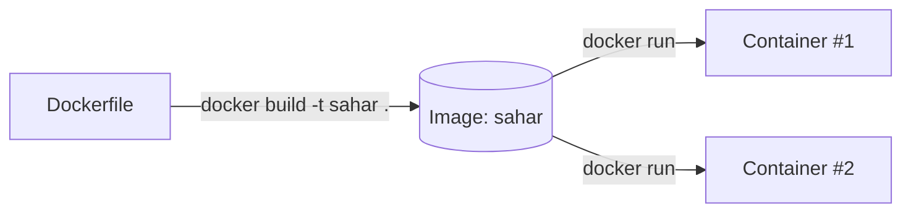
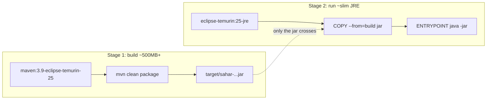
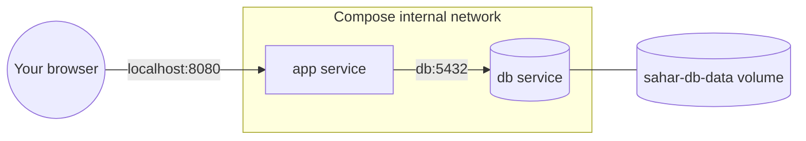

# Docker & Podman cheatsheet

> A dense, scannable reference for building, running, and composing the Sahar app's containers — Docker commands, the Dockerfile and Compose file Sahar actually ships, and the Podman equivalents.

**What you will get from this page:** the handful of `docker` commands you use 95% of the time (with one-line meanings), the exact Sahar `docker build` / `docker run` lines, every Dockerfile instruction Sahar uses explained in one glance, the `.dockerignore`, the Compose commands and what Sahar's `docker-compose.yml` declares, and a side-by-side Podman column showing what changes (and what doesn't) when you swap the engine.

For the *why* behind containers, layers, and 12-factor config, read [containers and devops](../docs/theory/containers-and-devops.md). For the step-by-step builds, see [step 11 (dockerize)](../docs/steps/11-dockerize.md) and [step 12 (compose)](../docs/steps/12-compose.md).

---

## 🔑 Image vs container, in one line

- **Image** = a read-only, baked template (your `Dockerfile`, built). Inert. You build it once, you can ship and re-run it anywhere.
- **Container** = a running (or stopped) *instance* of an image, with its own writable layer, network, and lifecycle. You can start many containers from one image.

Analogy: the image is a class, the container is an object. `docker build` produces the class; `docker run` instantiates it.



---

## 🐳 Core Docker commands

| Command | One-line meaning |
|---|---|
| `docker build -t name .` | Build an image from the `Dockerfile` in `.` and **t**ag it `name`. |
| `docker run name` | Start a container from image `name` (foreground, attached to your terminal). |
| `docker run -d name` | **D**etached — run in the background; prints the container ID. |
| `docker run -p 8080:8080 name` | **P**ublish `hostPort:containerPort` so you can reach it from your machine. |
| `docker run -e KEY=val name` | Set an **e**nvironment variable inside the container. |
| `docker run -v vol:/path name` | Mount a named **v**olume (or host dir) so data survives the container. |
| `docker run --name sahar name` | Give the container a stable name (instead of a random one). |
| `docker ps` | List **running** containers. |
| `docker ps -a` | List **all** containers, including stopped ones. |
| `docker logs <id\|name>` | Print a container's stdout/stderr. Add `-f` to follow (tail live). |
| `docker exec -it <id> sh` | Run a command **i**nteractively inside a running container (here, a shell). |
| `docker stop <id>` | Gracefully stop a running container (SIGTERM, then SIGKILL). |
| `docker rm <id>` | Remove a **stopped** container. Add `-f` to force-remove a running one. |
| `docker images` | List local images. |
| `docker rmi <image>` | Remove an image (must have no containers using it). |

Handy extras: `docker run --rm ...` auto-deletes the container when it exits (great for throwaway runs); `docker pull <image>` fetches an image without running it; `docker system prune` reclaims disk by deleting dangling images/containers/networks.

---

## ▶️ Sahar examples

```bash
# Build the image. The trailing "." is the build CONTEXT (this folder); -t names it "sahar".
docker build -t sahar .

# Run it detached, publishing 8080. With no env set, Sahar uses its default H2 file DB inside the container.
docker run -d -p 8080:8080 --name sahar sahar
# -> open http://localhost:8080  (and the API at /api/config, /api/prayer-times, ...)

# Tail the logs to watch it boot.
docker logs -f sahar

# Shell into the running container to poke around (the jar, the ./data H2 file, env).
docker exec -it sahar sh

# Stop and remove when done.
docker stop sahar && docker rm sahar
```

Running a **PostgreSQL 17** container by hand (what Compose does for you, but useful to understand). The `POSTGRES_*` env vars are read by the official `postgres` image on first start to create the DB, user, and password:

```bash
docker run -d --name sahar-db \
  -e POSTGRES_DB=sahar \
  -e POSTGRES_USER=sahar \
  -e POSTGRES_PASSWORD=sahar \
  -p 5432:5432 \
  -v sahar-db-data:/var/lib/postgresql/data \
  postgres:17-alpine
```

Then point Sahar at it via the `postgres` profile (the [step 09](../docs/steps/09-swap-to-postgres.md) wiring), passing config through the environment — no rebuild needed:

```bash
docker run -d -p 8080:8080 --name sahar \
  -e SPRING_PROFILES_ACTIVE=postgres \
  -e SAHAR_DB_URL=jdbc:postgresql://host.docker.internal:5432/sahar \
  -e SAHAR_DB_USERNAME=sahar \
  -e SAHAR_DB_PASSWORD=sahar \
  sahar
```

> [!NOTE]
> `host.docker.internal` is how a container reaches a service on *your host* (here, the separately-run Postgres). When both run under Compose, the app instead reaches the DB by its **service name** `db` (see below) — no host hop.

---

## 📋 The Sahar Dockerfile, instruction by instruction

Sahar uses a **multi-stage build**: a big `build` stage with the full JDK + Maven compiles the jar, and a slim `run` stage with just a JRE ships it. The compiler and Maven (hundreds of MB) never make it into the deployed image.

```dockerfile
# syntax=docker/dockerfile:1

# ---- Stage 1: build ----
FROM maven:3.9-eclipse-temurin-25 AS build      # full JDK + Maven; thrown away after
WORKDIR /app
COPY pom.xml .                                  # copy pom FIRST so deps cache on their own layer
COPY src ./src
RUN --mount=type=cache,target=/root/.m2 mvn -B -ntp -DskipTests clean package

# ---- Stage 2: run ----
FROM eclipse-temurin:25-jre AS run              # slim JRE — no compiler, no Maven
WORKDIR /app
RUN useradd --system --no-create-home --uid 10001 sahar
COPY --from=build /app/target/sahar-0.0.1-SNAPSHOT.jar app.jar   # copy ONLY the jar out of stage 1
RUN mkdir -p /app/data && chown -R sahar:sahar /app
USER sahar                                      # drop root: if compromised, attacker isn't root
EXPOSE 8080                                     # documents the port; does NOT publish it
ENTRYPOINT ["java", "-jar", "app.jar"]
```

| Instruction | What it does in Sahar |
|---|---|
| `# syntax=docker/dockerfile:1` | Opt into the modern BuildKit frontend (enables `--mount=type=cache`). |
| `FROM image AS name` | Start a build stage from a base image; `AS name` lets a later stage reference it. Two `FROM`s = two stages. |
| `WORKDIR /app` | Set the working directory for following instructions (created if missing). |
| `COPY src dst` | Copy files from the build context into the image layer. Sahar copies `pom.xml` first, then `src`, to maximize layer caching. |
| `COPY --from=build /app/target/...jar app.jar` | Copy a file **out of an earlier stage** — the whole point of multi-stage. Only the jar crosses over. |
| `RUN cmd` | Execute a command at build time, baking the result into a new layer (here: `mvn package`, `useradd`, `mkdir`/`chown`). |
| `RUN --mount=type=cache,target=/root/.m2 ...` | A **build-time** cache mount for Maven's `~/.m2`. Speeds up repeat builds; **not** part of the final image. |
| `USER sahar` | Switch to a non-root user for everything after (including the running process). |
| `EXPOSE 8080` | Documentation/metadata that the app listens on 8080. Publishing is done by `-p` at run time, not this. |
| `ENTRYPOINT ["java","-jar","app.jar"]` | The command the container runs on start. Exec form (JSON array) = no shell, signals reach Java directly. |

**Layer-caching rule of thumb:** Docker rebuilds from the first changed line downward. Sahar copies `pom.xml` and resolves dependencies *before* copying `src`, so editing Java does **not** re-download dependencies.



---

## 🗂️ `.dockerignore`

Keeps the **build context** (what gets sent to the engine) small and clean — anything rebuilt inside the image or irrelevant to the build is excluded. Sahar's:

```gitignore
target/
data/
*.mv.db
*.trace.db
.git/
.gitignore
.idea/
*.iml
.vscode/
.mvn/wrapper/maven-wrapper.jar
HELP.md
```

Why it matters: without it, a stale local `target/` or a multi-MB `.git/` history gets shipped to the daemon on every build — slower builds and a risk of leaking local artifacts into the image.

---

## 🧩 Docker Compose

Compose declares the **whole stack** (the app + its Postgres) in one YAML file and orchestrates them together. Use it instead of typing several long `docker run` lines.

| Command | One-line meaning |
|---|---|
| `docker compose up` | Create/start all services (foreground, logs interleaved). |
| `docker compose up --build` | Rebuild images first, then up. Use after changing the Dockerfile or source. |
| `docker compose up -d` | Up in the background (detached). |
| `docker compose ps` | List the services in this project and their state. |
| `docker compose logs -f` | Follow logs from all services (add a name: `logs -f app`). |
| `docker compose down` | Stop and remove the containers and network (**keeps** named volumes). |
| `docker compose down -v` | Same, but **also delete named volumes** — wipes the Postgres data. |
| `docker compose exec app sh` | Shell into the running `app` service. |

> [!IMPORTANT]
> `docker compose` (v2, a plugin) is the current form. The old standalone `docker-compose` (v1, hyphenated) is retired — use the space form.

### What Sahar's `docker-compose.yml` declares

```yaml
services:
  db:
    image: postgres:17-alpine
    environment:
      POSTGRES_DB: sahar
      POSTGRES_USER: sahar
      POSTGRES_PASSWORD: sahar
    volumes:
      - sahar-db-data:/var/lib/postgresql/data   # named volume -> data persists across down/up
    healthcheck:
      test: ["CMD-SHELL", "pg_isready -U sahar -d sahar"]
      interval: 5s
      timeout: 3s
      retries: 10

  app:
    build: .                                     # build from the Dockerfile in this folder
    depends_on:
      db:
        condition: service_healthy               # wait for the DB healthcheck, not just "started"
    environment:
      SPRING_PROFILES_ACTIVE: postgres
      SAHAR_DB_URL: jdbc:postgresql://db:5432/sahar   # "db" = the service's DNS name on the internal net
      SAHAR_DB_USERNAME: sahar
      SAHAR_DB_PASSWORD: sahar
    ports:
      - "${SAHAR_HOST_PORT:-8080}:8080"          # hostPort:containerPort; override SAHAR_HOST_PORT if 8080 is taken

volumes:
  sahar-db-data:
```

Key things it teaches:

- **services** — two: `db` (pulled `postgres:17-alpine`) and `app` (built from `.`).
- **depends_on + healthcheck** — the app waits for `condition: service_healthy`, i.e. until `pg_isready` succeeds, so the app never boots against a not-yet-ready database.
- **named volume** — `sahar-db-data` keeps Postgres files *outside* the container, so they survive `down` then `up`. (`down -v` deletes them.)
- **service-name networking** — Compose gives each service a DNS name equal to its service name. The app reaches Postgres at host `db` on the private network: no `localhost`, no published port needed *between* services. Only the app publishes a port to your machine.
- **no top-level `version:`** — obsolete in modern Compose; including it triggers a warning.



Run it:

```bash
docker compose up --build        # first time / after changes
docker compose up -d             # background
SAHAR_HOST_PORT=8086 docker compose up   # if 8080 is taken on your host
docker compose down              # stop, keep data
docker compose down -v           # stop AND wipe the DB volume
```

---

## 🦭 Podman: the equivalents

[Podman](https://podman.io/) is a drop-in alternative CLI. The headline differences:

- **Daemonless** — there is no long-running root daemon. `podman` forks the container directly, so there's no single privileged service to compromise or to crash everyone's containers.
- **Rootless by default** — containers run under *your* user, not root, without extra setup. Better security posture; the in-container UID maps to a sub-UID range on the host.
- **Mostly CLI-compatible** — `alias docker=podman` works for the everyday commands below. Differences surface mainly around volume permissions (rootless), localhost networking, and Compose.

| Task | Docker | Podman |
|---|---|---|
| Build | `docker build -t sahar .` | `podman build -t sahar .` |
| Run detached + publish | `docker run -d -p 8080:8080 sahar` | `podman run -d -p 8080:8080 sahar` |
| Env / volume / name | `-e`, `-v`, `--name` (same flags) | `-e`, `-v`, `--name` (same flags) |
| List running | `docker ps` | `podman ps` |
| Logs | `docker logs -f sahar` | `podman logs -f sahar` |
| Exec | `docker exec -it sahar sh` | `podman exec -it sahar sh` |
| Stop / remove | `docker stop` / `docker rm` | `podman stop` / `podman rm` |
| Images / remove image | `docker images` / `docker rmi` | `podman images` / `podman rmi` |
| Run Postgres | `docker run ... postgres:17-alpine` | `podman run ... postgres:17-alpine` |

### Compose with Podman

```bash
podman compose up --build      # uses an external compose provider under the hood
podman compose down -v
```

`podman compose` reads the **same** `docker-compose.yml` Sahar already ships — no separate file. It delegates to an installed Compose engine (e.g. `docker compose` or `podman-compose`). Podman also offers **`podman play kube`** / `podman kube` to run Kubernetes YAML directly, and **Quadlet** (`systemd` units) for managing containers as services — neither needed for Sahar, but good to know the ecosystem differs from Docker's.

**Rootless gotchas worth knowing for Sahar:**

- The non-root `sahar` user (UID 10001) in the Dockerfile is good practice under both engines. Under rootless Podman, that in-container UID is further remapped to a host sub-UID, so files written to the `./data` H2 dir or the Postgres volume are owned by a high-numbered host UID — usually fine, occasionally surprising if you inspect them on the host.
- If a rootless mount hits permission errors, add the SELinux relabel suffix on the volume, e.g. `-v sahar-db-data:/var/lib/postgresql/data:Z`.
- Rootless containers can't bind host ports below 1024 without extra config — Sahar uses 8080 and 5432, so this never bites here.

Flags and provider plumbing can change between releases; check [podman.io](https://podman.io/) and [docs.docker.com](https://docs.docker.com/) for the current details.

---

## 🔧 Quick troubleshooting

| Symptom | Likely cause / fix |
|---|---|
| `bind: address already in use` on 8080 | Something else owns the host port. Use `-p 8086:8080`, or `SAHAR_HOST_PORT=8086 docker compose up`. |
| App can't reach Postgres under Compose | Use host `db` (the service name), not `localhost`. The DB has no published port between services — that's expected. |
| App boots before DB is ready | Ensure `depends_on: db: condition: service_healthy` and a working `healthcheck`. |
| Data gone after `down` | You ran `down -v`, which deletes named volumes. Use plain `down` to keep `sahar-db-data`. |
| Build re-downloads all deps every time | A line above the `COPY pom.xml` changed, busting the cache. Keep `pom.xml` copied before `src`. |
| Permission denied writing `./data` (H2) | The `RUN mkdir -p /app/data && chown -R sahar:sahar /app` must run *before* `USER sahar`. Under rootless Podman, add `:Z` to bind mounts. |

---

## 🔗 Related

- Step: [11 — Dockerize](../docs/steps/11-dockerize.md)
- Step: [12 — Compose](../docs/steps/12-compose.md)
- Step: [09 — Swap to PostgreSQL](../docs/steps/09-swap-to-postgres.md)
- Theory: [Containers and DevOps](../docs/theory/containers-and-devops.md)
- Official docs: [docs.docker.com](https://docs.docker.com/) · [podman.io](https://podman.io/) · [postgresql.org](https://www.postgresql.org/)
- ↩️ Back to [README](../README.md)
