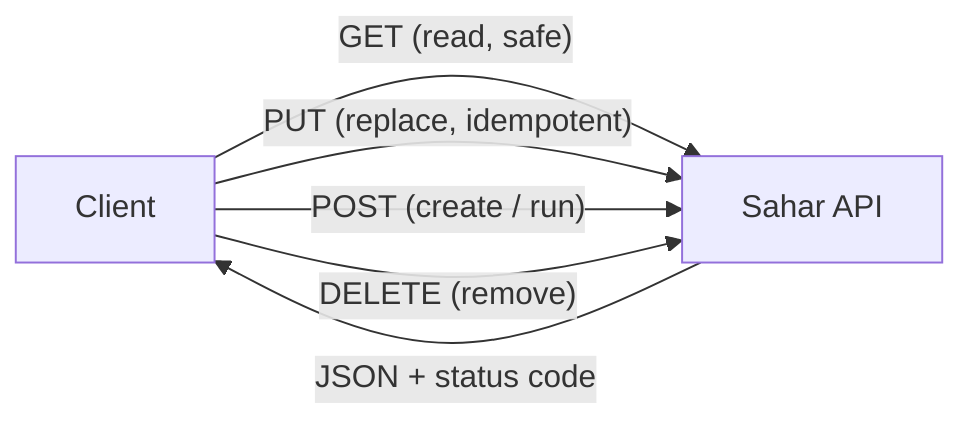

# HTTP & REST cheatsheet

> One-line summary: a scannable reference for the HTTP methods, status codes, and headers the **Sahar** API uses, with a full endpoint map and copy-paste `curl` / PowerShell calls.

**What you will get from this page:** the method semantics (safe/idempotent) at a glance; the status codes Sahar actually returns plus a wider reference list; the headers that matter for a JSON API; a table mapping every Sahar endpoint to its method, meaning, and success code; ready-to-run request examples in both `curl` and `Invoke-RestMethod`; and the exact shape of Sahar's `400` validation body.

For the *why* behind all of this, read the theory page [HTTP & REST](../docs/theory/http-and-rest.md). This page is the lookup table you keep open while you work.

---

## 🌐 HTTP methods at a glance

A method is **safe** if it is not supposed to change server state (a read). It is **idempotent** if doing it twice has the same effect as doing it once. These two properties drive almost every REST design decision in Sahar.

| Method | Meaning | Safe? | Idempotent? | Has body? | Sahar uses it for |
| --- | --- | --- | --- | --- | --- |
| `GET` | Read a resource | Yes | Yes | No (response only) | `GET /api/config`, `GET /api/prayer-times`, `GET /api/block`, `GET /api/schedule` |
| `POST` | Create a sub-resource, or run a process | No | **No** | Yes | `POST /api/schedule`, `POST /api/block/roll-forward`, `POST /api/block/weeks` |
| `PUT` | Replace the resource at this URL wholesale | No | **Yes** | Yes | `PUT /api/prayer-times`, `PUT /api/month`, `PUT /api/block`, `PUT /api/schedule/{id}`, `PUT /api/block/weeks/{ordinal}` |
| `PATCH` | Partially modify a resource | No | No (in general) | Yes | *not used in Sahar* |
| `DELETE` | Remove a resource | No | **Yes** | Usually no | `DELETE /api/schedule/{id}`, `DELETE /api/block/weeks/{ordinal}` |
| `HEAD` | Like `GET` but headers only | Yes | Yes | No | *not used (Spring provides it automatically)* |
| `OPTIONS` | Ask what a resource supports | Yes | Yes | No | *not used (CORS/preflight)* |

**Why this matters in Sahar:** updating the single prayer-times resource is a textbook `PUT` — sending the same body twice leaves the same state, so it is idempotent. Adding a schedule slot is `POST` — call it twice and you get two rows, so it is not idempotent. `DELETE` is idempotent in spirit (the row is gone either way); Sahar chooses to return `404` on a delete of something that does not exist, which is a defensible product decision, not an HTTP rule. See [step 02](../docs/steps/02-first-rest-endpoint.md) and [step 07](../docs/steps/07-full-crud.md).



---

## 🚦 Status codes Sahar returns

These five are the codes you will actually see hitting the Sahar API.

| Code | Name | When Sahar returns it | Body |
| --- | --- | --- | --- |
| `200` | OK | Successful `GET`, and successful `PUT` (returns the updated resource) | The resource JSON |
| `201` | Created | `POST /api/schedule` created a new slot | The created `ScheduleItem`, now with a database-assigned `id` |
| `204` | No Content | `DELETE /api/schedule/{id}` succeeded | *Empty* — nothing to return |
| `400` | Bad Request | `@Valid` body failed Bean Validation, or a business rule was broken (e.g. block not 4–5 weeks) | Validation: Sahar's `ApiError` shape (below). Rule: Spring's default error body |
| `404` | Not Found | `PUT`/`DELETE` on an `id`/`ordinal` that does not exist | Spring's default error body (not `ApiError`) |

How Sahar sets these:

- `201` and `204` are set declaratively with `@ResponseStatus` on the controller method — see `ScheduleController`:

  ```java
  @PostMapping
  @ResponseStatus(HttpStatus.CREATED)            // 201
  public ScheduleItem create(@Valid @RequestBody ScheduleItem item) { ... }

  @DeleteMapping("/{id}")
  @ResponseStatus(HttpStatus.NO_CONTENT)         // 204
  public void delete(@PathVariable Long id) { ... }
  ```

- `400` for a *validation* failure comes from `ApiExceptionHandler` (a `@RestControllerAdvice`), which catches `MethodArgumentNotValidException` and returns the tidy `ApiError` body. See [step 05](../docs/steps/05-validation-and-rules.md).
- `400` for a *business rule* and `404` for a *missing row* both come from the service throwing `ResponseStatusException`, e.g. `throw new ResponseStatusException(HttpStatus.NOT_FOUND, "no schedule item " + id)`. These use Spring's built-in error body, **not** `ApiError`.

> [!IMPORTANT]
> Heads-up: only the validation `400` has the `{status, error, messages[]}` shape. A `404` (or a rule-based `400`) carries Spring's default body. If you want them unified, you would add more handlers to `ApiExceptionHandler`.

### Wider reference list (common codes you may meet)

| Code | Name | Typical meaning |
| --- | --- | --- |
| `200` | OK | Generic success with a body |
| `201` | Created | New resource created; often with a `Location` header |
| `202` | Accepted | Accepted for async processing, not done yet |
| `204` | No Content | Success, deliberately empty body |
| `301` | Moved Permanently | Resource has a new permanent URL |
| `302` | Found | Temporary redirect |
| `304` | Not Modified | Cached copy is still valid (conditional `GET`) |
| `400` | Bad Request | Malformed or invalid request |
| `401` | Unauthorized | Not authenticated (you need credentials) |
| `403` | Forbidden | Authenticated but not allowed |
| `404` | Not Found | No such resource |
| `405` | Method Not Allowed | Wrong verb for this URL (Spring returns this automatically) |
| `409` | Conflict | State conflict, e.g. duplicate or version mismatch |
| `415` | Unsupported Media Type | Body `Content-Type` the server cannot read |
| `422` | Unprocessable Entity | Syntactically fine but semantically invalid (some APIs prefer this over `400` for validation) |
| `500` | Internal Server Error | Unhandled exception on the server |
| `503` | Service Unavailable | Server overloaded or down for maintenance |

Mnemonic: **2xx** worked, **3xx** go elsewhere, **4xx** *you* sent something wrong, **5xx** *the server* broke.

---

## 📨 Headers that matter for a JSON API

| Header | Direction | Purpose | Sahar value |
| --- | --- | --- | --- |
| `Content-Type` | Request (and response) | Declares the body's media type so the receiver knows how to parse it | `application/json` |
| `Accept` | Request | Tells the server which formats the client can handle | `application/json` |
| `Location` | Response | Points to a newly created resource (often with `201`) | Sahar returns the created body instead of a `Location` header on `POST /api/schedule` |

Rules of thumb:

- **You must send `Content-Type: application/json` on any request with a JSON body** (`PUT`/`POST`). Without it Spring may reject the body with `415 Unsupported Media Type`. `curl --json` and `Invoke-RestMethod -ContentType` set this for you.
- `Accept` is optional for Sahar because every endpoint only produces JSON, but it is good hygiene to send `Accept: application/json`.
- Sahar's `POST` returns the created object in the body (id included) rather than a bare `201 + Location`. Both are valid REST; returning the body saves the client a follow-up `GET`.

---

## 🗺️ The Sahar API map

Each row: endpoint → method → meaning → success status. Request bodies are JSON; path variables are in `{braces}`.

| Endpoint | Method | Meaning | Success |
| --- | --- | --- | --- |
| `/api/config` | `GET` | The whole routine config as one aggregate JSON object | `200` |
| `/api/prayer-times` | `GET` | The current month's prayer times | `200` |
| `/api/prayer-times` | `PUT` | Replace the prayer times wholesale | `200` |
| `/api/month` | `PUT` | Change the month label (`{ "month": "July 2026" }`) | `200` |
| `/api/block` | `GET` | The current training block | `200` |
| `/api/block` | `PUT` | Replace the block (validated: 4–5 weeks, deload last) | `200` |
| `/api/block/roll-forward` | `POST` | Start next month's block from the template | `200` |
| `/api/block/weeks` | `POST` | Add an accumulation week before the deload | `200` |
| `/api/block/weeks/{ordinal}` | `PUT` | Edit one week's name/dates/foci (`WeekUpdate` body) | `200` |
| `/api/block/weeks/{ordinal}` | `DELETE` | Drop a week (not the deload; min 4) | `200` |
| `/api/schedule` | `GET` | List all timeline slots (ordered by time) | `200` |
| `/api/schedule` | `POST` | Create a slot; db assigns the `id` | `201` |
| `/api/schedule/{id}` | `PUT` | Replace the slot at that id (`404` if missing) | `200` |
| `/api/schedule/{id}` | `DELETE` | Remove the slot (`404` if missing) | `204` |

> [!NOTE]
> Note on the block verbs: `roll-forward` and `weeks` (add) are `POST` because they *run a process* / *create*; replacing the whole block or one named week is `PUT` (idempotent); removing one week is `DELETE`. The `{ordinal}` is the week's position, pulled from the URL via `@PathVariable`. See [step 07](../docs/steps/07-full-crud.md).

---

## 🧾 Request bodies (the JSON shapes)

`PrayerTimes` — every time field must match 24-hour `HH:mm`; `methodNote` is free text:

```json
{
  "fajr": "04:37",
  "sunrise": "05:59",
  "dhuhr": "12:37",
  "asr": "17:12",
  "maghrib": "19:13",
  "isha": "20:36",
  "methodNote": "ISNA, angle 15°"
}
```

`ScheduleItem` — `id` is `null` when creating (db assigns it); `time` is `HH:mm`; `title` and `category` are required:

```json
{
  "time": "06:30",
  "title": "Fajr + journal",
  "detail": "5 min gratitude",
  "category": "pray",
  "dayType": "weekday"
}
```

`WeekUpdate` (body for `PUT /api/block/weeks/{ordinal}`) — deliberately omits `ordinal` and `deload`; those are decided by position, not the client:

```json
{
  "name": "Accumulation 2",
  "startDate": "2026-07-08",
  "endDate": "2026-07-14",
  "trainingFocus": "Upper hypertrophy",
  "backendFocus": "JdbcTemplate repos"
}
```

`MonthUpdate` (body for `PUT /api/month`):

```json
{ "month": "July 2026" }
```

---

## 📋 curl examples (copy-paste)

Assumes the app is running locally on `http://localhost:8080`. `--json` (curl 7.82+) sets `Content-Type` and `Accept` to `application/json` and takes the body; on older curl use `-H "Content-Type: application/json" -d '...'`.

```bash
# Read the whole config
curl http://localhost:8080/api/config

# Read prayer times
curl http://localhost:8080/api/prayer-times

# Replace prayer times (PUT with a JSON body)
curl -X PUT http://localhost:8080/api/prayer-times \
  --json '{
    "fajr":"04:37","sunrise":"05:59","dhuhr":"12:37",
    "asr":"17:12","maghrib":"19:13","isha":"20:36",
    "methodNote":"ISNA, angle 15°"
  }'

# Change the month label
curl -X PUT http://localhost:8080/api/month \
  --json '{"month":"July 2026"}'

# Create a schedule slot (POST -> 201, body has the new id)
curl -X POST http://localhost:8080/api/schedule \
  --json '{"time":"06:30","title":"Fajr + journal","detail":"5 min gratitude","category":"pray","dayType":"weekday"}'

# List schedule
curl http://localhost:8080/api/schedule

# Replace slot 3 (PUT)
curl -X PUT http://localhost:8080/api/schedule/3 \
  --json '{"time":"06:45","title":"Fajr + journal","detail":null,"category":"pray","dayType":"weekday"}'

# Delete slot 3 (DELETE -> 204, empty body)
curl -X DELETE http://localhost:8080/api/schedule/3

# Block operations
curl http://localhost:8080/api/block                          # GET the block
curl -X POST http://localhost:8080/api/block/roll-forward     # next month's block
curl -X POST http://localhost:8080/api/block/weeks            # add an accumulation week
curl -X PUT  http://localhost:8080/api/block/weeks/2 \
  --json '{"name":"Accumulation 2","startDate":"2026-07-08","endDate":"2026-07-14","trainingFocus":"Upper hypertrophy","backendFocus":"JdbcTemplate repos"}'
curl -X DELETE http://localhost:8080/api/block/weeks/2        # drop week 2
```

Useful flags: `-i` to see the status line and headers, `-s` to silence the progress meter, `-w '\n%{http_code}\n'` to print just the status code at the end.

```bash
# See the status code and headers (handy for checking 201 / 204 / 404)
curl -i -X DELETE http://localhost:8080/api/schedule/999    # expect: 404 (no such item) or 204 if it existed
```

---

## 🪟 PowerShell `Invoke-RestMethod` examples

`Invoke-RestMethod` (alias `irm`) parses JSON responses into objects automatically. Build the body as a hashtable and pipe through `ConvertTo-Json` so you do not fight quoting. `-ContentType 'application/json'` is the PowerShell equivalent of `--json`.

```powershell
# Read the whole config (returns a parsed object you can dot into)
Invoke-RestMethod http://localhost:8080/api/config

# Read prayer times
Invoke-RestMethod http://localhost:8080/api/prayer-times

# Replace prayer times (PUT)
$body = @{
  fajr = '04:37'; sunrise = '05:59'; dhuhr = '12:37'
  asr  = '17:12'; maghrib = '19:13'; isha  = '20:36'
  methodNote = 'ISNA, angle 15 deg'
} | ConvertTo-Json
Invoke-RestMethod -Method Put -Uri http://localhost:8080/api/prayer-times `
  -ContentType 'application/json' -Body $body

# Change the month label
Invoke-RestMethod -Method Put -Uri http://localhost:8080/api/month `
  -ContentType 'application/json' -Body (@{ month = 'July 2026' } | ConvertTo-Json)

# Create a schedule slot (POST -> 201; the returned object has the new id)
$slot = @{
  time = '06:30'; title = 'Fajr + journal'; detail = '5 min gratitude'
  category = 'pray'; dayType = 'weekday'
} | ConvertTo-Json
Invoke-RestMethod -Method Post -Uri http://localhost:8080/api/schedule `
  -ContentType 'application/json' -Body $slot

# List schedule
Invoke-RestMethod http://localhost:8080/api/schedule

# Delete slot 3 (DELETE -> 204)
Invoke-RestMethod -Method Delete -Uri http://localhost:8080/api/schedule/3

# Block: roll forward and add a week
Invoke-RestMethod -Method Post -Uri http://localhost:8080/api/block/roll-forward
Invoke-RestMethod -Method Post -Uri http://localhost:8080/api/block/weeks

# Edit week 2
$week = @{
  name = 'Accumulation 2'; startDate = '2026-07-08'; endDate = '2026-07-14'
  trainingFocus = 'Upper hypertrophy'; backendFocus = 'JdbcTemplate repos'
} | ConvertTo-Json
Invoke-RestMethod -Method Put -Uri http://localhost:8080/api/block/weeks/2 `
  -ContentType 'application/json' -Body $week
```

> [!TIP]
> Tip: to inspect the raw status code and headers in PowerShell, use `Invoke-WebRequest` instead of `Invoke-RestMethod` and read `.StatusCode`. On a `400`/`404`, `Invoke-RestMethod` throws; wrap it in `try { ... } catch { $_.Exception.Response }` to read the error body.

---

## ⚠️ The validation `400` response body

When a `@Valid @RequestBody` fails Bean Validation, `ApiExceptionHandler` returns HTTP `400` with this exact shape (`ApiError(int status, String error, List<String> messages)`):

```json
{
  "status": 400,
  "error": "validation failed",
  "messages": [
    "Fajr must be a 24-hour time like 04:37",
    "category is required",
    "time must be like 06:30"
  ]
}
```

Notes on the shape:

- `messages` collects **field errors** (formatted as `field: message` only for unnamed defaults; Sahar's constraints set custom `message` text, so you see the human-friendly string) and any **class-level** errors (the custom `@DeloadLast` rule on `BlockPlan`).
- The list is sorted for stable, readable ordering, so a test or a UI can rely on it.
- This is the body for *validation* `400`s only. A business-rule `400` (e.g. "a block is 4 or 5 weeks long") or a `404` ("no schedule item 7") comes from `ResponseStatusException` and uses Spring's default error body, which looks like:

  ```json
  {
    "timestamp": "2026-06-03T10:15:30.123+00:00",
    "status": 404,
    "error": "Not Found",
    "message": "no schedule item 7",
    "path": "/api/schedule/7"
  }
  ```

The editable admin UI in [step 08](../docs/steps/08-editable-admin-ui.md) reads `messages[]` from the validation body and shows them inline next to the form. See [step 05](../docs/steps/05-validation-and-rules.md) for how the validation and the handler are wired up.

---

## 🔗 Related

- Theory: [HTTP & REST](../docs/theory/http-and-rest.md) — the *why* behind methods, status codes, and idempotency.
- Step 02: [Your first REST endpoint](../docs/steps/02-first-rest-endpoint.md) — `@RestController`, `@GetMapping`, JSON serialization.
- Step 05: [Validation and rules](../docs/steps/05-validation-and-rules.md) — Bean Validation, `@DeloadLast`, the `400` handler.
- Step 07: [Full CRUD](../docs/steps/07-full-crud.md) — the five schedule endpoints and status codes `201`/`204`/`404`.
- Step 08: [Editable admin UI](../docs/steps/08-editable-admin-ui.md) — the browser client that calls these endpoints and renders the error body.
- Back to the [README](../README.md).
