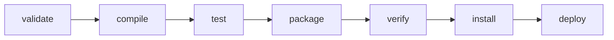
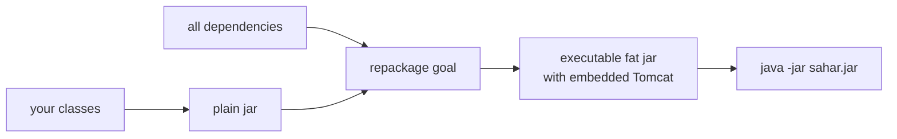
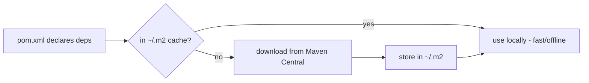

# Maven cheatsheet

> Everyday Maven for the Sahar app: the build lifecycle, the commands you actually type, what every block of `pom.xml` is for, and the Spring Boot 4 starter names you depend on.

**What you will get from this page:** a scannable reference you can keep open while you work. You will be able to read Sahar's real `pom.xml` line by line, run the right command for each task (run, test, package, debug a dependency), understand why `./mvnw` exists, and know the exact Boot 4 artifact names (and the Boot 3.x names they replaced).

This is a reference, not a tutorial. The walkthrough of these same concepts lives in [step 00 - baseline](../docs/steps/00-baseline.md).

---

## Mental model: what Maven actually is

Maven is two things at once, and conflating them causes most confusion:

1. **A build tool** - it compiles, tests, and packages your code by running a fixed sequence of *phases* (the "lifecycle").
2. **A dependency manager** - it downloads the libraries you declare (and *their* dependencies, transitively) from remote repositories into a local cache, so your code can compile against them.

Both are driven by one file: **`pom.xml`** (Project Object Model). It is the single source of truth for *how* Sahar is built and *what* it depends on. You do not script the build step-by-step; you *declare* what the project is, and Maven runs a conventional lifecycle over it.

> **Why a convention-heavy tool?** Because every Java project then looks the same: source in `src/main/java`, tests in `src/test/java`, resources in `src/main/resources`, output in `target/`. A new engineer (and a CI server) can build any Maven project with one command without reading a custom build script.

---

## The build lifecycle (phases)

Maven's default lifecycle is an **ordered** list of phases. When you run a phase, Maven runs **that phase and every phase before it**. So `mvn package` already ran `validate`, `compile`, and `test` for you.



| Phase | What it does | When you'd stop here |
| --- | --- | --- |
| `validate` | Checks the project is correct and all needed info is available (POM well-formed, etc.). | Rarely run alone. |
| `compile` | Compiles `src/main/java` into `target/classes`. | Quick "does it still compile?" check. |
| `test` | Runs **unit tests** (`src/test/java`) with Surefire. Build fails if a test fails. | Fast feedback loop. |
| `package` | Bundles compiled code into a `.jar` in `target/`. For Sahar, the Spring Boot plugin **repackages** it into an executable fat jar. | You want an artifact to run/ship. |
| `verify` | Runs **integration tests** (Failsafe) and other checks against the packaged artifact. | **This is what CI runs.** |
| `install` | Copies the artifact into your **local** repo (`~/.m2`) so other local projects can depend on it. | Sharing a build between local projects. |
| `deploy` | Uploads the artifact to a **remote** repository for other people/CI. | Publishing a library. |

> Sahar is an application, not a published library, so you almost never run `install` or `deploy`. The two phases that matter day to day are **`package`** (make the runnable jar) and **`verify`** (the full "is this change safe?" gate that CI uses).

There are also two lifecycles that run *outside* the default one:

- **`clean`** - deletes the `target/` directory. Combine it as `mvn clean package` to guarantee a from-scratch build.
- **`site`** - generates project documentation. You will not use it here.

---

## Phases vs goals (the bit that trips people up)

A **phase** is a stage in the lifecycle. A **goal** is a specific task provided by a plugin, written `plugin:goal`. Phases run by binding goals to them; you can also invoke a goal directly.

```bash
mvn package           # a PHASE - runs the whole lifecycle up to package
mvn spring-boot:run   # a GOAL  - runs the 'run' goal of the spring-boot plugin, directly
mvn dependency:tree   # a GOAL  - the 'tree' goal of the dependency plugin
```

`spring-boot:run` is the one you'll type most. It compiles your code and starts the app in place - no jar needed - which is perfect for the dev loop.

---

## Everyday commands

Use `./mvnw` (or `mvnw.cmd` / `.\mvnw` on Windows) instead of bare `mvn` - see [the wrapper section](#the-maven-wrapper-mvnw). Bare `mvn` is shown here for brevity.

```bash
# --- run the app -----------------------------------------------------------
mvn spring-boot:run                 # start Sahar; Ctrl-C to stop
mvn spring-boot:run \
  -Dspring-boot.run.profiles=postgres   # run with the 'postgres' profile active

# --- build & test ----------------------------------------------------------
mvn test                            # compile + run unit tests only
mvn package                         # compile + test + build the executable jar
mvn verify                          # package + run integration tests (the CI gate)
mvn -DskipTests package             # build the jar but SKIP running tests (still compiles tests)
mvn -Dmaven.test.skip=true package  # skip compiling AND running tests (faster, riskier)

# --- cleaning --------------------------------------------------------------
mvn clean                           # delete target/
mvn clean package                   # from-scratch build of the jar
mvn clean verify                    # from-scratch full check

# --- diagnostics -----------------------------------------------------------
mvn dependency:tree                 # show the full transitive dependency graph
mvn dependency:tree -Dincludes=org.flywaydb   # filter the tree to one group/artifact
mvn -version                        # print Maven + Java + OS versions
mvn help:effective-pom              # show the POM after the parent/BOM is merged in
mvn help:active-profiles            # which profiles are active and why

# --- CI-friendly flags -----------------------------------------------------
mvn -B -ntp verify                  # batch mode, no transfer progress (what Sahar's CI runs)
```

Sahar's GitHub Actions workflow runs exactly `mvn -B -ntp verify` on every push and pull request.

### Flags worth memorizing

| Flag | Meaning | Why |
| --- | --- | --- |
| `-B` / `--batch-mode` | Non-interactive, no ANSI colour. | Clean, parseable logs in CI. |
| `-ntp` / `--no-transfer-progress` | Hide the per-file download progress bars. | Keeps CI logs readable. |
| `-DskipTests` | Skip *running* tests (they still compile). | Fast local packaging when you trust the tests. |
| `-Dmaven.test.skip=true` | Skip *compiling and running* tests. | Faster still; use sparingly. |
| `-pl` / `-am` | Build specific modules / "also make" their deps. | Multi-module repos (not needed for single-module Sahar). |
| `-o` / `--offline` | Use only the local repo, no network. | Reproduce a build with no downloads. |
| `-U` | Force re-check of `SNAPSHOT` updates. | When a snapshot dep seems stale. |
| `-X` / `-e` | Debug / show full stack traces. | Diagnosing a confusing build failure. |

> **`-DskipTests` vs `-Dmaven.test.skip=true`:** the first still *compiles* your tests (so they can't silently rot), it just doesn't run them. The second skips compilation entirely. Prefer `-DskipTests` when you only want a quick jar.

---

## `pom.xml` anatomy (Sahar's real POM)

Below is Sahar's actual file, in the order it appears. Read it top to bottom once.

### 1. Parent / BOM - where versions come from

```xml
<parent>
    <groupId>org.springframework.boot</groupId>
    <artifactId>spring-boot-starter-parent</artifactId>
    <version>4.0.6</version>
    <relativePath/> <!-- look the parent up from the Maven repository, not a local folder -->
</parent>
```

`spring-boot-starter-parent` is itself a POM that Sahar **inherits** from. It brings:

- A **BOM (Bill of Materials)** - a curated, mutually-tested table of dependency versions. This is why almost every `<dependency>` below has **no `<version>`**: the parent already pins one that is known to work with Boot 4.0.6.
- **Plugin defaults** - sensible configuration for the compiler, Surefire, the Spring Boot plugin, etc.
- A **`java.version` hook** - setting the property below makes the compiler target that release.

`<relativePath/>` (empty) tells Maven *not* to look for the parent on disk, but to resolve it from the repository.

### 2. Coordinates - what THIS project is

```xml
<groupId>win.l0ve.sahar</groupId>
<artifactId>sahar</artifactId>
<version>0.0.1-SNAPSHOT</version>
```

The triple `groupId:artifactId:version` (GAV) uniquely identifies an artifact in every Maven repo on earth. `SNAPSHOT` means "in-development, may change" - Maven treats snapshot versions specially (it will re-fetch them). Sahar's base package matches the groupId: `win.l0ve.sahar`.

### 3. Properties

```xml
<properties>
    <!-- Compile and run against Java 25 (current LTS). Spring Boot 4 needs Java 17+. -->
    <java.version>25</java.version>
</properties>
```

`java.version` is a property the Spring Boot parent understands; it sets both the `--release` the compiler targets and the toolchain expectation. Properties are reusable `${...}` variables; the parent defines many you can override (e.g. a dependency version).

### 4. Dependencies and scopes

A `<dependency>` is a library you need. Its **`<scope>`** controls *when* it is on the classpath - this is the part beginners skip and later regret.

| Scope | On compile classpath? | On runtime classpath? | In the packaged jar? | Sahar example |
| --- | --- | --- | --- | --- |
| `compile` *(default)* | yes | yes | yes | `spring-boot-starter-webmvc` |
| `runtime` | no | yes | yes | `com.h2database:h2`, `org.postgresql:postgresql` |
| `provided` | yes | no | no | (none in Sahar - e.g. a servlet API supplied by a container) |
| `test` | test only | test only | no | the `*-test` starters |

Plus the modifier **`<optional>true</optional>`**: the dependency is used by *this* project but is **not** passed on transitively to anything that depends on Sahar. DevTools uses it:

```xml
<!-- DevTools: auto-restart on code change. 'optional' so it never leaks downstream;
     'runtime' because it's a dev convenience, not a compile-time API. -->
<dependency>
    <groupId>org.springframework.boot</groupId>
    <artifactId>spring-boot-devtools</artifactId>
    <scope>runtime</scope>
    <optional>true</optional>
</dependency>
```

Two examples of `runtime` scope and why it's correct: your code never imports an H2 or PostgreSQL class - you talk to the database through `JdbcTemplate` and JDBC interfaces. The **driver** only needs to be present when the app *runs*, so `runtime` keeps it off your compile classpath (you can't accidentally couple to a vendor class) while still shipping it in the jar.

```xml
<dependency>
    <groupId>com.h2database</groupId>
    <artifactId>h2</artifactId>
    <scope>runtime</scope>
</dependency>
```

### 5. The build plugin - what makes the executable jar

```xml
<build>
    <plugins>
        <plugin>
            <groupId>org.springframework.boot</groupId>
            <artifactId>spring-boot-maven-plugin</artifactId>
        </plugin>
    </plugins>
</build>
```

This single plugin does two jobs:

- During `package`, its **`repackage`** goal takes the plain jar Maven built and rewrites it into a **Spring Boot executable fat jar** - your classes, *all* your dependencies, and an embedded launcher + embedded Tomcat. The result runs with just `java -jar target/sahar-0.0.1-SNAPSHOT.jar` - no separate app server, no classpath wrangling.
- It provides the **`spring-boot:run`** goal you use in development.



---

## Spring Boot 4 starter names (and the 3.x names they replaced)

Sahar targets **Spring Boot 4.0.6**, which renamed and split several artifacts. If you copy a 3.x tutorial, these are the lines that will fail to resolve. Use the Boot 4 names.

| Purpose | Spring Boot 4 artifact (use this) | Replaced (Boot 3.x) |
| --- | --- | --- |
| Web (servlet MVC + Tomcat + JSON) | `org.springframework.boot:spring-boot-starter-webmvc` | `spring-boot-starter-web` |
| Bean Validation | `org.springframework.boot:spring-boot-starter-validation` | same name |
| JDBC + HikariCP + `JdbcTemplate` | `org.springframework.boot:spring-boot-starter-jdbc` | same name |
| H2 web console | `org.springframework.boot:spring-boot-h2console` | (was bundled with the H2 driver, toggled by a property) |
| H2 database engine | `com.h2database:h2` *(scope `runtime`)* | same |
| PostgreSQL driver | `org.postgresql:postgresql` *(scope `runtime`)* | same |
| Flyway migrations | `org.springframework.boot:spring-boot-starter-flyway` | `org.flywaydb:flyway-core` (added directly) |
| Flyway PostgreSQL support | `org.flywaydb:flyway-database-postgresql` | (folded into `flyway-core` before Flyway 10) |
| Test - web/MVC slice | `org.springframework.boot:spring-boot-starter-webmvc-test` *(scope `test`)* | `spring-boot-starter-test` (one starter for everything) |
| Test - JDBC slice | `org.springframework.boot:spring-boot-starter-jdbc-test` *(scope `test`)* | `spring-boot-starter-test` |
| Test - validation slice | `org.springframework.boot:spring-boot-starter-validation-test` *(scope `test`)* | `spring-boot-starter-test` |
| Test - Flyway slice | `org.springframework.boot:spring-boot-starter-flyway-test` *(scope `test`)* | `spring-boot-starter-test` |

Key Boot-4 ideas these reflect:

- **`web` -> `webmvc`.** The blocking servlet stack is now `spring-boot-starter-webmvc`; the reactive stack is `spring-boot-starter-webflux`. The name now states which model you chose.
- **Modular test starters.** Instead of one `spring-boot-starter-test`, you add only the slices you use. Each still pulls JUnit 5 + AssertJ + the matching Spring test support. Sahar uses four (`webmvc`, `jdbc`, `validation`, `flyway`).
- **Flyway is a starter now.** Boot 4 auto-configures Flyway via `spring-boot-starter-flyway`; the Postgres dialect is a separate module (required since Flyway 10). H2 support ships with the starter.
- **Jackson 3 / Spring Framework 7 / Jakarta EE 11.** You won't name these in the POM (the BOM pins them), but they ride along under Boot 4. Note the `jakarta.*` namespace - the old `javax.*` -> `jakarta.*` rename happened back in the 2.x -> 3.x jump, not this one.

> Artifact names and the minimum Java version can change across minor releases. When in doubt, check the dependency list for your exact version in the [Spring Boot 4.0.6 reference docs](https://docs.spring.io/spring-boot/4.0.6/).

---

## The Maven wrapper (`mvnw`)

Sahar ships a **Maven wrapper**: `mvnw` (shell), `mvnw.cmd` (Windows), and `.mvn/wrapper/maven-wrapper.properties`. The wrapper downloads and runs a **pinned Maven version** the first time it's used, so everyone - you, your teammate, the CI runner - builds with the *same* Maven, regardless of what is (or isn't) installed globally.

Sahar pins Maven via:

```properties
# .mvn/wrapper/maven-wrapper.properties
distributionUrl=https://repo.maven.apache.org/maven2/org/apache/maven/apache-maven/3.9.16/apache-maven-3.9.16-bin.zip
```

**Always prefer the wrapper over a system `mvn`:**

```bash
# macOS / Linux
./mvnw spring-boot:run
./mvnw -B -ntp verify

# Windows (PowerShell or cmd)
.\mvnw.cmd spring-boot:run
.\mvnw.cmd -B -ntp verify
```

Anything you can pass to `mvn`, you pass to `mvnw`. The only requirement on a fresh machine is a JDK; the wrapper fetches Maven itself.

---

## The local repository (`~/.m2`)

Every dependency Maven downloads is cached under your home directory:

- macOS / Linux: `~/.m2/repository`
- Windows: `%USERPROFILE%\.m2\repository`

How resolution works: when Sahar declares `spring-boot-starter-webmvc`, Maven checks `~/.m2` first. If it's there, it's used offline. If not, it's fetched from Maven Central into the cache, then reused forever. This is why your **first** build is slow and every build after is fast, and why CI caches `~/.m2` between runs (`cache: maven` in Sahar's workflow).

Useful facts:

- `~/.m2/settings.xml` (optional) configures mirrors, proxies, and credentials - it is **not** committed to the repo.
- To force fresh downloads of snapshots, add `-U`. To rule out network entirely, add `-o`.
- Deleting a corrupt artifact's folder under `~/.m2/repository/...` and rebuilding is a valid "turn it off and on again" fix.



---

## Troubleshooting quick hits

| Symptom | Likely cause / fix |
| --- | --- |
| `Could not resolve dependencies ... spring-boot-starter-web` | You used the Boot 3.x name. It's `-webmvc` in Boot 4. |
| `release version 25 not supported` | Your JDK is older than 25. Check `mvn -version`; install JDK 25. |
| Tests fail in `verify` but app runs fine | A real bug your tests catch - that's the point. Run `mvn test` to iterate. |
| Build downloads forever every time | You're online but not caching, or running with `-U` unnecessarily. |
| "Where did the jar go?" | `target/sahar-0.0.1-SNAPSHOT.jar` after `mvn package`. |
| A transitive version surprises you | `mvn dependency:tree` to see what pulled it in; the BOM usually decides. |
| Confused which config actually applies | `mvn help:effective-pom` shows the merged result of parent + your POM. |

---

## Related

- [Step 00 - Baseline](../docs/steps/00-baseline.md) - the guided walkthrough of this exact `pom.xml`.
- [Spring annotations cheatsheet](./cheatsheet-spring-annotations.md) - the annotations these starters bring to life.
- [Spring Boot 4.0.6 reference docs](https://docs.spring.io/spring-boot/4.0.6/) - official dependency and configuration reference.
- [Apache Maven documentation](https://maven.apache.org/guides/) - lifecycle, plugins, and the full POM reference.
- [Java SE 25 documentation](https://docs.oracle.com/en/java/javase/25/) - the language/runtime Sahar targets.
- [Project README](../README.md) - where this codealong starts.
