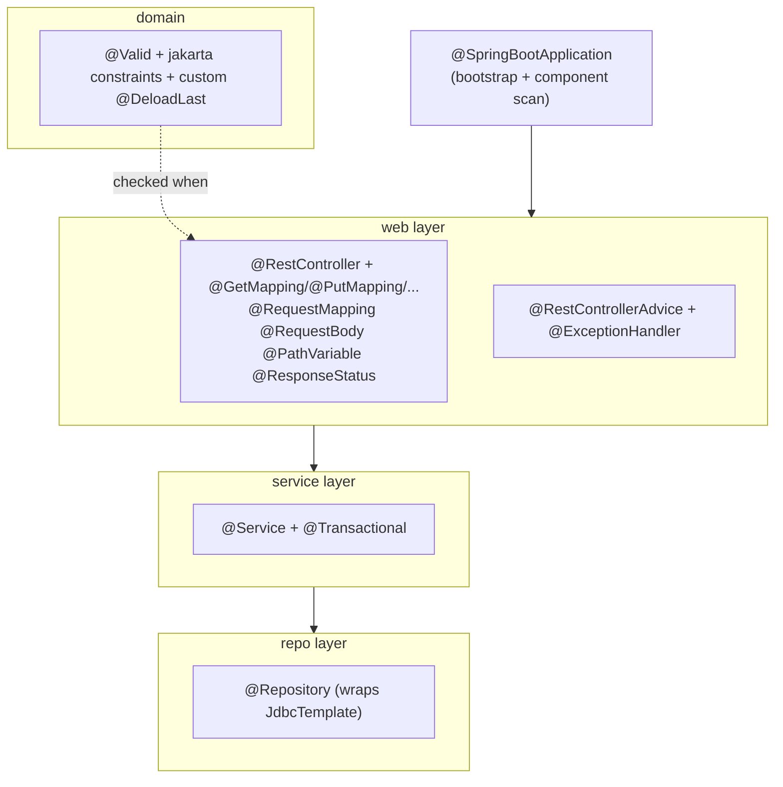

# Spring annotations cheatsheet

> Every Spring annotation that appears in the Sahar app, grouped by concern, with what it does, where it goes, and a real one-line example from the codebase.

**What you will get from this page:** a fast, scannable reference for the annotations you have already met (or are about to meet) while building Sahar — bootstrap, web/MVC, dependency injection, validation, and data. Each row is grounded in real Sahar code (`com.ramishtaha.sahar.*`), and a few honest notes flag annotations you will *not* find in Sahar but are likely to reach for next, so you know the difference.

A quick mental model first: annotations in Spring are mostly *markers and metadata*. They do nothing by themselves. Something else — the Spring Boot auto-configuration, component scanning, the MVC dispatcher, the Bean Validation engine — reads them at startup or per-request and acts on them. That is the recurring "why" on this page: the annotation describes intent; a framework piece enforces it.

---

## The map: which annotation belongs to which layer



Sahar's flow is `web -> service -> repo -> database`. The annotations below follow that path.

---

## 1. Bootstrap

| Annotation | What it does | Where it goes | Real Sahar example |
|---|---|---|---|
| `@SpringBootApplication` | Three annotations in one: `@SpringBootConfiguration` (this class is a bean-definition source), `@EnableAutoConfiguration` (configure beans by guessing from the classpath — sees Tomcat + Spring MVC, wires a web server), and `@ComponentScan` (scan this package and below for stereotypes). | On the single `main` class, at the **root** of your package tree. | `@SpringBootApplication public class SaharApplication { ... }` in `com.ramishtaha.sahar` |

```java
// SaharApplication.java
@SpringBootApplication
public class SaharApplication {
    public static void main(String[] args) {
        SpringApplication.run(SaharApplication.class, args);
    }
}
```

**Why the package matters.** Component scanning starts at the package of the `@SpringBootApplication` class (`com.ramishtaha.sahar`) and walks *downward*. Every controller, service, and repository lives under that package (`.web`, `.service`, `.repo`), so the scan finds them. A class placed *outside* `com.ramishtaha.sahar` would be invisible — no bean, no wiring. (See step [00-baseline](../docs/steps/00-baseline.md) for the project skeleton.)

---

## 2. Web / MVC

These annotations turn a plain class into HTTP endpoints. The piece that reads them is Spring MVC's `DispatcherServlet`, which matches an incoming request to a handler method and converts return values to JSON.

### Declaring controllers

| Annotation | What it does | Where it goes | Real Sahar example |
|---|---|---|---|
| `@RestController` | Marks a class as a web controller **and** says "every method's return value is the response body" (it bundles `@Controller` + `@ResponseBody`). Return a record or `List` and Spring serializes it to JSON via Jackson. | On a controller class. | `@RestController public class ConfigController { ... }` |
| `@Controller` | The plain stereotype: methods return a **view name** (a template to render), not a body. Sahar serves its UI as static files and returns JSON from `@RestController`, so it never uses bare `@Controller`. Reach for it when rendering server-side HTML (Thymeleaf, etc.). | On a controller class. | *(not used in Sahar)* |
| `@ResponseBody` | "Write this method's return value straight to the response body (as JSON), do not treat it as a view name." It is *implied* by `@RestController`, so you rarely write it explicitly. | On a method (or class) of a `@Controller`. | *(implied by `@RestController` everywhere in Sahar)* |

```java
// ConfigController.java — @RestController means config() is serialized to JSON automatically
@RestController
public class ConfigController {
    private final RoutineService routine;
    public ConfigController(RoutineService routine) { this.routine = routine; }

    @GetMapping("/api/config")
    public RoutineConfig config() {
        return routine.getConfig(); // returned record -> JSON, no @ResponseBody needed
    }
}
```

### Mapping requests to methods

| Annotation | What it does | Where it goes | Real Sahar example |
|---|---|---|---|
| `@RequestMapping("/api/schedule")` | Class-level base path (and optionally method/headers). Each method's path is appended to it. Keeps repetition out of the method mappings. | Usually on the class; can be on a method. | `@RequestMapping("/api/schedule")` on `ScheduleController` |
| `@GetMapping` | Handle HTTP **GET** (a read; safe and idempotent). Shorthand for `@RequestMapping(method = GET)`. | On a handler method. | `@GetMapping public List<ScheduleItem> list()` |
| `@PostMapping` | Handle **POST** (create a sub-resource or run a process; *not* idempotent). | On a handler method. | `@PostMapping("/roll-forward") public BlockPlan rollForward()` |
| `@PutMapping` | Handle **PUT** (replace the resource at this URL wholesale; idempotent). | On a handler method. | `@PutMapping("/api/prayer-times") public PrayerTimes update(...)` |
| `@DeleteMapping` | Handle **DELETE** (remove the resource). | On a handler method. | `@DeleteMapping("/{id}") public void delete(@PathVariable Long id)` |

`ScheduleController` shows all of these layered on a class-level base path — the canonical five-endpoint CRUD over one collection:

```java
// ScheduleController.java
@RestController
@RequestMapping("/api/schedule")          // base path for every method below
public class ScheduleController {

    @GetMapping                            // GET  /api/schedule
    public List<ScheduleItem> list() { ... }

    @PostMapping                           // POST /api/schedule
    @ResponseStatus(HttpStatus.CREATED)
    public ScheduleItem create(@Valid @RequestBody ScheduleItem item) { ... }

    @PutMapping("/{id}")                   // PUT  /api/schedule/{id}
    public ScheduleItem update(@PathVariable Long id, @Valid @RequestBody ScheduleItem item) { ... }

    @DeleteMapping("/{id}")                // DELETE /api/schedule/{id}
    @ResponseStatus(HttpStatus.NO_CONTENT)
    public void delete(@PathVariable Long id) { ... }
}
```

> **Why these verbs?** `BlockController` is the clearest illustration: replacing the block is `PUT /api/block` (idempotent), but "roll forward to next month" and "add a week" *create new state*, so they are `POST /api/block/roll-forward` and `POST /api/block/weeks`. Editing one named week is `PUT /api/block/weeks/{ordinal}`; removing it is `DELETE`. The HTTP method *is* the API design. See [http-and-rest theory](../docs/theory/http-and-rest.md) (and steps [02](../docs/steps/02-first-rest-endpoint.md), [07](../docs/steps/07-full-crud.md)).

### Pulling data out of the request

| Annotation | What it does | Where it goes | Real Sahar example |
|---|---|---|---|
| `@RequestBody` | Deserialize the request body (JSON) into the parameter, via Jackson. The mirror image of what `@RestController` does on the way out. | On a handler-method parameter. | `update(@Valid @RequestBody PrayerTimes prayerTimes)` |
| `@PathVariable` | Bind a `{...}` segment of the URL to the parameter. Spring converts the string to the parameter type (`Long`, `int`, ...). | On a handler-method parameter. | `delete(@PathVariable Long id)` ; `updateWeek(@PathVariable int ordinal, ...)` |
| `@RequestParam` | Bind a query-string parameter (`?key=value`) or form field; supports `required` and `defaultValue`. Sahar's reads take no query params today, so it does not appear — you would add it for, say, `GET /api/schedule?dayType=weekend`. | On a handler-method parameter. | *(not used in Sahar — would be `@RequestParam(defaultValue="weekday") String dayType`)* |

```java
// PrayerTimesController.java — @RequestBody turns the PUT JSON body into a PrayerTimes record
@PutMapping("/api/prayer-times")
public PrayerTimes update(@Valid @RequestBody PrayerTimes prayerTimes) {
    return routine.updatePrayerTimes(prayerTimes);
}
```

> **`@PathVariable` vs `@RequestBody` vs `@RequestParam`** — three different parts of the request. `@PathVariable` reads from the *URL path* (`/api/schedule/42` -> `id = 42`). `@RequestParam` reads from the *query string* (`?dayType=weekend`). `@RequestBody` reads the *whole body* (the JSON document). A create-and-update method like `ScheduleController.update` uses path + body together.

### Setting the response status

| Annotation | What it does | Where it goes | Real Sahar example |
|---|---|---|---|
| `@ResponseStatus(HttpStatus.X)` | Set the HTTP status code for a successful return (default is 200). The deliberate codes communicate intent: 201 = "created, here it is", 204 = "done, nothing to return". Also used on exception handlers (see §5). | On a handler method, or on an `@ExceptionHandler`, or on an exception class. | `@ResponseStatus(HttpStatus.CREATED)` on `create`; `@ResponseStatus(HttpStatus.NO_CONTENT)` on `delete` |

```java
@PostMapping
@ResponseStatus(HttpStatus.CREATED)   // 201 instead of the default 200
public ScheduleItem create(@Valid @RequestBody ScheduleItem item) { ... }
```

See step [04-in-memory-edit](../docs/steps/04-in-memory-edit.md) (first PUTs) and step [07-full-crud](../docs/steps/07-full-crud.md) (the full set with status codes).

---

## 3. Dependency injection (stereotypes + wiring)

A *bean* is an object Spring creates and manages in its application context. Stereotype annotations tell the component scan "create a bean from this class". They are functionally near-identical to `@Component`; the specific names document the layer and let tooling/aspects target a layer.

| Annotation | What it does | Where it goes | Real Sahar example |
|---|---|---|---|
| `@Component` | The generic "make this a bean" marker. The other three are specializations of it. Sahar always uses a more specific stereotype, so bare `@Component` does not appear — use it for a bean that is none of the below (e.g. a helper, a small strategy). | On a class. | *(not used in Sahar — specializations preferred)* |
| `@Service` | Stereotype for the service / business-logic layer. | On a service class. | `@Service public class RoutineService { ... }` |
| `@Repository` | Stereotype for the data-access layer. Bonus: it enables persistence exception translation (vendor SQL exceptions -> Spring's `DataAccessException` hierarchy). | On a repository class. | `@Repository public class ScheduleRepository { ... }` |
| `@Configuration` | Marks a class that *defines beans* via `@Bean` methods (Java config). Sahar leans on auto-configuration and stereotypes, so it has no hand-written `@Configuration` class yet — you add one when you need a bean you do not own (a third-party object) or custom wiring. | On a config class. | *(not used in Sahar)* |
| `@Bean` | Inside a `@Configuration` class, the method's return value becomes a bean (named after the method). Use it for objects you cannot annotate (library types). | On a method of a `@Configuration` class. | *(not used in Sahar)* |

```java
// RoutineService.java — @Service makes this a bean the controllers can be given
@Service
public class RoutineService {
    private final MetaRepository meta;
    private final PrayerTimesRepository prayerTimes;
    // ... seven repositories ...

    // Single constructor: Spring injects every repository bean. No @Autowired needed.
    public RoutineService(MetaRepository meta, PrayerTimesRepository prayerTimes, /* ... */) {
        this.meta = meta;
        this.prayerTimes = prayerTimes;
        // ...
    }
}
```

### Constructor injection and the `@Autowired` note

Sahar **never writes `@Autowired`** — and that is current best practice. Since Spring Framework 4.3, **if a bean has exactly one constructor, Spring uses it for injection automatically.** Every Sahar controller, the service, and every repository follow this pattern:

```java
// ConfigController.java
private final RoutineService routine;
public ConfigController(RoutineService routine) {   // one constructor -> auto-injected
    this.routine = routine;
}
```

Why constructor injection (not field injection)?

- **`final` fields** — dependencies are set once and cannot be `null`, so the object is always in a valid state.
- **Honest constructors** — the signature lists exactly what the class needs; you cannot forget to provide one.
- **Trivially testable** — in a unit test you just call `new RoutineService(mockRepo, ...)`; no Spring needed.

| Annotation | What it does | Where it goes | Real Sahar example |
|---|---|---|---|
| `@Autowired` | Asks Spring to inject a dependency. **Optional and omitted on a single constructor.** Still seen on field injection (`@Autowired private Foo foo;`) and on multi-constructor classes to pick the one to use — both of which Sahar avoids. | Constructor / field / setter. | *(not used in Sahar — single-constructor injection)* |

See the [Spring & DI theory page](../docs/theory/spring-and-di.md) for the full "why" behind beans and the container.

---

## 4. Validation

Bean Validation (the `jakarta.validation` standard, implemented by Hibernate Validator and pulled in by the validation starter) lets you *describe* rules with annotations on a record's components. They do nothing on their own — they are enforced when something marked `@Valid` is validated, which in Sahar happens when a controller receives a `@Valid @RequestBody`.

### The trigger and the built-in constraints

| Annotation | What it does | Where it goes | Real Sahar example |
|---|---|---|---|
| `@Valid` | The trigger. On a parameter: "validate this body before calling me." On a field/component: "cascade — validate the nested object(s) too." | Controller parameter, or a nested field. | `update(@Valid @RequestBody PrayerTimes prayerTimes)` ; `@Valid List<Week> weeks` |
| `@NotBlank` | String is non-null **and** has non-whitespace content. | On a `String` component. | `@NotBlank(message = "title is required") String title` |
| `@NotEmpty` | Collection/array/string is non-null and size > 0. (Allows whitespace, unlike `@NotBlank`.) | On a collection/string component. | `@NotEmpty(message = "a block needs weeks") List<Week> weeks` |
| `@Pattern(regexp=...)` | String matches a regex. Sahar validates `HH:mm` times this way. | On a `String` component. | `@Pattern(regexp = PrayerTimes.TIME, message = "time must be like 06:30") String time` |
| `@Size(min=, max=)` | Collection/array/string length is within bounds. | On a sized component. | `@Size(min = 4, max = 5, message = "a block is 4 or 5 weeks long") List<Week> weeks` |
| `@Min(value=)` | Numeric value is at least `value`. (`@Max` is the mirror.) | On a numeric component. | `@Min(value = 1, message = "week ordinal starts at 1") int ordinal` |

```java
// ScheduleItem.java — field constraints; enforced when a controller validates @Valid @RequestBody ScheduleItem
public record ScheduleItem(
        Long id,
        @NotBlank @Pattern(regexp = PrayerTimes.TIME, message = "time must be like 06:30") String time,
        @NotBlank(message = "title is required") String title,
        String detail,
        @NotBlank(message = "category is required") String category,
        String dayType
) {}
```

```java
// BlockPlan.java — @Size + cascading @Valid + a class-level custom rule, stacked
@DeloadLast                                        // custom, whole-object rule (see below)
public record BlockPlan(
        String label,
        @NotEmpty(message = "a block needs weeks")
        @Size(min = 4, max = 5, message = "a block is 4 or 5 weeks long")
        @Valid                                     // cascade into each Week
        List<Week> weeks
) { }
```

> **Cascade vs trigger.** `@Valid` on the controller parameter *triggers* validation of the body. `@Valid` on `List<Week> weeks` *cascades* it into each `Week`, so the `@Min`/`@NotBlank` rules on `Week` also run. Without the cascade, the nested weeks would be ignored.

### Writing a custom constraint: `@DeloadLast`

A single-field annotation cannot express "the deload week must be the last week, and only the last week" — that rule looks at the *whole* `BlockPlan`. A custom constraint is two pieces:

1. an annotation marked `@Constraint(validatedBy = ...)`, and
2. a `ConstraintValidator` class holding the logic.

| Annotation | What it does | Where it goes | Real Sahar example |
|---|---|---|---|
| `@Constraint(validatedBy=...)` | Meta-annotation that turns *your* annotation into a Bean Validation rule, naming the validator class. | On your custom annotation declaration. | `@Constraint(validatedBy = DeloadLastValidator.class)` on `@DeloadLast` |
| `@Target` / `@Retention` / `@Documented` | Standard `java.lang.annotation` meta-annotations: where the annotation may go (`TYPE` for a whole record), keep it at `RUNTIME` (so the validator can read it), and include it in Javadoc. | On the custom annotation. | `@Target(TYPE)` `@Retention(RUNTIME)` on `@DeloadLast` |
| `@DeloadLast` | The resulting custom rule. Because it inspects the whole record, it goes on the **type**, not a component. | On the `BlockPlan` record type. | `@DeloadLast public record BlockPlan(...)` |

```java
// DeloadLast.java — the annotation (note the three spec-required members)
@Documented
@Constraint(validatedBy = DeloadLastValidator.class)
@Target(TYPE)
@Retention(RUNTIME)
public @interface DeloadLast {
    String message() default "the deload must be the last week (and only the last week)";
    Class<?>[] groups() default {};
    Class<? extends Payload>[] payload() default {};
}
```

```java
// DeloadLastValidator.java — the logic; ConstraintValidator<A, T> ties annotation A to type T
public class DeloadLastValidator implements ConstraintValidator<DeloadLast, BlockPlan> {
    @Override
    public boolean isValid(BlockPlan block, ConstraintValidatorContext context) {
        if (block == null) return true;
        List<Week> weeks = block.weeks();
        if (weeks == null || weeks.isEmpty()) return true; // @NotEmpty/@Size handle size
        int lastIndex = weeks.size() - 1;
        for (int i = 0; i < weeks.size(); i++) {
            boolean isDeload = weeks.get(i).deload();
            boolean isLast = (i == lastIndex);
            if (isDeload != isLast) return false;
        }
        return true;
    }
}
```

> **Note the `message`/`groups`/`payload` members.** Every Bean Validation constraint annotation *must* declare these three; the spec requires them. And a good validator does one thing — `DeloadLastValidator` returns `true` for null/empty so it does not pile "deload" errors on top of "@Size too short" errors. The three required members are why the annotation looks heavier than the field constraints.

See step [05-validation-and-rules](../docs/steps/05-validation-and-rules.md) for the full build-up.

---

## 5. Turning failures into clean responses

When a `@Valid @RequestBody` fails, Spring throws `MethodArgumentNotValidException`. Left alone you get a verbose default 400 body. A controller advice intercepts it and shapes one tidy response for the whole API.

| Annotation | What it does | Where it goes | Real Sahar example |
|---|---|---|---|
| `@RestControllerAdvice` | A global interceptor for **every** `@RestController` — `@ControllerAdvice` + `@ResponseBody`. Its `@ExceptionHandler` methods catch exceptions thrown anywhere in the web layer and return JSON. | On an advice class. | `@RestControllerAdvice public class ApiExceptionHandler { ... }` |
| `@ExceptionHandler(X.class)` | Declares "this method handles exceptions of type X." | On a method inside an advice (or controller). | `@ExceptionHandler(MethodArgumentNotValidException.class)` |
| `@ResponseStatus` (again) | On the handler, sets the status returned for that exception. | On the handler method. | `@ResponseStatus(HttpStatus.BAD_REQUEST)` on `handleValidation` |

```java
// ApiExceptionHandler.java
@RestControllerAdvice
public class ApiExceptionHandler {

    public record ApiError(int status, String error, List<String> messages) {}

    @ExceptionHandler(MethodArgumentNotValidException.class)
    @ResponseStatus(HttpStatus.BAD_REQUEST)            // every validation failure -> 400
    public ApiError handleValidation(MethodArgumentNotValidException ex) {
        List<String> messages = new ArrayList<>();
        for (FieldError fe : ex.getBindingResult().getFieldErrors())
            messages.add(fe.getField() + ": " + fe.getDefaultMessage());
        for (ObjectError oe : ex.getBindingResult().getGlobalErrors())  // e.g. @DeloadLast
            messages.add(oe.getDefaultMessage());
        Collections.sort(messages);
        return new ApiError(400, "validation failed", messages);
    }
}
```

> Field errors (from `@NotBlank`, `@Size`, ...) appear under `getFieldErrors()`; the class-level `@DeloadLast` error appears under `getGlobalErrors()`. The handler merges both into one flat list the frontend can render.

---

## 6. Data / transactions

| Annotation | What it does | Where it goes | Real Sahar example |
|---|---|---|---|
| `@Repository` | (Repeated from §3.) Stereotype for the data layer; enables exception translation into Spring's `DataAccessException` hierarchy. Sahar's repositories wrap a `JdbcTemplate`. | On a repository class. | `@Repository public class ScheduleRepository { private final JdbcTemplate jdbc; ... }` |
| `@Transactional` | Run the method inside one database transaction: commit if it returns normally, **roll back** on a runtime exception. Essential for multi-statement writes that must be all-or-nothing. | On a public method (or class) of a Spring bean — typically the **service**, not the repo. | `@Transactional public BlockPlan replaceBlock(BlockPlan block) { ... }` |

```java
// RoutineService.java — replacing a block deletes old weeks and inserts new ones;
// @Transactional makes that atomic, so a mid-operation failure leaves the old block intact.
@Transactional
public BlockPlan replaceBlock(BlockPlan block) {
    requireValidBlock(block);
    blocks.replace(block);     // multiple SQL statements under the hood
    return blocks.find();
}
```

> **Why `@Transactional` on the service, not the repository?** A single business action (replace a block, add a week) may touch several rows or tables. The transaction boundary belongs where the *unit of work* is decided — the service method — so all of `replaceBlock`'s statements commit or roll back together. `rollForward`, `addWeek`, `dropWeek`, and `updateWeek` are all annotated for the same reason. A method that does one simple read/write (like `updatePrayerTimes`) does not need it.
>
> **Gotcha:** `@Transactional` works through a Spring proxy, so it only applies when the call comes *from outside* the bean. A `this.someTransactionalMethod()` self-call bypasses the proxy and the transaction does not start. Call across beans (controller -> service) to be safe.

See step [06-jdbctemplate-h2](../docs/steps/06-jdbctemplate-h2.md) for the repository pattern and step [07-full-crud](../docs/steps/07-full-crud.md) for the transactional writes.

---

## At-a-glance summary

| Concern | Annotations |
|---|---|
| **Bootstrap** | `@SpringBootApplication` |
| **Web — declare** | `@RestController` (`@Controller` + `@ResponseBody` for views) |
| **Web — map** | `@RequestMapping`, `@GetMapping`, `@PostMapping`, `@PutMapping`, `@DeleteMapping` |
| **Web — bind** | `@RequestBody`, `@PathVariable`, `@RequestParam` |
| **Web — status/errors** | `@ResponseStatus`, `@RestControllerAdvice`, `@ExceptionHandler` |
| **DI** | `@Service`, `@Repository`, `@Component`, `@Configuration`, `@Bean`, (`@Autowired` — usually omitted) |
| **Validation** | `@Valid`, `@NotBlank`, `@NotEmpty`, `@Pattern`, `@Size`, `@Min`, `@Constraint` + `@DeloadLast` |
| **Data** | `@Repository`, `@Transactional` |

> **Spring Boot 4 / Jakarta note.** Validation constraints live under `jakarta.validation.constraints.*` (the `javax -> jakarta` rename happened back in the Spring 5 -> 6 / Boot 2 -> 3 jump; Boot 4 keeps `jakarta.*`). The web MVC annotations above (`@RestController`, `@GetMapping`, ...) are unchanged in Boot 4 — what changed is the *starter* name (`spring-boot-starter-webmvc`) and JSON is now Jackson 3 (`tools.jackson`). The annotations themselves are stable; if a detail ages, check the official docs below.

---

## Related

- Theory: [Spring & dependency injection](../docs/theory/spring-and-di.md) — why beans, the container, and DI exist
- Theory: [HTTP & REST](../docs/theory/http-and-rest.md) — why GET/POST/PUT/DELETE map the way they do
- Step [02 — first REST endpoint](../docs/steps/02-first-rest-endpoint.md)
- Step [04 — in-memory edit](../docs/steps/04-in-memory-edit.md)
- Step [05 — validation and rules](../docs/steps/05-validation-and-rules.md)
- Step [06 — JdbcTemplate + H2](../docs/steps/06-jdbctemplate-h2.md)
- Step [07 — full CRUD](../docs/steps/07-full-crud.md)
- Reference: [glossary](./glossary.md)
- Reference: [SQL + JDBC cheatsheet](./cheatsheet-sql-jdbc.md)
- Official: [Spring Boot 4.0.6 reference](https://docs.spring.io/spring-boot/4.0.6/) · [Spring Web MVC](https://docs.spring.io/spring-framework/reference/web/webmvc.html) · [Bean Validation in Spring](https://docs.spring.io/spring-framework/reference/core/validation/beanvalidation.html)
- Back to the [README](../README.md)
