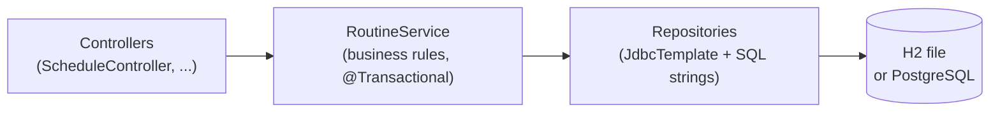
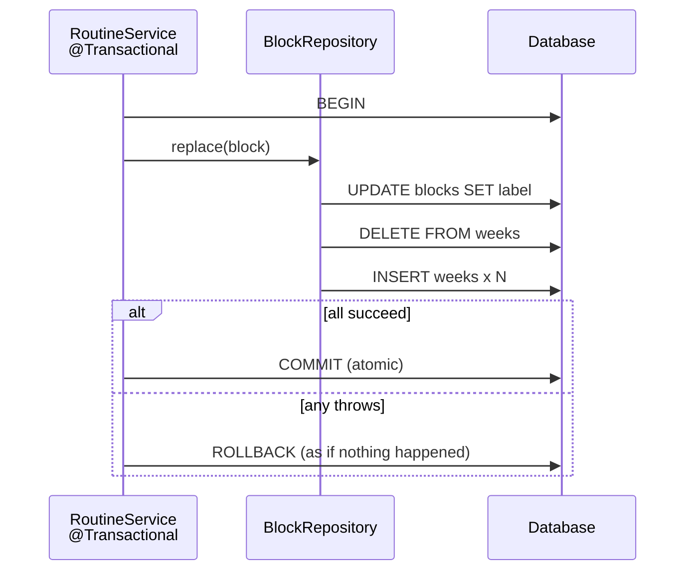

# SQL & JdbcTemplate cheatsheet

> The SQL Sahar actually uses, and the handful of `JdbcTemplate` methods that run it: portable DDL, bind parameters (and why they stop SQL injection), `query`/`queryForObject`/`update`, the `RowMapper`, the generated-key pattern, transactions, and which repository owns which table.

**What you will get from this page:** a dense, scannable reference you can keep open while writing or reading a repository. Every snippet here is copied or distilled from the real Sahar code under `app/src/main/java/com/ramishtaha/sahar/repo/` and `app/src/main/resources/db/migration/`, so it matches what you will see in the checkpoints exactly.

This is a reference, not a tutorial. The guided walkthroughs of these ideas live in [step 06 - JdbcTemplate + H2](../docs/steps/06-jdbctemplate-h2.md), [step 07 - full CRUD](../docs/steps/07-full-crud.md), and [step 10 - seed and migrations](../docs/steps/10-seed-and-migrations.md). The *why JdbcTemplate at all* discussion is in [theory: persistence landscape](../docs/theory/persistence-landscape.md) and [theory: JDBC vs JPA](../docs/theory/jdbc-vs-jpa.md).

---

## Mental model: where SQL lives in Sahar

Sahar is layered. SQL exists in exactly one place - the repository layer. Everything above it deals in domain records.



The repository's whole job is to translate between **rows** (a `ResultSet`) and **objects** (Java records). The service never sees a `ResultSet`; the controller never sees SQL. That separation is the payoff: in [step 09](../docs/steps/09-swap-to-postgres.md) you swap H2 for PostgreSQL and only the *wiring* changes - the repository SQL, written in portable DDL, runs unchanged.

> `JdbcTemplate` is auto-configured by `spring-boot-starter-jdbc` from your `spring.datasource.*` properties. You never `new` it; you inject it through the constructor. It removes the tedious JDBC ceremony (open connection, prepare statement, set parameters, iterate, close everything, translate exceptions) and leaves you writing just the SQL and a `RowMapper`.

---

## SQL basics used in Sahar

### CREATE TABLE with portable types

Sahar's DDL (in `V1__init_schema.sql`) sticks to SQL-standard types so the *same file* runs on H2 and PostgreSQL 17.

```sql
CREATE TABLE schedule_items (
    id         BIGINT GENERATED BY DEFAULT AS IDENTITY PRIMARY KEY,
    slot_time  VARCHAR(5)   NOT NULL,
    title      VARCHAR(200) NOT NULL,
    detail     VARCHAR(300),
    category   VARCHAR(20)  NOT NULL,
    day_type   VARCHAR(20)  NOT NULL,
    sort_order INT NOT NULL
);
```

| Type | Use for | Notes |
| --- | --- | --- |
| `INT` | small whole numbers, fixed-row PKs (`app_meta.id = 1`) | 32-bit. |
| `BIGINT` | auto-generated surrogate keys (`schedule_items.id`) | 64-bit; pairs with Java `long`/`Long`. |
| `VARCHAR(n)` | text with a length cap | Sahar stores times as `VARCHAR(5)` ("04:37") because that is how they are edited and displayed. |
| `BOOLEAN` | true/false flags (`weeks.deload`) | Maps to Java `boolean`/`Boolean`. |
| `GENERATED BY DEFAULT AS IDENTITY` | "auto-increment" surrogate key | **The portable, SQL-standard way.** Works identically on H2 and PostgreSQL, unlike vendor syntax (`AUTO_INCREMENT`, `SERIAL`). |

Constraints you will see: `PRIMARY KEY` (unique, not null, the row's identity), `NOT NULL` (required column), and `DEFAULT FALSE` (a value used when INSERT omits the column, e.g. `deload BOOLEAN NOT NULL DEFAULT FALSE`).

> **Why `GENERATED BY DEFAULT` and not `GENERATED ALWAYS`?** `BY DEFAULT` lets you *also* supply an explicit id when you want to (handy for deterministic seeding); `ALWAYS` forbids it. Sahar's child tables (`weeks`, `schedule_items`, ...) let the DB assign ids, while the singleton tables (`app_meta`, `prayer_times`, `blocks`) use a fixed `id = 1` declared as plain `INT PRIMARY KEY`.

### INSERT / SELECT / UPDATE / DELETE

The four statements Sahar runs, with real examples:

```sql
-- INSERT: add a row. List the columns; let the DB fill the IDENTITY id and any DEFAULTs.
INSERT INTO weekly_grid (day_of_week, discipline, note, sort_order) VALUES (?, ?, ?, ?);

-- SELECT: read rows. WHERE filters, ORDER BY sorts.
SELECT * FROM schedule_items WHERE id = ?;
SELECT * FROM weeks WHERE block_id = 1 ORDER BY ordinal;
SELECT COUNT(*) FROM blocks;                 -- aggregate -> a single number
SELECT label FROM blocks WHERE id = 1;       -- one column of one row

-- UPDATE: change existing rows. WITHOUT a WHERE this hits EVERY row - always scope it.
UPDATE app_meta SET month_label = ? WHERE id = 1;

-- DELETE: remove rows. Same warning: a missing WHERE empties the table.
DELETE FROM weeks WHERE block_id = 1;
DELETE FROM schedule_items WHERE id = ?;
```

`WHERE` selects which rows a statement touches. `ORDER BY` sets the order rows come back in - Sahar relies on it so the UI renders correctly: `ORDER BY slot_time, id` puts the timeline in time order (the `HH:mm` strings sort correctly), and `ORDER BY sort_order` keeps the grid in Mon..Sun display order. **SQL does not guarantee any order without `ORDER BY`** - never depend on insertion order.

---

## Bind parameters and SQL injection

Those `?` marks are **bind (placeholder) parameters**. You write the SQL once with `?` where a value goes, and pass the values *separately*. The database compiles the statement and then slots the values in as data - they can never be interpreted as SQL.

```java
// SAFE - the value is bound, never parsed as SQL.
jdbc.update("DELETE FROM schedule_items WHERE id = ?", id);
```

The dangerous alternative is string concatenation:

```java
// NEVER DO THIS. If `title` is  x'; DROP TABLE schedule_items; --
// you just handed the user a way to run their own SQL.
jdbc.update("UPDATE schedule_items SET title = '" + title + "' WHERE id = " + id);
```

That is **SQL injection**: untrusted input becomes executable SQL. Bind parameters are the fix, and they are not optional good manners - they are the difference between a safe app and a breached one. Every Sahar repository uses `?` for every value; you will not find a single concatenated value in `repo/`.

> Bonus: bound statements are also faster under load (the DB can reuse the compiled plan) and they handle quoting, escaping, NULLs, and types for you. There is no reason to concatenate.

---

## JdbcTemplate methods you actually use

A tiny surface area covers all of Sahar. Inject `JdbcTemplate` through the constructor (Spring provides it):

```java
private final JdbcTemplate jdbc;
public ScheduleRepository(JdbcTemplate jdbc) { this.jdbc = jdbc; }
```

| Method | Returns | Use for |
| --- | --- | --- |
| `query(sql, rowMapper, args...)` | `List<T>` | A SELECT that maps every matching row. |
| `queryForObject(sql, Type.class, args...)` | one scalar `T` | A SELECT of a single value: `COUNT(*)`, one column of one row. |
| `update(sql, args...)` | `int` (rows affected) | INSERT / UPDATE / DELETE with bind args. |
| `update(PreparedStatementCreator, KeyHolder)` | `int` + fills the key | INSERT where you need the generated id back. |

### query + RowMapper (read many)

```java
public List<ScheduleItem> findAll() {
    return jdbc.query("SELECT * FROM schedule_items ORDER BY slot_time, id", MAPPER);
}
```

### Read one (`Optional` via stream, not a thrown exception)

Sahar avoids `queryForObject` for "one row that may be absent" because it *throws* when zero rows come back. Instead it queries into a list and takes the first:

```java
public Optional<ScheduleItem> findById(Long id) {
    return jdbc.query("SELECT * FROM schedule_items WHERE id = ?", MAPPER, id)
               .stream().findFirst();
}
```

The service then decides what "absent" means (a 404, a seeding error, etc.).

### queryForObject (read one scalar)

Use `queryForObject` when you *expect* exactly one value, like an aggregate:

```java
public boolean exists() {
    Integer count = jdbc.queryForObject("SELECT COUNT(*) FROM blocks", Integer.class);
    return count != null && count > 0;
}

// One column of the known-present singleton row:
String label = jdbc.queryForObject("SELECT label FROM blocks WHERE id = 1", String.class);
```

> `queryForObject` throws `EmptyResultDataAccessException` for zero rows and `IncorrectResultSizeDataAccessException` for more than one. That strictness is a feature for `COUNT(*)` (always one row) but a trap for "find by id" - hence the `query(...).stream().findFirst()` pattern above.

### update (write, returns the affected row count)

`update` runs INSERT/UPDATE/DELETE and returns **how many rows changed**. Sahar uses that number to detect "no such id" without a second query:

```java
/** Returns the number of rows changed - 0 means "no such id". */
public int update(Long id, ScheduleItem item) {
    return jdbc.update("""
            UPDATE schedule_items
               SET slot_time = ?, title = ?, detail = ?, category = ?, day_type = ?
             WHERE id = ?
            """,
            item.time(), item.title(), item.detail(), item.category(), dayType, id);
}
```

The service turns `0` into a 404:

```java
public void deleteScheduleItem(Long id) {
    if (schedule.delete(id) == 0) {
        throw new ResponseStatusException(HttpStatus.NOT_FOUND, "no schedule item " + id);
    }
}
```

### PreparedStatementCreator + GeneratedKeyHolder (get the new id)

When you INSERT a row whose `id` is an IDENTITY, the DB assigns the id - and the caller needs it back (the frontend uses it to later update or delete the row). The pattern: build the `PreparedStatement` yourself with `RETURN_GENERATED_KEYS`, hand `JdbcTemplate` a `KeyHolder`, then read the key out. This is the one repository method that is more than a one-liner, and it is worth knowing by heart:

```java
public ScheduleItem create(ScheduleItem item) {
    String dayType = item.dayType() == null ? "weekday" : item.dayType();
    KeyHolder keys = new GeneratedKeyHolder();
    jdbc.update(con -> {
        PreparedStatement ps = con.prepareStatement("""
                INSERT INTO schedule_items (slot_time, title, detail, category, day_type, sort_order)
                VALUES (?, ?, ?, ?, ?, 0)
                """, Statement.RETURN_GENERATED_KEYS);
        ps.setString(1, item.time());
        ps.setString(2, item.title());
        ps.setString(3, item.detail());
        ps.setString(4, item.category());
        ps.setString(5, dayType);
        return ps;
    }, keys);
    Long id = keys.getKey().longValue();
    return findById(id).orElseThrow();   // re-read so the caller gets the full, DB-defaulted row
}
```

Required imports for this pattern:

```java
import org.springframework.jdbc.support.GeneratedKeyHolder;
import org.springframework.jdbc.support.KeyHolder;
import java.sql.PreparedStatement;
import java.sql.Statement;
```

> Note the parameters are set 1-based (`ps.setString(1, ...)`), matching the `?` positions left to right. For the simple `update(sql, args...)` overload, `JdbcTemplate` does this binding for you - you only drop to a `PreparedStatementCreator` when you need the generated key (or other advanced statement options).

---

## The RowMapper: one row -> one object

A `RowMapper<T>` is a function from a `ResultSet` row to a `T`. Sahar declares one `static final` mapper per repository as a lambda, reads columns by name, and constructs the domain record positionally:

```java
private static final RowMapper<ScheduleItem> MAPPER = (rs, rowNum) -> new ScheduleItem(
        rs.getLong("id"),
        rs.getString("slot_time"),
        rs.getString("title"),
        rs.getString("detail"),
        rs.getString("category"),
        rs.getString("day_type"));
```

| `ResultSet` getter | Java type | Sahar example |
| --- | --- | --- |
| `rs.getString("col")` | `String` | every text column |
| `rs.getLong("id")` | `long` | IDENTITY keys |
| `rs.getInt("ordinal")` | `int` | `weeks.ordinal` |
| `rs.getBoolean("deload")` | `boolean` | `weeks.deload` |

Read columns **by name**, not by index - it survives column reordering and reads clearly. The `rowNum` argument (0-based row counter) is rarely needed; Sahar ignores it everywhere.

> Because the domain types are Java **records**, the mapper is just a constructor call with the columns in the record's component order. There is no setter ceremony, no mutable object - the mapper *is* the schema-to-domain contract for that table.

---

## Transactions: why block replace is atomic

A **transaction** groups several statements so they all commit together or none do. `@Transactional` on a service method tells Spring to open a transaction before the method runs and commit it after - or roll everything back if the method throws.

The block-replace operation is the reason Sahar needs this. Replacing a block touches *three* statements across *two* tables:

```java
// BlockRepository.replace - three writes that must be all-or-nothing
public void replace(BlockPlan block) {
    jdbc.update("UPDATE blocks SET label = ? WHERE id = 1", block.label());
    jdbc.update("DELETE FROM weeks WHERE block_id = 1");
    insertWeeks(block);   // N inserts
}
```

If the process died between the `DELETE` and the inserts, the block would have *no weeks* - a corrupt, half-written state a reader could observe. So the service method that calls `replace` is annotated:

```java
@Transactional
public BlockPlan replaceBlock(BlockPlan block) {
    requireValidBlock(block);     // throws -> nothing is committed
    blocks.replace(block);        // UPDATE + DELETE + N INSERTs, all in one transaction
    return blocks.find();
}
```



Rules of thumb:

- Put `@Transactional` on the **service** method, not the repository - the service defines the unit of work (one business operation = one transaction). All of Sahar's block operations (`replaceBlock`, `rollForward`, `addWeek`, `dropWeek`, `updateWeek`) are `@Transactional` for exactly this reason.
- It rolls back on **unchecked** exceptions by default. The validation throw in `requireValidBlock` aborts the transaction before any write commits.
- Single-statement writes (a lone `UPDATE` or `DELETE`) are already atomic on their own; you do not need `@Transactional` for `updatePrayerTimes` or `updateMonth`.
- The annotation lives in `org.springframework.transaction.annotation.Transactional`.

---

## Sahar tables and which repository owns each

Eight tables, each owned by exactly one repository. "Owns" means that repository is the only code that writes SQL against it.

| Table | Repository | Shape | Key |
| --- | --- | --- | --- |
| `app_meta` | `MetaRepository` | singleton (title, tagline, month) | `id = 1` |
| `prayer_times` | `PrayerTimesRepository` | singleton (6 prayer times + note) | `id = 1` |
| `blocks` | `BlockRepository` | singleton parent (label) | `id = 1` |
| `weeks` | `BlockRepository` | children of the block, ordered by `ordinal` | IDENTITY |
| `schedule_items` | `ScheduleRepository` | full CRUD list (the only fully editable collection) | IDENTITY |
| `weekly_grid` | `GridRepository` | reference list (read + seed only) | IDENTITY |
| `supplements` | `SupplementRepository` | reference list (read + seed only) | IDENTITY |
| `diet_sections` | `DietRepository` | reference list (read + seed only) | IDENTITY |

> `BlockRepository` is the only repository that spans two tables (`blocks` + `weeks`). That aggregate shape - one parent row, N ordered child rows - is why reading a block is two queries and replacing it is "update parent, delete children, re-insert children" inside a transaction.

---

## Reserved words: why the odd column and table names

Some perfectly natural names collide with SQL keywords, which breaks (or silently mangles) queries on some engines. Sahar dodges them on purpose:

| Tempting name | Problem | Sahar uses |
| --- | --- | --- |
| `time` (column) | `TIME` is a SQL type/keyword | `slot_time` |
| `day` (column) | reserved on several engines | `day_of_week` |
| `week`, `block` (tables) | keyword-adjacent / ambiguous | **plural** tables: `weeks`, `blocks` |
| `order` (column) | `ORDER` is a keyword (as in `ORDER BY`) | `sort_order` |

The general fix when you cannot rename is to quote identifiers (`"order"`), but quoting is itself non-portable and easy to forget - so the simplest cross-database rule is **avoid reserved words entirely**. Pluralizing tables and prefixing/suffixing columns (`slot_`, `_order`, `_of_week`) costs nothing and keeps the DDL clean on both H2 and PostgreSQL.

---

## Schema init: `schema.sql` vs Flyway migrations

Steps 06-09 create the tables with a single `schema.sql` that Spring runs on every boot (`spring.sql.init.mode=always`); it uses `CREATE TABLE IF NOT EXISTS` so re-running is harmless and your H2 file data survives. That is fine for one developer but has no record of *what changed when*. Step 10 graduates to **Flyway**: each `db/migration/V<n>__name.sql` file runs **once**, in version order, and is recorded in a `flyway_schema_history` table - so the schema evolves the same way on every machine and in production, and `IF NOT EXISTS` is dropped (each migration runs exactly once by design). Sahar's `V1__init_schema.sql` is the *same portable DDL* the old `schema.sql` held; `V2__seed_routine.sql` adds the starter data. In Spring Boot 4 you wire Flyway with `spring-boot-starter-flyway` plus `flyway-database-postgresql` (not the old `flyway-core`). See [step 10](../docs/steps/10-seed-and-migrations.md) for the full migration story.

---

## Quick reference card

```java
// READ many                -> List<T>
List<Week> ws = jdbc.query("SELECT * FROM weeks WHERE block_id = 1 ORDER BY ordinal", WEEK_MAPPER);

// READ one (may be absent)  -> Optional<T>
Optional<ScheduleItem> one = jdbc.query("SELECT * FROM schedule_items WHERE id = ?", MAPPER, id)
                                 .stream().findFirst();

// READ one scalar (expect exactly one) -> T
Integer n = jdbc.queryForObject("SELECT COUNT(*) FROM blocks", Integer.class);

// WRITE                     -> int rows affected
int changed = jdbc.update("DELETE FROM schedule_items WHERE id = ?", id);

// WRITE + get generated id  -> KeyHolder
KeyHolder keys = new GeneratedKeyHolder();
jdbc.update(con -> con.prepareStatement(SQL, Statement.RETURN_GENERATED_KEYS) /* set params */, keys);
long id = keys.getKey().longValue();
```

- One `RowMapper<T>` per table; read columns **by name**; map straight into a record constructor.
- **Every** value goes through a `?` bind parameter. Never concatenate input into SQL.
- `update` returns rows affected - use `0` to detect "no such id" and turn it into a 404.
- Multi-statement writes go behind a `@Transactional` **service** method; single writes do not need it.
- Portable DDL only: `INT`, `BIGINT`, `VARCHAR(n)`, `BOOLEAN`, `GENERATED BY DEFAULT AS IDENTITY`.
- Avoid reserved words: `slot_time`, `day_of_week`, `sort_order`, plural tables.

---

## Related

- [Step 06 - JdbcTemplate + H2](../docs/steps/06-jdbctemplate-h2.md) - the guided introduction to repositories, `RowMapper`, and `schema.sql`.
- [Step 07 - full CRUD](../docs/steps/07-full-crud.md) - where the generated-key pattern and "rows affected -> 404" appear.
- [Step 10 - seed and migrations](../docs/steps/10-seed-and-migrations.md) - moving from `schema.sql` to Flyway.
- [Theory - persistence landscape](../docs/theory/persistence-landscape.md) - the spectrum from raw JDBC to ORMs, and where JdbcTemplate sits.
- [Theory - JDBC vs JPA](../docs/theory/jdbc-vs-jpa.md) - why Sahar chooses JdbcTemplate over an ORM.
- [HTTP & REST cheatsheet](./cheatsheet-http-rest.md) - the layer above the repositories.
- [README](../README.md) - project overview and the full step list.

### Official docs

- Spring Framework JdbcTemplate: <https://docs.spring.io/spring-framework/reference/data-access/jdbc/core.html>
- Spring Boot 4.0.6 reference: <https://docs.spring.io/spring-boot/4.0.6/>
- PostgreSQL 17 SQL commands: <https://www.postgresql.org/docs/17/sql-commands.html>
- H2 grammar: <https://www.h2database.com/html/commands.html>
- Flyway: <https://flywaydb.org/documentation/>
