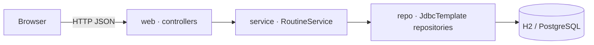

# Glossary

> [!NOTE]
> Every term the Sahar codealong uses, defined in plain language, with a pointer to where it first earns its keep.

**What you will get from this page:** a single alphabetical lookup for the jargon that shows up across the steps and theory pages. Each entry is one to three sentences, grounded in the Sahar app where that helps, and links to the step or theory page where the term appears. Read it cover-to-cover once, then keep it open in a tab.

Sahar itself is a layered Spring Boot app: REST **controllers** in the `web` package call a `RoutineService`, which calls `JdbcTemplate`-based **repositories**, which talk to a database (H2 by default, PostgreSQL under the `postgres` profile). The base package is `com.ramishtaha.sahar`. Many definitions below point back at that pipeline.

---

## 🅰️ A

**Application context**
Spring's runtime container: the object that holds every bean, knows how they depend on one another, and wires them together at startup. In Sahar, when `SaharApplication.main` runs, Spring builds one application context, discovers `ConfigController`, `RoutineService`, `PrayerTimesRepository`, and friends, and connects them. See [Spring and dependency injection](../docs/theory/spring-and-di.md).

**Auto-configuration**
Spring Boot's "look at the classpath and configure sensible defaults" mechanism: because `spring-boot-starter-jdbc` is present, Boot auto-creates a `DataSource`, a `HikariCP` pool, and a `JdbcTemplate` so you never write that wiring yourself. It backs off the moment you define your own bean of the same type. See [JdbcTemplate and H2](../docs/steps/06-jdbctemplate-h2.md) and [Spring Boot and auto-configuration](../docs/theory/spring-and-di.md).

**API (HTTP API)**
The set of HTTP endpoints a client can call to use the app. Sahar's API lives under `/api/*` (for example `GET /api/config`, `PUT /api/prayer-times`). See [Your first REST endpoint](../docs/steps/02-first-rest-endpoint.md).

## 🅱️ B

**Bean**
Any object that Spring creates, wires, and manages for you inside the application context. `RoutineService` is a bean; so is every `@Repository` and `@RestController`. You ask for beans (usually via the constructor) rather than calling `new` yourself. See [Spring and dependency injection](../docs/theory/spring-and-di.md).

**Bean Validation (Jakarta Validation)**
The Java standard (in the `jakarta.validation` namespace) for declaring constraints on objects with annotations like `@NotNull` and `@Size`, then asking the framework to check them. Sahar pulls it in via `spring-boot-starter-validation` and adds a custom `@DeloadLast` rule. See [Validation and rules](../docs/steps/05-validation-and-rules.md) and [Validation theory](../docs/steps/05-validation-and-rules.md).

**BOM (Bill of Materials)**
A special Maven POM that pins a curated, mutually-tested set of dependency versions so you do not have to. Sahar inherits `spring-boot-starter-parent` (version `4.0.6`), whose BOM is why almost every dependency in `pom.xml` omits its own `<version>`. See [Baseline](../docs/steps/00-baseline.md) and [the Maven cheatsheet](./cheatsheet-maven.md).

## 🔤 C

**Classpath**
The list of places (jars and compiled-class folders) where the JVM looks for classes at runtime. Spring Boot's auto-configuration is driven by "what is on the classpath": adding `spring-boot-starter-webmvc` puts embedded Tomcat on the classpath, which is why a web server appears. See [Baseline](../docs/steps/00-baseline.md).

**Connection pool**
A cache of already-open database connections that are borrowed and returned instead of opened fresh per query, because opening a TCP+auth connection is slow. Sahar uses HikariCP (Boot's default), auto-configured from `spring.datasource.*`. See [JdbcTemplate and H2](../docs/steps/06-jdbctemplate-h2.md).

**Constructor injection**
The preferred form of dependency injection: a bean declares what it needs as constructor parameters, and Spring passes them in. `PrayerTimesRepository(JdbcTemplate jdbc)` is constructor injection — Spring hands it the auto-configured `JdbcTemplate`. It keeps fields `final`, makes dependencies obvious, and makes the class easy to unit-test. See [Spring and dependency injection](../docs/theory/spring-and-di.md).

**Container**
Overloaded term. (1) *Spring container* = the application context that holds your beans. (2) *OS container* = a lightweight, isolated process bundle built from an image, run by Docker or Podman. Sahar runs as an OS container from step 11 onward. See [Dockerize](../docs/steps/11-dockerize.md) and [Containers theory](../docs/theory/containers-and-devops.md).

**Controller**
A web-layer bean (annotated `@RestController` in Sahar) that maps incoming HTTP requests to Java methods and returns the response. `PrayerTimesController` handles `GET/PUT /api/prayer-times`; it delegates real work to `RoutineService` and never touches SQL. See [Your first REST endpoint](../docs/steps/02-first-rest-endpoint.md) and [HTTP and REST](../docs/theory/http-and-rest.md).

**CORS (Cross-Origin Resource Sharing)**
The browser rule that a page from one origin (scheme+host+port) may only call an API on a *different* origin if that API explicitly allows it via response headers. Relevant when Sahar's admin UI is served separately from the API. See [Editable admin UI](../docs/steps/08-editable-admin-ui.md).

**CRUD**
Create, Read, Update, Delete — the four basic operations on stored data, which map naturally onto HTTP `POST`, `GET`, `PUT`, `DELETE`. Sahar's `/api/schedule` endpoints are a full CRUD set. See [Full CRUD](../docs/steps/07-full-crud.md).

## 🗄️ D

**DataSource**
The Java standard (`javax`-now-`jakarta`-era `javax.sql.DataSource`) factory for database connections; everything above it (`JdbcTemplate`, repositories) asks the `DataSource` for connections. Spring Boot auto-configures one from `spring.datasource.url`, `.username`, and `.password`, backed by a HikariCP pool. See [JdbcTemplate and H2](../docs/steps/06-jdbctemplate-h2.md).

**Dependency injection (DI)**
Giving an object the collaborators it needs from the outside (usually via its constructor) instead of having it create them itself. It is the *how* behind Inversion of Control. In Sahar, `RoutineService` is injected with its repositories rather than `new`-ing them. See [Spring and dependency injection](../docs/theory/spring-and-di.md).

**DispatcherServlet**
The single front-controller servlet at the heart of Spring MVC: every HTTP request hits it first, and it routes the request to the right `@RequestMapping` method on the right controller, then renders the response. Boot registers and configures it for you. See [HTTP and REST](../docs/theory/http-and-rest.md).

**Docker**
The most common toolchain for building OS-container images and running containers. Sahar ships a `Dockerfile` and is run with `docker run` / `docker compose`. See [Dockerize](../docs/steps/11-dockerize.md) and [docs.docker.com](https://docs.docker.com/).

**DTO (Data Transfer Object)**
A small, purpose-built object that carries exactly the data a request or response needs, kept separate from your domain/storage shapes. Sahar's `MonthUpdate` and `WeekUpdate` are request DTOs (the JSON bodies of `PUT /api/month` and the block-week endpoints). See [In-memory edit](../docs/steps/04-in-memory-edit.md).

## 🧩 E

**Embedded database**
A database that runs *inside* your application process rather than as a separate server. Sahar's default is H2 in file mode, so there is nothing extra to install or start for development. See [JdbcTemplate and H2](../docs/steps/06-jdbctemplate-h2.md).

**Endpoint**
One callable address+method on the API, e.g. `PUT /api/block/weeks/{ordinal}`. Each endpoint is a controller method. See [Your first REST endpoint](../docs/steps/02-first-rest-endpoint.md).

**Entity**
A thing your app stores and identifies (a row, conceptually): in Sahar a `ScheduleItem` with an `id` is entity-like. Note Sahar uses plain `JdbcTemplate`, not JPA, so "entity" here means the domain record a row maps to — there is no `@Entity` annotation. See [Model the domain](../docs/steps/03-model-the-domain.md).

**Executable jar (fat jar / uber jar)**
A single `.jar` that bundles your code, all dependencies, *and* an embedded web server, so `java -jar sahar.jar` starts the whole app with no external server. The Spring Boot Maven plugin's `repackage` goal produces it. See [Baseline](../docs/steps/00-baseline.md) and [Dockerize](../docs/steps/11-dockerize.md).

## 🦅 F

**Flyway**
A database migration tool that runs versioned SQL scripts (`V1__...`, `V2__...`) in order and records what it has applied, so every environment converges on the same schema. In Boot 4 you add `spring-boot-starter-flyway` plus `flyway-database-postgresql` (not `flyway-core`). Sahar uses `V1`/`V2` after seeding. See [Seed and migrations](../docs/steps/10-seed-and-migrations.md), [Migrations theory](../docs/steps/10-seed-and-migrations.md), and [flywaydb.org](https://flywaydb.org/).

## 🛢️ H

**H2**
A fast, pure-Java SQL database that can run embedded (in-process) or in-memory; Sahar's default datastore for development. Boot 4 exposes its web console via the dedicated `spring-boot-h2console` module. See [JdbcTemplate and H2](../docs/steps/06-jdbctemplate-h2.md).

**HikariCP**
The high-performance JDBC connection pool that Spring Boot uses by default; it manages the pool of live database connections behind the `DataSource`. You rarely name it directly — it is auto-configured. See [JdbcTemplate and H2](../docs/steps/06-jdbctemplate-h2.md).

## 🔁 I

**Idempotent**
An operation that has the same effect whether you do it once or many times. `PUT /api/prayer-times` is idempotent (re-sending the same body leaves the same single row), whereas `POST /api/schedule` is not (each call creates a new item). Flyway migrations are also designed to be safely re-runnable. See [Full CRUD](../docs/steps/07-full-crud.md) and [HTTP and REST](../docs/theory/http-and-rest.md).

**Image (container image)**
The immutable, layered package that a container is started from: filesystem + metadata + the command to run. Sahar's `Dockerfile` builds an image; `docker run` turns it into a running container. See [Dockerize](../docs/steps/11-dockerize.md).

**Inversion of Control (IoC)**
The principle that the framework, not your code, controls object creation and the calling of your code. You write beans and declare needs; Spring decides when to instantiate them and what to pass in. Dependency injection is the concrete technique that implements IoC. See [Spring and dependency injection](../docs/theory/spring-and-di.md).

## ☕ J

**Jackson**
The library Spring MVC uses to convert between Java objects and JSON. When `ConfigController` returns a `RoutineConfig`, Jackson serializes it to the JSON the browser receives, and deserializes request bodies back into records. Boot 4 ships **Jackson 3** under the `tools.jackson` package. See [HTTP and REST](../docs/theory/http-and-rest.md).

**Jakarta EE**
The vendor-neutral set of Java enterprise specifications (Servlet, Validation, Persistence, etc.) now governed by the Eclipse Foundation. The big rename happened in the Spring 5→6 / Boot 2→3 jump: packages moved from `javax.*` to `jakarta.*`. Boot 4 targets Jakarta EE 11, so Sahar's imports are `jakarta.validation.*`, not `javax`. See [Validation theory](../docs/steps/05-validation-and-rules.md).

**JDBC (Java Database Connectivity)**
The low-level Java API for talking to relational databases: connections, statements, result sets. It is powerful but verbose, which is why Sahar uses `JdbcTemplate` on top of it. See [JdbcTemplate and H2](../docs/steps/06-jdbctemplate-h2.md) and [the SQL/JDBC cheatsheet](./cheatsheet-sql-jdbc.md).

**JdbcTemplate**
Spring's helper that removes JDBC's boilerplate (open/close connection, create statement, bind parameters, iterate results) so you write just the SQL and a `RowMapper`. Sahar's `PrayerTimesRepository` uses `jdbc.query(sql, MAPPER)` to read and `jdbc.update(sql, args...)` to write. See [JdbcTemplate and H2](../docs/steps/06-jdbctemplate-h2.md).

```java
// From PrayerTimesRepository — JdbcTemplate + a RowMapper, no ResultSet plumbing.
public Optional<PrayerTimes> find() {
    return jdbc.query("SELECT * FROM prayer_times WHERE id = 1", MAPPER).stream().findFirst();
}
```

**JPA (Jakarta Persistence API)**
The Java standard for object-relational mapping; its reference implementation is Hibernate. Sahar deliberately does **not** use JPA — it uses `JdbcTemplate` so you see the SQL plainly and understand what the database does before reaching for an ORM. Mentioned for contrast. See [JdbcTemplate and H2](../docs/steps/06-jdbctemplate-h2.md).

## 🧱 L

**Layer (web / service / repository)**
The three-tier split that keeps Sahar maintainable: the **web** layer (controllers) handles HTTP, the **service** layer (`RoutineService`) holds business rules, and the **repository** layer (the `*Repository` classes) is the only place that knows SQL. Each layer depends only on the one below it, so swapping H2 for Postgres touches only wiring, not controllers. See [Model the domain](../docs/steps/03-model-the-domain.md) and [Layers theory](../docs/theory/spring-and-di.md).



## 🏗️ M

**Maven**
Sahar's build tool: it reads `pom.xml`, downloads dependencies, compiles, runs tests, and packages the executable jar. The wrapper scripts `mvnw` / `mvnw.cmd` let teammates build with the exact pinned Maven version. See [Baseline](../docs/steps/00-baseline.md) and [the Maven cheatsheet](./cheatsheet-maven.md).

**Migration**
A single, versioned, ordered change to the database schema (or seed data) applied by Flyway, e.g. `V1__init.sql`. Migrations make schema changes repeatable and reviewable instead of ad-hoc `ALTER TABLE` typed into a console. See [Seed and migrations](../docs/steps/10-seed-and-migrations.md) and [Migrations theory](../docs/steps/10-seed-and-migrations.md).

**Multi-stage build**
A Dockerfile technique that uses one stage (with the full JDK + Maven) to build the jar and a second, slim stage (JRE only) to run it, so the final image stays small and contains no build tools. Sahar's `Dockerfile` is multi-stage. See [Dockerize](../docs/steps/11-dockerize.md).

## 🔗 O

**ORM (Object-Relational Mapping)**
A library that maps database rows to objects and back automatically (JPA/Hibernate is the Java example). Sahar avoids an ORM in favor of explicit SQL via `JdbcTemplate`; the `RowMapper` is the hand-written, transparent version of what an ORM would do for you. See [JdbcTemplate and H2](../docs/steps/06-jdbctemplate-h2.md).

## 🐘 P

**Podman**
A daemonless, drop-in alternative to Docker for building images and running containers; most `docker` commands work as `podman` commands. Sahar's image and compose file run under either. See [Dockerize](../docs/steps/11-dockerize.md) and [podman.io](https://podman.io/).

**PostgreSQL**
A mature, production-grade open-source relational database; Sahar's "real" datastore, activated by the `postgres` Spring profile from step 09. Boot auto-configures the `DataSource` from `spring.datasource.*` and Flyway loads the Postgres module. See [Swap to PostgreSQL](../docs/steps/09-swap-to-postgres.md) and [postgresql.org](https://www.postgresql.org/).

**Profile (Spring)**
A named set of configuration that can be switched on per environment, e.g. activate `postgres` to use PostgreSQL instead of the default H2. Beans and `application-{profile}.properties` files can be profile-specific. See [Swap to PostgreSQL](../docs/steps/09-swap-to-postgres.md) and [Configuration and profiles theory](../docs/steps/09-swap-to-postgres.md).

## 🌐 R

**Record (Java)**
A concise, immutable data class introduced in modern Java: `record PrayerTimes(String fajr, ...)` auto-generates the constructor, accessors (`fajr()`), `equals`, `hashCode`, and `toString`. Sahar's whole domain (`RoutineConfig`, `PrayerTimes`, `Week`, `ScheduleItem`, …) is records, which pairs perfectly with Jackson JSON and read-only data. See [Model the domain](../docs/steps/03-model-the-domain.md) and [Modern Java for Spring](../reference/java-refresher.md).

**Repository**
The data-access layer bean (annotated `@Repository`) that owns all SQL for one part of the schema. `PrayerTimesRepository` reads/writes the single `prayer_times` row; the service talks to it in terms of `PrayerTimes` objects and never sees a `ResultSet`. See [JdbcTemplate and H2](../docs/steps/06-jdbctemplate-h2.md).

**REST (Representational State Transfer)**
An architectural style for HTTP APIs: resources have URLs (`/api/schedule/{id}`), HTTP methods carry intent (`GET` read, `POST` create, `PUT` replace, `DELETE` remove), and the server is stateless between requests. Sahar's API follows it. See [Your first REST endpoint](../docs/steps/02-first-rest-endpoint.md) and [HTTP and REST](../docs/theory/http-and-rest.md).

**RowMapper**
A small function you give `JdbcTemplate` that turns one result-set row into one Java object. Sahar's `PrayerTimesRepository` uses a `RowMapper<PrayerTimes>` lambda `(rs, rowNum) -> new PrayerTimes(rs.getString("fajr"), ...)`. See [JdbcTemplate and H2](../docs/steps/06-jdbctemplate-h2.md) and [the SQL/JDBC cheatsheet](./cheatsheet-sql-jdbc.md).

## 🌱 S

**Seed data**
The initial rows an app needs to be usable on a fresh database (Sahar's starting routine, prayer times, blocks). Sahar seeds via `RoutineSeed` and then evolves the schema with Flyway `V1`/`V2`. See [Seed and migrations](../docs/steps/10-seed-and-migrations.md).

**Servlet**
The Java standard (`jakarta.servlet`) for a component that handles HTTP requests inside a web server; Spring MVC's `DispatcherServlet` is one servlet that fronts your whole app. "Servlet stack" is why Boot's blocking web starter is `spring-boot-starter-webmvc` (vs. the reactive `webflux`). See [HTTP and REST](../docs/theory/http-and-rest.md).

**Spring Boot**
The framework Sahar is built on: it layers auto-configuration, starters, an embedded server, and an executable-jar packaging model on top of the Spring Framework so you can ship a runnable app fast. Sahar pins **Spring Boot 4.0.6** (Spring Framework 7, Jakarta EE 11). See [Baseline](../docs/steps/00-baseline.md), [Spring Boot and auto-configuration](../docs/theory/spring-and-di.md), and [docs.spring.io/spring-boot/4.0.6](https://docs.spring.io/spring-boot/4.0.6/).

**Starter**
A curated "umbrella" dependency that pulls in everything needed for one capability with versions already aligned by the BOM. Sahar uses `spring-boot-starter-webmvc` (web + Tomcat + Jackson), `-validation`, `-jdbc`, and `-flyway`. Note the Boot 4 renames: `spring-boot-starter-web` → `spring-boot-starter-webmvc`, and the single `spring-boot-starter-test` split into modular `-{webmvc,jdbc,validation,flyway}-test` starters. See [Baseline](../docs/steps/00-baseline.md).

**Stereotype annotation**
A marker that tells Spring "this class is a bean, and here is its role": `@Component`, `@Service`, `@Repository`, `@RestController`. They drive component scanning so the application context picks the class up automatically. Sahar tags `RoutineService` with `@Service` and each repository with `@Repository`. See [Spring and dependency injection](../docs/theory/spring-and-di.md).

## 🐱 T

**Tomcat (embedded)**
The default web server Spring Boot embeds inside your jar (via `spring-boot-starter-webmvc`), so the app *contains* its server instead of being deployed into an external one. This is what makes `java -jar sahar.jar` serve HTTP on its own. See [Baseline](../docs/steps/00-baseline.md) and [HTTP and REST](../docs/theory/http-and-rest.md).

**Transaction**
A group of database operations that succeed or fail as one unit (all-or-nothing), so a partial update never leaves the data inconsistent. In Spring you typically mark a service method `@Transactional`; relevant for Sahar's multi-row block/week operations. See [Full CRUD](../docs/steps/07-full-crud.md) and [Layers theory](../docs/theory/spring-and-di.md).

## ✅ V

**Validation**
Checking that incoming data obeys the rules before you act on it. Sahar validates request DTOs with Bean Validation annotations plus a custom `@DeloadLast` constraint (enforced by `DeloadLastValidator`), and the controller triggers it with `@Valid`. See [Validation and rules](../docs/steps/05-validation-and-rules.md) and [Validation theory](../docs/steps/05-validation-and-rules.md).

**Volume (Docker)**
A storage mechanism that lives outside a container's writable layer so data survives container restarts and rebuilds. Sahar uses a volume for PostgreSQL's data (and can persist the H2 file) so your routine is not wiped when the container is recreated. See [Compose](../docs/steps/12-compose.md).

## 🔢 Numbers

**12-factor**
A set of twelve guidelines for building portable, cloud-friendly apps (config in the environment, stateless processes, dev/prod parity, logs as streams, etc.). Sahar leans on several: externalized config via Spring profiles and environment variables, an executable jar as a single deployable, and a container as the unit of deploy. See [Deploy](../docs/steps/14-deploy.md) and [Configuration and profiles theory](../docs/steps/09-swap-to-postgres.md), and the canonical [12factor.net](https://12factor.net/).

---

## 🔗 Related

- 🚦 Steps index: [Setup](../docs/00-setup.md) → then [Baseline](../docs/steps/00-baseline.md) onward
- [HTTP and REST](../docs/theory/http-and-rest.md) · [Spring and dependency injection](../docs/theory/spring-and-di.md) · [Layers](../docs/theory/spring-and-di.md) · [Validation](../docs/steps/05-validation-and-rules.md) · [Migrations](../docs/steps/10-seed-and-migrations.md) · [Containers](../docs/theory/containers-and-devops.md) · [Configuration and profiles](../docs/steps/09-swap-to-postgres.md)
- Cheatsheets: [Maven](./cheatsheet-maven.md) · [SQL/JDBC](./cheatsheet-sql-jdbc.md)
- [Project README](../README.md)
