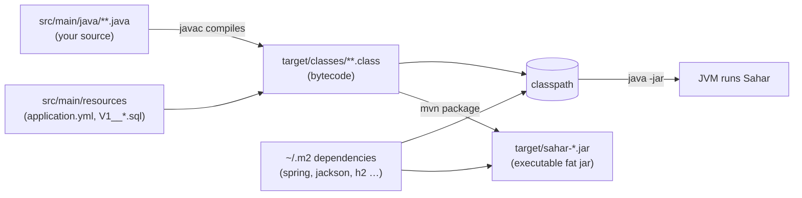

# Modern Java refresher

> A fast, Sahar-grounded tour of the modern Java features this course leans on — records, lambdas, streams, generics, annotations, `Optional`, `var`, switch, text blocks — plus the build/classpath model that turns your `.java` files into a running jar.

**What you will get from this page:** enough modern Java to read every `.java` file in `spring-boot-sahar` without being surprised. If you last wrote Java around 8 and have been away, the language has quietly grown a lot of ergonomics — most of which Spring and the Sahar domain model use heavily. Each topic below has a tiny example, preferably lifted from or flavoured by the real Sahar code, and a pointer to the step where you first meet it.

We target **Java 25** (the current LTS; Spring Boot 4 needs Java 17 as a minimum). Where a feature has a finalized-in version that matters, it is noted — but everything here has been stable for years, so you can use it freely.

---

## Why this page exists

Spring Boot does not invent its own language; it is "just" a library of annotated classes you wire together. So the more comfortable you are with modern Java, the less of Spring feels like magic. Two themes recur:

- **Records make the domain model honest.** Almost every type in `com.ramishtaha.sahar.domain` is a `record`. They are immutable, value-based, and serialize to JSON for free. That single choice shapes how the whole app reads and writes data.
- **Functional Java makes the plumbing short.** A `RowMapper` is a one-line lambda. The service filters and renumbers weeks with streams. `Optional` keeps null out of the read path. None of this is required — but the idiomatic version is the readable version.

```mermaid
flowchart LR
    A[Annotations<br/>describe rules] --> S[Spring / Bean Validation<br/>read them at runtime]
    R[Records<br/>domain model] --> J[Jackson<br/>JSON in/out]
    L[Lambdas + Streams<br/>RowMapper, helpers] --> Q[JdbcTemplate<br/>rows in/out]
    O[Optional<br/>find&#40;&#41;.orElseThrow&#40;&#41;] --> SVC[Service<br/>no nulls]
```



---

## Annotations

**What they are.** An annotation is metadata you attach to code — a class, method, field, parameter, or another annotation. By itself an annotation *does nothing*. Something else has to read it and act on it: the compiler, a framework at startup, or a validator at runtime.

That "does nothing on its own" point is the one beginners trip over. `@NotBlank` on a field is not a runtime check that fires the moment you assign a blank value; it is a *description* of a rule that Bean Validation enforces only when something triggers validation. The Sahar `PrayerTimes` Javadoc says it plainly:

> They do nothing on their own — they describe rules. They are enforced when something annotated `@Valid` is validated, which in our app happens when the controller receives one of these as a request body.

**Retention and targets.** When you write your *own* annotation, two meta-annotations decide where it can go and how long it survives:

| Meta-annotation | Controls | Common values |
|---|---|---|
| `@Target` | Where the annotation may be placed | `TYPE`, `METHOD`, `FIELD`, `PARAMETER`, `RECORD_COMPONENT` |
| `@Retention` | How long it is kept | `SOURCE` (compiler only), `CLASS` (in bytecode, not at runtime), `RUNTIME` (readable by reflection at runtime) |

Frameworks like Spring and Bean Validation read annotations by reflection while the app runs, so their annotations are `RUNTIME`. Sahar's custom `@DeloadLast` constraint is a real example — note the meta-annotations at the top:

```java
@Documented
@Constraint(validatedBy = DeloadLastValidator.class)
@Target(TYPE)            // sits on the whole record, not one field
@Retention(RUNTIME)      // Hibernate Validator reads it at runtime
public @interface DeloadLast {
    String message() default "the deload must be the last week (and only the last week)";
    Class<?>[] groups() default {};
    Class<? extends Payload>[] payload() default {};
}
```

`@Target(TYPE)` is deliberate: the "deload is the last week and only the last week" rule looks at the *whole* `BlockPlan`, so the annotation goes on the type, not on a single component. A field-level constraint like `@NotBlank` could not express a cross-field rule.

**How Spring and validation use them.** Three flavours show up constantly in Sahar:

- *Stereotype / wiring* — `@RestController`, `@Service`, `@Repository`, `@Transactional`. These tell Spring "manage this class as a bean / weave behaviour around it." See [Spring & DI](../docs/theory/spring-and-di.md).
- *Web mapping* — `@GetMapping`, `@PutMapping`, `@RequestBody`, `@PathVariable`. These map HTTP to method calls. See [HTTP & REST](../docs/theory/http-and-rest.md).
- *Validation* — `@NotBlank`, `@Pattern`, `@Size`, `@Valid`, and the custom `@DeloadLast`. These describe data rules. See [Validation & rules](../docs/steps/05-validation-and-rules.md).

A controller method ties two of these together — the annotation on the parameter is what makes validation actually run:

```java
@PutMapping("/api/prayer-times")
public PrayerTimes update(@Valid @RequestBody PrayerTimes prayerTimes) {
    return routine.updatePrayerTimes(prayerTimes);
}
```

`@RequestBody` says "deserialize the JSON body into this record"; `@Valid` says "and check its constraints first — reject with a 400 if they fail."

> First seen: **step 02** (`@RestController`), then everywhere. Custom annotation: **step 05**.

---

## Generics

**Why they exist.** Generics let a type or method be parameterized by another type, so the compiler can guarantee what is inside a container. `List<Week>` is "a list that holds `Week` and nothing else." Before generics you had a raw `List` of `Object` and cast on the way out, hoping you were right. Generics move that hope to compile time.

In Sahar the block plan is exactly this:

```java
public record BlockPlan(
        String label,
        @NotEmpty @Size(min = 4, max = 5) @Valid
        List<Week> weeks      // List<Week>: the element type is locked in
) { }
```

Because `weeks` is `List<Week>`, you can write `block.weeks().get(0).deload()` and the compiler knows `get(0)` returns a `Week` with a `deload()` accessor. No cast, no guesswork.

**Type parameters on your own code.** A type variable (conventionally `T`, `E`, `K`, `V`) is a placeholder filled in by the caller. Spring's `RowMapper<T>` is generic so it can map a row to *any* type:

```java
// Spring's interface, simplified:
public interface RowMapper<T> {
    T mapRow(ResultSet rs, int rowNum) throws SQLException;
}
```

Sahar supplies `RowMapper<Week>` and `RowMapper<ScheduleItem>` — same interface, different `T`. The repositories also use generics on `JdbcTemplate` query methods, e.g. `jdbc.queryForObject("SELECT COUNT(*) FROM blocks", Integer.class)` returns an `Integer`, not an `Object`.

**Bounded types (you will read these, rarely write them).** `Class<? extends Payload>[]` in `@DeloadLast` means "an array of `Class` objects whose type is `Payload` or a subtype." The `? extends X` is a *bounded wildcard*; you do not need to author these to use the framework, but recognizing them stops them from looking scary.

> First seen: **step 03** (`List<Week>`, `List<ScheduleItem>`), pervasive thereafter.

---

## Lambdas and functional interfaces

**The idea.** A *functional interface* is an interface with exactly one abstract method (a SAM — Single Abstract Method). A *lambda* is a compact literal for an instance of such an interface. Instead of a five-line anonymous class, you write the parameters and the body.

The classic JDK functional interfaces:

| Interface | Method | Means |
|---|---|---|
| `Runnable` | `void run()` | do something, no input, no output |
| `Supplier<T>` | `T get()` | produce a `T` |
| `Function<A,B>` | `B apply(A a)` | turn an `A` into a `B` |
| `Predicate<T>` | `boolean test(T t)` | yes/no test on a `T` |

A `Supplier<T>` appears in Sahar via `Optional.orElseThrow`:

```java
PrayerTimes pt = prayerTimes.find()
    .orElseThrow(() -> new IllegalStateException("prayer_times not seeded"));
```

The `() -> new IllegalStateException(...)` is a lambda implementing `Supplier<? extends Throwable>` — "if there is nothing, here is how to make the exception."

**RowMapper as a lambda.** This is the most important lambda in the course. `RowMapper<Week>` has one method, so the whole mapper is a single lambda from `(ResultSet, int)` to a `Week`:

```java
private static final RowMapper<Week> WEEK_MAPPER = (rs, rowNum) -> new Week(
        rs.getInt("ordinal"),
        rs.getString("name"),
        rs.getString("start_date"),
        rs.getString("end_date"),
        rs.getString("training_focus"),
        rs.getString("backend_focus"),
        rs.getBoolean("deload"));
```

Read it as: "given a database row `rs`, build a `Week` from these columns." `JdbcTemplate.query(...)` calls it once per row. The pre-lambda equivalent was a verbose `new RowMapper<Week>() { public Week mapRow(...) { ... } }` — same behaviour, four times the noise.

**Method references** are lambdas you do not even have to write out. `n.equals("Deload")` could be passed as a predicate; `ScheduleItem::time` is shorthand for `item -> item.time()`. You will see both forms in stream pipelines.

> First seen: **step 06** (every repository's `RowMapper`).

---

## The Streams API

**Why.** A stream is a pipeline over a sequence of elements: you describe *what* you want (filter these, transform those, collect the rest) rather than writing the index-fiddling loop. Streams are lazy until a *terminal* operation (`toList()`, `findFirst()`, `collect(...)`) runs them.

The three you will use 90% of the time:

| Operation | Shape | Does |
|---|---|---|
| `map` | `Stream<A> -> Stream<B>` | transform each element |
| `filter` | `Stream<T> -> Stream<T>` | keep elements passing a predicate |
| `toList()` / `collect(...)` | `Stream<T> -> List<T>` | gather results (terminal) |

Sahar's `RoutineService` uses streams to build week templates — `map` turns each phase name into a `Week`, and `toList()` materializes the list:

```java
return List.of("Foundation", "Build", "Peak", "Deload").stream()
        .map(n -> new Week(0, n, "TBD", "TBD", "(set focus)", "(set focus)", n.equals("Deload")))
        .toList();
```

`filter` + `findFirst` find one week by ordinal, returning an `Optional` so "not found" is a value, not an exception you forgot to throw:

```java
Week target = weeks.stream()
        .filter(w -> w.ordinal() == ordinal)
        .findFirst()
        .orElseThrow(() -> new ResponseStatusException(HttpStatus.NOT_FOUND, "no week " + ordinal));
```

And the repository turns a query result into an `Optional` in one line:

```java
public Optional<ScheduleItem> findById(Long id) {
    return jdbc.query("SELECT * FROM schedule_items WHERE id = ?", MAPPER, id)
               .stream().findFirst();
}
```

**`toList()` vs `collect(Collectors.toList())`.** `Stream.toList()` (finalized in Java 16) returns an *unmodifiable* list and is the modern default. Use `collect(Collectors.toList())` only when you specifically need a mutable `ArrayList`. Note that when Sahar needs to *mutate* a list afterward (add/remove a week), it copies into a fresh `ArrayList` first: `new ArrayList<>(current.weeks())`.

> First seen: **step 07** (service helpers and `findById`).

---

## Records — the star of the domain model

**Why records exist.** A record is a transparent carrier for an immutable group of values. You declare the *components* once, and the compiler generates the constructor, the accessors, `equals`, `hashCode`, and `toString`. No Lombok, no 60-line POJO. Sahar's entire domain is records — `RoutineConfig`, `PrayerTimes`, `BlockPlan`, `Week`, `ScheduleItem`, and the rest.

```java
public record Week(
        int ordinal,
        String name,
        String startDate,
        String endDate,
        String trainingFocus,
        String backendFocus,
        boolean deload
) { }
```

From those seven lines you get, for free:

- a **canonical constructor** taking all seven components in order;
- **accessors** named after the components — `week.ordinal()`, `week.name()`, `week.deload()` (note: *no* `get` prefix);
- value-based **`equals`/`hashCode`** (two `Week`s with equal components are equal);
- a readable **`toString`**.

**Immutability.** A record's components are `final`. You cannot change a `Week` in place. To "edit" one you build a new instance copying the unchanged parts — exactly what `RoutineConfig`'s "wither" helpers do:

```java
public RoutineConfig withMonth(String newMonth) {
    return new RoutineConfig(title, tagline, newMonth, prayerTimes, block, weeklyGrid,
            schedule, supplements, diet, journal, threeRules, weekend, notes);
}
```

This copy-and-replace style is the source of truth for how the service performs edits — see `updateWeek` rebuilding the weeks list rather than mutating it.

**The canonical and compact constructor.** You can add validation or normalization without rewriting the field list, using the *compact constructor* form (no parameter list, no `this.x = x` assignments — the compiler adds those after your block):

```java
public record Week(int ordinal, String name, /* ... */ boolean deload) {
    public Week {                                   // compact constructor
        if (ordinal < 0) throw new IllegalArgumentException("ordinal >= 0");
    }
}
```

Records can also hold static fields and extra methods. `PrayerTimes` carries a regex constant and `BlockPlan` adds a derived `length()`:

```java
public record BlockPlan(String label, List<Week> weeks) {
    public int length() { return weeks == null ? 0 : weeks.size(); }
}
```

**Records serialize to JSON for free.** Jackson 3 (the `tools.jackson` line shipped with Spring Boot 4) reads a record's components directly. `RoutineConfig` composes every smaller record, so `GET /api/config` returns the entire tree as JSON with no mapping code — and the *shape is compiler-guaranteed*, unlike an untyped `Map`.

**When to use a record vs a class:**

| Use a `record` when… | Use a `class` when… |
|---|---|
| The type is defined by its data (a value) | The type has identity / lifecycle (a service, a bean) |
| It should be immutable | It must be mutable |
| You want free `equals`/`hashCode`/`toString` | You need to extend another class (records can't) |
| It is a DTO / domain value / event | It holds injected dependencies (e.g. `@Service`) |

That table explains Sahar's split exactly: everything in `domain` is a record (data); `RoutineService` and the repositories are classes (they hold collaborators and behaviour).

> First seen: **step 03** — *model the domain.* This is the conceptual centre of the app.

---

## Sealed types (brief)

A *sealed* type restricts which classes may extend or implement it, listed in a `permits` clause. The payoff is exhaustiveness: the compiler knows the complete set of subtypes, so a `switch` over them needs no `default`.

```java
public sealed interface Category permits Pray, Train, Meal { }
```

Sahar models `category` as a plain `String` rather than a sealed hierarchy (it is user-editable free-ish text validated by `@NotBlank`), so you will not find sealed types in the app — but they pair naturally with records and pattern matching when you have a *closed* set of variants. Records are implicitly `final`, which makes them clean leaves of a sealed hierarchy.

---

## `Optional` — making "absent" a value

**Why.** `null` is a landmine: nothing in the type system warns you that a method might return it, so you forget the check and get an NPE in production. `Optional<T>` makes "might be absent" explicit in the return type, forcing the caller to deal with it.

Sahar uses `Optional` at every repository read boundary and unwraps it in the service with intent:

```java
// repository: returns Optional<ScheduleItem>
public Optional<ScheduleItem> findById(Long id) { ... }

// service: "absent here is a programming/state error" -> throw
PrayerTimes pt = prayerTimes.find()
    .orElseThrow(() -> new IllegalStateException("prayer_times not seeded"));

// service: "absent here means the client asked for an id that doesn't exist" -> 404
return schedule.findById(id).orElseThrow();
```

Common operations:

| Method | Use |
|---|---|
| `orElseThrow()` | unwrap, or throw `NoSuchElementException` if empty |
| `orElseThrow(supplier)` | unwrap, or throw the exception you supply |
| `orElse(default)` | unwrap, or fall back to a value |
| `map(fn)` | transform the contained value if present |
| `isPresent()` / `isEmpty()` | test (prefer the methods above to manual `if`) |

The rule of thumb in Sahar: **return `Optional` from repositories, decide what "absent" means in the service.** Sometimes it is a 404 (client error), sometimes an `IllegalStateException` (the database was never seeded). The type forces that decision instead of letting a null slip through.

> First seen: **step 06** (repository reads return `Optional`); used decisively in the service in **step 07**.

---

## `var` — local type inference

`var` lets the compiler infer the type of a *local* variable from its initializer. It is still statically typed — `var keys = new GeneratedKeyHolder();` makes `keys` exactly a `GeneratedKeyHolder`, just without repeating the name. Use it where the right-hand side already makes the type obvious:

```java
var weeks = new ArrayList<Week>(current.weeks());   // clearly an ArrayList<Week>
```

Limits worth knowing: `var` is **locals only** (not fields, not method parameters or return types), and it needs an initializer to infer from. The Sahar code base tends to spell out types for clarity in teaching contexts (e.g. `List<Week> weeks = new ArrayList<>(...)`), but `var` is idiomatic and you should reach for it when the type is self-evident and the name would just be visual noise.

---

## Enhanced switch and pattern matching (brief)

Modern `switch` is an *expression* (it returns a value), uses arrow labels with no fall-through, and can match on type:

```java
// switch expression with arrow labels — returns a value, no break needed
String css = switch (item.category()) {
    case "pray", "journal" -> "rest";
    case "train", "work"   -> "effort";
    default                -> "neutral";
};

// pattern matching for instanceof — bind and use in one step
if (body instanceof PrayerTimes pt) {
    return pt.fajr();          // pt is already typed, no cast
}
```

Pattern matching for `switch` (finalized in Java 21) and *record patterns* let you destructure records directly — `case Week(int ord, String name, var rest)`. Sahar keeps its branching simple and does not need these, but you will meet them in other modern codebases, and they shine with sealed types where the compiler can verify you covered every case.

---

## Text blocks — readable multi-line strings

A *text block* is a string literal delimited by triple double-quotes (`"""`). It preserves newlines and strips common leading indentation, which makes embedded SQL legible instead of a `+`-glued mess. Sahar's repositories use them for every multi-line statement:

```java
jdbc.update("""
        INSERT INTO weeks
            (block_id, ordinal, name, start_date, end_date, training_focus, backend_focus, deload)
        VALUES (1, ?, ?, ?, ?, ?, ?, ?)
        """,
        w.ordinal(), w.name(), w.startDate(), w.endDate(),
        w.trainingFocus(), w.backendFocus(), w.deload());
```

Compare the pre-text-block version, which obscured the SQL behind quotes, plus signs, and manual `\n`:

```java
// the bad old way
jdbc.update("INSERT INTO weeks\n" +
    "  (block_id, ordinal, name, start_date, end_date, training_focus, backend_focus, deload)\n" +
    "VALUES (1, ?, ?, ?, ?, ?, ?, ?)", ...);
```

A few rules: the opening `"""` must be followed by a line break (the content starts on the next line); incidental indentation is stripped relative to the closing `"""`; and the `?` placeholders are still ordinary JDBC parameters bound positionally — see the [JDBC/SQL cheatsheet](./cheatsheet-sql-jdbc.md).

> First seen: **step 06** (first SQL in `JdbcTemplate` repositories).

---

## The build / classpath model

You can write perfect modern Java and still be confused about *how it runs*. Here is the pipeline Maven drives every time you build Sahar.



**Sources → bytecode.** `javac` turns each `.java` file into a `.class` file of platform-neutral *bytecode*. The JVM executes bytecode; it never reads your source. Java 25's bytecode runs on a Java 25 JVM.

**What the classpath is.** The classpath is simply the list of places the JVM looks to *find classes* at runtime — your compiled `target/classes` plus every dependency jar. When you write `import org.springframework.jdbc.core.RowMapper;`, the compiler and JVM resolve that name by searching the classpath. A `ClassNotFoundException` / `NoClassDefFoundError` almost always means "this jar is not on the classpath," i.e. a missing or wrong dependency.

**How Maven assembles it.** Your `pom.xml` declares dependencies by `groupId:artifactId:version`. Maven downloads them (and *their* dependencies, transitively) into your local repository `~/.m2`, then puts them on the classpath for compile, test, and run. Spring Boot's parent POM pins consistent versions so you usually omit version numbers. Note the Boot 4 module names this course uses — they changed from 3.x:

| Concern | Spring Boot 4 starter |
|---|---|
| Web MVC | `spring-boot-starter-webmvc` (was `…-web`) |
| Validation | `spring-boot-starter-validation` |
| JDBC | brings in `JdbcTemplate` |
| Flyway | `spring-boot-starter-flyway` + `flyway-database-postgresql` |
| H2 console | `spring-boot-h2console` |
| Tests | modular `spring-boot-starter-{webmvc,jdbc,validation,flyway}-test` |

**The fat jar.** `mvn package` produces an *executable* jar under `target/` that bundles your classes, your resources (including Flyway's `V1__*.sql` migrations), and all dependency jars, plus a small launcher. `java -jar target/sahar-*.jar` then needs nothing but a JVM — which is exactly why the Docker image in [step 11](../docs/steps/11-dockerize.md) is so small. See the [Maven cheatsheet](./cheatsheet-maven.md) for the day-to-day commands.

> Build basics appear in **step 00** (baseline) and recur through Dockerizing in **step 11**.

---

## A note on versions

Everything above is stable on **Java 25** and has been finalized for several releases:

- Lambdas, streams, generics, annotations — Java 8 and earlier; ancient and safe.
- `var` — Java 10. Records & text blocks — Java 16/15. Sealed types — Java 17.
- Pattern matching for `switch` and record patterns — Java 21.

So none of this is bleeding-edge; it is just "modern Java" that accumulated while you were away. Where a flag or API might shift in a future release (e.g. automatic record "withers" are discussed but not yet shipped, which is why Sahar hand-writes them), the code notes it. For the authoritative reference, see the [Java SE 25 documentation](https://docs.oracle.com/en/java/javase/25/) and the [Spring Boot 4.0.6 reference](https://docs.spring.io/spring-boot/4.0.6/).

---

## Related

- Step: [03 — Model the domain](../docs/steps/03-model-the-domain.md) — records in practice
- Step: [06 — JdbcTemplate & H2](../docs/steps/06-jdbctemplate-h2.md) — lambdas (`RowMapper`), text blocks, `Optional`
- Step: [07 — Full CRUD](../docs/steps/07-full-crud.md) — streams in the service
- Step: [05 — Validation & rules](../docs/steps/05-validation-and-rules.md) — the custom `@DeloadLast` annotation
- Theory: [Spring & dependency injection](../docs/theory/spring-and-di.md) — how Spring reads stereotype annotations
- Theory: [HTTP & REST](../docs/theory/http-and-rest.md) — the web-mapping annotations
- Theory: [Validation & rules](../docs/steps/05-validation-and-rules.md) — Bean Validation in depth
- Reference: [SQL & JDBC cheatsheet](./cheatsheet-sql-jdbc.md) — the SQL inside those text blocks
- Reference: [Maven cheatsheet](./cheatsheet-maven.md) — building the classpath and the fat jar
- Reference: [Glossary](./glossary.md) — quick definitions
- [Project README](../README.md)
